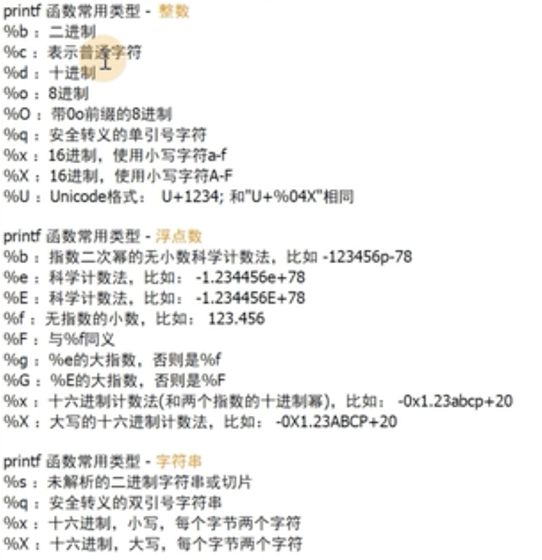

# Helm语法

## helm模板

### 内置对象

- **Release**：这个对象描述了 release 本身的一些信息。它里面有几个对象：

  - .Release.Name：release 名称
  - .Release.Time：release 的时间
  - .Release.Namespace：release 的 namespace（如果清单未覆盖）
  - .Release.Service：release 服务的名称，一般是Helm
  - .Release.Revision：此 release 的修订版本号，从1开始累加。
  - .Release.IsUpgrade：如果当前操作是升级或回滚，则将其设置为 true。
  - .Release.IsInstall：如果当前操作是安装，则设置为 true。

- **Values**：使用该对象可以获取value.yaml文件中已定义的任何变量数值。默认情况下，Values 是空的。

- Chart：用于获取`Chart.yaml`文件的内容。。chart 指南中[Charts Guide](https://github.com/kubernetes/helm/blob/master/docs/charts.md#the-chartyaml-file)列出了可用字段，可以前往查看。

- Capabilities：这提供了关于 Kubernetes 集群相关的信息，该对象有如下方法：

  - .Capabilities.APIVersions  返回k8s集群API版本信息集合
  - .Capabilities.APIVersions.Has $version  用于检测指定的版本或资源在k8s集群是否可用，可用为true，例如`.Capabilities.APIVersions.Has apps/v1/Deployment`
  - .Capabilities.KubeVersion  提供了查找 Kubernetes 版本的方法。它具有以下值：Major（主版本号,如1），Minor（小版本号,如20），GitVersion，GitCommit，GitTreeState，BuildDate，GoVersion，Compiler，和 Platform。

- Template：用于获取当前模板的信息，包含如下两个对象：

  - .Template.Name 用于获取当前模板的名称和路径（例如 mychart/templates/mytemplate.yaml）
  - .Template.BasePath：当前模板目录的路径（例如 mychart/templates）。

  

除了系统自带的变量，我们也可以**自定义模板变量**

{{- $relname := .Release.Name }}

引用自定义变量:

{{ $relname }}

### 内置函数

常用函数：http://masterminds.github.io/sprig/strings.html


函数的使用格式：

格式1：函数名 arg1 arg2

格式2：**agr1 ｜函数名** #实际使用中更偏向于管道符来将参数传递给函数


• quote：将值转换为字符串，即**加双引号**

   ```yaml
cat mychart/values.yaml         
nodeSelector:
  gpu: true

cat mychart/templates/deployment.yaml
apiVersion: apps/v1
...
      nodeSelector:
        gpu: {{ .Values.nodeSelector.gpu | quote }}

helm install web1 --dry-run mychart/
apiVersion: apps/v1
...
      nodeSelector:
        gpu: "true"
   ```

• default：设置默认值，**如果获取的值为空则使用这个默认值**( 以防止忘记定义而导致模板文件缺少字段无法创建资源，这时可以为字段定义一个默认值。)

```yaml
cat mychart/values.yaml         
namespace: ""

cat mychart/templates/deployment.yaml
apiVersion: apps/v1
...
metadata:
  namespace: {{ .Values.namespace | default "default" }}

helm install web1 --dry-run mychart/
apiVersion: apps/v1
...
metadata:
  namespace: default
```

• toYaml：**引用一块YAML内容**

• indent和nindent：**缩进字符串**,nindent用的多，一般是结合toYaml

```yaml
#在values.yaml里写结构化数据，引用内容块，结合上面的nindent换行缩进
#像健康检查，资源配额resources，或者端口，这都是一块一块的内容，可以通过toYaml引用

cat mychart/values.yaml
resources:
  limits:
    cpu: 100m
    memory: 128Mi
  requests:
    cpu: 100m
    memory: 128Mi

cat mychart/templates/deployment.yaml
apiVersion: apps/v1
...
    spec:
      containers:
      - name: web
        resources:
          {{- toYaml .Values.resources | nindent 10 }}
          
helm install web1 --dry-run mychart/
apiVersion: apps/v1
...
    spec:
      containers:
      - name: web
        resources:
          limits:
            cpu: 100m
            memory: 128Mi
          requests:
            cpu: 100m
            memory: 128Mi
```

• printf：用于格式化输出字符串内容，并且支持使用占位符，占位符取决于传入参数的类型



• trunc：用于截断字符串，通过使用正整数或负整数来分别表示从左向右截取的个数和从右向左截取的个数

```shell
trunc 5
```

• trimPrefix和trimSuffix：分别用于移除字符串中指定的前缀和后缀

```shell
trimPrefix "-"
```

• replace

### 流程控制

• **with**：主要就是用来**修改 . 作用域**的

适用于多次引用同个多层级里的内容

```yaml
{{ .Values.a.b.c.repository }}
{{ .Values.a.b.c.pullPolicy }}
转成：
{{- with .Values.a.b.c }}
{{ .repository }}
{{ .pullPolicy }}
{{- end }}

cat values.yaml
controller:
  image:
    repository: registry.cn-beijing.aliyuncs.com/dotbalo/controller
    tag: "v0.40.2"
    pullPolicy: IfNotPresent
    runAsUser: 101
    allowPrivilegeEscalation: true

cat templates/daemonset.yaml
      containers:
        - name: controller
          {{- with .Values.controller.image }}
          image: "{{.repository}}:{{ .tag }}{{- if (.digest) -}} @{{.digest}} {{- end -}}"
          {{- end }}
          
helm install ingress-nginx --dry-run .
      containers:
        - name: controller
          image: "registry.cn-beijing.aliyuncs.com/dotbalo/controller:v0.40.2"
```

变量赋值

```yaml
cat configmap.yaml
apiVersion: v1
kind: ConfigMap
metadata:
  name: {{ .Release.Name }}-configmap
data:
  # 由于下方的with语句引入相对命令空间,无法通过.Release引入,提前定义relname变量
  {{- $name := .Release.Name }}
  {{- with .Values.data  }}
  drink: {{ .drink }}
  release: {{ $name }}
  # 或者可以使用$符号,引入全局命名空间
  release: {{ $.Release.Name }}
  {{- end }}
  
#default：定义变量默认的值
```

• **if**语法

操作符：and/eq/or/not

eq：判断两个参数是否相等，等于为true不等为false

ne：判断两个参数是否不相等

lt：判断第一个参数是否小于第二个参数

le

gt

ge

and：返回逻辑与结果，两个参数为真，则结果为true

or：逻辑或

empty：判断给定的值是否为空，如果空为true

coalesce：扫描一个给定的列表，并返回第一个非空的值


什么时候空类型：

整型：0

字符串：“”

列表：[]

字典：{}

布尔：false

以及所有的nil或null


例子：

```yaml
#例子1
cat values.yaml
rbac:
  create: true
  scope: false
  
cat clusterrole.yaml
#如果.Values.rbac.create的值为真且.Values.rbac.scope不为真
{{- if and .Values.rbac.create (not .Values.rbac.scope) -}}
xxxx
{{- end }}

#例子2
cat values.yaml
controller:
  kind: DaemonSet
  
cat controller-daemonset.yaml
{{- if or (eq .Values.controller.kind "DaemonSet") (eq .Values.controller.kind "Both") -}}
xxx
{{- end }}
```

• **range**主要用于循环遍历数组类型

语法1（遍历map类型，用于遍历键值对象）:

 ```yaml
#变量$key代表对象的属性名，$val代表属性值
 {{- range $key, $val := 键值对象 }}
 {{ $key }}: {{ $val | quote }}
 {{- end}} 

cat values.yaml
controller:
  containerPort:
    http: 80
    https: 443

cat templates/controller-daemonset.yaml
spec:
  template:
    spec:
      containers:
        - name: controller
          ports:
          {{- range $key, $value := .Values.controller.containerPort }}
            - name: {{ $key }}
              containerPort: {{ $value }}
              protocol: TCP
          {{- end }}

#渲染后
spec:
  template:
    spec:
      containers:
        - name: controller
          ports:
            - name: http
              containerPort: 80
              protocol: TCP
            - name: https
              containerPort: 443
              protocol: TCP
 ```

语法2（数组类型遍历）：

```yaml
{{- range 数组 }}
{{ . | title | quote }} # . (点)，引用数组元素值。
{{- end }}

cat values.yaml
pizzaToppings:
  - mushrooms
  - cheese
  - peppers
  - onions

cat templates/test.yaml
{{- range .Values.pizzaToppings }}
- {{ . | quote }} 
{{- end }}

渲染后：
- "Mushrooms"
- "Cheese"
- "Peppers"
- "Onions"
```

### 公共模板

在templates目录中默认下划线开头的文件为公共模板(\_helpers.tpl)，**通过define在_helpers.tpl文件中定义子模板,通过template或include调用子模板**

**template不能被其他函数修饰，include可以，推荐用include**


格式：

```yaml
定义模版:
{{ define "模版名字" }}
模版内容
{{ end }}

引用模版:
{{ include "模版名字" 作用域}}
```

例子：

```yaml
#公共模板
cat templates/_helpers.tpl
{{- define "ingress-nginx.labels" -}}
helm.sh/chart: {{ include "ingress-nginx.chart" . }}
{{ include "ingress-nginx.selectorLabels" . }}
{{- if .Chart.AppVersion }}
app.kubernetes.io/version: {{ .Chart.AppVersion | quote }}
{{- end }}
app.kubernetes.io/managed-by: {{ .Release.Service }}
{{- end -}}
...
{{- define "ingress-nginx.chart" -}}
#以占位符的方式，输出.Chart.Name-.Chart.Version，取前63个字符，去掉末尾的-
{{- printf "%s-%s" .Chart.Name .Chart.Version | replace "+" "_" | trunc 63 | trimSuffix "-" -}}
{{- end -}}
...
{{- define "ingress-nginx.selectorLabels" -}}
app.kubernetes.io/name: {{ include "ingress-nginx.name" . }}
app.kubernetes.io/instance: {{ .Release.Name }}
{{- end -}}
...
{{- define "ingress-nginx.name" -}}
# 如果.Values.nameOverride为空的，那么就取默认default的值 .Chart.Name
{{- default .Chart.Name .Values.nameOverride | trunc 63 | trimSuffix "-" -}}
{{- end -}}

#Chart
cat Chart.yaml
appVersion: 0.40.2
name: ingress-nginx
version: 3.6.0


cat templates/clusterrole.yaml
metadata:
  labels:
    {{- include "ingress-nginx.labels" . | nindent 4 }}

#渲染后
helm install ingress-nginx --dry-run .
metadata:
  labels:
    helm.sh/chart: ingress-nginx-3.6.0
    app.kubernetes.io/name: ingress-nginx
    app.kubernetes.io/instance: ingress-nginx
    app.kubernetes.io/version: "0.40.2"
    app.kubernetes.io/managed-by: Helm
```

