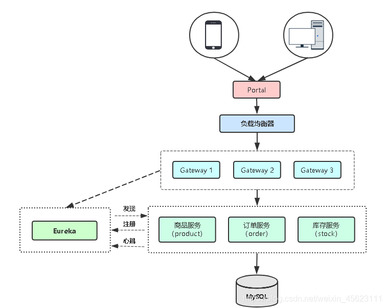
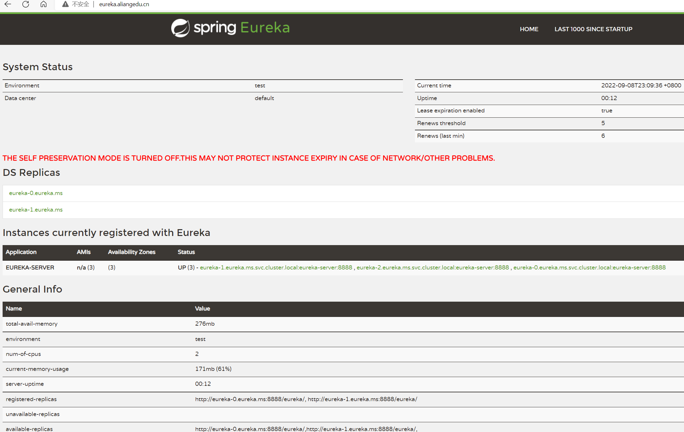

# k8s部署微服务

## 了解微服务



## 微服务项目

https://github.com/lizhenliang/simple-microservice

代码分支说明：

dev1：交付代码

dev2：编写dockerfile构建镜像

dev3：k8s资源编排

dev4：微服务链路监控

master：最终上线

## 部署流程

### 构建镜像并推送到镜像仓库

```shell
#下载代码
git clone https://github.com/lizhenliang/simple-microservice.git
cd simple-microservice
git checkout dev3

#修改代码的数据库地址和账号密码
修改order-service-biz、product-service-biz、stock-service-biz的application-fat.yml文件

#编译
mvn clean package -D maven.test.skip=true

#构建镜像
cd eureka-service/
docker build -t registry.cn-shenzhen.aliyuncs.com/c-hh/eureka:v1 .
cd gateway-service/
docker build -t registry.cn-shenzhen.aliyuncs.com/c-hh/gateway:v1 .
cd order-service/order-service-biz/
docker build -t registry.cn-shenzhen.aliyuncs.com/c-hh/order-service:v1 .
cdll product-service/product-service-biz/
docker build -t registry.cn-shenzhen.aliyuncs.com/c-hh/product-service:v1 .
cd stock-service/stock-service-biz/
docker build -t registry.cn-shenzhen.aliyuncs.com/c-hh/stock-service:v1 .
cd portal-service/
docker build -t registry.cn-shenzhen.aliyuncs.com/c-hh/portal-service:v1 .

#推送镜像到阿里云镜像仓库
docker push registry.cn-shenzhen.aliyuncs.com/c-hh/eureka:v1
docker push registry.cn-shenzhen.aliyuncs.com/c-hh/gateway:v1
docker push registry.cn-shenzhen.aliyuncs.com/c-hh/order-service:v1
docker push registry.cn-shenzhen.aliyuncs.com/c-hh/product-service:v1
docker push registry.cn-shenzhen.aliyuncs.com/c-hh/stock-service:v1
docker push registry.cn-shenzhen.aliyuncs.com/c-hh/portal-service:v1
```

### 服务编排

创建拉取镜像secret

```shell
kubectl create secret docker-registry registry-pull-secret --docker-server=registry.cn-shenzhen.aliyuncs.com --docker-username=haven_c --docker-password=Aa123456 -n ms
```

### 导入数据库文件到mysql

```shell
mysql -h gz-cdb-qpjp4x5v.sql.tencentcdb.com -P 57091 -uroot -p

create database tb_order;
create database tb_product;
create database tb_stock;

use tb_order;
source order.sql;

use tb_product;
source product.sql;

use tb_stock;
source stock.sql;
```

### 部署erueka集群

```yaml
cd simple-microservice/k8s
vim eureka.yaml
---
apiVersion: networking.k8s.io/v1
kind: Ingress
metadata:
  name: eureka
  namespace: ms
spec:
  rules:
    - host: eureka.aliangedu.cn
      http:
        paths:
        - path: /
          pathType: Prefix
          backend:
            service:
              name: eureka
              port:
                number: 8888
---
apiVersion: v1
kind: Service
metadata:
  name: eureka
  namespace: ms
spec:
  clusterIP: None
  ports:
  - port: 8888
    name: eureka
  selector:
    project: ms
    app: eureka

---
apiVersion: apps/v1
kind: StatefulSet
metadata:
  name: eureka
  namespace: ms
spec:
  replicas: 3
  selector:
    matchLabels:
      project: ms
      app: eureka
  serviceName: "eureka"
  template:
    metadata:
      labels:
        project: ms
        app: eureka
    spec:
      imagePullSecrets:
      - name: registry-pull-secret
      containers:
      - name: eureka
        image: registry.cn-shenzhen.aliyuncs.com/c-hh/eureka:v1
        ports:
         - protocol: TCP
            containerPort: 8888
        env:
          - name: MY_POD_NAME
            valueFrom:
              fieldRef:
                fieldPath: metadata.name
        resources:
          requests:
            cpu: 0.5
            memory: 256Mi
          limits:
            cpu: 1
            memory: 1Gi
        readinessProbe:
          tcpSocket:
            port: 8888
          initialDelaySeconds: 60
          periodSeconds: 10
        livenessProbe:
          tcpSocket:
            port: 8888
          initialDelaySeconds: 60
          periodSeconds: 10
```



### 部署网关

```yaml
vim gateway.yaml
---
apiVersion: networking.k8s.io/v1
kind: Ingress
metadata:
  name: gateway
  namespace: ms
spec:
  rules:
    - host: gateway.aliangedu.cn
      http:
        paths:
        - path: /
          pathType: Prefix
          backend:
            service:
              name: gateway
              port:
                number: 9999
---
apiVersion: v1
kind: Service
metadata:
  name: gateway
  namespace: ms
spec:
  ports:
  - port: 9999
    name: gateway
  selector:
    project: ms
    app: gateway
---
apiVersion: apps/v1
kind: Deployment
metadata:
  name: gateway
  namespace: ms
spec:
  replicas: 2
  selector:
    matchLabels:
      project: ms
      app: gateway
  template:
    metadata:
      labels:
        project: ms
        app: gateway
    spec:
      imagePullSecrets:
      - name: registry-pull-secret
      containers:
      - name: gateway
        image: registry.cn-shenzhen.aliyuncs.com/c-hh/gateway:v1
        imagePullPolicy: Always
        ports:
          - protocol: TCP
            containerPort: 9999
        resources:
          requests:
            cpu: 0.5
            memory: 256Mi
          limits:
            cpu: 1
            memory: 1Gi
        readinessProbe:
          tcpSocket:
            port: 9999
          initialDelaySeconds: 60
          periodSeconds: 10
        livenessProbe:
          tcpSocket:
            port: 9999
          initialDelaySeconds: 60
          periodSeconds: 10
```

### 部署业务程序

order

```yaml

```


### 部署前端


## 创建helm

创建一个chart包

```shell
helm create java
cd java ;rm -fr templates/*
```

修改values.yaml

```yaml
# Default values for java. 
# This is a YAML-formatted file. 
# Declare variables to be passed into your templates. 
 
replicaCount: 2 
namespace: ms
label: {} 
annotations: {} 
 
#image 
image: 
  repository: registry.cn-shenzhen.aliyuncs.com/c-hh/order-service
  pullPolicy: IfNotPresent 
  tag: "v1" 
 
imagePullSecrets: [] 
nameOverride: "" 
fullnameOverride: "" 
 
#pod更新策略 
strategy: 
  rollingUpdate: 
    maxSurge: 1 
    maxUnavailable: 0 
 
#java 应用配置参数 
jarInfo: 
  name: "/opt/neighbour-group.jar" 
  port: 10051 
  version: v1 
  args: ['-XX:+UnlockExperimentalVMOptions','-XX:+UseCGroupMemoryLimitForHeap','-XX:MaxRAMFraction=1'] 
  env: 
  - name: NACOS_CONFIG_ADDR 
    value: "nacos-headless.nacos.svc.cluster.local:8848" 
  - name: SEATA_CONFIG_ADDR 
    value: "seata-server.default.svc.cluster.local:8091" 
  - name: enable_multi_nacos 
    value: "true" 
  - name: additional_nacos_address 
    value: http://nacos-headless.nacos.svc.cluster.local:8848  
  addenv: {} 
 
# 资源限制 
resources: 
  limits: 
    cpu: 1 
    memory: 1 
  requests: 
    cpu: 100Mi 
    memory: 200Mi 
 
#探针 
readinessProbe: 
  initialDelaySeconds: 15 
  periodSeconds: 10 
 
livenessProbe: 
  initialDelaySeconds: 25 
  periodSeconds: 10 
  failureThreshold: 3 
 
#节点亲和度 
nodeSelector: {} 
##污点 
tolerations: [] 
##容忍 
affinity: {} 
 
serviceAccount: 
  # Specifies whether a service account should be created 
  create: true 
  # Annotations to add to the service account 
  annotations: {} 
  # The name of the service account to use. 
  # If not set and create is true, a name is generated using the fullname template 
  name: ""

podAnnotations: {}

podSecurityContext: {}
  # fsGroup: 2000

securityContext: {}
  # capabilities:
  #   drop:
  #   - ALL
  # readOnlyRootFilesystem: true
  # runAsNonRoot: true
  # runAsUser: 1000

service:
  type: ClusterIP
  port: 80
  protocol: TCP
  annotations: {}

ingress:
  enabled: false
  className: ""
  annotations: {}
    # kubernetes.io/ingress.class: nginx
    # kubernetes.io/tls-acme: "true"
  hosts:
    - host: chart-example.local
      paths:
        - path: /
          pathType: ImplementationSpecific
  tls: []
  #  - secretName: chart-example-tls
  #    hosts:
  #      - chart-example.local
```

修改deployment.yaml

```yaml
apiVersion: apps/v1
kind: Deployment 
metadata:
  name: {{ .Release.Name }}
  namespace: {{ .Values.namespace | default "ms" }}
spec:
  revisionHistoryLimit: 10
  replicas: {{ .Values.replicaCount }}
  strategy: {{ toYaml .Values.strategy | nindent 4 }}
  selector:
    matchLabels:
      project: ms
      app: {{ .Release.Name }}
  template:
    metadata:
      annotations: {{ toYaml .Values.image.annotations | nindent 8 }}
      labels:
        project: ms 
        app: {{ .Release.Name }}
    spec:
      imagePullSecrets:
      - name: registry-pull-secret
      containers:
      - name: {{ .Release.Name }}
        image: {{ .Values.image.repository }}:{{ .Values.image.tag }}
        imagePullPolicy: {{ .Values.image.pullPolicy }}
        ports:
          - protocol: TCP
            containerPort: 8020 
        env:
          - name: JAVA_OPTS
            value: "-Xmx1g"
        resources:
          requests:
            cpu: 0.5
            memory: 256Mi
          limits:
            cpu: 1
            memory: 1Gi
        readinessProbe:
          tcpSocket:
            port: 8020
          initialDelaySeconds: 60
          periodSeconds: 10
        livenessProbe:
          tcpSocket:
            port: 8020
          initialDelaySeconds: 60
          periodSeconds: 10
```

修改service.yaml

```yaml
apiVersion: v1
kind: Service
metadata:
  name: portal
  namespace: {{ .Vaules.namespace }}
spec:
  type: {{ .Values.service.type }}
  ports:
  - port: 8080
    name: portal 
  selector:
    project: ms
    app: portal
```

