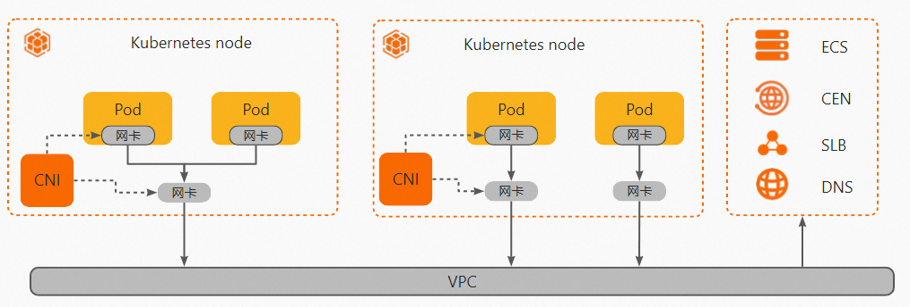
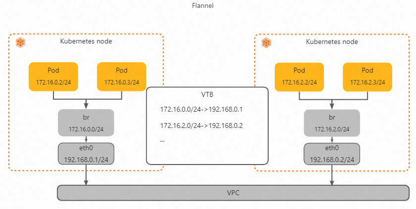

容器网络模型

容器网络特点如下：

- 每个Pod都拥有自己独立的网络空间和IP地址。不同Pod的应用可以监听同样的端口而不冲突。

- Pod可以通过各自的IP地址互相访问。

  集群中Pod可以通过它独立的IP地址与其他应用互通：

  - 同一个集群中，Pod之间相互访问。
  - Pod直接访问同一个VPC下的ECS。（需要正确设置安全组规则）
  - 同一个VPC下的ECS直接访问Pod。（需要正确设置安全组规则）

## Flannel插件

Flannel网络模式中Pod的网段独立于VPC的网段。Pod网段会按照掩码（节点IP数量）均匀划分给每个集群中的节点，每个节点上的Pod会从节点上划分的网段中分配IP地址。

