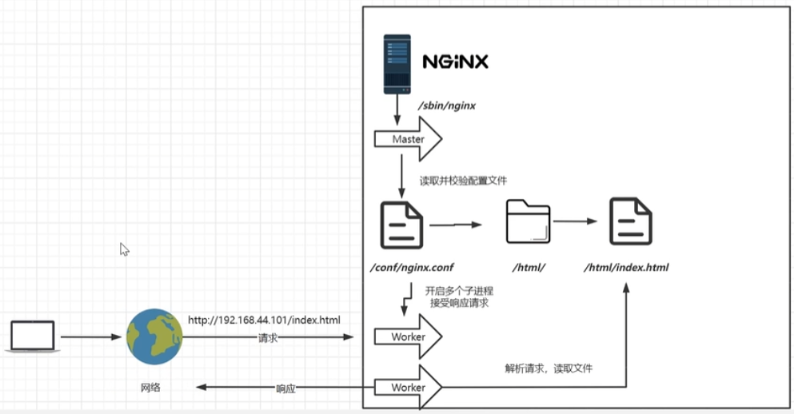
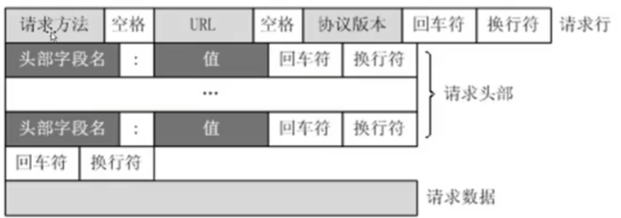

# Nginx概念

nginx：全称engine X；
Tengine：淘宝二次开发版本；


Nginx 是一个高性能的 HTTP 和反向代理服务器，特点是占用内存少，并发能力强，事实上 Nginx 的并发能力确实在同类型的网页服务器中表现较好。有报告 Nginx 能支持高达 50000 个并发连接数。

## Nginx原理




首先nginx会启动**master主进程**，master进程读取并校验配置文件，然后开启多个**worker子进程来接收响应请求**


- Nginx 采用**多进程+异步非阻塞**方式（IO 多路复用 Epoll）。
- 请求的完整过程：建立连接→读取请求→解析请求→处理请求→响应请求。
- 请求的完整过程对应到底层就是：读写 Socket 事件。

I/O类型：

同步：调用发出后不会立即返回，一旦返回则返回最终结果

异步：调用发出后，被调用方立即返回结果，但返回并非最终结果

阻塞：调用结果返回之前，调用者会被挂起；调用者只有在得到返回结果之后才能继续

非阻塞：调用者在调用结果返回之前，不会被挂起，即调用不会阻塞调用者

## Nginx命令

```shell
nginx -c /path/to/nginx.conf  	  # 以特定目录下的配置文件启动nginx:
nginx -s reload            	 	 	  # 修改配置后重新加载生效
nginx -s reopen   			 	 				# 重新打开日志文件
nginx -s stop  				 	 	 				# 快速停止nginx
nginx -s quit  				  	 				# 完整有序的停止nginx
nginx -t    					 		 				# 测试当前配置文件是否正确
nginx -t -c /path/to/nginx.conf   # 测试特定的nginx配置文件是否正确
```

## http协议

http1.x协议报文组成：




常见请求：

```text
GET: 从服务器上请求一个资源；
HEAD: 请求资源时，服务器端只响应首部；而不返回body；
POST: 浏览器或者useragent端通过提交表单；
PUT: 上传资源；
DELETE: 删除资源；
TRACE: 跟踪资源所经过的代理服务器；
OPTIONS：查看资源支持哪些请求方法；
```

## curl命令

curl**加一个 -I 选项，就会看到服务端返回的相关头信息**，这里面有很多 response head 信息，比如说 HTTP 的协议类型是 1.1，服务端状态码是 200，表示服务端返回正常。同时看到服务端返回的数据长度、类型以及缓存的头信息。

这里请求我的博客地址 URL（命令：curl www.jesonc.com），会发现并没有默认的 body 数据返回。为什么呢？因为服务端返回来一些重定向类型的状态码，比如 **301、302 的这种重定向，是没有 body 数据的**，只会返回头信息，所以我们可以先看头信息的内容。

在这个时候，如果想更加全面地了解整个通信过程，可以**加一个 -v** 参数。你可以看到请求服务端是不是已经发送出去了？并可以看到客户端发送的请求内容是什么，另外是看到服务端返回的情况，加 -v 的参数的作用就是可以把整个通信过程都打印出来。
