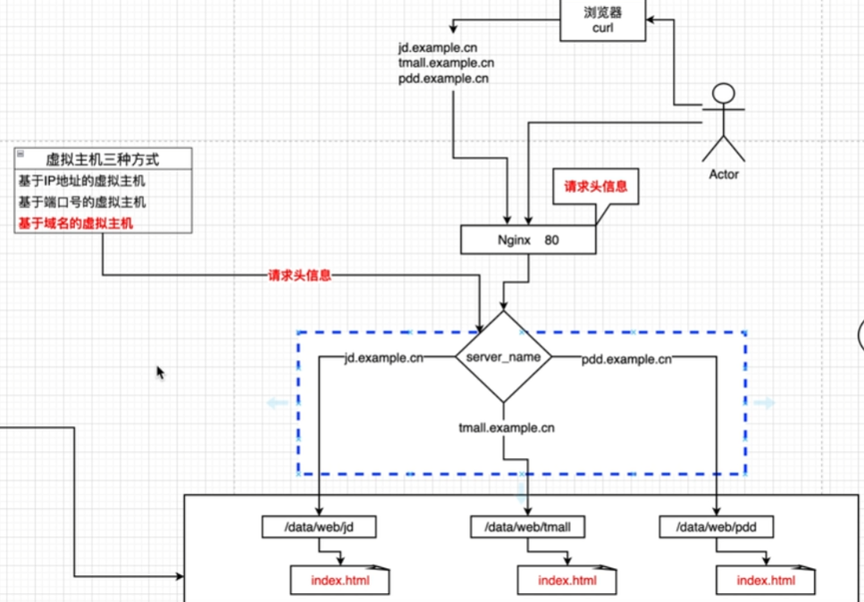

## nginx.conf详解

- 全局参数(配置影响nginx全局的指令。)


```nginx
user nginx nginx	#定义nginx运行的用户和组
pid /run/nginx.pid;	#pid文件位置
#error_log /var/log/nginx/error.log error;	#全局日志输出位置,一定要设置warn级别以上[ debug|info|notice|warn|error|crit]，该配置可以在此处定义，也可以定义到http、server、location里
worker_processes auto;	#开启的工作进程数量,和cpu核心数量相等
worker_rlimit_nofile 65535;	#一个nginx 进程打开的最多文件描述符数目，理论值应该是最多打开文件数（ulimit -n）与进程数相除，但是nginx分配请求并不是那么均匀，所以最好与ulimit -n值一致
```

- events块


```nginx
events {
	use epoll;
	worker_connections	65535;	#每个work进程最大的连接数,并发限定总数是 worker_processes 和 worker_connections 的乘积;在设置了反向代理的情况下，max_clients = worker_processes * worker_connections / 2  因为作为反向代理服务器，每个并发会建立与客户端的连接和与后端服务的连接，会占用两个连接。
    accept_mutex on;（节省资源）当某一个时刻只有一个网络连接请求服务器时，服务器上有多个睡眠的进程会被同时叫醒，这样会损耗一定的服务器性能。Nginx中的accept_mutex设置为on，将会对多个Nginx进程（worker processer）接收连接时进行序列化，防止多个进程争抢资源。默认就是on。
    multi_accept on;（提升并发性能）nginx worker processer可以做到同时接收多个新到达的网络连接，前提是把该参数设置为on。默认为off，即每个workerprocess一次只能接收一个新到达的网络连接。
}
```

- http块

  - 日志格式

  ```nginx
  http {
  	log_format  main  '$remote_addr - $remote_user [$time_local] "$request" '
                        '$status $body_bytes_sent "$http_referer" '
                        '"$http_user_agent" "$http_x_forwarded_for"';
      access_log  /var/log/nginx/access.log  main;
      error_log /var/log/nginx/error.log info;
  }
  ```

  

  - 基础配置

  ```nginx
  http {
      #隐藏版本号
      server_tokens off;
      #编码格式
      charset UTF-8;
      
      include	/etc/nginx/conf.d/*.conf;
  }
  ```

  

  - limit

  ```nginx
  http {
      #限制同一客户端的并发连接数
      limit_conn_zone $binary_remote_addr zone=addr:5m;
      limit_conn addr 100; #我们设置的值是 100，也就是说我们允许每一个 IP 地址最多同时打开有 100 个连接。
      limit_rate_after 3m; #限速模块，前3M下载时不限速
      limit_rate 512k;    #限速模块
  }
  ```

  

  - 信息传输

  ```nginx
  http {
      #开启数据0拷贝，首先nginx接受到请求后要把数据文件响应给客户端， 如果不开启sendfile，nginx先把数据加载到应用程序内存中，然后再发送到网络接口；如果开启sendfile，nginx应用程序就不去加载数据，而是发送sendfile信号给网络接口，网络接口直接去加载数据发送给客户端
      sendfile        on;
      #必须在sendfile开启模式才有效，告诉nginx在一个数据包里发送所有头文件，而不一个接一个的发送。
      tcp_nopush     on;
      #必须在sendfile开启模式才有效告诉nginx不要缓存数据，而是一段一段的发送--当需要及时发送数据时，就应该给应用设置这个属性，这样发送一小块数据信息时就不能立即得到返回值。
      tcp_nodelay on;
  }
  ```

  

  - server_name

  ```nginx
  http {
  	#保存服务器名字的hash表是由指令server_names_hash_max_size 和server_names_hash_bucket_size所控制的。参数hash bucket size总是等于hash表的大小，并且是一路处理器缓存大小的倍数。在减少了在内存中的存取次数后，使在处理器中加速查找hash表键值成为可能。如果hash bucket size等于一路处理器缓存的大小，那么在查找键的时候，最坏的情况下在内存中查找的次数为2。第一次是确定存储单元的地址，第二次是在存储单元中查找键 值。因此，如果Nginx给出需要增大hash max size 或 hash bucket size的提示，那么首要的是增大前一个参数的大小
      server_names_hash_bucket_size 64;
      #存储服务器名字的值大小，默认512kb，如果一个server对应多个域名，就要加大此值
      server_names_hash_max_size 256;
  }
  ```

  

  - 超时设置

  ```nginx
  http {
      #客户端连接保持会话超时时间，超过这个时间，服务器断开这个链接，对于后端是php，可以低一些，因为php解析快，java的话要长一些，java解析慢
      keepalive_timeout  30;
      #设置请求头的超时时间。我们也可以把这个设置低些，如果超过这个时间没有发送任何数据，nginx将返回request time out的错误
      client_header_timeout 10;
      #设置请求体的超时时间。我们也可以把这个设置低些，超过这个时间没有发送任何数据，和上面一样的错误提示
      client_body_timeout 10;
      #响应客户端超时时间，服务端给客户端发送数据，如果客户端迟迟不接受没超过以下时间将断开连接
      send_timeout 10;
      #告诉nginx关闭不响应的客户端连接。这将会释放那个客户端所占有的内存空间。
      reset_timedout_connection on;
  }
  ```

  

### 请求缓冲

可配置位置：

- http

- server

- location

  

**缓冲（buffer）**：向硬盘写入数据时，先把数据放入缓冲区，然后再一起写入硬盘，把分散的写操作集中进行，减少磁盘碎片和磁盘的反复寻道，从而提高系统高性能。

**客户端请求发送来一个数据**后，nginx先处理请求头，然后处理请求体，发送来的数据可能会比较大，可以通过client_body_buffer_size 配置缓冲区的大小

```nginx
http {
    #客户端请求体的缓冲大小，如果请求体大于缓冲区，则将整个请求体或仅将其部分写入临时文件。默认32位8k，64位16k
    client_header_buffer_size 32k;
    #对客户端请求的body缓冲大小
    client_body_buffer_size 
    
    #此指令规定了用于读取大型客户端请求头的缓冲区的最大数量和大小。 这些缓冲区仅在缺省缓冲区不足时按需分配。 当处理请求或连接转换到保持活动状态时，释放缓冲区。如下例子：
    large_client_header_buffers 4 64k;
}
```

### 对客户端的限制

可配置位置：

- http
- server
- location


```nginx
http {
    #NGINX上传文件最大限制。 默认1M，如果请求大于指定的大小，则NGINX发回HTTP 413（Request Entity too large）错误。如果在上传大文件，可以将此值设置大一些
    client_max_body_size 20m;
   
    #客户端与服务端建立连接后发送request body的超时时间，如果指定时间内没发送任何内容，nginx返回http 408
    client_body_timeout
    client_header_timeout
    
    #在磁盘上客户端的body临时缓冲区位置
    client_body_temp_path
    #把body写入磁盘文件，请求结束不会删除
    client_body_in_file_only on;
    
    #这个将为打开文件指定缓存，默认是没有启用的，max指定缓存数量，建议和打开文件数一致，inactive 是指经过多长时间文件没被请求后删除缓存。
    open_file_cache max=100000 inactive=20s;
    #这个是指多长时间检查一次缓存的有效信息。
    open_file_cache_valid 30s;
    #open_file_cache指令中的inactive 参数时间内文件的最少使用次数，如果超过这个数字，文件描述符一直是在缓存中打开的，如上例，如果有一个文件在inactive 时间内一次没被使用，它将被移除。
    open_file_cache_min_uses 2;
    #指定了当搜索一个文件时是否缓存错误信息，也包括再次给配置中添加文件。我们也包括了服务器模块，这些是在不同文件中定义的。如果你的服务器模块不在这些位置，你就得修改这一行来指定正确的位置
    open_file_cache_errors off;
}
```

### fastcgi调优（配合PHP引擎动态服务）

```nginx
http {
    fastcgi_connect_timeout    300;	#指定连接到后端fastCGI的超时时间
    fastcgi_send_timeout    300;	#向FastCGI传送请求的超时时间，这个值是指已经完成两次握手后向FastCGI传送请求的超时时间
    fastcgi_read_timeout    300;	#指定接收FastcGI应答的超时时间，这个值是指己经完成两次握手后接收FastCGI应答的超时时间
    fastcgi_buffer_size    32k;	#指定读取FastCGI应答第一部分需要用多大的缓冲区，这个值表示将使用1个64KB的缓冲区读取应答的第一部分（应答头），可以置为fastcgi_buffers选项指定的缓冲区大小。
    fastcgi_buffers    8 32k;	#指定本地需要用多少和多大的缓冲区来缓冲FastCGI的应答请求。如果一个PHP脚本所产生的页面大小为256KB,为其分配4个64KB的缓冲区来缓存；如果页面大小大于256KB，那么大于256KB的部分会缓存到fastcgi_temp指定的路径中，但是这并不是好方法，因为内存中的数据处理速度要快于硬盘。一般这个值应该为站点中PHP脚本所产生的页面大小的中间值，如果站点大部分脚本所产生的页面大小为256KB，那么可以把这个值设置为"16 16k"、"16 16k" 
}
```

### 负载均衡

```nginx
http {
	upstream lbEureka {
		server    10.1.96.3:80 weight=1 max_fails=2 fail_timeout=30s;
        server    10.1.96.4:80 weight=1 max_fails=2 fail_timeout=30s;
	}
}
```

### 压缩

作用域：

http、server、location

```nginx
vim /etc/nginx/conf.d/gzip.conf
    #开启页面压缩
    gzip  on;
    #缓冲区大小
    gzip_buffers 16 8k;
    
    #被gzip压缩的响应的最小长度，长度仅由“Content-Length”响应报头字段确定
    gzip_min_length 1024K;
    # gzip版本
    gzip_http_version 1.1;

    # 压缩级别 1-9，级别越高压缩率越大，当然压缩时间也就越长（传输快但比较消耗cpu）。 
    gzip_comp_level 6;
    #需要进行gzip压缩的Content-Type的Header的类型。建议js、text、css、xml、json都要进行压缩；图片就没必要了，gif、jpge文件已经压缩得很好了，就算再压，效果也不好，而且还耗费cpu。
    #gzip_types text/HTML text/plain application/x-javascript text/css application/xml;
    gzip_types text/plain application/javascript application/x-javascript text/css application/xml text/javascript application/x-httpd-php image/jpeg image/gif image/png;
    # 禁用IE6的gzip压缩，又是因为杯具的IE6。当然，IE6目前依然广泛的存在，所以这里你也可以设置为“MSIE [1-5].”
    # IE6的某些版本对gzip的压缩支持很不好，会造成页面的假死，今天产品的同学就测试出了这个问题后来调试后，发现是对img进行gzip后造成IE6的假死，把对img的gzip压缩去掉后就正常了为了确保其它的IE6版本不出问题，所以建议加上gzip_disable的设置
    gzip_disable "msie6";

    gzip_proxied 多选，针对上游服务器返回的头信息进行压缩，一般不配置
    # 默认值：off
    #off - 关闭所有的代理结果数据的压缩
    #expired - 启用压缩，如果header头中包含 "Expires" 头信息
    #no-cache - 启用压缩，如果header头中包含 "Cache-Control:no-cache" 头信息
    #no-store - 启用压缩，如果header头中包含 "Cache-Control:no-store" 头信息
    #private - 启用压缩，如果header头中包含 "Cache-Control:private" 头信息
    #no_last_modified - 启用压缩,如果header头中不包含 "Last-Modified" 头信息
    #no_etag - 启用压缩 ,如果header头中不包含 "ETag" 头信息
    #auth - 启用压缩 , 如果header头中包含 "Authorization" 头信息
    #any - 无条件启用压缩
    
    #尽量发送压缩过的静态文件
    gzip_static on;
```

## 虚拟主机

一个nginx可以通过配置不同的域名来配置多个站点

vim /etc/nginx/conf.d/*.conf




反向代理：

nginx处理请求体时，可以通过配置proxy_request_buffering来决定如何发送到上游服务器（后端服务器），on是完全读到请求体后再发送，off是一边读body一边发送给上游服务器。

通过开启proxy_buffering来**缓冲上游服务器返回的数据**，proxy_buffers配置缓冲区的大小

### 例1:slb-->nginx（前端+代理）

把域名解析到slb公网地址，slb监听该服务器，就可以通过域名访问该前端服务

/etc/nginx/conf.d/xx.conf：

```nginx
#后端地址池
upstream xxx {
	server    10.xx.xx.xx:27000 weight=1 max_fails=2 fail_timeout=30s;
    server    10.xx.xx.xx:27000 weight=1 max_fails=2 fail_timeout=30s;
}

server {
	listen       33100;	#监听端口
	server_name  10.xx.xx.xx;	#内网ip
	access_log   /var/logs/nginx/xx_access.log main;
	error_log    /var/logs/nginx/xx_error.log warn;
	
  #前端服务
	root         /data/www/xx/dist;
	index  index.html index.htm;
	
	#https证书
	ssl on;
    ssl_certificate /etc/nginx/ssl/xx/xx.xxx.com.pem;
    ssl_certificate_key /etc/nginx/ssl/xx/xx.xxx.com.key;
    ssl_session_timeout 5m;
    ssl_protocols TLSv1 TLSv1.1 TLSv1.2;
    ssl_ciphers AESGCM:ALL:!DH:!EXPORT:!RC4:+HIGH:!MEDIUM:!LOW:!aNULL:!eNULL;
    ssl_prefer_server_ciphers on;
  
  #后端服务
  location /api/ {
      proxy_pass http://xxx; #反向代理
      proxy_redirect     off; #关闭proxy重定向
      proxy_set_header   Host             $http_host; #包含客户端真实的域名和端口号
      proxy_set_header   X-Real-IP        $remote_addr; # 表示客户端真实的IP（remote_addr 是一个 Nginx 的内置变量，它获取到的是 Nginx 层前端的用户 IP 地址，这个地址是一个 4 层的 IP 地址）
      （相对于下面的方式而言更加准确，因为 remote_addr 是直接获取第一层代理的用户 IP 地址，如果直接把这个地址传递给 X-Real，这样就会更加准确。但是它有什么劣势呢？如果是多级代理的话，用户如果不是直接请求到最终的代理层，而是在中间通过了 n 层带来转发过来的话，此时 remote_addr 可能获取的不是用户的信息，而是 Nginx 最近一层代理过来的 IP 地址，此时同样没有获取到真实的用户 IP 地址信息。）
      proxy_set_header   X-Forwarded-For  $proxy_add_x_forwarded_for; #在多层代理时会包含真实客户端及中间每个代理服务器的IP（加了一个转发到后端的标准 head 信息，把用户的 IP 信息通过 X-Forwarded-For  方式传递过去）
      proxy_set_header X-NginX-Proxy true;
      proxy_next_upstream error timeout invalid_header http_500 http_502 http_503 http_504;
      proxy_max_temp_file_size 0;
      
      proxy_connect_timeout 900; #nginx 跟后端服务器连接超时时间
      proxy_send_timeout 900; #nginx向后端发送请求报文的超时时间
      proxy_read_timeout 9000; #nginx读取后端响应内容的超时时间
    
      proxy_buffering on;	#缓冲开关，nignx会把后端返回的内容先放到缓冲区当中，然后再返回给客户端（边收边传，不是全部接收完再传给客户端）
      proxy_buffer_size 16k; #缓冲区大小
      proxy_buffers 4 64k; #缓冲区数量及每个buffer被分配的内存大小
      proxy_busy_buffers_size 128k; #忙碌的缓冲区大小控制同时传递给客户端的buffer数量
      proxy_temp_file_write_size 128k;
    
      client_max_body_size 20m;
      client_body_buffer_size 10m;
  }
}
```

### 例2:nginx（代理）-->nginx（前端）

把域名解析到nginx代理的服务器ip

nginx代理配置：

```nginx
server {
        listen 80;
        server_name xx.xxx.com;

        rewrite ^(.*)$ https://${server_name}$1 permanent;
}

server {
        listen 443;
        server_name xx.xxx.com;

        access_log /var/log/nginx/xx_access.log;
        error_log /var/log/nginx/xx_error.log;

        ssl on;
        ssl_certificate /etc/nginx/sslkey/xx/xx.xxx.com.pem;
        ssl_certificate_key /etc/nginx/sslkey/xx/xx.xxx.com.key;
        ssl_session_timeout 5m;
        ssl_protocols TLSv1 TLSv1.1 TLSv1.2;
        ssl_ciphers AESGCM:ALL:!DH:!EXPORT:!RC4:+HIGH:!MEDIUM:!LOW:!aNULL:!eNULL;
        ssl_prefer_server_ciphers on;

        client_max_body_size 20m;

        location / {
            proxy_pass http://10.xx.xx.109:33100;
            proxy_http_version 1.1;
            proxy_set_header Host $http_host;
            proxy_set_header X-Forwarded-For $proxy_add_x_forwarded_for;
            proxy_set_header X-Real-Ip $remote_addr;
            proxy_set_header X-NginX-Proxy true;
        }

        allow 218.xx.xx.xx;
        deny all;
}
```

nginx前端配置：

```nginx
 server {
       listen  33100;
       server_name 10.xx.xx.109;
       index index.html index.htm index.php;
       root   /data/xx/dist;
       location / {
           index index.html;
       }
       location /api/ {
          proxy_pass http://127.0.0.1:27001;
       }
   }
```


## 日志中变量的含义

```shell
$http_x_real_ip 记录客户端IP地址,通常使用
$remote_addr, 这里结合负载均衡的配置获取真实的客户端IP 
$http_host 请求的域名 
$time_local 通用日志格式下的本地时间。 
$request 记录请求的URL和HTTP协议版本,及请求方式。 格式为"METHOD URL VERSION" 
$request_length 请求的长度（包括请求行，请求头和请求正文）。 
$status 记录请求状态，HTTP状态码。 
$body_bytes_sent 发送给客户端的响应体大小，不包括响应头。 $http_referer 记录从哪个页面链接访问过来的 
$http_user_agent 记录客户端浏览器相关信息 
$remote_addr 远端服务器，到底是哪台代理服务器来的请求。
```

## nginx自带变量

```shell
$args ： 这个变量等于请求行中的参数，同$query_string 
$content_length ： 请求头中的Content-length字段。 
$content_type ： 请求头中的Content-Type字段。 
$document_root ： 当前请求的文档根目录或别名。 
$host ： 请求主机头字段，否则为服务器名称。优先级：HTTP请求行的主机名>"HOST"请求头字段>符合请求的服务器名 
$http_user_agent ： 客户端agent信息 
$http_cookie ： 客户端cookie信息 
$limit_rate ： 这个变量可以限制连接速率。 
$request_method ： 客户端请求的动作，通常为GET或POST。 
$remote_addr ： 客户端的IP地址。 
$remote_port ： 客户端的端口。 
$remote_user ： 已经经过Auth Basic Module验证的用户名。 $request_filename ： 当前请求的文件路径，由root或alias指令与URI请求生成。 
$scheme ： HTTP方法（如http，https）。 
$server_protocol ： 请求使用的协议，通常是HTTP/1.0或HTTP/1.1。 $server_addr ： 服务器地址，在完成一次系统调用后可以确定这个值。 $server_name ： 服务器名称。 
$server_port ： 请求到达服务器的端口号。 
$request_uri ： 包含请求参数的原始URI，不包含主机名，如：”/foo/bar.php?arg=baz”。 
$uri ： 不带请求参数的当前URI，$uri不包含主机名，如”/foo/bar.html”。 $document_uri ： 与$uri相同。 
... ... 
更多的变量，我们可以通过产线官网: http://nginx.org/en/docs/http/ngx_http_core_module.html#variables
```


## nginx状态码和日志

http返回状态码(Status-Code)

```text
200     成功
301     永久重定向(redirect) 
302     临时重定向(redirect) 
304     浏览器缓存
403     请求不到首页，权限被拒绝
404     资源找不到
500     服务器内部错误，程序代码错误
502     找不到后端的资源
504     请求超时
```

浏览器（客户端）访问网站携带的参数，以及服务端返回的参数

```shell
//1.概况
Request URL: http://www.52wiki.cn/static/bootstrap/css/bootstrap.min.css       # 请求的URL地址
Request Method: GET                             # 请求的方法(获取)
Status Code: 200 OK (from memory cache)         # 返回的状态
Remote Address: 61.184.215.226:80               # 请求的地址
//2.客户端请求的头部信息
Accept: butes                                   # 请求的类型
Accept-Encoding: gzip, deflate                  # 是否进行压缩
Accept-Language: zh-CN,zh;q=0.9                 # 请求的语言
Cache-Control: max-age=0                        # 缓存
Connection: keep-alive                          # TCP长连接
Host: www.52wiki.cn                             # 请求的域名
If-Modified-Since: Tue, 04 Dec 2018 09:58:20 GMT# 修改的时间
If-None-Match: "a49-56b5ce607fe00"              # 标记
Upgrade-Insecure-Requests:1                     # 在http和https之间起的一个过渡作用
User-Agent: Mozilla/5.0                         # 请求浏览器的工具
"=== 请求一个空行 ==="
"=== 请求内容主体 ==="
//3.服务端响应的头部信息
HTTP/1.1 304 Not Modified                       # 返回服务器的http协议，状态码
Date: Fri, 14 Sep 2018 09:14:28 GMT             # 返回服务器的时间
Server: Apache/2.4.6 (CentOS) PHP/5.4.16        # 返回服务器使用的软件（Apache php）
Connection: Keep-Alive                          # TCP长连接
Keep-Alive: timeout=5, max=100                  # 长连接的超时时间
ETag: "a49-56b5ce607fe00"                       # 验证客户端标记
"=== 返回一个空行 ==="
"=== 返回内容主体 ==="
```

nginx日志统计

```shell
1.根据访问IP统计UV     awk '{print $1}'  access.log|sort | uniq -c |wc -l
2.根据访问URL统计PV    awk '{print $7}' access.log|wc -l     
3.查询访问最频繁的URL  awk '{print $7}' access.log|sort | uniq -c |sort -n -k 1 -r|more    
4.查询访问最频繁的IP   awk '{print $1}' access.log|sort | uniq -c |sort -n -k 1 -r|more
```


