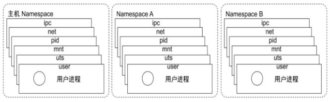
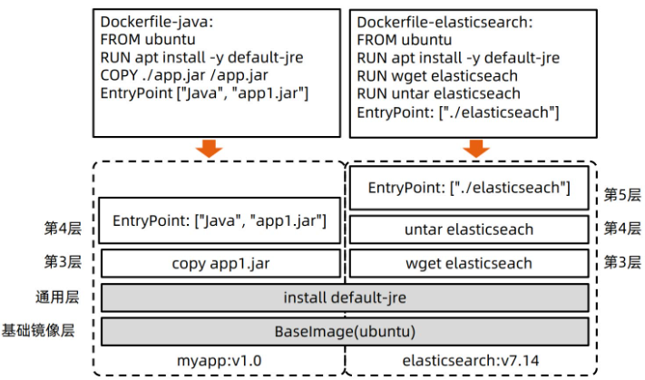
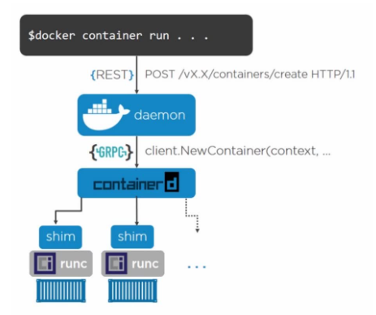

# Docker

## 简介

容器其实是一种**沙盒技术**，沙盒就是能够像一个个集装箱，把你的应用**“装”**起来的技术，这样应用与应用之间就有了**边界**而不互相干扰，而被装进集装箱的应用也方便**搬动**，这也是PASS最理想的状态。


docker容器镜像官网：

```text
dockerhub.com
download.docker.com
```

docker国内加速镜像站：

```text
阿里云
清华大学镜像站：mirrors.tuna.tsinghua.edu.cn
```

## 核心底层技术

### Namespaces（隔离）

**Linux namespace是一种Linux内核提供的资源隔离方案：**

- 系统可以为进程分配不同的namespace
- 保证不同的namespace资源独立分配、进程彼此隔离，即不同namespace下的进程互不干扰


复杂点说，**namespace是linux创建进程的可选参数。**

在 Linux 系统中**创建线程**的系统调用是 **clone()**，这个系统调用就会为我们创建一个新的进程，并且返回它的进程号 pid。而当我们用 clone() 系统调用创建一个新进程时，就可以在参数中指定 CLONE_NEWPID 参数这时，**新创建的这个进程将会“看到”一个全新的进程空间**，在这个进程空间里，它的 PID 是 1。之所以说“看到”，是因为这只是一个“障眼法”，在宿主机真实的进程空间里，这个进程的 PID 还是真实的数值，比如 100。

多次执行上面的 clone() 调用，这样就会创建多个 PID Namespace，而每个 Namespace 里的应用进程，都会认为自己是当前容器里的第 1 号进程。它们既看不到宿主机里真正的进程空间，也看不到其他 PID Namespace 里的具体情况。


namespace6项隔离：

- **pid namespace**
  - 不同用户的进程就是通过Pidnamespace隔离开的，且不同namespace 中可以有相同Pid。
  - 有了Pidnamespace, 每个namespace中的Pid能够相互隔离。
- **net namespace**
  - 网络隔离是通过net namespace实现的，每个net namespace有独立的network devices, IPaddresses, IP routing tables, /proc/net 目录。
- **ipc namespace**
  - Container中进程交互还是采用linux常见的进程间交互方法（interprocesscommunication –IPC）, 包括常见的信号量、消息队列和共享内存。
  - container 的进程间交互实际上还是host上具有相同Pidnamespace中的进程间交互，因此需要在IPC资源申请时加入namespace信息-每个IPC资源有一个唯一的32 位ID。
- **mnt namespace**
  - mntnamespace允许不同namespace的进程看到的文件结构不同，这样每个namespace 中的进程所看到的文件目录就被隔离开了。
- **uts namespace**
  - 允许每个container拥有独立的hostname和domain name, 使其在网络上可以被视作一个独立的节点而非Host上的一个进程。
- **user namespace**
  - 每个container可以有不同的user 和group id, 也就是说可以在container内部用container内部的用户执行程序而非Host上的用户。

简单举个例子，在不同pid namespace下，看到的进程pid是不一样的；在不同network namespace下，看到的网络配置是不一样的



​                       

**所以说，容器，其实是一种特殊的进程而已。**一般不推荐在一个容器运行多个进程，如果有类似需求，可以通过额外 的进程管理机制，比如 supervisord 来管理所运行的进程。

在 Linux 内核中，有很多资源和对象是不能被 Namespace 化的，最典型的例子就是：时间。

### Control groups（限制）

**Cgroups（Control Groups）是Linux下用于对一个或一组进程进行资源控制和监控的机制；可以对诸如CPU使用时间、内存、磁盘I/O等进程所需的资源进行限制**

- Cgroups以文件系统的方式暴露给用户使用，/sys/fs/cgroup 下面有很多诸如 cpuset、cpu、 memory 这样的子目录，也叫子系统
- 使用时，在每个子系统下新建一个控制组（子目录下新建一个目录，操作系统会自动为其填充资源限制文件），将需要限制的进程的PID填写入tasks文件中

	blkio：块设备IO；
	cpu：CPU；
	cpuacct：CPU资源使用报告；
	cpuset：多处理器平台上的CPU集合；
	devices：设备访问；
	freezer：挂起或恢复任务；
	memory：内存用量及报告；
	perf_event：对cgroup中的任务进行统一性能测试；
	net_cls：cgroup中的任务创建的数据报文的类别标识符；
```shell
docker run -d --name mysql --memory="500m" --memory-swap="600M" --oom-kill-disabel mysql01
# 限制CPU
docker run -d --name mysql --cpus=".5"
docker run -d --name mysql --cpus="1.5
```

### Union FS（文件系统）

**关于联合文件系统：**

- 将不同目录挂载到同一个虚拟文件系统下（unite several directories into a single virtual filesystem）的文件系统
- 支持为每一个成员目录（类似GitBranch）设定readonly、readwrite和whiteout-able 权限
- 文件系统分层, 对readonly权限的branch 可以逻辑上进行修改(增量地, 不影响readonly部分的)。
- 通常Union FS 有两个用途, 一方面可以将多个disk挂到同一个目录下, 另一个更常用的就是将一个readonly的branch 和一个writeable 的branch 联合在一起。


容器镜像的分层结构：



- Dockerfile中的每一条指令，都会为镜像生成一个层，即一个增量rootfs

- 用命令`docker image insepct <image-name>:<tag-name>`可以看到“RootFS”字段下镜像的分层信息

```shell
$ docker image inspect ubuntu:latest
...
     "RootFS": {
      "Type": "layers",
      "Layers": [
        "sha256:f49017d4d5ce9c0f544c...",
        "sha256:8f2b771487e9d6354080...",
        "sha256:ccd4d61916aaa2159429...",
        "sha256:c01d74f99de40e097c73...",
        "sha256:268a067217b5fe78e000..."
      ]
    }
    
#可以看到，这个 Ubuntu 镜像，实际上由五个层组成。这五个层就是五个增量 rootfs，每一层都是 Ubuntu 操作系统文件与目录的一部分；而在使用镜像时，Docker 会把这些增量联合挂载在一个统一的挂载点上，这个挂载点就是 /var/lib/docker/aufs/mnt/
```


## 安装

https://docs.docker.com/engine/install/centos

```shell
#先执行以下命令卸载旧版 Docker
$ sudo yum remove docker \
                  docker-client \
                  docker-client-latest \
                  docker-common \
                  docker-latest \
                  docker-latest-logrotate \
                  docker-logrotate \
                  docker-engine
#添加 Docker 安装源
wget https://mirrors.aliyun.com/docker-ce/linux/centos/docker-ce.repo -O /etc/yum.repos.d/docker-ce.repo
#正常情况下，直接安装最新版本的 Docker 即可
$ sudo yum install docker-ce docker-ce-cli containerd.io docker-buildx-plugin docker-compose-plugin
#如果你想要安装指定版本的 Docker
$ sudo yum list docker-ce --showduplicates | sort -r
docker-ce.x86_64            18.06.1.ce-3.el7                   docker-ce-stable
docker-ce.x86_64            18.06.0.ce-3.el7                   docker-ce-stable
docker-ce.x86_64            18.03.1.ce-1.el7.centos            docker-ce-stable
docker-ce.x86_64            18.03.0.ce-1.el7.centos            docker-ce-stable
docker-ce.x86_64            17.12.1.ce-1.el7.centos            docker-ce-stable
docker-ce.x86_64            17.12.0.ce-1.el7.centos            docker-ce-stable
docker-ce.x86_64            17.09.1.ce-1.el7.centos            docker-ce-stable
$ sudo yum install docker-ce-<VERSION_STRING> docker-ce-cli-<VERSION_STRING> containerd.io
#配置阿里云镜像加速
mkdir /etc/docker
vim /etc/docker/daemon.json
{
    "registry-mirrors": ["https://plqjafsr.mirror.aliyuncs.com"]
    #"registry-mirrors": ["https://registry.docker-cn.com"]
}
systemctl enable docker && systemctl start docker
docker version
```

这里有一个国际惯例，安装完成后，我们需要使用以下命令启动一个 hello world 的容器

```shell
$ sudo docker run hello-world
Unable to find image 'hello-world:latest' locally
latest: Pulling from library/hello-world
0e03bdcc26d7: Pull complete
Digest: sha256:7f0a9f93b4aa3022c3a4c147a449bf11e0941a1fd0bf4a8e6c9408b2600777c5
Status: Downloaded newer image for hello-world:latest
Hello from Docker!
```

## docker引擎架构



Docker 整体架构采用 C/S（客户端 / 服务器）模式。客户端和服务端通信有多种方式，既可以在同一台机器上通过`UNIX`套接字通信，也可以通过网络连接远程通信。

```shell
[root@Pagerduty ~]# docker version
Client: Docker Engine – Community   ## 客户端
 Version:           19.03.6        ## Docker版本号
 API version:       1.40            ## Docker API 版本
 Go version:        go1.12.16       ## Go语言版本
 Git commit:        369ce74a3c     ## GIT commit ID
 Built:             Thu Feb 13 01:29:29 2020   ## 发布日期
 OS/Arch:           linux/amd64            ## 系统版本
 Experimental:      false 

Server: Docker Engine – Community      ### Docker 服务端
 Engine:                              ### 引擎版本号
  Version:          19.03.6
  API version:      1.40 (minimum version 1.12)   ### 服务端API版本
  Go version:       go1.12.16                  ### 服务端Go语言版本
  Git commit:       369ce74a3c                ### 服务端 commit ID
  Built:            Thu Feb 13 01:28:07 2020     ### 发布时间
  OS/Arch:          linux/amd64               ### 系统版本
  Experimental:     false                       ### 是否开启夜间实验
 containerd:                                  ### 容器版本
  Version:          1.4.3
  GitCommit:        269548fa27e0089a8b8278fc4fc781d7f65a939b
 runc:                                        ###轻量级的工具，用来运行容器
  Version:          1.0.0-rc92
  GitCommit:        ff819c7e9184c13b7c2607fe6c30ae19403a7aff
 docker-init:
  Version:          0.18.0
  GitCommit:        fec3683
```

1. Docker 相关的组件：

   docker

   ```text
   docker客户端，负责发送docker请求给Docker Daemon（dockerd）,该程序的安装路径为：/usr/bin/docker
   ```

   dockerd

   ```text
   一般称之为Docker engine，负责接收客户端请求并返回请求结果,该程序的安装路径为：/usr/bin/dockerd
   ```

2. containerd 相关的组件：

   containerd

   ```text
   Containerd 主要负责：管理容器的生命周期（从创建到销毁容器）、拉取/推送镜像、存储管理（管理镜像及容器存储）、调用Runc 运行容器（与Runc等容器运行时交互）、管理容器网络接口及网络。
   ```

   containerd-shim

   ```text
   是容器运行时的载体，我们在Docker宿主机上看到的shim也正是代表着一个个通过调用containerd启动的docker容器。
   containerd-shim 的主要作用是将 containerd 和真正的容器进程解耦，使用 containerd-shim 作为容器进程的父进程，从而实现重启 containerd 不影响已经启动的容器进程。
   ```

## 命令

### 镜像

搜索镜像：docker search

```shell
[root@localhost ~]# docker search centos
NAME                      DESCRIPTION                                     STARS               OFFICIAL            AUTOMATED
-----显示内容描述—----
NAME：          - 镜像名称
DESCRIPTION：   - 镜像描述说明
STARS：         - 收藏数量
OFFICIAL：      - “OK”表示官方镜像，一般使用官方的镜像或者自己做的
AUTOMATED：     - “OK” 表示自助构建
```

获取镜像：docker pull [选项] [Docker Registry 地址[:端口]]/仓库名/[image]:[tag]

```shell
标签：如果不显式指定TAG，则默认会选择latest标签，这会下载仓库中最新版本的镜像

#拉取默认docker hub仓库镜像
[root@localhost ~]# docker pull centos
#该命令相当于docker pull registry.docker-cn.com/library/centos:latest命令，即从默认的注册服务器Docker Hub Registry中的centos仓库来下载标记为latest的镜像。

#拉取阿里云镜像仓库镜像
docker pull registry.cn-shenzhen.aliyuncs.com/c-hh/gateway:v1
```

重命名镜像：docker tag

```shell
[root@qfedu.com ~]# docker tag daocloud.io/ubuntu daocloud.io/ubuntu:v1
#这两个镜像id一样，指向同一个镜像文件，只是别名不同
```

上传镜像：docker  push  [OPTIONS]  NAME[:TAG]

```shell
docker tag gateway registry.cn-shenzhen.aliyuncs.com/c-hh/gateway:v1
docker pull registry.cn-shenzhen.aliyuncs.com/c-hh/gateway:v1
```

列出本地所有镜像：docker images

```text
仓库名称，标签，镜像 ID、创建时间，镜像大小。镜像ID是唯一标识
dockerhub显示的镜像大小是压缩的
```

查询指定镜像：docker image ls 镜像名 或 docker images | grep 镜像名

查看镜像构建历史：docker history

```shell
[root@localhost ~]# docker history 67f7ad418fdf
```

删除镜像，多个镜像用空格隔开：docker rmi 镜像名或id：

使用标签删除镜像

- 当同一个镜像拥有多个标签的时候，docker rmi命令**只是删除该镜像多个标签中的指定标签**而已，并不影响镜像文件。但当镜像只剩下一个标签的时候就要小心了，此时再使用docker rmi命令会彻底删除镜像。


```shell
[root@node1 ~]# docker rmi nginx:v1
```

使用镜像ID删除镜像

- 删除所有指向该镜像的标签，然后删除该镜像文件本身。注意，当有该镜像创建的容器存在时，镜像文件默认是无法被删除的


```shell
[root@node1 ~]# docker rmi d123f4e55e12 
#如果镜像被使用想强制删除
[root@qfedu.com ~]# docker rmi docker.io/ubuntu:latest --force
```

删除所有镜像

```shell
[root@qfedu.com ~]# docker rmi $(docker images -q)
```

查看镜像详情信息：

```shell
[root@qfedu.com ~]# docker image inspect 镜像id
```

打包镜像：

```shell
[root@node1 ~]# docker save centos > /opt/centos.tar.gz    #导出镜像
或
[root@node1 ~]# docker save centos -o /opt/centos.tar.gz

[root@node1 ~]# docker load < /opt/centos.tar.gz           #导入镜像
或
[root@node1 ~]# docker load -i /opt/centos.tar.gz
```

### 容器

#### 创建、运行

创建并运行一个容器：docker run

```shell
docker run [参数] 镜像名
#参数：
-i	捕获标准输入输出,交互式操作
-t	分配一个终端或控制台
-d	容器运行在后台，此时所有I/O数据只能通过网络资源或共享卷组进行交互

--entrypoint=""	覆盖imgae的入口点
--restart=always	自动重启，这样每次docker重启后仓库容器也会自动启动
--name="mycontainer"	为容器分配一个名字，不指定会随机分配一个名称,容器的名称是唯一的
--rm	在容器退出时自动清理容器并移除文件系统
--net="bridge": 指定容器的网络连接类型，支持如下：
     bridge / host / none / container:<name|id>

-p	指定本地端口映射到容器端口
-u	指定容器的用户
-h	指定主机名
-v	指定挂载一个本地的已有目录到容器中去作为数据卷

注：修改docker启动参数
1. 停止docker容器
2. docker update --restart=no 容器名字
```

```shell
[root@localhost ~]# docker run -d -p 88:80 --name web -v /src/webapp:/opt/webapp training/webapp python app.py
```

容器的第一个进程（初始命令）必须一直处于前台运行的状态（夯住），否则这个容器就会处于退出状态

某些时候，执行docker run会出错，因为命令无法正常执行容器会直接退出，此时可以查看退出的错误代码。默认情况下，常见错误代码包括：

125： Docker daemon执行出错，例如指定了不支持的Docker命令参数；

126：所指定命令无法执行，例如权限出错；

127：容器内命令无法找到。

#### 查看

查看运行的容器: docker ps

正在运行的容器数量：docker ps -q | wc -l

查看所有的容器：docker ps -a

 非运行状态的容器的数量:  docker ps -a | grep -v 'Up ' | grep -v'CONTAINER' | wc -l

查看容器的详细信息：docker insepct 容器名或容器号

#### 启动、停止、删除

强制停止容器： docker kill id或名字

杀死所有running状态的容器

```shell
docker kill $(docker ps -q)
```

停止容器：docker stop id或名字

```shell
[root@localhost ~]# docker stop 2b85a89be878
#当Docker容器中指定的应用终结时，容器也会自动终止。
```

删除后台所有停止的容器

```shell
sudo docker rm $(sudo docker ps -a -q)
```

重启容器：docker restart id或名字

删除处于终止或退出状态的容器：docker rm id

强制删除还处于运行状态的容器： docker rm -f id

#### 连接、退出容器

exec(最推荐方式)

交互型任务：

```shell
[root@qfedu.com ~]# docker exec -it 容器id /bin/bash
root@68656158eb8e:/[root@qfedu.com ~]# ls

以root身份进入容器
[root@qfedu.com ~]# docker exec -it -u root 容器id /bin/bash
```

后台任务：

```shell
[root@qfedu.com ~]# docker exec 容器id touch /testfile
```

退出容器的终端：按Ctrl-p Ctrl-q

#### 监控容器的运行

logs命令来查看后台容器的输出和⽇志，其中--tail选项可以指定查看最后⼏条⽇志，⽽-t选项则可以对⽇志条⽬附加时间戳。使⽤-f选项可以跟踪⽇志的输出，直到⼿动停⽌。

查看容器日志：docker logs

```shell
查看指定时间后的日志，只显示最后100行：
docker logs -f -t --since="2018-02-08" --tail=100 CONTAINER_ID
查看最近30分钟的日志:
docker logs --since 30m CONTAINER_ID
查看某时间段日志：
docker logs -t --since="2018-02-08T13:23:37" --until "2018-02-09T12:23:37" CONTAINER_ID
```

top命令显示一个运行的容器里面的进程信息

```shell
[root@qfedu.com ~]# docker top birdben/ubuntu:v1
```

events实时输出docker服务器端的事件，包括容器的创建启动关闭等

```shell
[root@qfedu.com ~]# docker events
```

#### 文件管理

容器和宿主机之间拷贝文件

```shell
[root@qfedu.com ~]# docker cp mysql:/usr/local/bin/docker-entrypoint.sh /root
#拷贝mysql容器的文件到本地的/root
```

#### 导入导出容器

导出命令

```shell
docker export busybox > busybox.tar
```

导入上一步导出的容器

```shell
docker import busybox.tar busybox:test
```

此时，busybox.tar 被导入成为新的镜像，镜像名称为 busybox:test ，然后用docker run启动容器，就实现了容器的迁移

### 其他

查看docker版本:docker version

查看docker状态信息：docker info

```shell
Client:            ## docker 客户端信息
 Debug Mode: false
Server:           ## 代表服务端
 Containers: 1     ## 容器数量
  Running: 0      ## 运行容器数量
  Paused: 0       ## 暂停容器数量
  Stopped: 1      ## 停止容器数量
 Images: 1        ## 镜像数量
 Server Version: 19.03.6   ## docker服务版本
 Storage Driver: overlay2   ## docker存储驱动程序
  Backing Filesystem: xfs    ## 文件系统
  Supports d_type: true     ## 
  Native Overlay Diff: true
 Logging Driver: json-file    ## 日志驱动程序
 Cgroup Driver: cgroupfs     ## Cgroup 驱动程序
 Plugins:                   ## 插件信息
  Volume: local
  Network: bridge host ipvlan macvlan null overlay
  Log: awslogs fluentd gcplogs gelf journald json-file local logentries splunk syslog
 Swarm: inactive   ## Swarm 状态
Runtimes: runc    ## runtimes 信息
 Default Runtime: runc   ## 默认 runtimes 
 Init Binary: docker-init
 containerd version: 269548fa27e0089a8b8278fc4fc781d7f65a939b
 runc version: ff819c7e9184c13b7c2607fe6c30ae19403a7aff
 init version: fec3683
 Security Options:       ## 安全选项
  seccomp
   Profile: default
 Kernel Version: 3.10.0-1160.11.1.el7.x86_64  ## Linux内核版本
 Operating System: CentOS Linux 7 (Core)    ## Linux操作系统
 OSType: linux                     ## 操作系统类型
 Architecture: x86_64         ## 系统架构
 CPUs: 4                       ## CPU 数量
 Total Memory: 1.777GiB         ## 宿主机内存
 Name: Pagerduty             ## 宿主机名称
 ID: 4RDT:F4PO:L57F:3DLQ:JVPK:26C4:LD3W:J3VV:ZX4M:JG3S:SM4R:7EJL
 Docker Root Dir: /var/lib/docker   ## Docker目录
 Debug Mode: false
 Registry: https://index.docker.io/v1/   ## 镜像仓库
 Labels:
 Experimental: false
 Insecure Registries:         ## 非安全镜像仓库
  127.0.0.0/8
 Registry Mirrors:           ## 镜像加速
  https://plqjafsr.mirror.aliyuncs.com/
 Live Restore Enabled: false
```

查看 docker 的硬盘空间使用情况：docker system df

更新容器启动项：docker container update --restart=always nginx

登录登出仓库：docker login/docker logout

## 网络

网络模式主要有四种，这四种网络模式基本满足了我们单机容器的所有场景

- Null(--net=None)
  - 把容器放入独立的网络空间但不做任何网络配置；
  - 用户需要通过运行docker network命令来完成网络配置。
- Host
  - 使用主机网络名空间，复用主机网络。
- Container
  - 重用其他容器的网络。
- Bridge(--net=bridge)
  - 使用Linux网桥和iptables提供容器互联，Docker在每台主机上创建一个名叫docker0的网桥，通过vethpair来连接该主机的每一个EndPoint。


跨主机容器间通信：

不同宿主机的docker0网桥是无法互通的，所以连接在这些网桥的容器也没法互通。

我们可以通过Overlay Network(覆盖网络)技术，创建一个整个集群”公用“的网桥，把集群所有容器都接进来，就可以互相通信。


## 数据持久化

使用 `-v 宿主机目录:容器`目录挂载

Docker 卷的目录默认在 **/var/lib/docker** 下，当我们想把主机的其他目录映射到容器内时，就需要用到主机与容器之间数据共享的方式了，例如我想把 MySQL 容器中的 /var/lib/mysql 目录映射到主机的 /var/lib/mysql 目录中，我们就可以使用主机与容器之间数据共享的方式来实现。

挂载主机的 /data 目录到容器中的 /usr/local/data 中，可以使用以下命令来启动容器:

```shell
$ docker run -v /data:/usr/local/data -it busybox
```

容器启动后，便可以在容器内的 /usr/local/data 访问到主机 /data 目录的内容了，并且容器重启后，/data 目录下的数据也不会丢失。

**修改docker存储目录**

```shell
[root@Pagerduty ~]# vi /usr/lib/systemd/system/docker.service 
-----------修改内容截取--------------
    9	[Service]
    10	Type=notify
    11	# the default is not to use systemd for cgroups because the delegate issues still
    12	# exists and systemd currently does not support the cgroup feature set required
    13	# for containers run by docker
    14	#ExecStart=/usr/bin/dockerd -H fd:// --containerd=/run/containerd/containerd.sock
    15	ExecStart=/usr/bin/dockerd --graph=/data/docker -H fd:// --containerd=/run/containerd/containerd.sock
    16	ExecReload=/bin/kill -s HUP $MAINPID
#######################################################
修改内容如下，将官方内容注释，在15行处，添加一下内容：
ExecStart=/usr/bin/dockerd --graph=/data/docker -H fd:// --containerd=/run/containerd/containerd.sock
############################################
随后重新加载配置文件，并重启docker：
[root@Pagerduty ~]# systemctl daemon-reload
[root@Pagerduty ~]# systemctl restart docker
执行docker info 查看，是否修改成功：
[root@Pagerduty ~]# docker info
-------------内容截取，红字处，修改成功-----------
Total Memory: 1.777GiB
 Name: Pagerduty
 ID: 4RDT:F4PO:L57F:3DLQ:JVPK:26C4:LD3W:J3VV:ZX4M:JG3S:SM4R:7EJL
 Docker Root Dir: /data/docker
 Debug Mode: false
 Registry: https://index.docker.io/v1/
-----------------内容截取---------------
```


