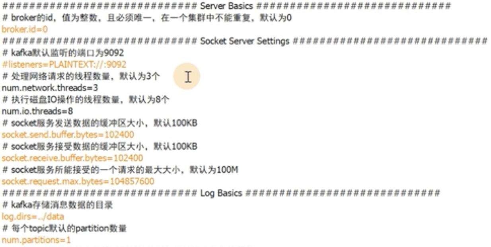
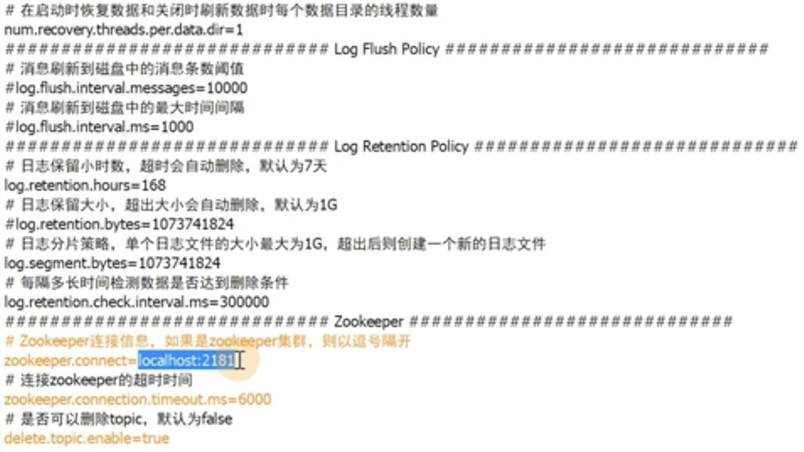

# kafka单机安装和消息测试

## 单机安装kafka和zookeeper

先安装并启动zookeeper

zookeeper两种安装方式：

1. 使用kafka自带的zookeeper（一般不推荐，zookeeper和kafka后面都是集群形式的，不推荐使用内置的）

   ```shell
   #进入kafka的解压目录
   cd /../kafka_2.122.3.0/bin
   #启动
   ./zookeeperserverstart.sh ../config/zookeeper.properties
   ```

2. 单独搭建zookeeper（推荐）

   ```shell
   yum install java-1.8.0-openjdk -y
   #解压安装包
   tar -zxf zookeeper-3.4.13.tar.gz
   cd zookeeper-3.4.13
   #在解压目录创建一个存储zookeeper数据的data目录
   mkdir data
   cp conf/zoo_sample.cfg conf/zoo.cfg
   vim conf/zoo.cfg
   ..
   dataDir=../data #修改zk的数据存储目录
   clientPort=2181 #zk的端口号
   
   #启动
   cd bin/
   ./zkServer.sh start
   ./zkServer.sh status
   
   netstat -tunlp|grep 2181
   ```


单机安装kafka

```shell
#kafka也需要jdk环境，上面已安装
#解压包
tar -zxf kafka_2.12-2.3.0.tgz
#进入解压目录
cd kafka_2.12-2.3.0
#几个重要的配置文件
ls config/
server.properties #kafka的配置文件
zookeeper.properties #使用自带zookeeper时zk的配置文件（一般不用自带）
#几个重要的二进制文件
kafka-server-start.sh #kafka启动程序
kafka-server-stop.sh #kafka停止程序
kafka-topics.sh #创建topic程序
kafka-console-producer.sh #命令行模拟生产者生产消息数据程序
kafka-console-consumer.sh #命令行模拟消费者消费消息数据程序

#在解压目录创建数据目录存储kafka数据
mkdir data
#编辑kafka配置文件
vim config/server.properties
...
log.dirs=../data #指定kafka数据的存放目录，当前目录上一级的data目录
zookeeper.connect=localhost:2181 #zookeeper的连接信息

#启动kafka
cd bin/
./kafka-server-start.sh -daemon ../config/server.properties #-daemon后台运行
netstat -tunlp|grep 9092
```


## 生产和消费消息的测试

主题topic相关操作命令格式：

```shell
./kafka-topics.sh --create --zookeeper localhost:2181 --replication-factor 1 --partitions 3 --topic test-topic #创建topic test-topic
./kafka-topics.sh --list --zookeeper localhost:2181 #查看topic列表，需指定zk的地址
./kafka-topics.sh --describe --zookeeper localhost:2181 --topic hello #查看某个具体的topic消息
./kafka-topics.sh --alter --zookeeper localhost:2181 --topic hello --partitions 5 #修改topic信息，增加到5个分区
./kafka-topics.sh --delete --zookeeper localhost:2181 --topic hello #删除主题hello，如果删除不了需要修改配置文件
```

1. 使用kafka自带命令创建两个topic：test-topic和hello

   ```shell
   cd kafka_2.12-2.3.0/bin
   ./kafka-topics.sh --create --zookeeper localhost:2181 --replication-factor 1 --partitions 3 --topic test-topic
   ./kafka-topics.sh --create --zookeeper localhost:2181 --replication-factor 1 --partitions 2 --topic hello
   
   解释：
   --zookeeper localhost:2181 主题信息存在zk
   --replication-factor 1 topic的副本数，因为现在只有一个节点，所以只能是1，有多个节点可以指定多个
   --partitions 3 主题有多少个分区
   
   ./kafka-topics.sh --list --zookeeper localhost:2181
   hello
   topic
   ```

2. 使用kafka自带生产者命令生产消息

   ```shell
   cd kafka_2.12-2.3.0/bin
   #生产者生产消息，是往topic里发送消息的，需要指明kafka地址和topic名字
   ./kafka-console-producer.sh --broker-list localhost:9092 --topic test-topic
   #先成为阻塞状态，后续手动输入消息，就是生产消息，生产下面3条消息
   ...
   >test1
   >test2
   >test3
   >...
   ```

3. 使用kafka自带消费者命令消费消息

   ```shell
   cd kafka_2.12-2.3.0/bin
   #消费者消费消息，是从topic里取出消息，加--from-beginning是从头开始收，不加就是从当前状态开始收
   kafka-console-consumer.sh --bootstrap-server localhost:9092 --topic test-topic --from-beginning
   test1
   test2
   test3
   ```

4. 查看kafka存放的消息在不同分区

   ```shell
   ls /root/kafka_2.12-2.3.0/data/test-topic*
   ```

5. 查看kafka中相关元数据信息存放在zookeeper中

   ```shell
   cd /root/zookeeper-3.4.13/bin
   #登录zk
   ./zkCli.sh
   #查看/下有哪些数据
   ls /
   #查看brokers下的数据
   ls /brokers
   #查看当前brokers的节点编号
   ls /brokers/ids
   #查看主题的名字
   ls /brokers/topics
   #查看主题下的分区
   ls /brokers/topics/test-topic
   #查看主题下的相关信息
   get /brokers/topics/test-topic
   #查看主题下的partition
   ls /brokers/topics/test-topic/partitions
   ```

## kafka配置文件需要了解的部分





