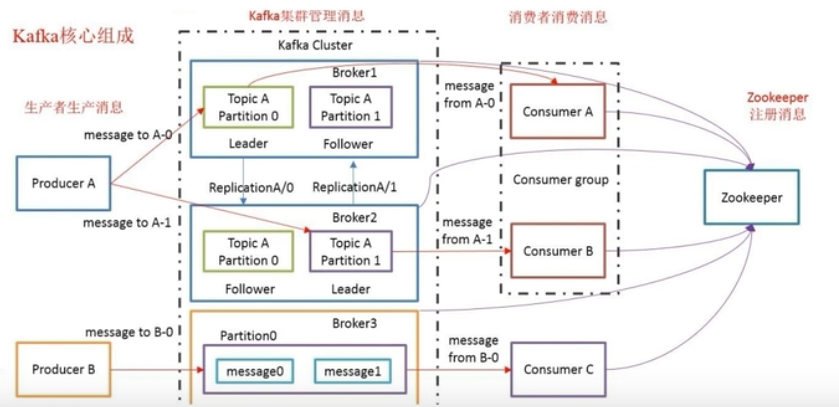

# kafka的介绍和架构

## kafka

kafka是一个分布式的**发布/订阅**消息系统，apache的顶级项目

主要用于处理活跃的数据，如登录、浏览、点击、分享等**用户行为产生的数据**

特点：

- 高吞吐量：适合消息量大的场景，可以满足**每秒百万级别消息**的生产和消费
- 持久性：有一套完善的消息存储机制，确保数据的高效安全的持久化
- 分布式：基于分布式的扩展和容错机制，kafka的数据会复制到多台服务器，当某一台发生故障失效时，生产者和消费者转而使用其他的机器

## kafka的架构

架构：

组成：

Broker：kafka集群中包含多个kafka服务节点，**每一个kafka服务节点就称为一个broker**

Topic：主题，用来存储不同类别的消息，**存储消息时，需要指定存储在哪个主题下**，如发帖子，发哪种类型

Partition：分区，**每个topic包含一个或多个partition**，在创建topic时指定包含的partition数量（目的是为了进行分布式存储）

replication：副本，**每个partition分区可以有多个副本，分布在不同的broker上**，会选出一个副本作为leader，所有的**读写请求都会通过leader完成，follower只负责备份数据**，所有follower会自动从leader中复制数据，**当leader宕机后，会从follower中选出一个新的leader继续提供服务，实现故障自动转移**

Message：消息，是通信数据的基本单位，每个消息都属于一个partition，消息都是放在分区里

Producer：消息的生产者，向kafka的一个topic发布消息，发布消息的时候需要指定发布到哪一个topic

Consumer：消息的消费者，订阅topic并读取其发布的消息，可以订阅多个主题的消息，如订阅多个微信公众号

Consumer Group：消费者组，**每个Consumer属于一个特定的Consumer Group**，多个Consumer可以属于同一个Consumer Group

Zookeeper：协调kafka的正常运行，kafka将元素信息保存在zookeeper。**元数据信息包括：kafka有多少个节点，有哪些主题，主题叫什么，有哪些分区等等**。但消息自身的数据不在zk中，是在磁盘上对应的分区中。
