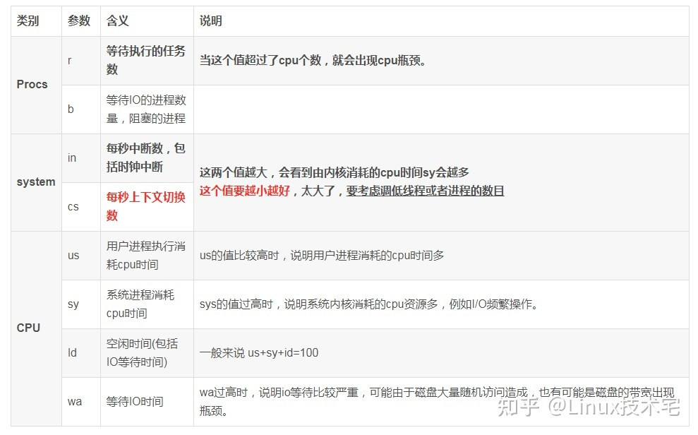

## 性能指标

### cpu使用率

cpu使用率：cpu非空闲态下运行的时间占比，反应的是**cpu的繁忙程度**

用户CPU使用率：CPU使用率高，通常说明有应用程序比较繁忙；

系统CPU使用率：CPU使用率高，说明内核比较繁忙；

等待I/O的CPU使用率：iowait,表示等待I/O的时间百分比，iowait高通常说明系统与硬件设备I/O交互时间比较长；

软中断和硬中断的CPU使用率，内核调用软中断处理程序，硬中断处理程序的百分比。

### 负载均衡

平均负载：**单位时间内，系统处于可运行和不可中断的进程数**。所以，它不仅包括了正在使用 CPU 的进程，还包括等待 CPU 和等待 I/O 的进程。

现实工作中我们会经常混淆平均负载和CPU使用率的概念，其实**两者并不完全对等**：

- CPU密集型进程，大量CPU使用会导致平均负载升高，此时两者一致
- I/O密集型进程，等待I/O也会导致平均负载升高，此时CPU使用率并不一定高
- 大量等待CPU的进程调度会导致平均负载升高，此时CPU使用率也会比较高


主要包括三个数值，分别值过去1分钟，5分钟，15分钟的平均负载

### 上下文切换

### cpu缓存命中率

CPU速度比内存访问速度快得多，协调这两者巨大性能差距，使用CPU缓存。缓存的是热点的内存数据。L1 L2 L3到缓存。L1 L2常用在单核中，L3则用在多核中。L1->L3三级缓存大小依次增大，相应性能依次降低。命中率衡量的是CPU缓存的复用情况，命中率越高，则性能越好。

## 常用工具

负载高的时候可以使用 **mpstat、pidstat**等工具分析：

1、CPU 密集型进程

```shell
#-P ALL 表示监控所有 CPU，后面数字 5 表示间隔 5 秒后输出一组数据
[root@luoahong ~]# mpstat -P ALL 5
03:47:20 PM  CPU    %usr   %nice    %sys %iowait    %irq   %soft  %steal  %guest  %gnice   %idle
03:47:25 PM  all   25.29    0.00    0.05    0.05    0.00    0.05    0.00    0.00    0.00   74.55
03:47:25 PM    0   99.80    0.00    0.00    0.00    0.00    0.20    0.00    0.00    0.00    0.00
03:47:25 PM    1    0.00    0.00    0.20    0.20    0.00    0.00    0.00    0.00    0.00   99.59
03:47:25 PM    2    0.00    0.00    0.00    0.00    0.00    0.00    0.00    0.00    0.00  100.00
03:47:25 PM    3    0.21    0.00    0.00    0.00    0.00    0.00    0.00    0.00    0.00   99.79

#正好有一个 CPU 的使用率为 100%，但其它的只有 0。这说明，平均负载的升高正是由于 CPU 使用率为 100% 。

#查看哪个进程导致了 CPU 使用率为 100%
[root@luoahong ~]# pidstat -u 5 1
Linux 3.10.0-693.el7.x86_64 (luoahong) 02/05/2019 _x86_64_  (4 CPU)
 
03:51:51 PM UID PID %usr %system %guest %wait %CPU CPU Command
03:51:56 PM 0 79 0.00 0.59 0.00 0.20 0.59 2 kworker/2:2
03:51:56 PM 0 309 0.00 0.20 0.00 0.00 0.20 0 xfsaild/sda2
03:51:56 PM 0 738 0.40 0.00 0.00 0.20 0.40 1 vmtoolsd
03:51:56 PM 0 1308 99.80 0.20 0.00 0.00 100.00 3 stress #stress 进程的 CPU 使用率为 99.80
03:51:56 PM 0 1501 0.20 0.20 0.00 0.00 0.40 0 watch
03:51:56 PM 0 1752 0.00 0.40 0.00 0.00 0.40 1 pidstat
 
Average: UID PID %usr %system %guest %wait %CPU CPU Command
Average: 0 79 0.00 0.59 0.00 0.20 0.59 - kworker/2:2
Average: 0 309 0.00 0.20 0.00 0.00 0.20 - xfsaild/sda2
Average: 0 738 0.40 0.00 0.00 0.20 0.40 - vmtoolsd
Average: 0 1308 99.80 0.20 0.00 0.00 100.00 - stress
Average: 0 1501 0.20 0.20 0.00 0.00 0.40 - watch
Average: 0 1752 0.00 0.40 0.00 0.00 0.40 - pidstat
```

2、I/O 密集型进程

```shell
[root@luoahong ~]# mpstat -P ALL 5 1
Linux 3.10.0-693.el7.x86_64 (luoahong)  02/05/2019  _x86_64_    (2 CPU)
 
08:58:00 PM  CPU    %usr   %nice    %sys %iowait    %irq   %soft  %steal  %guest  %gnice   %idle
08:58:05 PM  all    0.32    0.00   54.64   40.51    0.00    1.79    0.00    0.00    0.00    2.74
08:58:05 PM    0    0.43    0.00   27.55   66.59    0.00    3.47    0.00    0.00    0.00    1.95
08:58:05 PM    1    0.21    0.00   80.29   15.81    0.00    0.21    0.00    0.00    0.00    3.49
 
Average:     CPU    %usr   %nice    %sys %iowait    %irq   %soft  %steal  %guest  %gnice   %idle
Average:     all    0.32    0.00   54.64   40.51    0.00    1.79    0.00    0.00    0.00    2.74
Average:       0    0.43    0.00   27.55   66.59    0.00    3.47    0.00    0.00    0.00    1.95
Average:       1    0.21    0.00   80.29   15.81    0.00    0.21    0.00    0.00    0.00    3.49

#其中一个 CPU 的系统 CPU 使用率升高到了 27.55，而 iowait 高达 66.59%。这说明，平均负载的升高是由于 iowait 的升高。
```

3、当系统中运行进程超出CPU运行能力时，就会出现等待CPU的进程

```shell
[root@luoahong ~]# pidstat -u 5 1
Linux 3.10.0-693.el7.x86_64 (luoahong)  02/05/2019  _x86_64_    (2 CPU)
 
09:15:30 PM   UID       PID    %usr %system  %guest   %wait    %CPU   CPU  Command
09:15:35 PM     0       683    0.20    0.00    0.00    1.37    0.20     0  vmtoolsd
09:15:35 PM     0      1049    0.00    0.20    0.00    0.00    0.20     0  tuned
09:15:35 PM     0      4622    0.00    0.39    0.00    0.39    0.39     1  kworker/1:0
09:15:35 PM     0      4624    0.20    0.20    0.00    0.59    0.39     0  watch
09:15:35 PM     0      5271   24.31    0.00    0.00   74.31   24.31     1  stress
09:15:35 PM     0      5272   24.51    0.00    0.00   74.12   24.51     0  stress
09:15:35 PM     0      5273   24.31    0.00    0.00   73.92   24.31     1  stress
09:15:35 PM     0      5274   24.12    0.00    0.00   74.12   24.12     0  stress
09:15:35 PM     0      5275   24.31    0.00    0.00   74.12   24.31     1  stress
09:15:35 PM     0      5276   24.31    0.20    0.00   73.73   24.51     0  stress
09:15:35 PM     0      5277   24.31    0.20    0.00   74.31   24.51     1  stress
09:15:35 PM     0      5278   24.31    0.20    0.00   74.71   24.51     0  stress
09:15:35 PM     0      5326    0.00    0.20    0.00    0.39    0.20     0  pidstat
 
Average:      UID       PID    %usr %system  %guest   %wait    %CPU   CPU  Command
Average:        0       683    0.20    0.00    0.00    1.37    0.20     -  vmtoolsd
Average:        0      1049    0.00    0.20    0.00    0.00    0.20     -  tuned
Average:        0      4622    0.00    0.39    0.00    0.39    0.39     -  kworker/1:0
Average:        0      4624    0.20    0.20    0.00    0.59    0.39     -  watch
Average:        0      5271   24.31    0.00    0.00   74.31   24.31     -  stress
Average:        0      5272   24.51    0.00    0.00   74.12   24.51     -  stress
Average:        0      5273   24.31    0.00    0.00   73.92   24.31     -  stress
Average:        0      5274   24.12    0.00    0.00   74.12   24.12     -  stress
Average:        0      5275   24.31    0.00    0.00   74.12   24.31     -  stress
Average:        0      5276   24.31    0.20    0.00   73.73   24.51     -  stress
Average:        0      5277   24.31    0.20    0.00   74.31   24.51     -  stress
Average:        0      5278   24.31    0.20    0.00   74.71   24.51     -  stress
Average:        0      5326    0.00    0.20    0.00    0.39    0.20     -  pidstat

#可以看出，8 个进程在争抢 2 个 CPU，每个进程等待CPU 的时间（也就是代码块中的 %wait 列）高达 75%这些超出 CPU 计算能力的进程，最终导致 CPU 过载。
```


vmstat

```text
procs -----------memory---------- ---swap-- -----io---- -system-- ------cpu-----
 r  b   swpd   free   buff  cache   si   so    bi    bo   in   cs us sy id wa st
 0  0      0 5816612 459976 678352    0    0    40    26  209  587  1  1 98  0  0
 0  0      0 5816484 459976 678344    0    0     0     0  225  540  1  1 98  0  0
 0  0      0 5816484 459976 678344    0    0     0     0  218  531  0  0 100  0  0
 2  0      0 5816360 459976 678344    0    0     0     0  215  501  1  0 99  0  0
 0  0      0 5816356 459984 678336    0    0     0    28  223  690  0  0 100  0  0
```



我们可以通过 `vmstat` 工具来查看系统的上下文切换情况。`vmstat` 主要用来分析系统内存使用情况，也常用来分析 `CPU` 上下文切换和中断的次数。

```shell
# 每隔 5 秒输出 1 组数据
$ vmstat 5
procs -----------memory---------- ---swap-- -----io---- -system-- ------cpu-----
 r  b  swpd   free   buff  cache   si   so    bi    bo   in   cs us sy id wa st
 0  0    0 7005360  91564 818900    0    0     0     0   25   33  0  0 100  0  0
```

我们需要重点关注下列四项内容：

- cs(context switch) 是每秒上下文切换的次数。
- in(interrupt) 是每秒中断的次数。
- r(Running or Runnable) 是就绪队列的长度，也就是正在运行和等待 CPU 的进程数。
- b(Blocked) 是处于不可中断睡眠状态的进程数。

想要查看每个进程的详细情况，需要使用 pidstat，给它加上 `-w` 选项，就可以查看每个进程上下文切换的情况。

```shell
# 每隔 5 秒输出 1 组数据
$ pidstat -w 5
Linux 4.15.0 (ubuntu)  09/23/18  _x86_64_  (2 CPU)
08:18:26      UID       PID   cswch/s nvcswch/s  Command
08:18:31        0         1      0.20      0.00  systemd
08:18:31        0         8      5.40      0.00  rcu_sched
```

上述结果有两列是我们重点关注的对象，一个是 cswch，表示每秒自愿上下文切换的次数；另一个是 nvcswch，表示每秒非自愿上下文切换的次数。

- 自愿上下文切换，是指进程无法获取所需资源，导致的上下文切换。比如，IO、内存等系统资源不足时，就会发生自愿上下文切换。
- 非自愿上下文切换，则是指进程由于时间片已到等原因，被系统强制调度，进而发生的上下文切换。比如说，大量进程都在抢占 CPU 时，就容易发生非自愿上下文切换。


通常先用**top,vmstat和pidstat**

- 从 top 的输出可以得到各种 CPU 使用率以及僵尸进程和平均负载等信息。
- 从 vmstat 的输出可以得到上下文切换次数、中断次数、运行状态和不可中断状态的进程数。
- 从 pidstat 的输出可以得到进程的用户 CPU 使用率、系统 CPU 使用率、以及自愿上下文切换和非自愿上下文切换情况。

