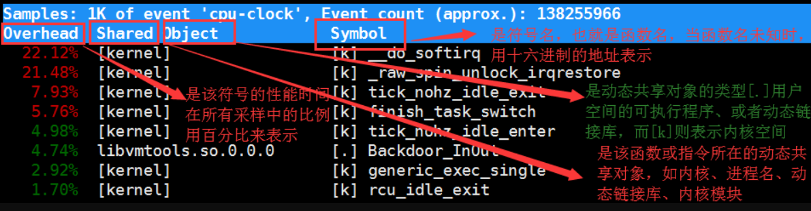

# CPU性能篇

CPU性能指标：

- cpu使用率
- 上下文切换
- 平均负载
- cpu缓存命中率


## 平均负载

平均负载：

单位时间内，系统处于**可运行状态和不可中断状态的平均进程数**，也可以说是平均的活跃进程数，**和cpu使用率没有直接关系**。


可运行状态：

正在使用的cpu或者正在等待cpu的进程

不可中断状态：

进程是正处于内核关键流程中的进程，并且这些流程是不可打断的，比如最常见的是等待硬件设备I/O响应，也就是我们在ps命令中看到的D状态的状态


既然是平均的活跃进程数，**那么最理想的情况等于CPU的个数**，这样每个cpu都得到了充分利用，比如当平均负载2时，意味着什么呢？

1、在只有2个CPU的系统上，意味着所有的CPU都刚好被完全占用

2、在4个CPU的系统上，意味着CPU有50%的空闲

3、而在只有1个CPU的系统上，则意味着有一半的进程竞争不到CPU


当**平均负载高于 CPU 数量 70%** 排查负载高的问题了。一旦负载过高，就可能导致进程响应变慢，进而影响服务的正常功能。


CPU使用率是单位时间内CPU繁忙情况的 统计，跟平均负载并不一定完全对应

负载高的时候可以使用 **mpstat、pidstat**等工具分析：

1、CPU 密集型进程，使用大量 CPU 会导致平均负载升高，此时这两者一直的

```shell
#-P ALL 表示监控所有 CPU，后面数字 5 表示间隔 5 秒后输出一组数据
[root@luoahong ~]# mpstat -P ALL 5
03:47:20 PM  CPU    %usr   %nice    %sys %iowait    %irq   %soft  %steal  %guest  %gnice   %idle
03:47:25 PM  all   25.29    0.00    0.05    0.05    0.00    0.05    0.00    0.00    0.00   74.55
03:47:25 PM    0   99.80    0.00    0.00    0.00    0.00    0.20    0.00    0.00    0.00    0.00
03:47:25 PM    1    0.00    0.00    0.20    0.20    0.00    0.00    0.00    0.00    0.00   99.59
03:47:25 PM    2    0.00    0.00    0.00    0.00    0.00    0.00    0.00    0.00    0.00  100.00
03:47:25 PM    3    0.21    0.00    0.00    0.00    0.00    0.00    0.00    0.00    0.00   99.79

#正好有一个 CPU 的使用率为 100%，但其它的只有 0。这说明，平均负载的升高正是由于 CPU 使用率为 100% 。

#查看哪个进程导致了 CPU 使用率为 100%
[root@luoahong ~]# pidstat -u 5 1
Linux 3.10.0-693.el7.x86_64 (luoahong) 02/05/2019 _x86_64_  (4 CPU)
 
03:51:51 PM UID PID %usr %system %guest %wait %CPU CPU Command
03:51:56 PM 0 79 0.00 0.59 0.00 0.20 0.59 2 kworker/2:2
03:51:56 PM 0 309 0.00 0.20 0.00 0.00 0.20 0 xfsaild/sda2
03:51:56 PM 0 738 0.40 0.00 0.00 0.20 0.40 1 vmtoolsd
03:51:56 PM 0 1308 99.80 0.20 0.00 0.00 100.00 3 stress #stress 进程的 CPU 使用率为 99.80
03:51:56 PM 0 1501 0.20 0.20 0.00 0.00 0.40 0 watch
03:51:56 PM 0 1752 0.00 0.40 0.00 0.00 0.40 1 pidstat
 
Average: UID PID %usr %system %guest %wait %CPU CPU Command
Average: 0 79 0.00 0.59 0.00 0.20 0.59 - kworker/2:2
Average: 0 309 0.00 0.20 0.00 0.00 0.20 - xfsaild/sda2
Average: 0 738 0.40 0.00 0.00 0.20 0.40 - vmtoolsd
Average: 0 1308 99.80 0.20 0.00 0.00 100.00 - stress
Average: 0 1501 0.20 0.20 0.00 0.00 0.40 - watch
Average: 0 1752 0.00 0.40 0.00 0.00 0.40 - pidstat
```

2、I/O 密集型进程，等待 I/O 也会导致平均负载升高，但 CPU 使用率不一定很高；

```shell
[root@luoahong ~]# mpstat -P ALL 5 1
Linux 3.10.0-693.el7.x86_64 (luoahong)  02/05/2019  _x86_64_    (2 CPU)
 
08:58:00 PM  CPU    %usr   %nice    %sys %iowait    %irq   %soft  %steal  %guest  %gnice   %idle
08:58:05 PM  all    0.32    0.00   54.64   40.51    0.00    1.79    0.00    0.00    0.00    2.74
08:58:05 PM    0    0.43    0.00   27.55   66.59    0.00    3.47    0.00    0.00    0.00    1.95
08:58:05 PM    1    0.21    0.00   80.29   15.81    0.00    0.21    0.00    0.00    0.00    3.49
 
Average:     CPU    %usr   %nice    %sys %iowait    %irq   %soft  %steal  %guest  %gnice   %idle
Average:     all    0.32    0.00   54.64   40.51    0.00    1.79    0.00    0.00    0.00    2.74
Average:       0    0.43    0.00   27.55   66.59    0.00    3.47    0.00    0.00    0.00    1.95
Average:       1    0.21    0.00   80.29   15.81    0.00    0.21    0.00    0.00    0.00    3.49

#其中一个 CPU 的系统 CPU 使用率升高到了 27.55，而 iowait 高达 66.59%。这说明，平均负载的升高是由于 iowait 的升高。
```

3、当系统中运行进程超出CPU运行能力时，就会出现等待CPU的进程，大量等待 CPU 的进程调度也会导致平均负载升高，此时的CPU 使用率也会比较高

```shell
[root@luoahong ~]# pidstat -u 5 1
Linux 3.10.0-693.el7.x86_64 (luoahong)  02/05/2019  _x86_64_    (2 CPU)
 
09:15:30 PM   UID       PID    %usr %system  %guest   %wait    %CPU   CPU  Command
09:15:35 PM     0       683    0.20    0.00    0.00    1.37    0.20     0  vmtoolsd
09:15:35 PM     0      1049    0.00    0.20    0.00    0.00    0.20     0  tuned
09:15:35 PM     0      4622    0.00    0.39    0.00    0.39    0.39     1  kworker/1:0
09:15:35 PM     0      4624    0.20    0.20    0.00    0.59    0.39     0  watch
09:15:35 PM     0      5271   24.31    0.00    0.00   74.31   24.31     1  stress
09:15:35 PM     0      5272   24.51    0.00    0.00   74.12   24.51     0  stress
09:15:35 PM     0      5273   24.31    0.00    0.00   73.92   24.31     1  stress
09:15:35 PM     0      5274   24.12    0.00    0.00   74.12   24.12     0  stress
09:15:35 PM     0      5275   24.31    0.00    0.00   74.12   24.31     1  stress
09:15:35 PM     0      5276   24.31    0.20    0.00   73.73   24.51     0  stress
09:15:35 PM     0      5277   24.31    0.20    0.00   74.31   24.51     1  stress
09:15:35 PM     0      5278   24.31    0.20    0.00   74.71   24.51     0  stress
09:15:35 PM     0      5326    0.00    0.20    0.00    0.39    0.20     0  pidstat
 
Average:      UID       PID    %usr %system  %guest   %wait    %CPU   CPU  Command
Average:        0       683    0.20    0.00    0.00    1.37    0.20     -  vmtoolsd
Average:        0      1049    0.00    0.20    0.00    0.00    0.20     -  tuned
Average:        0      4622    0.00    0.39    0.00    0.39    0.39     -  kworker/1:0
Average:        0      4624    0.20    0.20    0.00    0.59    0.39     -  watch
Average:        0      5271   24.31    0.00    0.00   74.31   24.31     -  stress
Average:        0      5272   24.51    0.00    0.00   74.12   24.51     -  stress
Average:        0      5273   24.31    0.00    0.00   73.92   24.31     -  stress
Average:        0      5274   24.12    0.00    0.00   74.12   24.12     -  stress
Average:        0      5275   24.31    0.00    0.00   74.12   24.31     -  stress
Average:        0      5276   24.31    0.20    0.00   73.73   24.51     -  stress
Average:        0      5277   24.31    0.20    0.00   74.31   24.51     -  stress
Average:        0      5278   24.31    0.20    0.00   74.71   24.51     -  stress
Average:        0      5326    0.00    0.20    0.00    0.39    0.20     -  pidstat

#可以看出，8 个进程在争抢 2 个 CPU，每个进程等待CPU 的时间（也就是代码块中的 %wait 列）高达 75%这些超出 CPU 计算能力的进程，最终导致 CPU 过载。
```

## CPU上下文

上下文切换：

对任务当前运行状态的暂存和恢复


为什么要上下文切换：

当多个进程竞争CPU的时候，CPU为了保证每个进程能公平被调度运行，采取了处理任务时间分片的机制，**轮流处理多个进程**，由于CPU处理速度非常快，在人类的感官上认为是并行处理，实际是**"伪"并行**，同一时间只有一个任务在运行处理。


上下文切换分为几种：

进程上下文切换、线程上下文切换、中断上下文切换

## CPU使用率

CPU 使用率就是 CPU 非空闲态运行的时间占比，它反映了 CPU 的繁忙程度。


CPU使用率=1-空闲时间/总CPU时间


CPU使用率高分析思路：

**1、如何轻松找到CPU使用率过高的进程**

通过top、ps 、pidstat等工具

**2、占用CPU高的到底是代码里的那个函数？**

perf和GDB



**3、那么哪种工具适合在第一时间分析进程的 CPU 问题呢？**

perf是Linux 2.6.31 以后内置的性能分析工具，它以性能事件采样为基础，不仅可以分析系统的各种事件和内核性能，还可以用来分析制定应用程序的性能问题


CPU 使用率是最直观和最常用的系统性能指标，更是我们在排查性能问题时，通常会关注的第一个指标。所以我们更要熟悉它的含义，尤其要弄清楚用户（%user）、Nice（%nice）、系统（%system） 、等待 I/O（%iowait） 、中断（%irq）以及软中断（%softirq）这几种不同 CPU 的使用率。比如说：

- 用户 CPU 和 Nice CPU 高，说明用户态进程占用了较多的 CPU，所以应该着重排查进程的性能问题
- 系统 CPU 高，说明内核态占用了较多的 CPU，所以应该着重排查内核线程或者系统调用的性能问题
- I/O 等待 CPU 高，说明等待 I/O 的时间比较长，所以应该着重排查系统存储是不是出现了 I/O 问题
- 软中断和硬中断高，说明软中断或硬中断的处理程序占用了较多的 CPU，所以应该着重排查内核中的中断服务程序

碰到 CPU 使用率升高的问题，你可以借助 top、pidstat 等工具，确认引发 CPU 性能问题的来源，再使用 jstack（java应用）、perf 等工具，排查出引起性能问题的具体函数。 

## 不可中断进程和僵尸进程

查看进程状态：top

进程状态详解：

| R    | running，进程在cpu的就绪队列汇总，正在运行或者正在等待运行   |
| ---- | ------------------------------------------------------------ |
| D    | disk sleep，不可中断状态睡眠，进程在跟硬件交互，并且在交互过程中不允许被其他进程中断 |
| Z    | zombie，僵尸进程，进程实际上已经结束，但是父进程还没回收它的资源（比如进程的描述符、pid等） |
| S    | interruptible sleep，可中断状态睡眠，进程因为等待某个事件而被系统挂起，当进程等待的事情发生时，它会被唤醒并进入R状态 |
| I    | idle，空闲状态，用在不可中断睡眠的内核线程上，D状态的进程会导致平均负载升高，I状态进程不会 |
| X    | dead，进程已经消亡，不会在top和ps命令中看到它                |
| T或t | stopped或traced，进程处于暂停或跟踪状态                      |

- 不可中断状态，表示进程正在跟硬件交互，为了保护进程数据和硬件的一致性，系统不允许其他进程或中断打断这个进程。进程长时间处于不可中断状态，通常表示系统有I/O性能问题。
- 僵尸进程表示进程已经退出，但它的父进程还没有回收子进程占用的资源。***\*短暂的僵尸状态我们通常不必理会，但进程长时间处于僵尸状态，就应该注意了，可能有应用程序没有正常处理子进程的退出\****


一行行分析问题：

```shell
# 按下数字 1 切换到所有 CPU 的使用情况，观察一会儿按 Ctrl+C 结束
$ top
top - 05:56:23 up 17 days, 16:45,  2 users,  load average: 2.00, 1.68, 1.39
Tasks: 247 total,   1 running,  79 sleeping,   0 stopped, 115 zombie
%Cpu0  :  0.0 us,  0.7 sy,  0.0 ni, 38.9 id, 60.5 wa,  0.0 hi,  0.0 si,  0.0 st
%Cpu1  :  0.0 us,  0.7 sy,  0.0 ni,  4.7 id, 94.6 wa,  0.0 hi,  0.0 si,  0.0 st
...
 
  PID USER      PR  NI    VIRT    RES    SHR S  %CPU %MEM     TIME+ COMMAND
 4340 root      20   0   44676   4048   3432 R   0.3  0.0   0:00.05 top
 4345 root      20   0   37280  33624    860 D   0.3  0.0   0:00.01 app
 4344 root      20   0   37280  33624    860 D   0.3  0.4   0:00.01 app
    1 root      20   0  160072   9416   6752 S   0.0  0.1   0:38.59 systemd
...
```

先看第一行平均负载，过去1、5、15分钟内的平均负载依次减小，说明**平均负载正在升高**，而1分钟内的平均负载已经达到了系统CPU的个数，说明系统可能已经有了性能瓶颈

Tasks 有1个正在运行的进程，但**僵尸进程比较多**，而且还在不停增加，说明有子进程在退出时没有没清理

CPU使用率：用户CPU和系统CPU都不高，但**iowait**分别是60.5%和94.6%好像有点不正常

每个进程的情况：有两个进程处于D状态，它们可能在等待I/O，但光凭这里并不能确定是它们导致了 iowait 升高

总结：1. iowait太高，导致平均负载高；2.僵尸进程不断增多，说明程序没正确清理进程的资源


**iowait升高原因分析**

用**dstat 命令**同时查看cpu和i/o对比情况：

```shell
#安装dstat
wget http://mirror.centos.org/centos/7/os/x86_64/Packages/dstat-0.7.2-12.el7.noarch.rpm
rpm -ivh dstat-0.7.2-12.el7.noarch.rpm 

# 间隔 1 秒输出 10 组数据
$ dstat 1 10
You did not select any stats, using -cdngy by default.
--total-cpu-usage--     -dsk/total-  -net/total-  ---paging--  ---system--
usr  sys idl  wai stl|   read   writ| recv  send| in      out | int  csw
   0  0   96    4  0|   1219k 	408k|  0   	  0 |  0      	0 | 42  885
   0  0    2   98  0|    34M  	  0 | 198B  790B|  0   		0 | 42  138
   0  0    0  100  0|    34M  	  0 | 66B   342B|  0   		0 | 42  135
   0  0   84   16  0|	5633k 	  0 | 66B   342B|  0   		0 | 52  177
   0  3   39   58  0|	 22M 	  0 | 66B   342B|  0   		0 | 43  144
   0  0    0  100  0| 	34M  	  0 | 200B  450B|  0   		0 | 46  147
   0  0    2   98  0|	 34M 	  0 | 66B   342B|  0   		0 | 45  134
   0  0    0  100  0|	 34M  	  0 | 66B   342B|  0   		0 | 39  131
   0  0   83   17  0|	5633k 	  0 | 66B   342B|  0   		0 | 46  168
   0  3   39   59  0| 	22M  	  0 | 66B   342B|  0   		0 | 37  134
   
#可以发现iowait升高时，磁盘读请求（read）升高所以推断iowait升高是磁盘读导致
```

定位磁盘读进程：

```shell
# 使用top命令查看处于不可中断状态（D）的进程PID
$ top
...
  PID USER      PR  NI    VIRT    RES    SHR S  %CPU %MEM     TIME+ COMMAND
 4340 root      20   0   44676   4048   3432 R   0.3  0.0   0:00.05 top
 4345 root      20   0   37280  33624    860 D   0.3  0.0   0:00.01 app
 4344 root      20   0   37280  33624    860 D   0.3  0.4   0:00.01 app
```

pidstat查看不可中断进程的磁盘读写情况：

```shell
# -d 展示 I/O 统计数据，-p 指定进程号，间隔 1 秒输出 3 组数据
$ pidstat -d -p 4344 1 3
06:38:50   UID    PID  kB_rd/s kB_wr/s kB_ccwr/s iodelay Command
06:38:51    0   4344   0.00   0.00   0.00    0 app
06:38:52    0   4344   0.00   0.00   0.00    0 app
06:38:53    0   4344   0.00   0.00   0.00    0 app

#发现处于不可中断状态的进程都没有进行磁盘读写
```

使用pidstat命令查看所有进程的i/o情况

```shell
# 间隔 1 秒输出多组数据 (这里是 20 组)
$ pidstat -d 1 20
...
06:48:46      UID       PID   kB_rd/s   kB_wr/s kB_ccwr/s iodelay  Command
06:48:47        0      4615      0.00      0.00      0.00       1  kworker/u4:1
06:48:47        0      6080  32768.00      0.00      0.00     170  app
06:48:47        0      6081  32768.00      0.00      0.00     184  app
 
06:48:47      UID       PID   kB_rd/s   kB_wr/s kB_ccwr/s iodelay  Command
06:48:48        0      6080      0.00      0.00      0.00     110  app
 
06:48:48      UID       PID   kB_rd/s   kB_wr/s kB_ccwr/s iodelay  Command
06:48:49        0      6081      0.00      0.00      0.00     191  app
 
06:48:49      UID       PID   kB_rd/s   kB_wr/s kB_ccwr/s iodelay  Command
 
06:48:50      UID       PID   kB_rd/s   kB_wr/s kB_ccwr/s iodelay  Command
06:48:51        0      6082  32768.00      0.00      0.00       0  app
06:48:51        0      6083  32768.00      0.00      0.00       0  app
 
06:48:51      UID       PID   kB_rd/s   kB_wr/s kB_ccwr/s iodelay  Command
06:48:52        0      6082  32768.00      0.00      0.00     184  app
06:48:52        0      6083  32768.00      0.00      0.00     175  app
 
06:48:52      UID       PID   kB_rd/s   kB_wr/s kB_ccwr/s iodelay  Command
06:48:53        0      6083      0.00      0.00      0.00     105  app
...
```

进程访问磁盘，需要使用系统调用，下面的重点就是找到该进程的系统调用

使用strace查看进程的系统调用 strace -p <pid>

```shell
strace -p 6082
strace : attach: ptrace(PTRACE_SEIZE, 6082): Operation not permitted
```


**僵尸进程分析**

查看僵尸进程

```shell
ps -ef | grep defunct
```

僵尸进程清楚方法：

**1.改写父进程**

**2. kill -18 PPID　(PPID是其父进程)**

这个信号是告诉父进程，该子进程已经死亡了，请收回分配给他的资源。

**３.终止父进程**

如果方法2不能终止，可采用终止其父进程的方法(如果其父进程不需要的话)父进程死后，僵尸进程成为”孤儿进程”，过继给1号进程init，init始终会负责清理僵尸进程．它产生的所有僵尸进程也跟着消失。先看其父进程又无其他子进程，如果有，可能需要先kill其他子进程，也就是兄弟进程。方法是：

kill –15 PID1 PID2　(PID1,PID2是僵尸进程的父进程的其它子进程)。然后再kill父进程：kill –15 PPID，这样僵尸进程就可能被完全杀掉了。

找出父进程，在父进程里解决：

```shell
# -a 表示输出命令行选项
# p 表 PID
# s 表示指定进程的父进程
[root@luoahong ~]# pstree -aps 12582
systemd,1 --switched-root --system --deserialize 22
  └─containerd,9379
      └─containerd-shim,12484 -namespace moby -workdir...
          └─app,12502
              └─(app,12582
```

## 分析CPU瓶颈

1、从 top 的输出可以得到各种 CPU 使用率以及僵尸进程和平均负载等信息

- pidstat 输出的进程用户 CPU 使用率升高，会导致 top 输出的用户 CPU 使用率升高。所以，当发现 top 输出的用户 CPU 使用率有问题时，可以跟 pidstat 的输出做对比，观察是否是某个进程导致的问题。
- 而找出导致性能问题的进程后，就要用进程分析工具来分析进程的行为，比如使用 strace 分析系统调用情况，以及使用perf 分析调用链中各级函数的执行情况。

2、从 vmstat 的输出可以得到上下文切换次数、中断次数、运行状态和不可中断状态的进程数。

- top 输出的平均负载升高，可以跟 vmstat输出的运行状态和不可中断状态的进程数做对比，观察是哪种进程导致的负载升高。
- 如果是不可中断进程数增多了，那么就需要做 I/O 的分析，也就是用 dstat 或 sar 等工具，进一步分析 I/O...
- 如果是运行状态进程数增多了，那就需要回到 top 和 pidstat，找出这些处于运行状态的到底是什么进程，然后再用进程分析工具，做进一步分析。

3、从 pidstat 的输出可以得到进程的用户 CPU 使用率、系统 CPU 使用率、以及自愿上下文切换和非自愿上下文切换情况

- 当发现 top 输出的软中断 CPU 使用率升高时，可以查看/proc/softirqs 文件中各种类型软中断的变化情况，确定到底是哪种软中断出的问题

  比如，发现是网络接收中断导的问题，那就可以继续用网络分析工具 sar 和 tcpdum来分析