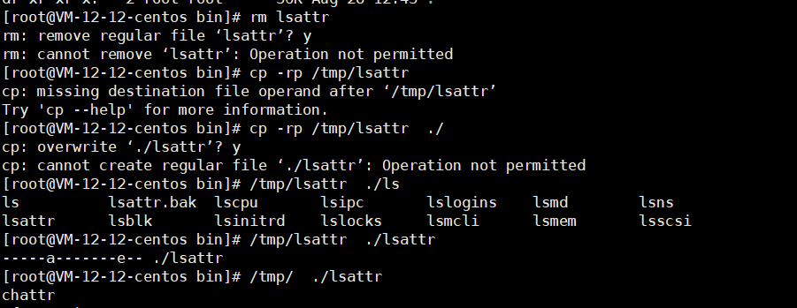

有时候会遇到一些疑难杂症，并且监控插件并不能一眼立马发现问题的根源。这时候就需要登录服务器进一步深入分析问题的根源。


## cpu



说明：

- uptime,vmstat,mpstat,top,pidstat只能查询到cpu及负载的的使用情况。
- perf可以跟着到进程内部具体函数耗时情况，并且可以指定内核函数进行统计，指哪打哪。

使用方式：

```shell
//查看系统cpu使用情况
top

//查看所有cpu核信息
mpstat -P ALL 1 10
Linux 3.10.0-327.10.1.el7.x86_64 (iZ94dupy6gtZ)         05/05/2023      _x86_64_        (4 CPU)

05:38:03 PM  CPU    %usr   %nice    %sys %iowait    %irq   %soft  %steal  %guest  %gnice   %idle
05:38:04 PM  all   40.20    0.00    7.29    1.01    0.00    0.25    0.00    0.00    0.00   51.26
05:38:04 PM    0   42.00    0.00   15.00    2.00    0.00    0.00    0.00    0.00    0.00   41.00
05:38:04 PM    1    7.22    0.00    2.06    2.06    0.00    0.00    0.00    0.00    0.00   88.66
05:38:04 PM    2   19.19    0.00    3.03    0.00    0.00    0.00    0.00    0.00    0.00   77.78
05:38:04 PM    3   92.08    0.00    7.92    0.00    0.00    0.00    0.00    0.00    0.00    0.00

//查看cpu使用情况以及平均负载
vmstat 1

//进程cpu的统计信息
pidstat -u 1 -p pid

//跟踪进程内部函数级cpu使用情况
perf top -p pid -e cpu-clock
```

## 内存


**说明：**

- free,vmstat,top,pidstat,pmap只能统计内存信息以及进程的内存使用情况。
- valgrind可以分析内存泄漏问题。
- dtrace动态跟踪。需要对内核函数有很深入的了解，通过D语言编写脚本完成跟踪。

使用方式：

```shell
//查看系统内存使用情况
free
             total        used         free      shared   buffers   cached
Mem:         16402432    16360492      41940        0     465404   12714880
-/+ buffers/cache:        3180208   13222224
Swap:        8193108        264      8192844
#从内核角度：total - used = free
#其实就是总的物理内存减去已经使用的物理内存得到的就是空闲的物理内存大小，注意这里的可用内存值41940并不包含处于buffers和cached状态的内存大小。linux会在需要内存的时候，或在系统运行逐步推进时，将buffers和cached状态的内存变为free状态的内存，以供系统使用。
#从应用角度：可用内存=free+buffers/cache
#对于应用程序来说，buffers/cached占有的内存是可用的，因为buffers/cached是为了提高文件读取的性能，当应用程序需要用到内存的时候，buffers/cached会很快地被回收，以供应用程序使用。

//虚拟内存统计信息
vmstat 1 10
procs -----------memory---------- ---swap-- -----io---- -system-- ------cpu-----
 r  b   swpd   free   buff  cache   si   so    bi    bo   in   cs us sy id wa st
 2  0      0 258380 190788 2702112    0    0    40   161    1    1 17  5 78  1  0
 2  0      0 263432 190788 2702216    0    0     0  1748 6925 9058 49  7 43  1  0
 3  0      0 185860 190788 2702436    0    0     0   912 7482 9277 69  4 27  0  0
 2  0      0 280304 190788 2702468    0    0     0   620 6736 9173 45  5 50  0  0
 3  0      0 212876 190788 2702568    0    0     0   284 6641 9430 38  7 55  0  0
 2  0      0 255876 190788 2702576    0    0     0   604 7364 9314 65 11 23  0  0
 6  0      0 318840 190788 2702448    0    0     0   336 5912 9076 22  8 71  0  0
 2  0      0 225620 190788 2702520    0    0     0  1024 8397 13429 64 13 23  0  0
 1  0      0 228412 190788 2702552    0    0     0  1052 7066 10195 42  4 52  2  0
 3  0      0 252344 190792 2702528    0    0     0   244 6921 8890 50 11 38  0  0

//查看系统内存情况
top

//1s采集周期，获取内存的统计信息
pidstat -p pid -r 1

//查看进程的内存映像信息
pmap -d pid

//检测程序内存问题
valgrind --tool=memcheck --leak-check=full --log-file=./log.txt  ./程序名
```

## 磁盘IO


使用方式：

```shell
//查看系统io信息
iotop

//统计io详细信息（查看磁盘忙不忙，主要看util）
iostat -d -x -k 1 10
Linux 3.10.0-327.10.1.el7.x86_64 (iZ94dupy6gtZ)         05/05/2023      _x86_64_        (4 CPU)

Device:         rrqm/s   wrqm/s     r/s     w/s    rkB/s    wkB/s avgrq-sz avgqu-sz   await r_await w_await  svctm  %util
vda               0.09    26.08   12.35   37.99   157.09   640.36    31.69     0.13    2.56    3.52    2.25   0.62   3.13
vdb               0.00     0.00    0.00    0.00     0.02     0.00    14.72     0.00    1.84    1.83    3.32   0.25   0.00

//查看进程级io的信息
#pidstat -d 1 -p  pid
pidstat -d 1 10
Linux 3.10.0-327.10.1.el7.x86_64 (iZ94dupy6gtZ)         05/05/2023      _x86_64_        (4 CPU)

06:03:14 PM   UID       PID   kB_rd/s   kB_wr/s kB_ccwr/s  Command
06:03:15 PM     0       288      0.00      7.77      0.00  jbd2/vda1-8
06:03:15 PM    27      1350      0.00    411.65      0.00  mysqld
06:03:15 PM     0    251848      0.00      3.88      0.00  AliHips
06:03:15 PM     0    961639      0.00      3.88      3.88  supervisord

//查看系统IO的请求，比如可以在发现系统IO异常时，可以使用该命令进行调查，就能指定到底是什么原因导致的IO异常
perf record -e block:block_rq_issue -ag
^C
perf report
```

## 网络


使用方式：

```shell
//显示网络统计信息
netstat -s

//显示当前UDP连接状况
netstat -nu

//显示UDP端口号的使用情况
netstat -apu

//统计机器中网络连接各个状态个数
netstat -a | awk '/^tcp/ {++S[$NF]} END {for(a in S) print a, S[a]}'

//显示TCP连接
ss -t -a

//查看服务器有多少tcp连接
ss -s

//显示所有udp sockets
ss -u -a

//tcp,etcp状态
sar -n TCP,ETCP 1

//查看网络IO
sar -n DEV 1

//抓包以包为单位进行输出
tcpdump -i eth1 host 192.168.1.1 and port 80 

//抓包以流为单位显示数据内容
tcpflow -cp host 192.168.1.1
```

## 系统负载

平均负载就是单位时间内系统处于可运行和不可中断的进程数


使用方式：

```shell
//查看负载情况
uptime

top

vmstat

//统计系统调用耗时情况
strace -c -p pid

//跟踪指定的系统操作例如epoll_wait
strace -T -e epoll_wait -p pid

//查看内核日志信息
dmesg
```

## 火焰图

火焰图主要是用来展示 CPU的调用栈

y 轴表示调用栈，每一层都是一个函数。调用栈越深，火焰就越高，顶部就是正在执行的函数，下方都是它的父函数。

x 轴表示抽样数，如果一个函数在 x 轴占据的宽度越宽，就表示它被抽到的次数多，即执行的时间长。注意，x 轴不代表时间，而是所有的调用栈合并后，按字母顺序排列的。

火焰图就是看顶层的哪个函数占据的宽度最大。只要有”平顶”（plateaus），就表示该函数可能存在性能问题。颜色没有特殊含义，因为火焰图表示的是 CPU 的繁忙程度，所以一般选择暖色调。


安装依赖库：

```shell
//安装systemtap，默认系统已安装
yum install systemtap systemtap-runtime

//内核调试库必须跟内核版本对应，例如：uname -r 2.6.18-308.el5
kernel-debuginfo-2.6.18-308.el5.x86_64.rpm
kernel-devel-2.6.18-308.el5.x86_64.rpm
kernel-debuginfo-common-2.6.18-308.el5.x86_64.rpm

//安装内核调试库
debuginfo-install --enablerepo=debuginfo search kernel
debuginfo-install --enablerepo=debuginfo  search glibc
```

安装：

```shell
git clone https://github.com/lidaohang/quick_location.git
cd quick_location
```

### cpu级别火焰图

cpu占用过高，或者使用率提不上来，你能快速定位到代码的哪块有问题吗？
一般的做法可能就是通过日志等方式去确定问题。现在我们有了火焰图，能够非常清晰的发现哪个函数占用cpu过高，或者过低导致的问题。


on-CPU

cpu占用过高，执行中的时间通常又分为用户态时间user和系统态时间sys

使用方式：

```shell
//on-CPU user
sh ngx_on_cpu_u.sh pid

//进入结果目录
cd ngx_on_cpu_u

//on-CPU kernel
sh ngx_on_cpu_k.sh pid

//进入结果目录
cd ngx_on_cpu_k

//开一个临时端口8088
python -m SimpleHTTPServer 8088

//打开浏览器输入地址
127.0.0.1:8088/pid.svg
```


off-CPU

cpu过低，利用率不高。等待下一轮CPU，或者等待I/O、锁、换页等等，其状态可以细分为可执行、匿名换页、睡眠、锁、空闲等状态。

使用方式：

```shell
// off-CPU user
sh ngx_off_cpu_u.sh pid

//进入结果目录
cd ngx_off_cpu_u

//off-CPU kernel
sh ngx_off_cpu_k.sh pid

//进入结果目录
cd ngx_off_cpu_k

//开一个临时端口8088
python -m SimpleHTTPServer 8088

//打开浏览器输入地址
127.0.0.1:8088/pid.svg
```

### 内存级别火焰图

如果线上程序出现了内存泄漏，并且只在特定的场景才会出现。这个时候我们怎么办呢？有什么好的方式和工具能快速的发现代码的问题呢？同样内存级别火焰图帮你快速分析问题的根源。

使用方式：

```shell
sh ngx_on_memory.sh pid

//进入结果目录
cd ngx_on_memory

//开一个临时端口8088
python -m SimpleHTTPServer 8088

//打开浏览器输入地址
127.0.0.1:8088/pid.svg
```

### 案例分析

1. 通过监控插件发现在2017.09.25 19点nginx集群请求流量出现大量的499，5xx状态码。并且发现机器cpu使用率升高，目前一直持续中。

2. 分析nginx流量，发现流量并没有突增，反而下降了，跟请求流量突增没关系

   分析nginx响应时间，发现nginx的响应时间有增加可能跟nginx自身有关系或者跟后端upstream响应时间有关系。

   分析nginx upstream响应时间，发现nginx upstream 响应时间有增加，目前猜测可能后端upstream响应时间拖住nginx，导致nginx出现请求流量异常。

3. 通过top命令发现nginx worker cpu比较高

   分析nginx进程内部cpu情况：perf top -p pid

   发现主要开销在free,malloc,json解析上面

4. 生成用户态cpu火焰图

   ```shell
   //test.c
   #include <stdio.h>
   #include <stdlib.h>
   //on-CPU user
   sh ngx_on_cpu_u.sh pid
   
   //进入结果目录
   cd ngx_on_cpu_u
   
   //开一个临时端口8088
   python -m SimpleHTTPServer 8088
   
   //打开浏览器输入地址
   127.0.0.1:8088/pid.svg
   ```

   发现代码里面有频繁的解析json操作，并且发现这个json库性能不高，占用cpu挺高

