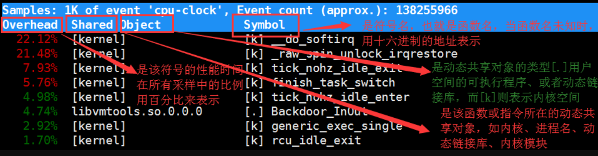

## CPU使用率高

cpu使用率：cpu非空闲态下运行的时间占比，反应的是cpu的繁忙程度

CPU使用率可以通过top 或 ps来查看。分析进程的CPU问题可以通过 jstack（java应用）、perf


先用top找出导致cpu使用率高的进程

然后用perf分析进程哪个函数导致该问题

```shell
perf top -g -p XXXX #对某一个进程进行分析
```



## 不可中断和僵尸进程

#### 进程状态

- R Running/Runnable，表示进程在CPU的就绪队列中，正在运行或者等待运行；
- D Disk Sleep，不可中断状态睡眠，一般表示进程正在跟硬件交互，并且交互过程中不允许被其他进程中断；
- Z Zombie，僵尸进程，表示进程实际上已经结束，但是父进程还没有回收它的资源；
- S Interruptible Sleep，可中断睡眠状态，表示进程因为等待某个事件而被系统挂起，当等待事件发生则会被唤醒并进入R状态；
- I Idle，空闲状态，用在不可中断睡眠的内核线程上。该状态不会导致平均负载升高；
- T Stop/Traced，表示进程处于暂停或跟踪状态（SIGSTOP/SIGCONT， GDB调试）；
- X Dead，进程已经消亡，不会在top/ps中看到。


对于不可中断状态，一般都是在很短时间内结束，可忽略。但是如果系统或硬件发生故障，进程可能会保持不可中断状态很久，甚至系统中出现大量不可中断状态，此时需注意是否出现了I/O性能问题。

僵尸进程一般多进程应用容易遇到，父进程来不及处理子进程状态时子进程就提前退出，此时子进程就变成了僵尸进程。大量的僵尸进程会用尽PID进程号，导致新进程无法建立。


#### 磁盘O_DIRECT问题

```
sudo docker run --privileged --name=app -itd feisky/app:iowait
ps aux | grep '/app'
```

可以看到此时有多个app进程运行，状态分别时Ss+和D+。其中后面s表示进程是一个会话的领导进程，+号表示前台进程组。

其中**进程组**表示一组相互关联的进程，子进程是父进程所在组的组员。**会话**指共享同一个控制终端的一个或多个进程组。

用top查看系统资源发现：1）平均负载在逐渐增加，且1分钟内平均负载达到了CPU个数，说明系统可能已经有了性能瓶颈；2）僵尸进程比较多且在不停增加；3）us和sys CPU使用率都不高，iowait却比较高；4）每个进程CPU使用率也不高，但有两个进程处于D状态，可能在等待IO。

分析目前数据可知：iowait过高导致系统平均负载升高，僵尸进程不断增长说明有程序没能正确清理子进程资源。

用dstat来分析，因为它可以同时查看CPU和I/O两种资源的使用情况，便于对比分析。

```
dstat 1 10    #间隔1秒输出10组数据
```

可以看到当wai（iowait）升高时磁盘请求read都会很大，说明iowait的升高和磁盘的读请求有关。接下来分析到底时哪个进程在读磁盘。

之前top查看的处于D状态的进程号，用pidstat -d -p XXX 展示进程的I/O统计数据。发现处于D状态的进程都没有任何读写操作。在用pidstat -d 查看所有进程的I/O统计数据，看到app进程在进行磁盘读操作，每秒读取32MB的数据。进程访问磁盘必须使用系统调用处于内核态，接下来重点就是找到app进程的系统调用。

```
sudo strace -p XXX #对app进程调用进行跟踪
```

报错没有权限，因为已经时root权限了。所以遇到这种情况，首先要检查进程状态是否正常。ps命令查找该进程已经处于Z状态，即僵尸进程。

这种情况下top pidstat之类的工具无法给出更多的信息，此时像第5篇一样，用perf record -d和perf report进行分析，查看app进程调用栈。

看到app确实在通过系统调用sys_read()读取数据，并且从new_sync_read和blkdev_direct_IO看出进程时进行直接读操作，请求直接从磁盘读，没有通过缓存导致iowait升高。

通过层层分析后，root cause是app内部进行了磁盘的直接I/O。然后定位到具体代码位置进行优化即可。

#### 僵尸进程

上述优化后iowait显著下降，但是僵尸进程数量仍旧在增加。首先要定位僵尸进程的父进程，通过pstree -aps XXX，打印出该僵尸进程的调用树，发现父进程就是app进程。

查看app代码，看看子进程结束的处理是否正确（是否调用wait()/waitpid(),有没有注册SIGCHILD信号的处理函数等）。

**碰到iowait升高时，先用dstat pidstat等工具确认是否存在磁盘I/O问题，再找是哪些进程导致I/O，不能用strace直接分析进程调用时可以通过perf工具分析。**

**对于僵尸问题，用pstree找到父进程，然后看源码检查子进程结束的处理逻辑即可。**

## 内存问题

查看内存

```shell
[root@localhost ~]# free
             total        used         free      shared   buffers   cached
Mem:         16402432    16360492      41940        0     465404   12714880
-/+ buffers/cache:        3180208   13222224
Swap:        8193108        264      8192844
```

首先是第一行：

1. total：物理内存的总大小。 
2. used：已经使用的物理内存多小。 
3. free：空闲的物理内存值。 
4. shared：多个进程共享的内存值。
5. buffers/cached：磁盘缓存的大小。 

1．**从内核的角度来查看内存的状态    total - used = free**

就是内核目前可以直接分配到，不需要额外的操作，即为上面free命令输出中第二行Mem项的值，可以看出，此系统物理内存有16G，空闲的内存只有41940K，也就是40M多一点，我们来做一个这样的计算：

16402432－16360492＝41940  

其实就是总的物理内存减去已经使用的物理内存得到的就是空闲的物理内存大小，注意这里的可用内存值41940并不包含处于buffers和cached状态的内存大小。

如果你认为这个系统空闲内存太小，那你就错了，实际上，内核完全控制着内存的使用情况，**linux会在需要内存的时候，或在系统运行逐步推进时，将buffers和cached状态的内存变为free状态的内存，以供系统使用。** 

2．**从应用层的角度来看系统内存的使用状态   free+buffer/cached**

也就是linux上运行的应用程序可以使用的内存大小，即free命令第三行“(-/+ buffers/cached)”的输出，可以看到，此系统已经使用的内存才3180208K，而空闲的内存达到13222224K，继续做这样一个计算：

41940＋（465404＋12714880）＝13222224

通过这个等式可知，应用程序可用的物理内存值是Mem项的free值加上buffers和cached值之和，也就是说，这个free值是包括buffers和cached项大小的，

对于应用程序来说，buffers/cached占有的内存是可用的，因为buffers/cached是为了提高文件读取的性能，当应用程序需要用到内存的时候，buffers/cached会很快地被回收，以供应用程序使用。

 buffer和cache也是真实的物理内存。

 通过内核角度去查看空闲内存，如果空闲内存较多，那很明显，这台机器是内存非常空闲的，但是如果从内核层面看到的free内存小的话，并不代表内存不足，**还要综合看buffer/cache，如果这个值也非常小，这样才能够说明内存确实不足了。**

通俗一点说：buffers主要用来存放目录里面有什么内容，文件的属性以及权限等等。而cached直接用来记忆我们打开过的文件和程序。

