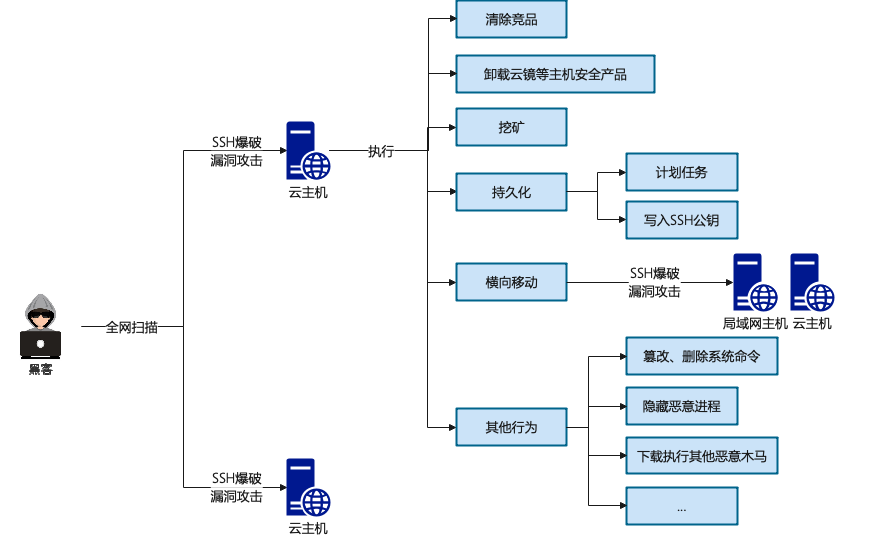
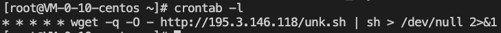
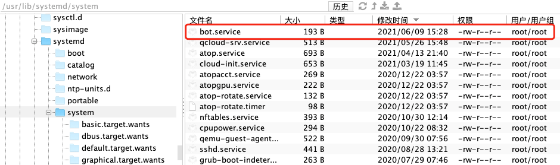
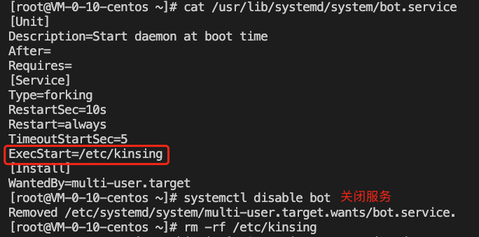
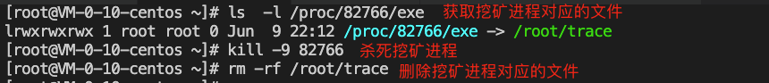
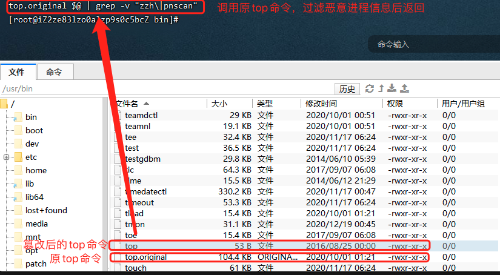
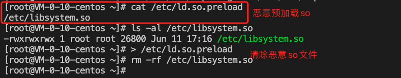

# 服务器被挖矿

## 挖矿木马

挖矿木马会占用CPU进行超频运算，从而占用主机大量的CPU资源

挖矿木马的整体攻击流程大致如下图所示：



## 清除挖矿木马

1. 隔离主机

   部分带有蠕虫功能的挖矿木马在取得主机的控制权后，会继续对公网的其他主机，或者以当前主机作为跳板机对同一局域网内的其他主机进行横向渗透，所以在发现主机被植入挖矿木马后，在不影响业务正常运行的前提下，应该及时隔离受感染的主机，然后进行下一步分析和清除工作。

2. 阻断异常网络通信

   挖矿木马不仅会连接矿池，还有可能会连接黑客的C2服务器，接收并执行C2指令、投递其他恶意木马，所以需要及时进行网络阻断。

   

   （1）检查主机防火墙当前生效的iptables规则中是否存在业务范围之外的可疑地址和端口，它们可能是挖矿木马的矿池或C2地址

   ```
   iptables -L -n
   ```

   （2）从iptables规则中清除可疑地址和端口

   ```
   vi /etc/sysconfig/iptables
   ```

   （3）阻断挖矿木马的网络通信

   ```
   iptables -A INPUT -s 可疑地址 -j DROPiptables -A OUTPUT -d 可疑地址 -j DROP
   ```

3. 清除计划任务

   大部分挖矿木马会通过在受感染主机中写入计划任务实现持久化，如果仅仅只是清除挖矿进程，无法将其根除，到了预设的时间点，系统会通过计划任务从黑客的C2服务器重新下载并执行挖矿木马。

   

   挖矿木马常见的计划任务通常是下载并执行sh脚本，如下图所示:

   

   查看系统特定用户的计划任务：

   ```shell
   crontab -u username -l
   ```

   查看其他计划任务文件：

   ```shell
   cat /etc/crontab
   cat /var/spool/cron
   cat /etc/anacrontab
   cat /etc/cron.d/
   cat /etc/cron.daily/
   cat /etc/cron.hourly/
   cat /etc/cron.weekly/
   cat /etc/cron.monthly/
   cat /var/spool/cron/
   ```

4. 清除启动项

   除了计划任务，挖矿木马通过添加启动项同样能实现持久化。可以使用如下命令查看开机启动项中是否有异常的启动服务。

   ```shell
   systemctl list-unit-files
   systemctl disable 服务名
   ```

   另外，还需要仔细排查以下目录及文件，及时删除可疑的启动项：

   ```shell
   /usr/lib/systemd/system
   /usr/lib/systemd/system/multi-user.target.wants
   /etc/rc.local
   /etc/inittab
   /etc/rc0.d/
   /etc/rc1.d/
   /etc/rc2.d/
   /etc/rc3.d/
   /etc/rc4.d/
   /etc/rc5.d/
   /etc/rc6.d/
   /etc/rc.d/
   ```

   排查的时候，可以按照文件修改时间来排序，重点排查近期被创建服务项。如下图所示，系统近期被创建了一个名为bot.service的服务，该服务在系统启动时会启动/etc/kinsing这个木马文件，需要关闭bot服务，并删除/etc/kinsing文件。

   

   

5. 清除ssh公钥

   挖矿木马通常还会在~/.ssh/authoruzed_keys文件中写入黑客的SSH公钥，这样子就算用户将挖矿木马清除得一干二净，黑客还是可以免密登陆该主机

6. 清除挖矿木马

   清除挖矿进程

   获取并记录挖矿进程的文件路径：

   ```shell
   ls -l /proc/$PID/exe
   ```

   杀死挖矿进程：

   ```shell
   kill -9 $PID
   ```

   删除挖矿进程对应的文件

   

   清除其他相关恶意进程

   查看服务器是否有未被授权的端口被监听：

   ```shell
   netstat -antp
   ```

   然后杀死进程和删除进程对应的文件

## 为什么系统CPU占用率接近100%，却看不到是哪个进程导致的？

这种情况一般是因为系统命令被木马篡改了，从而隐藏了木马进程的踪迹

命令篡改有多种方式，分别如下：
（1）top源文件被篡改，恶意进程信息被过滤后返回



通过执行如下命令即可复原：

```shell
rm -rf /usr/bin/top && mv /usr/bin/top.original /usr/bin/top
```

（2）篡改预加载so文件，ls、top、ps等命令已经被木马的动态链接库劫持，无法获得木马进程相关的信息



通过执行如下命令即可复原：

```shell
> /etc/ld.so.preload && rm -rf 恶意so文件路径
```

