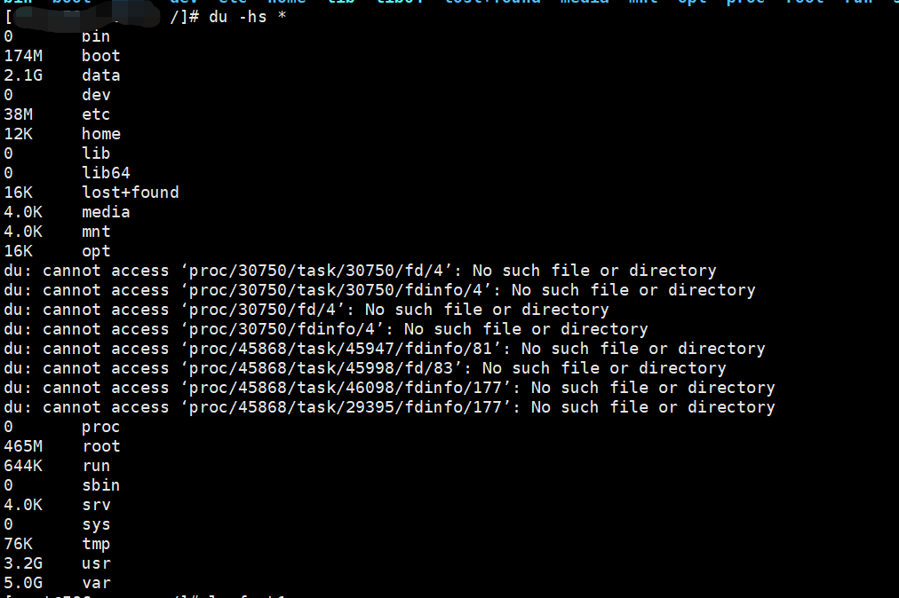
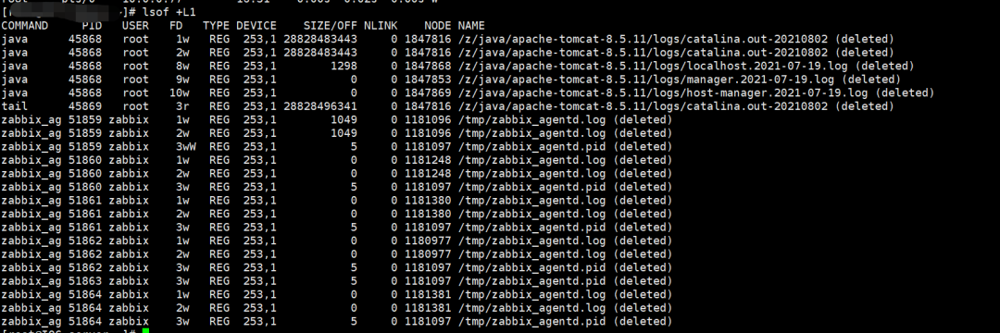

# 根分区空间满了

我们时常会遇到服务器磁盘空间告警

登录服务器，通过df -Hl查看，然后要找到导致磁盘空间满的目录或文件

## 方法

一种比较笨的方法是，在根目录下，通过du -hs命令，列出各目录所占空间大小



之后再用同样的方法继续到对应目录下去找

再相对高效一点的方法是通过du的-d参数，或--max-depth，设置查询的目录深度，目录深度增加，所查询的目录，展示出来会很多，这个时候可以通过grep进行过滤

```shell
du -h -d 2|grep [GT] |sort -nr  
du -h --max-depth=2|grep [GT] |sort -nr  
```

有时候会发现du查到的占用空间和df看到的占用空间相差很大，**du比df少了很多**，这是因为有空间被已删除文件占用，文件删除了，但是资源没有释放

用lsof命令

```shell
lsof +L1  
```



从结果可以看出，有一个28G左右的大日志文件，删除了，但是空间没释放，需要重启tomcat释放空间