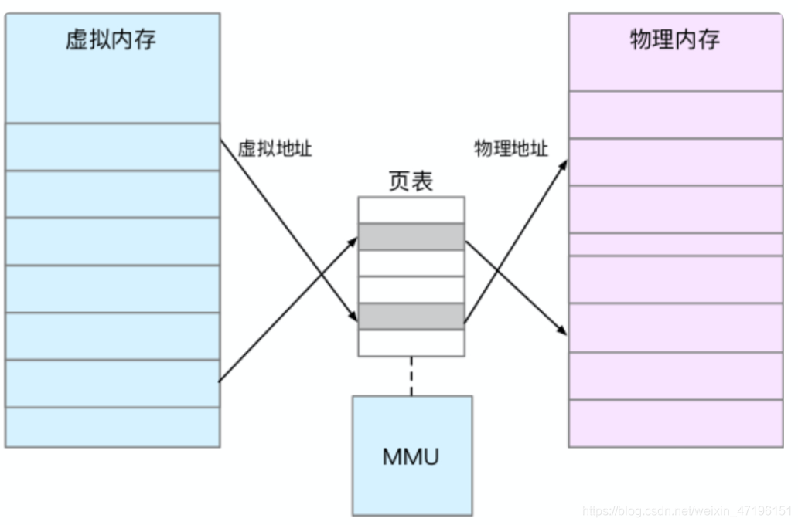
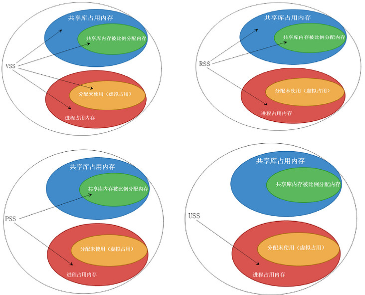

## 内存怎么工作

对于进程来说，并不是直接访问物理内存，而是通过虚拟内存，两者之间通过页表做映射。如图



使用虚拟内存有以下的好处

- 虚拟内存可以为进程提供独立的内存空间，简化内存分配过程
- 不限于物理内存的空间限制，可以利用磁盘加物理内存，为进程提供看起来访问速度快，并且容量足够大的存储
- 虚拟内存可以控制进程对物理内存的访问，隔离不同进程的访问权限，提高系统的安全性


虚拟地址与物理地址映射用的页面存储在MMU中。当进程访问的虚拟地址在页表中找不到时，会产生一个缺页异常，进入内核空间分配物理内存，更新进程页表，最后再返回用户空间，恢复进程的运行。

在MMU中，还通过TLB做页表的高速缓存，提升查询物理地址的性能。TLB空间有限，通过减少进程上下文切换，来减少TLB的刷新次数，就可以提高TLB缓存的使用率，进而提高CPU的内存访问性能。


Linux通过伙伴（Buddy）系统管理内存分配，伙伴系统使用页为单位（4KB）来管理内存。

对于比页更小的对象，比如1KB，如果也分配单独的页，会有内存浪费。针对这个问题，在内核空间中，Linux通过slab分配器来管理小对象。

对于释放缓存，应用程序在用户内存后，还需要调用free()或unmap()释放不用的内存，避免内存泄漏。

而对于回收内存，系统可通过以下三种方式回收

回收缓存：比如使用LRU算法，回收最近最少使用的内存页面
回收不常用的内存：把不常用的内存通过swap直接写到磁盘中
杀死进程：通过OOM，直接杀掉占用大量内存的进程

## 性能指标

**系统内存指标：**

已用/剩余/可用内存

缺页异常

缓存/缓冲区：使用量/命中率

```text
Buffer 既可以用作“将要写入磁盘数据的缓存”，也可以用作“从磁盘读取数据的缓存”。Cache 既可以用作“从文件读取数据的页缓存”，也可以用作“写文件的页缓存”。

（**备注：**磁盘是一个块设备，可以划分为不同的分区；在分区之上再创建文件系统，挂载到某个目录，之后才可以在这个目录中读写文件。在读写普通文件时，会经过文件系统，由文件系统负责与磁盘交互；而读写磁盘或者分区时，就会跳过文件系统，也就是所谓的“裸I/O“。这两种读写方式所使用的缓存是不同的，也就是文中所讲的 Cache 和 Buffer 区别。）

**缓存的命中率：**所谓缓存命中率，是指直接通过缓存获取数据的请求次数，占所有数据请求次数的百分比。命中率越高，表示使用缓存带来的收益越高，应用程序的性能也就越好。
```

Slabs


**进程内存指标：**



虚拟内存VSS

```text
进程向系统申请的虚拟内存（包含共享库内存总数），即单个进程全部可访问的地址空间，其大小可能包括还尚未在内存中驻留的部分。
```

常驻内存RSS

```text
是进程在 RAM 中实际保存的总内存（包含共享库占用的共享内存总数）。

即单个进程实际占用内存大小，RSS 可能会产生误导，因为包含了共享库占用的共享内存总数。然而实际上一个共享库仅会被加载到内存中一次，无论被多少个进程使用。

所以，RSS 不能准确的表示单个进程的内存占用情况。
```

按比例分配共享内存后的物理内存PSS

```text
是单个进程运行时实际占用的物理内存（包含比例分配共享库占用的内存）。

对比 RSS 来说，PSS 中的共享库内存是按照比例计算的。一个共享库有 N 个进程使用，那么该库比例分配给 PSS 的大小为：1/N；

PSS 明确的表示了单个进程在系统总内存中的实际使用量。
```

独占内存USS

```text
是进程实际独自占用的物理内存（不包含共享库占用的内存）。USS 揭示了单个进程运行中真实的内存增量大小。如果单个进程终止，USS 就是实际返还给系统的内存大小。

当怀疑某个进程中内存泄漏时，可以查看 USS 的数值。
```

共享内存

缺页异常

### 内存泄漏

内存泄漏：内存泄漏一般指的是堆内存的泄漏。堆内存是指程序从堆中分配的、大小任意的(内存块的大小可以在程序运行期决定)、使用完后必须显示的释放的内存。应用程序一般使用malloc、realloc、new 等函数从堆中分配到一块内存，使用完后，程序必须负责相应的调用 free 或 delete 释放该内存块。否则，这块内存就不能被再次使用，我们就说这块内存泄漏了。

有些简单的内存泄漏问题可以从在代码的检查阶段确定。还有些泄漏比较严重的，即在很短的时间内导致程序或系统崩溃，或者系统报告没有足够内存，也比较容易发现。最困难的就是泄漏比较缓慢，需要观测几天、几周甚至几个月才能看到明显异常现象。那么如何在比较短的时间内检测出有没有潜在的内存泄漏问题呢？


**查看内存泄漏的命令**

> **ps 命令**
>
> **top 命令**
>
> **free 命令**
>
> **cat /proc/meminfo 或 cat /proc/$pid/status 命令**

## 常用工具

1.free:

```shell
# Mem：物理内存，Swap:交换分区
# total: 物理内存的总大小；
# used: 已使用物理内存的大小，包含了共享内存; 
# free: 空闲的物理内存大小
# shared: 多个进程共享的内存大小
# buff/cache: 缓存大小
# available: 新进程可用内存的大小
$ free
              total        used        free      shared  buff/cache   available
Mem:        8169348      263524     6875352         668     1030472     7611064
Swap:             0           0           0
```

**从内核的角度来查看内存的状态    total - used = free**

linux会在需要内存的时候，或在系统运行逐步推进时，将buffers和cached状态的内存变为free状态的内存，以供系统使用。

**从应用层的角度来看系统内存的使用状态   free+buffer+cached**

对于应用程序来说，buffers/cached占有的内存是可用的，因为buffers/cached是为了提高文件读取的性能，当应用程序需要用到内存的时候，buffers/cached会很快地被回收，以供应用程序使用。

 buffer和cache也是真实的物理内存。

从内核层面看到的free内存小的话，并不代表内存不足，**还要综合看buffer/cache，如果这个值也非常小，这样才能够说明内存确实不足了。**

2.top

```shell
# 按下M切换到内存排序
$ top
...
KiB Mem :  8169348 total,  6871440 free,   267096 used,  1030812 buff/cache
KiB Swap:        0 total,        0 free,        0 used.  7607492 avail Mem

# VIRT: 是进程虚拟内存的大小，只要是进程申请过的内存，即便还没有真正分配物理内存，也会计算在内
# RES: 是常驻内存的大小，也就是进程实际使用的物理内存大小，但不包括 Swap 和共享内存。
# SHR: 是共享内存的大小，比如与其他进程共同使用的共享内存、加载的动态链接库以及程序的代码段等。
# MEM: 是进程使用物理内存占系统总内存的百分比。
  PID USER      PR  NI    VIRT    RES    SHR S  %CPU %MEM     TIME+ COMMAND
  430 root      19  -1  122360  35588  23748 S   0.0  0.4   0:32.17 systemd-journal
 1075 root      20   0  771860  22744  11368 S   0.0  0.3   0:38.89 snapd
...
```

3.vmstat

```shell
# 每隔1秒输出1组数据
# bi 和 bo 则分别表示块设备读取和写入的大小，单位为块 / 秒。
# 因为 Linux 中块的大小是 1KB，所以这个单位也就等价于 KB/s。
$ vmstat 1
procs -----------memory---------- ---swap-- -----io---- -system-- ------cpu-----
r  b   swpd   free   buff  cache   si   so    bi    bo   in   cs us sy id wa st
0  0      0 7743608   1112  92168    0    0     0     0   52  152  0  1 100  0  0
0  0      0 7743608   1112  92168    0    0     0     0   36   92  0  0 100  0  0

#swpd：交换处的内存量；
#free：空闲的可用内存；
#buff: 用户缓冲缓存的内存；
#cache: 用于页缓存的内存；
#si: 换入的内存(换页);
#so：换出的内存（换页）；
```

内存的 free 列在不停的变化，并且是下降趋势；而 buffer 和 cache 基本保持不变。未使用内存在逐渐减小，而 buffer 和 cache 基本不变，这说明，系统中使用的内存一直在升高，但这并不能说明有内存泄漏，因为应用程序运行中需要的内存也可能会增大。

4.cachestat /cachetop

cachestat 提供了整个操作系统缓存的读写命中情况。

cachetop 提供了每个进程的缓存命中情况。

```text
# TOTAL ：表示总的 I/O 次数
# MISSES ，表示缓存未命中的次数
# HITS ，表示缓存命中的次数；
# DIRTIES， 表示新增到缓存中的脏页数；
# BUFFERS_MB 表示 Buffers 的大小，以 MB 为单位；
# CACHED_MB 表示 Cache 的大小，以 MB 为单位。
$ cachestat 1 3
   TOTAL   MISSES     HITS  DIRTIES   BUFFERS_MB  CACHED_MB
       2        0        2        1           17        279
       2        0        2        1           17        279
       2        0        2        1           17        279
 # READ_HIT 和 WRITE_HIT ，分别表示读和写的缓存命中率
$ cachetop
11:58:50 Buffers MB: 258 / Cached MB: 347 / Sort: HITS / Order: ascending
PID      UID      CMD              HITS     MISSES   DIRTIES  READ_HIT%  WRITE_HIT%
   13029 root     python                  1        0        0     100.0%       0.0%
```

5. pcstat

```text
$ pcstat /bin/ls
+---------+----------------+------------+-----------+---------+
| Name    | Size (bytes)   | Pages      | Cached    | Percent |
|---------+----------------+------------+-----------+---------|
| /bin/ls | 133792         | 33         | 0         | 000.000 |
+---------+----------------+------------+-----------+---------+
```

6.strace // 观察系统调用

```text
# strace -p $(pgrep app)
strace: Process 4988 attached
restart_syscall(<\.\.\. resuming interrupted nanosleep \.\.\.>) = 0
openat(AT_FDCWD, "/dev/sdb1", O_RDONLY|O_DIRECT) = 4
mmap(NULL, 33558528, PROT_READ|PROT_WRITE, MAP_PRIVATE|MAP_ANONYMOUS, -1, 0) = 0x7f448d240000
read(4, "8vq\213\314\264u\373\4\336K\224\25@\371\1\252\2\262\252q\221\n0\30\225bD\252\266@J"\.\.\., 33554432) = 33554432
write(1, "Time used: 0.948897 s to read 33"\.\.\., 45) = 45
close(4)  
```

从 strace 的结果可以看到，案例应用调用了 openat 来打开磁盘分区 /dev/sdb1，并且传入的参数为 O_RDONLY|O_DIRECT（中间的竖线表示或）。O_RDONLY 表示以只读方式打开，而 O_DIRECT 则表示以直接读取的方式打开，这会绕过系统的缓存。

7.memleak

memleak 可以跟踪系统或指定进程的内存分配、释放请求，然后定期输出一个未释放内存和相应调用栈的汇总情况（默认 5 秒）。

8.sar

```shell
#kbcommit，表示当前系统负载需要的内存。它实际上是为了保证系统内存不溢出，对需要内存的估计值。
# commit，就是这个值相对总内存的百分比。
# kbactive，表示活跃内存，也就是最近使用过的内存，一般不会被系统回收。
# kbinact，表示非活跃内存，也就是不常访问的内存，有可能会被系统回收。
# kbmemfree:剩余内存
# 间隔1秒输出一组数据
# -r表示显示内存使用情况，-S表示显示Swap使用情况
$ sar -r -S 1
04:39:56    kbmemfree   kbavail kbmemused  %memused kbbuffers  kbcached  kbcommit   %commit  kbactive   kbinact   kbdirty
04:39:57      6249676   6839824   1919632     23.50    740512     67316   1691736     10.22    815156    841868         4

04:39:56    kbswpfree kbswpused  %swpused  kbswpcad   %swpcad
04:39:57      8388604         0      0.00         0      0.00

04:39:57    kbmemfree   kbavail kbmemused  %memused kbbuffers  kbcached  kbcommit   %commit  kbactive   kbinact   kbdirty
04:39:58      6184472   6807064   1984836     24.30    772768     67380   1691736     10.22    847932    874224        20

04:39:57    kbswpfree kbswpused  %swpused  kbswpcad   %swpcad
04:39:58      8388604         0      0.00         0      0.00
…
04:44:06    kbmemfree   kbavail kbmemused  %memused kbbuffers  kbcached  kbcommit   %commit  kbactive   kbinact   kbdirty
04:44:07       152780   6525716   8016528     98.13   6530440     51316   1691736     10.22    867124   6869332         0

04:44:06    kbswpfree kbswpused  %swpused  kbswpcad   %swpcad
04:44:07      8384508      4096      0.05        52      1.27
```

8.ps

　　可以列出包括内存使用统计信息在内的所有进程细节；

　　%MEM: 主存使用(物理内存、RSS)占总内存的百分比；
　　RSS：常驻集合大小；
　　VSZ: 虚拟内存大小

```shell
ps -ef | grep 进程关键字      //查看指定进程的信息

ps -aux       // 列出当前内存中的所有进程

ps aux --sort=%mem（或者 ps aux --sort %mem） //按照内存占用率的升序排序

ps aux --sort=-%mem  （或者 ps aux --sort -%mem） //按照内存占用率降序排序

ps aux | grep -e test       //打印含义test关键字的进程

ps -aux | grep -E "test|PID"      //打印 包含test关键字的进程信息
```

9.dmesg

```shell
#查看系统中的 oom 事件
$ dmesg | grep -i oom
[255083.947041] a.out invoked oom-killer: gfp_mask=0x1100dca(GFP_HIGHUSER_MOVABLE|__GFP_ZERO), order=0, oom_score_adj=0
[255083.947143]  oom_kill_process.cold+0xb/0x10
[255083.947301] [  pid  ]   uid  tgid total_vm      rss pgtables_bytes swapents oom_score_adj name
[255083.947369] oom-kill:constraint=CONSTRAINT_NONE,nodemask=(null),cpuset=user.slice,mems_allowed=0,global_oom,task_memcg=/user.slice/user-0.slice/session-487.scope,task=a.out,pid=8204,uid=0
[255083.947389] Out of memory: Killed process 8204 (a.out) total-vm:7946846728kB, anon-rss:3880048kB, file-rss:1152kB, shmem-rss:0kB, UID:0 pgtables:3910580kB oom_score_adj:0
```

## 内核优化参数

vm.dirty_background_bytes：默认值为0， 触发pdflush后台回写的脏存储器量；

vm.dirty_background_ratio：默认值10， 触发pdflush后台回写脏系统存储器百分比；
vm.dirty_bytes：默认值为0，触发一个写入进程开始回写的脏存储器量；
vm.dirty_ratio：默认值为20，触发一个写入进程开始回写的脏系统存储器比例；
vm.dirty_expire_centisecs：默认值为3000，使用pdflush的脏存储器最小时间；
vm.dirty_writeback_centisecs：默认值为500，pdflush活跃时间间隔(0为停用)；
vm.min_free_kbytes：默认值为 dynamic，设置期望的空闲存储器量（一些内核自动分配器能消耗它）；
vm.overconmmit_memory：默认值为0，0表示利用探索法允许合理的国度分配；1表示一直国度分配；3表示禁止国度分配；
vm.swappiness：默认值为60，相对于页面高速缓存回收更倾向用交换释放存储器的程度；
vm.vfs_cache_pressure：默认值为100，表示回收高速缓存的目录和inode对象的程度。较低的值会保留更多;0意味着从不回收，容器导致存储器耗尽的情况；

提示：

vm.dirty_background_bytes和vm.dirty_background_ratio是互斥的，dirty_bytes 和 dirty_ratio 也是如此，仅能设置一个。vm.swappiness参数对性能会产生显著的影响，建议设置为0;因为应用程序内存能尽可能就地驻留。