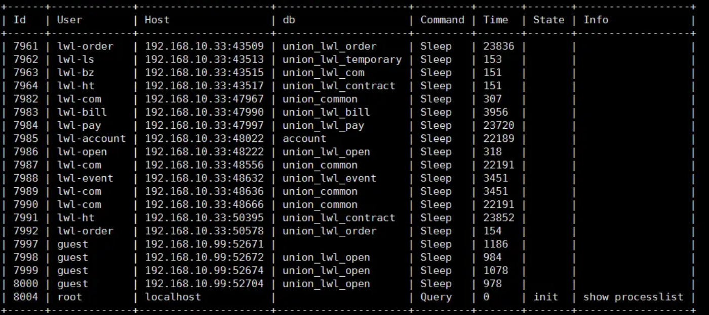
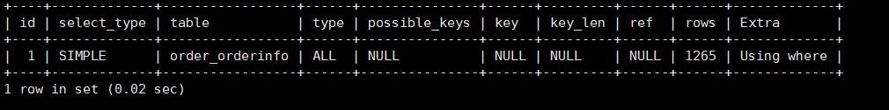

# 日志管理

## 错误日志

作用：记录**启动、关闭、日常运行**的状态信息、警告、**错误**，当数据库出现任何故障，建议首先查看此日志

错误日志配置：

```dart
默认就是开启的:  /var/log/mysqld.log

查看日志位置：
show variables like '%log_error%';
```

主要关注**[ERROR]**,看上下文

## binlog二进制日志


Binlog以事件形式记录，还包含语句所执行的消耗和时间。MySQL的二进制日志是事务安全型的。一般来说开启binlog日志大概会有1%的性能损耗


作用：

**备份恢复**

**主从复制**


默认没有开启binlog

开启binlog:

```shell
vim /etc/my.cnf
[mysqld]
server_id=1 #5.7必须加上
log_bin=/data/mysql/mysql-bin #必须对mysql有权限
binlog_format=row
expire_logs_days=15 #binlog日志保留天数

mkdir /data/mysql -p
chown -R mysql.mysql /data/mysql

systemctl restart mysqld
```


涉及到参数如下：

```shell
show variables like '%log_bin%';
```


Binlog记录的内容

binlog记录的是变更sql语句，不记录查询语句

记录的种类：

DDL、DCL：原封不动记录

DML：只记录已提交的事务

记录格式：

- statement（5.6默认）：**基于sql语句的日志记录**，记录对数据进行修改的sql

- ROW(5.7 默认值) ：**基于行的日志记录**，记录每一行的数据变化(用户看不懂，需要工具分析)

  **row格式很占空间**，比如用一个delete语句删掉10万行数据，用statement就是一个sql语句被记录到binlog中，但如果用row就要把这10万条记录都写到binlog中，不仅占用更大的空间，也耗费IO资源影响执行速度。

- mixed（混合）：以上两种模式的混合，默认采用statement，在某些特殊情况下会自动切换为row，MySQL 自己会判断这条 SQL 语句是否可能引起主备不一致，如果有可能，就用 row 格式，否则就用 statement 格式。

statement与row的区别：

- statement可读性高，日志量少，不够严谨
- row可读性低，日志量大，足够严谨

查看binlog格式

```css
show variables like '%binlog_format%';
```


### event事件

**binlog得最小记录单元**

对于ddl、dcl，一个语句就是一个event

对于dml，以下例子就被分为4个event：

begin；
dml1；
dml2；
commit；

event的组成：开始位置+事件内容+结束位置

位置号（position号码）的作用：为了方便截取binlog文件中的事件


查看mysql正在使用的日志文件：

```mysql
Master [(none)]>show master status;
+------------------+----------+--------------+------------------+-------------------+
| File             | Position | Binlog_Do_DB | Binlog_Ignore_DB | Executed_Gtid_Set |
+------------------+----------+--------------+------------------+-------------------+
| mysql-bin.000003 |      154 |              |                  |                   |
+------------------+----------+--------------+------------------+-------------------+
Master [(none)]>
    
file：当前MySQL正在使用的文件名
Position：最后一个事件的结束位置号
```

查看事件信息：

```shell
show binlog events in 'mysql-bin.000002';
| Log_name         | Pos   | Event_type     | Server_id | End_log_pos | Info
+------------------+-------+----------------+-----------+-------------+------
| mysql-bin.000002 |     4 | Format_desc    |         1 |         123 | Server ver: 5.7.42-log, Binlog ver: 4  
| mysql-bin.000002 |   123 | Previous_gtids |         1 |         154 |
| mysql-bin.000002 |   154 | Anonymous_Gtid |         1 |         219 | SET @@SESSION.GTID_NEXT= 'ANONYMOUS'
| mysql-bin.000002 |   219 | Query          |         1 |         328 | DROP DATABASE IF EXISTS `pig_config`
...
```

截取binlog内容：

```shell
mysqlbinlog --start-position=219 --stop-position=328 mysql-bin.000002
```


### 日志查看

由于日志是以**二进制的方式存储**的，不能直接读取，需要通过二进制日志查询工具**mysqlbinlog**来查看，具体语法：

```shell
mysqlbinlog [参数] logfilename
参数：
-d 指定数据库名称，只列出指定数据库相关操作
-o 忽略日志前n行的命令
-v 将行事件重构为sql语句
-vv 将行事件重构为sql语句，并输出注释
```


## 慢日志

慢查询日志记录了所有执行时间超过参数long_query_time的值并且扫描记录数不小于min_examined_row_limit的所有sql语句，默认未开启


开启慢日志（默认没开启）

```shell
开关:
slow_query_log=1 
文件位置及名字 
slow_query_log_file=/data/mysql/slow.log
设定慢查询时间:
long_query_time=0.1 #运行时间超过long_query_time值的语句,就会记录到慢查询日志中,默认是10.
默认不会记录没走索引的语句，如果要记录需要开启:
log_queries_not_using_indexes=1
默认不会记录管理语句，如果要记录需要开启：
log_slow_admin_statements=1

vim /etc/my.cnf
slow_query_log=1 
slow_query_log_file=/data/mysql/slow.log
long_query_time=0.1
log_queries_not_using_indexes

systemctl restart mysqld
```

查看是否开启和存放位置

```mysql
show variables like 'slow_query%';
```

查看现在这个session有多少个慢查询

```mysql
show global status like '%slow%';
```

查看超时阀值

```mysql
show variables like '%long%';
```

### 分析慢日志工具

#### mysqldumpslow

统计不同慢sql的出现次数(Count),执行最长时间(Time),累计总耗费时间(Time),等待锁的时间(Lock),发送给客户端的行总数(Rows),扫描的行总数(Rows),用户以及sql语句本身(抽象了一下格式,比如limit 1, 20用limit N,N表示).

```cpp
mysqldumpslow
-s 排序选项：c:访问计数l:锁定时间r:返回记录t:查询时间al:平均锁定时间ar:平均返回记录数at:平均查询时间 
-t 只显示top n条查询

mysqldumpslow -s c -t 20 host-slow.log                # 访问次数最多的20个sql语句
```

常见用法：

```shell
#取出使用最多的10条慢查询
mysqldumpslow -sc -t 10 xxxx-slow.log
#取出查询时间最慢的3条慢查询
mysqldumpslow -st -t 3 xxxx-slow.log
```

### show processlist

显示哪些线程正在运行



Id列：一个标识，你要kill一个语句的时候很有用

User列：显示单前用户，如果不是root，这个命令就只显示你权限范围内的sql语句

Host列：显示这个语句是从哪个ip的哪个端口上发出的。用于追踪出问题语句的用户

db列：显示这个进程目前连接的是哪个数据库

Command列：显示当前连接的执行的命令，一般就是休眠（sleep），查询（query），连接（connect）

Time列：此这个状态持续的时间，单位是秒

State列：显示使用当前连接的sql语句的状态，很重要的列，后续会有所有的状态的描述，请注意，state只是语句执行中的某一个状态，一个sql语句，以查询为例，可能需要经过copying to tmp table，Sorting result，Sending data等状态才可以完成

Info列；显示这个sql语句，因为长度有限，所以长的sql语句就显示不全，但是一个判断问题语句的重要依据

这个命令中最关键的就是state列，MySQL列出的状态主要有以下几种：

Checking table：正在检查数据表（这是自动的）。

Closing tables：正在将表中修改的数据刷新到磁盘中，同时正在关闭已经用完的表。这是一个很快的操作，如果不是这样的话，就应该确认磁盘空间是否已经满了或者磁盘是否正处于重负中。

Connect Out：复制从服务器正在连接主服务器。

Copying to tmp

table on disk：由于临时结果集大于tmp_table_size，正在将临时表从内存存储转为磁盘存储以此节省内存。

Creating tmp

table：正在创建临时表以存放部分查询结果。

deleting from

main table：服务器正在执行多表删除中的第一部分，刚删除第一个表。

deleting from

reference tables：服务器正在执行多表删除中的第二部分，正在删除其他表的记录。

Flushing tables：正在执行FLUSH

TABLES，等待其他线程关闭数据表。

Killed：发送了一个kill请求给某线程，那么这个线程将会检查kill标志位，同时会放弃下一个kill请求。MySQL会在每次的主循环中检查kill标志位，不过有些情况下该线程可能会过一小段才能死掉。如果该线程程被其他线程锁住了，那么kill请求会在锁释放时马上生效。

Locked：被其他查询锁住了。

Sending data：正在处理SELECT查询的记录，同时正在把结果发送给客户端。

Sorting for

group：正在为GROUP BY做排序。

Sorting for

order：正在为ORDER BY做排序。

Opening tables：这个过程应该会很快，除非受到其他因素的干扰。例如，在执ALTER TABLE或LOCK TABLE语句行完以前，数据表无法被其他线程打开。正尝试打开一个表。

Removing

duplicates：正在执行一个SELECT DISTINCT方式的查询，但是MySQL无法在前一个阶段优化掉那些重复的记录。因此，MySQL需要再次去掉重复的记录，然后再把结果发送给客户端。

Reopen table：获得了对一个表的锁，但是必须在表结构修改之后才能获得这个锁。已经释放锁，关闭数据表，正尝试重新打开数据表。

Repair by

sorting：修复指令正在排序以创建索引。

Repair with

keycache：修复指令正在利用索引缓存一个一个地创建新索引。它会比Repair by sorting慢些。

Searching rows

for update：正在讲符合条件的记录找出来以备更新。它必须在UPDATE要修改相关的记录之前就完成了。

Sleeping：正在等待客户端发送新请求.

System lock：正在等待取得一个外部的系统锁。如果当前没有运行多个mysqld服务器同时请求同一个表，那么可以通过增加--skip-external-locking参数来禁止外部系统锁。

Upgrading lock：INSERT

DELAYED正在尝试取得一个锁表以插入新记录。

Updating：正在搜索匹配的记录，并且修改它们。

User Lock：正在等待GET_LOCK()。

Waiting for

tables：该线程得到通知，数据表结构已经被修改了，需要重新打开数据表以取得新的结构。然后，为了能的重新打开数据表，必须等到所有其他线程关闭这个表。以下几种情况下会产生这个通知：FLUSH TABLES tbl_name, ALTER TABLE, RENAME TABLE, REPAIR TABLE,

ANALYZE TABLE,或OPTIMIZE TABLE。

waiting for

handler insert：INSERT DELAYED已经处理完了所有待处理的插入操作，正在等待新的请求。

大部分状态对应很快的操作，只要有一个线程保持同一个状态好几秒钟，那么可能是有问题发生了，需要检查一下。

### explain

显示了mysql如何使用索引来处理select语句和连接表，可以帮助选择更好的索引和写出更优化的查询语句

使用方法，在select语句前加上explain就可以了



table列：显示这一行的数据是关于哪张表的

type列：这是重要的列，显示连接使用了何种类型。从最好到最差的连接类型为const、eq_reg、ref、range、index和ALL

possible_keys列：显示可能应用在这张表中的索引。如果为空，没有可能的索引。可以为相关的域从WHERE语句中选择一个合适的语句

key列：实际使用的索引。如果为NULL，则没有使用索引。很少的情况下，MYSQL会选择优化不足的索引。这种情况下，可以在SELECT语句中使用USE INDEX（indexname）来强制使用一个索引或者用IGNORE INDEX（indexname）来强制MYSQL忽略索引

key_len列：使用的索引的长度。在不损失精确性的情况下，长度越短越好

ref列：显示索引的哪一列被使用了，如果可能的话，是一个常数

rows列：MYSQL认为必须检查的用来返回请求数据的行数

Extra列：关于MYSQL如何解析查询的额外信息。

## 事务日志

事务有4种特性：`原子性`、`一致性`、`隔离性`和`持久性`

- 事务的`隔离性`由 `锁机制` 实现。
- `REDO LOG` 称为 重做日志 ，提供再写入操作，恢复提交事务修改的页操作，用来保证事务的`持久性`。
- `UNDO LOG` 称为 回滚日志 ，回滚行记录到某个特定版本，用来保证事务的`原子性`、`一致性`。

### redo log

前面讲过，`MySQL`中数据是以页为单位，你查询一条记录，会从硬盘把一页的数据加载出来，加载出来的数据叫数据页，会放入到`Buffer Pool`中。后续的查询都是先从`Buffer Pool`中找，没有命中再去硬盘加载，减少硬盘`IO`开销，提升性能。

**更新操作也是如此，把数据页加载到内存，直接在内存里更新，然后会把“在某个数据页上做了什么修改”记录到redo log中。**


刷盘时机：

`InnoDB`存储引擎为`redo log`的刷盘策略提供了`innodb_flush_log_at_trx_commit`参数，它支持三种策略

- **设置为0的时候，表示每次事务提交时不进行刷盘操作**
- **设置为1的时候，表示每次事务提交时都将进行刷盘操作（默认值）**
- **设置为2的时候，表示每次事务提交时都只把redo log buffer内容写入page cache**

另外`InnoDB`存储引擎有一个后台线程，每隔`1`秒，就会把`redo log buffer`中的内容写到文件系统缓存（`page cache`），然后调用`fsync`刷盘。

除了后台线程每秒`1`次的轮询操作，还有一种情况，当`redo log buffer`占用的空间即将达到`innodb_log_buffer_size`一半的时候，后台线程会主动刷盘。


日志文件组：

InnoDB 的 **redo log 是固定大小的**，比如可以配置为一组 4 个文件，每个文件的大小是 1GB，那么redo log总共就可以记录 4GB 的操作。


现在我们来思考一问题，只要每次把修改后的数据页直接刷盘不就好了，还有`redo log`什么事。

它们不都是刷盘么？差别在哪里？

```text
1 Byte = 8bit
1 KB = 1024 Byte
1 MB = 1024 KB
1 GB = 1024 MB
1 TB = 1024 GB
```

实际上，数据页大小是`16KB`，刷盘比较耗时，可能就修改了数据页里的几`Byte`数据，有必要把完整的数据页刷盘吗？

而且数据页刷盘是随机写，因为一个数据页对应的位置可能在硬盘文件的随机位置，所以性能是很差。

如果是写`redo log`，一行记录可能就占几十`Byte`，只包含表空间号、数据页号、磁盘文件偏移 量、更新值，再加上是顺序写，所以刷盘速度很快。

所以用`redo log`形式记录修改内容，性能会远远超过刷数据页的方式，这也让数据库的并发能力更强。


redo log 是循环写的，空间固定会用完；binlog 是可以追加写入的。“追加写”是指 binlog 文件写到一定大小后会切换到下一个，并不会覆盖以前的日志。

sync_binlog 这个参数设置成 1 的时候，表示每次事务的 binlog 都持久化到磁盘。这个参数我也建议你设置成 1，这样可以保证 MySQL 异常重启之后 binlog 不丢失。


通过命令查看redo log参数：

```shell
show variables like '%innodb_log%';
```

