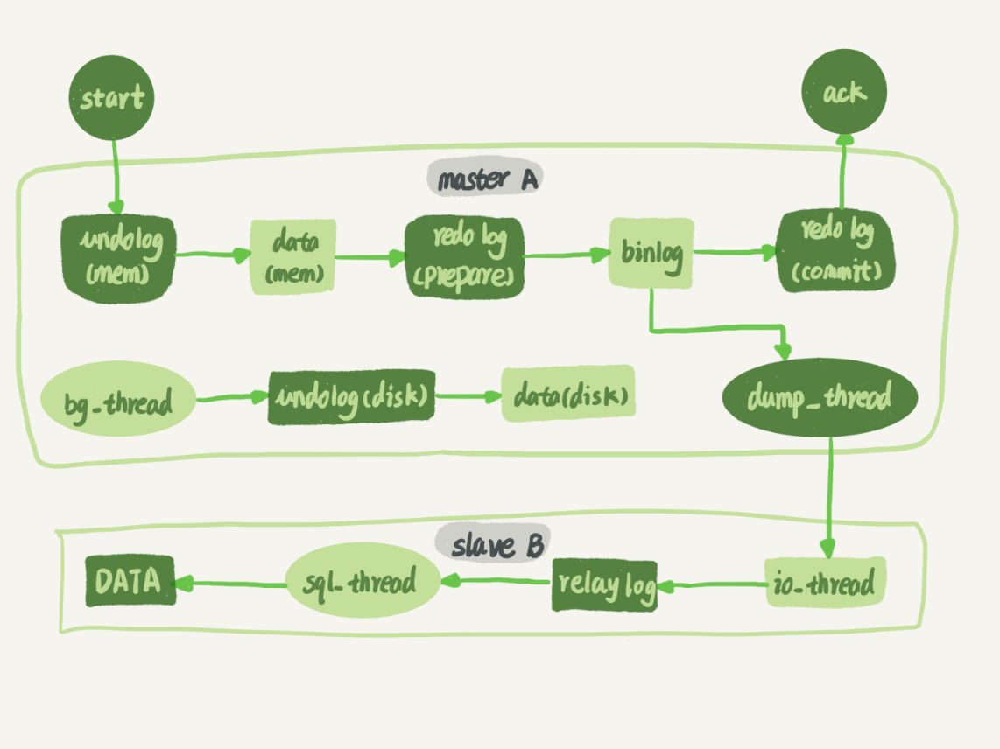

#  MySQL是怎么保证主备一致的？

在状态 1 中，客户端的读写都直接访问节点 A，而节点 B 是 A 的备库，只是将 A 的更新都同步过来，到本地执行。这样可以保持节点 B 和 A 的数据是相同的。当需要切换的时候，就切成状态 2。这时候客户端读写访问的都是节点 B，而节点 A 是 B 的备库。在状态 1 中，虽然节点 B 没有被直接访问，但是我依然建议你把节点 B（也就是备库）设置成只读（readonly）模式。这样做，有以下几个考虑：有时候一些运营类的查询语句会被放到备库上去查，设置为只读可以防止误操作；防止切换逻辑有 bug，比如切换过程中出现双写，造成主备不一致；可以用 readonly 状态，来判断节点的角色。你可能会问，我把备库设置成只读了，还怎么跟主库保持同步更新呢？这个问题，你不用担心。因为 readonly 设置对超级 (super) 权限用户是无效的，而用于同步更新的线程，就拥有超级权限。接下来，我们再看看节点 A 到 B 这条线的内部流程是什么样的。图 2 中画出的就是一个 update 语句在节点 A 执行，然后同步到节点 B 的完整流程图。

图 2 中，包含了我在上一篇文章中讲到的 binlog 和 redo log 的写入机制相关的内容，可以看到：主库接收到客户端的更新请求后，执行内部事务的更新逻辑，同时写 binlog。备库 B 跟主库 A 之间维持了一个长连接。主库 A 内部有一个线程，专门用于服务备库 B 的这个长连接。一个事务日志同步的完整过程是这样的：在备库 B 上通过 change master 命令，设置主库 A 的 IP、端口、用户名、密码，以及要从哪个位置开始请求 binlog，这个位置包含文件名和日志偏移量。在备库 B 上执行 start slave 命令，这时候备库会启动两个线程，就是图中的 io_thread 和 sql_thread。其中 io_thread 负责与主库建立连接。主库 A 校验完用户名、密码后，开始按照备库 B 传过来的位置，从本地读取 binlog，发给 B。备库 B 拿到 binlog 后，写到本地文件，称为中转日志（relay log）。sql_thread 读取中转日志，解析出日志里的命令，并执行。

为什么会有 mixed 格式的 binlog？基于上面的信息，我们来讨论一个问题：为什么会有 mixed 这种 binlog 格式的存在场景？推论过程是这样的：因为有些 statement 格式的 binlog 可能会导致主备不一致，所以要使用 row 格式。但 row 格式的缺点是，很占空间。比如你用一个 delete 语句删掉 10 万行数据，用 statement 的话就是一个 SQL 语句被记录到 binlog 中，占用几十个字节的空间。但如果用 row 格式的 binlog，就要把这 10 万条记录都写到 binlog 中。这样做，不仅会占用更大的空间，同时写 binlog 也要耗费 IO 资源，影响执行速度。所以，MySQL 就取了个折中方案，也就是有了 mixed 格式的 binlog。mixed 格式的意思是，MySQL 自己会判断这条 SQL 语句是否可能引起主备不一致，如果有可能，就用 row 格式，否则就用 statement 格式。

接下来，我们就分别从 delete、insert 和 update 这三种 SQL 语句的角度，来看看数据恢复的问题。通过图 6 你可以看出来，即使我执行的是 delete 语句，row 格式的 binlog 也会把被删掉的行的整行信息保存起来。所以，如果你在执行完一条 delete 语句以后，发现删错数据了，可以直接把 binlog 中记录的 delete 语句转成 insert，把被错删的数据插入回去就可以恢复了。如果你是执行错了 insert 语句呢？那就更直接了。row 格式下，insert 语句的 binlog 里会记录所有的字段信息，这些信息可以用来精确定位刚刚被插入的那一行。这时，你直接把 insert 语句转成 delete 语句，删除掉这被误插入的一行数据就可以了。如果执行的是 update 语句的话，binlog 里面会记录修改前整行的数据和修改后的整行数据。所以，如果你误执行了 update 语句的话，只需要把这个 event 前后的两行信息对调一下，再去数据库里面执行，就能恢复这个更新操作了。

## 备库延迟

主备延迟的来源首先，有些部署条件下，备库所在机器的性能要比主库所在的机器性能差。一般情况下，有人这么部署时的想法是，反正备库没有请求，所以可以用差一点儿的机器。或者，他们会把 20 个主库放在 4 台机器上，而把备库集中在一台机器上。其实我们都知道，更新请求对 IOPS 的压力，在主库和备库上是无差别的。所以，做这种部署时，一般都会将备库设置为“非双 1”的模式。但实际上，更新过程中也会触发大量的读操作。所以，当备库主机上的多个备库都在争抢资源的时候，就可能会导致主备延迟了。当然，这种部署现在比较少了。因为主备可能发生切换，备库随时可能变成主库，所以主备库选用相同规格的机器，并且做对称部署，是现在比较常见的情况。

追问 1：但是，做了对称部署以后，还可能会有延迟。这是为什么呢？这就是第二种常见的可能了，即备库的压力大。一般的想法是，主库既然提供了写能力，那么备库可以提供一些读能力。或者一些运营后台需要的分析语句，不能影响正常业务，所以只能在备库上跑。我真就见过不少这样的情况。由于主库直接影响业务，大家使用起来会比较克制，反而忽视了备库的压力控制。结果就是，备库上的查询耗费了大量的 CPU 资源，影响了同步速度，造成主备延迟。这种情况，我们一般可以这么处理：一主多从。除了备库外，可以多接几个从库，让这些从库来分担读的压力。通过 binlog 输出到外部系统，比如 Hadoop 这类系统，让外部系统提供统计类查询的能力。其中，一主多从的方式大都会被采用。因为作为数据库系统，还必须保证有定期全量备份的能力。而从库，就很适合用来做备份。备注：这里需要说明一下，从库和备库在概念上其实差不多。在我们这个专栏里，为了方便描述，我把会在 HA 过程中被选成新主库的，称为备库，其他的称为从库。

追问 2：采用了一主多从，保证备库的压力不会超过主库，还有什么情况可能导致主备延迟吗？这就是第三种可能了，即大事务。大事务这种情况很好理解。因为主库上必须等事务执行完成才会写入 binlog，再传给备库。所以，如果一个主库上的语句执行 10 分钟，那这个事务很可能就会导致从库延迟 10 分钟。不知道你所在公司的 DBA 有没有跟你这么说过：不要一次性地用 delete 语句删除太多数据。其实，这就是一个典型的大事务场景。比如，一些归档类的数据，平时没有注意删除历史数据，等到空间快满了，业务开发人员要一次性地删掉大量历史数据。同时，又因为要避免在高峰期操作会影响业务（至少有这个意识还是很不错的），所以会在晚上执行这些大量数据的删除操作。结果，负责的 DBA 同学半夜就会收到延迟报警。然后，DBA 团队就要求你后续再删除数据的时候，要控制每个事务删除的数据量，分成多次删除。另一种典型的大事务场景，就是大表 DDL。

追问 3：如果主库上也不做大事务了，还有什么原因会导致主备延迟吗？造成主备延迟还有一个大方向的原因，就是备库的并行复制能力。这个话题，我会留在下一篇文章再和你详细介绍。其实还是有不少其他情况会导致主备延迟，如果你还碰到过其他场景，欢迎你在评论区给我留言，我来和你一起分析、讨论。由于主备延迟的存在，所以在主备切换的时候，就相应的有不同的策略。

# 主库出问题了，从库怎么办？

大多数的互联网应用场景都是读多写少，因此你负责的业务，在发展过程中很可能先会遇到读性能的问题。而在数据库层解决读性能问题，就要涉及到接下来两篇文章要讨论的架构：一主多从。

相比于一主一备的切换流程，一主多从结构在切换完成后，A’会成为新的主库，从库 B、C、D 也要改接到 A’。正是由于多了从库 B、C、D 重新指向的这个过程，所以主备切换的复杂性也相应增加了。

基于位点的主备切换这里，我们需要先来回顾一个知识点。当我们把节点 B 设置成节点 A’的从库的时候，需要执行一条 change master 命令：CHANGE MASTER TO MASTER_HOST=$host_name MASTER_PORT=$port MASTER_USER=$user_name MASTER_PASSWORD=$password MASTER_LOG_FILE=$master_log_name MASTER_LOG_POS=$master_log_pos 这条命令有这么 6 个参数：MASTER_HOST、MASTER_PORT、MASTER_USER 和 MASTER_PASSWORD 四个参数，分别代表了主库 A’的 IP、端口、用户名和密码。最后两个参数 MASTER_LOG_FILE 和 MASTER_LOG_POS 表示，要从主库的 master_log_name 文件的 master_log_pos 这个位置的日志继续同步。而这个位置就是我们所说的同步位点，也就是主库对应的文件名和日志偏移量。

那么，这里就有一个问题了，节点 B 要设置成 A’的从库，就要执行 change master 命令，就不可避免地要设置位点的这两个参数，但是这两个参数到底应该怎么设置呢？原来节点 B 是 A 的从库，本地记录的也是 A 的位点。但是相同的日志，A 的位点和 A’的位点是不同的。因此，从库 B 要切换的时候，就需要先经过“找同步位点”这个逻辑。这个位点很难精确取到，只能取一个大概位置。为什么这么说呢？我来和你分析一下看看这个位点一般是怎么获取到的，你就清楚其中不精确的原因了。考虑到切换过程中不能丢数据，所以我们找位点的时候，总是要找一个“稍微往前”的，然后再通过判断跳过那些在从库 B 上已经执行过的事务。一种取同步位点的方法是这样的：等待新主库 A’把中转日志（relay log）全部同步完成；在 A’上执行 show master status 命令，得到当前 A’上最新的 File 和 Position；取原主库 A 故障的时刻 T；用 mysqlbinlog 工具解析 A’的 File，得到 T 时刻的位点。mysqlbinlog File --stop-datetime=T --start-datetime=T

图中，end_log_pos 后面的值“123”，表示的就是 A’这个实例，在 T 时刻写入新的 binlog 的位置。然后，我们就可以把 123 这个值作为 $master_log_pos ，用在节点 B 的 change master 命令里。当然这个值并不精确。为什么呢？你可以设想有这么一种情况，假设在 T 这个时刻，主库 A 已经执行完成了一个 insert 语句插入了一行数据 R，并且已经将 binlog 传给了 A’和 B，然后在传完的瞬间主库 A 的主机就掉电了。那么，这时候系统的状态是这样的：在从库 B 上，由于同步了 binlog， R 这一行已经存在；在新主库 A’上， R 这一行也已经存在，日志是写在 123 这个位置之后的；我们在从库 B 上执行 change master 命令，指向 A’的 File 文件的 123 位置，就会把插入 R 这一行数据的 binlog 又同步到从库 B 去执行。这时候，从库 B 的同步线程就会报告 Duplicate entry ‘id_of_R’ for key ‘PRIMARY’ 错误，提示出现了主键冲突，然后停止同步。

所以，通常情况下，我们在切换任务的时候，要先主动跳过这些错误，有两种常用的方法。一种做法是，主动跳过一个事务。跳过命令的写法是：set global sql_slave_skip_counter=1;start slave;因为切换过程中，可能会不止重复执行一个事务，所以我们需要在从库 B 刚开始接到新主库 A’时，持续观察，每次碰到这些错误就停下来，执行一次跳过命令，直到不再出现停下来的情况，以此来跳过可能涉及的所有事务。另外一种方式是，通过设置 slave_skip_errors 参数，直接设置跳过指定的错误。在执行主备切换时，有这么两类错误，是经常会遇到的：1062 错误是插入数据时唯一键冲突；1032 错误是删除数据时找不到行。因此，我们可以把 slave_skip_errors 设置为 “1032,1062”，这样中间碰到这两个错误时就直接跳过。这里需要注意的是，这种直接跳过指定错误的方法，针对的是主备切换时，由于找不到精确的同步位点，所以只能采用这种方法来创建从库和新主库的主备关系。这个背景是，我们很清楚在主备切换过程中，直接跳过 1032 和 1062 这两类错误是无损的，所以才可以这么设置 slave_skip_errors 参数。等到主备间的同步关系建立完成，并稳定执行一段时间之后，我们还需要把这个参数设置为空，以免之后真的出现了主从数据不一致，也跳过了。

GTID通过 sql_slave_skip_counter 跳过事务和通过 slave_skip_errors 忽略错误的方法，虽然都最终可以建立从库 B 和新主库 A’的主备关系，但这两种操作都很复杂，而且容易出错。所以，MySQL 5.6 版本引入了 GTID，彻底解决了这个困难。那么，GTID 到底是什么意思，又是如何解决找同步位点这个问题呢？现在，我就和你简单介绍一下。GTID 的全称是 Global Transaction Identifier，也就是全局事务 ID，是一个事务在提交的时候生成的，是这个事务的唯一标识。它由两部分组成，格式是：GTID=server_uuid:gno其中：server_uuid 是一个实例第一次启动时自动生成的，是一个全局唯一的值；gno 是一个整数，初始值是 1，每次提交事务的时候分配给这个事务，并加 1。这里我需要和你说明一下，在 MySQL 的官方文档里，GTID 格式是这么定义的：GTID=source_id:transaction_id这里的 source_id 就是 server_uuid；而后面的这个 transaction_id，我觉得容易造成误导，所以我改成了 gno。为什么说使用 transaction_id 容易造成误解呢？

因为，在 MySQL 里面我们说 transaction_id 就是指事务 id，事务 id 是在事务执行过程中分配的，如果这个事务回滚了，事务 id 也会递增，而 gno 是在事务提交的时候才会分配。从效果上看，GTID 往往是连续的，因此我们用 gno 来表示更容易理解。GTID 模式的启动也很简单，我们只需要在启动一个 MySQL 实例的时候，加上参数 gtid_mode=on 和 enforce_gtid_consistency=on 就可以了。在 GTID 模式下，每个事务都会跟一个 GTID 一一对应。这个 GTID 有两种生成方式，而使用哪种方式取决于 session 变量 gtid_next 的值。如果 gtid_next=automatic，代表使用默认值。这时，MySQL 就会把 server_uuid:gno 分配给这个事务。a. 记录 binlog 的时候，先记录一行 SET @@SESSION.GTID_NEXT=‘server_uuid:gno’;b. 把这个 GTID 加入本实例的 GTID 集合。如果 gtid_next 是一个指定的 GTID 的值，比如通过 set gtid_next='current_gtid’指定为 current_gtid，那么就有两种可能：a. 如果 current_gtid 已经存在于实例的 GTID 集合中，接下来执行的这个事务会直接被系统忽略；b. 如果 current_gtid 没有存在于实例的 GTID 集合中，就将这个 current_gtid 分配给接下来要执行的事务，也就是说系统不需要给这个事务生成新的 GTID，因此 gno 也不用加 1。

注意，一个 current_gtid 只能给一个事务使用。这个事务提交后，如果要执行下一个事务，就要执行 set 命令，把 gtid_next 设置成另外一个 gtid 或者 automatic。这样，每个 MySQL 实例都维护了一个 GTID 集合，用来对应“这个实例执行过的所有事务”。这样看上去不太容易理解，接下来我就用一个简单的例子，来和你说明 GTID 的基本用法。我们在实例 X 中创建一个表 t。CREATE TABLE `t` ( `id` int(11) NOT NULL, `c` int(11) DEFAULT NULL, PRIMARY KEY (`id`)) ENGINE=InnoDB;insert into t values(1,1);

可以看到，事务的 BEGIN 之前有一条 SET @@SESSION.GTID_NEXT 命令。这时，如果实例 X 有从库，那么将 CREATE TABLE 和 insert 语句的 binlog 同步过去执行的话，执行事务之前就会先执行这两个 SET 命令， 这样被加入从库的 GTID 集合的，就是图中的这两个 GTID。假设，现在这个实例 X 是另外一个实例 Y 的从库，并且此时在实例 Y 上执行了下面这条插入语句：insert into t values(1,1);并且，这条语句在实例 Y 上的 GTID 是 “aaaaaaaa-cccc-dddd-eeee-ffffffffffff:10”。那么，实例 X 作为 Y 的从库，就要同步这个事务过来执行，显然会出现主键冲突，导致实例 X 的同步线程停止。这时，我们应该怎么处理呢？处理方法就是，你可以执行下面的这个语句序列：set gtid_next='aaaaaaaa-cccc-dddd-eeee-ffffffffffff:10';begin;commit;set gtid_next=automatic;start slave;

其中，前三条语句的作用，是通过提交一个空事务，把这个 GTID 加到实例 X 的 GTID 集合中。如图 5 所示，就是执行完这个空事务之后的 show master status 的结果。

可以看到实例 X 的 Executed_Gtid_set 里面，已经加入了这个 GTID。这样，我再执行 start slave 命令让同步线程执行起来的时候，虽然实例 X 上还是会继续执行实例 Y 传过来的事务，但是由于“aaaaaaaa-cccc-dddd-eeee-ffffffffffff:10”已经存在于实例 X 的 GTID 集合中了，所以实例 X 就会直接跳过这个事务，也就不会再出现主键冲突的错误。在上面的这个语句序列中，start slave 命令之前还有一句 set gtid_next=automatic。这句话的作用是“恢复 GTID 的默认分配行为”，也就是说如果之后有新的事务再执行，就还是按照原来的分配方式，继续分配 gno=3。基于 GTID 的主备切换现在，我们已经理解 GTID 的概念，再一起来看看基于 GTID 的主备复制的用法。在 GTID 模式下，备库 B 要设置为新主库 A’的从库的语法如下：CHANGE MASTER TO MASTER_HOST=$host_name MASTER_PORT=$port MASTER_USER=$user_name MASTER_PASSWORD=$password master_auto_position=1

其中，master_auto_position=1 就表示这个主备关系使用的是 GTID 协议。可以看到，前面让我们头疼不已的 MASTER_LOG_FILE 和 MASTER_LOG_POS 参数，已经不需要指定了。我们把现在这个时刻，实例 A’的 GTID 集合记为 set_a，实例 B 的 GTID 集合记为 set_b。接下来，我们就看看现在的主备切换逻辑。我们在实例 B 上执行 start slave 命令，取 binlog 的逻辑是这样的：实例 B 指定主库 A’，基于主备协议建立连接。实例 B 把 set_b 发给主库 A’。实例 A’算出 set_a 与 set_b 的差集，也就是所有存在于 set_a，但是不存在于 set_b 的 GTID 的集合，判断 A’本地是否包含了这个差集需要的所有 binlog 事务。a. 如果不包含，表示 A’已经把实例 B 需要的 binlog 给删掉了，直接返回错误；b. 如果确认全部包含，A’从自己的 binlog 文件里面，找出第一个不在 set_b 的事务，发给 B；之后就从这个事务开始，往后读文件，按顺序取 binlog 发给 B 去执行。

其实，这个逻辑里面包含了一个设计思想：在基于 GTID 的主备关系里，系统认为只要建立主备关系，就必须保证主库发给备库的日志是完整的。因此，如果实例 B 需要的日志已经不存在，A’就拒绝把日志发给 B。这跟基于位点的主备协议不同。基于位点的协议，是由备库决定的，备库指定哪个位点，主库就发哪个位点，不做日志的完整性判断。基于上面的介绍，我们再来看看引入 GTID 后，一主多从的切换场景下，主备切换是如何实现的。由于不需要找位点了，所以从库 B、C、D 只需要分别执行 change master 命令指向实例 A’即可。其实，严谨地说，主备切换不是不需要找位点了，而是找位点这个工作，在实例 A’内部就已经自动完成了。但由于这个工作是自动的，所以对 HA 系统的开发人员来说，非常友好。之后这个系统就由新主库 A’写入，主库 A’的自己生成的 binlog 中的 GTID 集合格式是：server_uuid_of_A’:1-M。如果之前从库 B 的 GTID 集合格式是 server_uuid_of_A:1-N， 那么切换之后 GTID 集合的格式就变成了 server_uuid_of_A:1-N, server_uuid_of_A’:1-M。当然，主库 A’之前也是 A 的备库，因此主库 A’和从库 B 的 GTID 集合是一样的。这就达到了我们预期。

GTID 和在线 DDL接下来，我再举个例子帮你理解 GTID。之前在第 22 篇文章《MySQL 有哪些“饮鸩止渴”提高性能的方法？》中，我和你提到业务高峰期的慢查询性能问题时，分析到如果是由于索引缺失引起的性能问题，我们可以通过在线加索引来解决。但是，考虑到要避免新增索引对主库性能造成的影响，我们可以先在备库加索引，然后再切换。当时我说，在双 M 结构下，备库执行的 DDL 语句也会传给主库，为了避免传回后对主库造成影响，要通过 set sql_log_bin=off 关掉 binlog。评论区有位同学提出了一个问题：这样操作的话，数据库里面是加了索引，但是 binlog 并没有记录下这一个更新，是不是会导致数据和日志不一致？这个问题提得非常好。当时，我在留言的回复中就引用了 GTID 来说明。今天，我再和你展开说明一下。假设，这两个互为主备关系的库还是实例 X 和实例 Y，且当前主库是 X，并且都打开了 GTID 模式。这时的主备切换流程可以变成下面这样：在实例 X 上执行 stop slave。在实例 Y 上执行 DDL 语句。注意，这里并不需要关闭 binlog。执行完成后，查出这个 DDL 语句对应的 GTID，并记为 server_uuid_of_Y:gno。到实例 X 上执行以下语句序列：set GTID_NEXT="server_uuid_of_Y:gno";begin;commit;set gtid_next=automatic;start slave;这样做的目的在于，既可以让实例 Y 的更新有 binlog 记录，同时也可以确保不会在实例 X 上执行这条更新。接下来，执行完主备切换，然后照着上述流程再执行一遍即可。