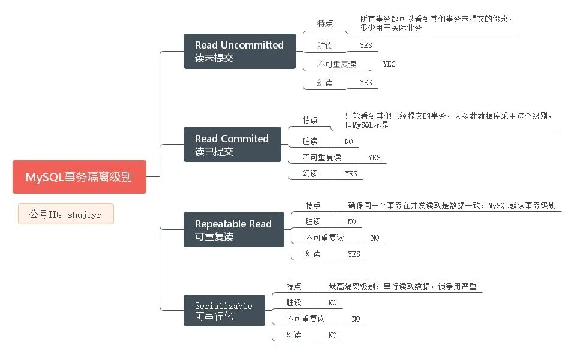

# 入门概念

## 数据库管理系统种类

### 关系型数据库(RDBMS)

简单来说，关系模式就是二维表格模型

主要代表：SQL server、mysql、oracle

如下表，可以根据love=画画找到喜欢画画的人

| name | age  | love |
| :--: | :--: | :--: |
|  A   |  11  | 画画 |

 优点：二维表格容易理解；通用的sql语句使用方便；易于维护，数据库的[ACID属性](http://www.52wiki.cn/docs/pu/472)，大大降低了数据冗余和数据不一致的概率

缺点：高并发对硬盘IO是个挑战；难以横向扩展

### 非关系型数据库

指那些非关系型的、分布式的，且一般不保证ACID的数据存储系统，主要代表MongoDB，Redis、CouchDB。已key-value来存储值。

优点：数据放在内存，读取快；扩展方便，数据间没有关系

缺点：不支持sql，不支持事务

## 场景

适用大部分业务实体的增删查改操作，还有事务和索引的支持，mysql作为单体服务，原生并不支持分布式，它的分库分表需要借助各种外部组件来实现

## 基本架构

mysql可以分为server层和存储引擎层

**server层**包括连接器、查询缓冲、分析器、优化器、执行器

**存储引擎层**负责数据的存储和提取。其架构模式是插件式的，支持 InnoDB、MyISAM、Memory 等多个存储引擎。现在最常用的存储引擎是 InnoDB，它从 MySQL 5.5.5 版本开始成为了默认存储引擎。


### 一条sql查询语句如何执行

**连接器**

第一步，你会先连接到这个数据库上。连接器负责跟客户端**建立连接、获取权限、维持和管理连接**

```shell
mysql -h$ip -P$port -u$user -p
```


连接完成后，如果你没有后续的动作，这个连接就处于空闲状态，你可以在 show processlist 命令中看到它，command列会显示sleep。

**客户端如果太长时间没动静，连接器就会自动将它断开**。这个时间是由参数 wait_timeout 控制的，默认值是 8 小时。

数据库里面，**长连接**是指连接成功后，如果客户端持续有请求，则一直使用同一个连接。**短连接**则是指每次执行完很少的几次查询就断开连接，下次查询再重新建立一个。


**查询缓冲**

`MySQL`中**数据是以页为单位**，你查询一条记录，会从硬盘把一页的数据加载出来，加载出来的数据叫**数据页，会放入到`Buffer Pool`中。**

**后续的查询都是先从`Buffer Pool`中找，没有命中再去硬盘加载，减少硬盘`IO`开销，提升性能。**

如果语句不在查询缓冲池中，就会继续后面的执行阶段。执行完成后，执行结果会被存入查询缓冲池中。

如果查询命中缓冲，MySQL 不需要执行后面的复杂操作，就可以直接返回结果，这个效率会很高


但是查询缓冲的失效非常频繁，**只要有对一个表的更新，这个表上所有的查询缓冲都会被清空**。

好在 MySQL 也提供了这种“按需使用”的方式。你可以将参数 query_cache_type 设置成 DEMAND，这样对于默认的 SQL 语句都不使用查询缓冲。而对于你确定要使用查询缓冲的语句，可以用 SQL_CACHE 显式指定，像下面这个语句一样：

```shell
mysql> select SQL_CACHE * from T where ID=10；
```

需要注意的是，**MySQL 8.0 版本直接将查询缓冲的整块功能删掉了**，也就是说 8.0 开始彻底没有这个功能了。


**分析器**

没有命中缓存，就开始执行语句，执行语句之前MySQL 需要知道**你要做什么**

分析器先会做**“词法分析”**。你输入的是由多个字符串和空格组成的一条 SQL 语句，MySQL 需要识别出里面的字符串分别是什么，代表什么。

做完了这些识别以后，就要做**“语法分析”**。语法分析器会根据语法规则，判断你输入的这个 SQL 语句是否满足 MySQL 语法。如果你的语句不对，就会收到“You have an error in your SQL syntax”的错误提醒


**优化器**

经过分析器mysql知道你要做什么后，**要决定怎么做**；优化器是在表里有多个索引的时候决定使用哪个索引，或者一个语句有多表关联（join）的时候决定各个表的连接顺序

优化器阶段完成后，这个语句的**执行方案就确定下来**了，然后进入执行器阶段


**执行器**

进入了执行器阶段，开始执行语句。

以这个语句为例：

```mysql
mysql> select * from T where ID=10;
```

执行器的执行流程是这样的：

调用 InnoDB 引擎接口取这个表的第一行，判断 ID 值是不是 10，如果不是则跳过，如果是则将这行存在结果集中；

调用引擎接口取“下一行”，重复相同的判断逻辑，直到取到这个表的最后一行。

执行器将上述遍历过程中所有满足条件的行组成的记录集作为结果集返回给客户端。


### 一条sql更新语句如何执行

执行器和 InnoDB 引擎在执行`update T set c=c+1 where ID=2;`这个简单的 update 语句时的内部流程：

执行器先找引擎取 ID=2 这一行。ID 是主键，引擎直接用树搜索找到这一行。如果 ID=2 这一行所在的**数据页本来就在内存中，就直接返回给执行器；否则，需要先从磁盘读入内存，然后再返回。**

执行器拿到引擎给的行数据，把这个值加上 1，比如原来是 N，现在就是 N+1，得到新的一行数据，再**调用引擎接口写入**这行新数据。

引擎将这行新数据更新到内存中，同时**将这个更新操作记录到 redo log** 里面，此时 redo log 处于 prepare 状态。然后告知执行器执行完成了，随时可以提交事务。

执行器**生成这个操作的 binlog**，并把 binlog 写入磁盘。

执行器**调用引擎的提交事务接口**，引擎把刚刚写入的 redo log 改成提交（commit）状态，更新完成。

## 事务

事务就是「一组原子性的SQL查询」，或者说一个独立的工作单元。也就是说，事务内的语句，要么全部执行成功，要么全部执行失败。


举个例子：

比较典型的就是银行业务（毕竟是涉及到钱的业务），你有两银行卡，一张是招商银行CMBC的工资卡，另一张是工商银行ICBC的储蓄卡，每月10号发工资都要把招行卡的10万转到建设银行卡账户。

把转账的操作简化抽成一个事务，包含如下步骤：

1. 查询CMBC账户的余额是否大于10万
2. 从CMBC账户余额中减去10万
3. 在ICBC账户余额中增加10万

用SQL体现：

```sql
START TRANSACTION;
SELECT balance FROM CMBC WHERE username='you';
UPDATE CMBC SET balance = balance - 100000.00 WHERE username = 'you';
UPDATE ICBC SET balance = balance + 100000.00 WHERE username = 'you';
COMMIT;
```

### ACID特性

**Atomic（原子性）**

```undefined
整个事务中的所有操作要么全部提交成功，要么全部失败回滚，对于一个事务来说，不可能只执行其中的一部分操作。
```

**Consistent（一致性）**

```undefined
在前面的例子中，一致性确保了，即使在执行第三、四条语句之间时系统崩溃，CMBC账户中也不会损失10万，不然要哭死，因为事务最终没有提交，所以事务中所做的修改也不会保存到数据库中。
```

**Isolated（隔离性）**

```undefined
事务之间不相互影响。在前面的例子中，当执行完第三条语句、第四条语句还未开始时，此时如果有其他人准备给你的CMBC账户存钱，那他看到的CMBC账户里还是有10万的。
```

**Durable（持久性）**

```undefined
一旦事务提交，则其所做的修改就会永久保存到数据库中。此时即使系统崩溃，修改的数据也不会丢失。持久性是个有点模糊的概念，因为实际上持久性也分很多不同的级别。有些持久性策略能够提供非常强的安全保障，而有些则未必。而且「不可能有能做到100%的持久性保证的策略」否则还需要备份做什么。
```

### 什么是脏读、不可重复读、幻读

脏读

在事务A修改数据之后提交数据之前，这时另一个事务B来读取数据，如果不加控制，事务B读取到A修改过数据，之后A又对数据做了修改再提交，则B读到的数据是脏数据，此过程称为脏读Dirty Read。

| Time | 事务A                  | 事务B                          |
| ---- | ---------------------- | ------------------------------ |
| T1   | start transaction      | start transaction              |
| T2   | 查询CMBC账户余额10万   |                                |
| T3   | 工资入账10万，余额20万 |                                |
| T4   |                        | 查询到CMBC账户余额20万（脏读） |
| T5   | 取出10万，余额10万     |                                |
| T6   |                        | 买10万理财，余额修改为30万     |
| T7   |                        | commit                         |
| T8   | commit                 |                                |


不可重复读

一个事务内在读取某些数据后的某个时间，再次读取以前读过的数据，却发现其读出的数据已经发生了变更、或者某些记录已经被删除了。

| Time | 事务A                          | 事务B                      |
| ---- | ------------------------------ | -------------------------- |
| T1   | start transaction              | start transaction          |
| T2   |                                |                            |
| T3   |                                | 查询CMBC账户余额10万       |
| T4   |                                | 买10万理财，余额修改为20万 |
| T5   |                                | commit                     |
| T6   | 查询CMBC余额20万（不可重复读） |                            |
| T7   |                                |                            |
| T8   | commit                         |                            |


幻读

事务A在按查询条件读取某个范围的记录时，事务B又在该范围内插入了新的满足条件的记录，当事务A再次按条件查询记录时，会产生新的满足条件的记录（幻行 Phantom Row）

| Time | 事务A                          | 事务B                   |
| ---- | ------------------------------ | ----------------------- |
| T1   | start transaction              | start transaction       |
| T2   | 查询CMBC账户，返回两条交易记录 |                         |
| T3   |                                | 买10万理财，交易记录加1 |
| T4   |                                |                         |
| T5   |                                | commit                  |
| T6   | 查询CMBC交易记录3条（幻读）    |                         |
| T7   |                                |                         |
| T8   | commit                         |                         |


SQL实现了四个标准的隔离级别，各个隔离级别可以不同程度的解决脏读、不可重复读、幻读。隔离级别各有所长，没有完美的解决方案，要结合具体的业务场景谈具体实施。



## 数据切分方法

### 概念

通过某种特定的条件，将我们存放在同一个数据库中的数据分散存放到多个数据库（主机）上面，以达到分散单台设备负载的效果。

数据的切分（Sharding）根据其切分规则的类型，可以分为两种切分模式：垂直（纵向）切分和水平（横向）切分

### 垂直切分

按照不同的表切分到不同的数据库。

优点：

- 拆分后业务清晰，拆分规则明确。
- 系统之间整合或扩展容易。
- 数据维护简单。

缺点：

- 部分业务表无法 join，只能通过接口方式解决，提高了系统复杂度。
- 受每种业务不同的限制存在单库性能瓶颈，不易数据扩展跟性能提高。
- 事务处理复杂。
- 由于垂直切分是按照业务的分类将表分散到不同的库，所以有些业务表会过于庞大，存在单库读写与存储瓶
- 颈，所以就需要水平拆分来做解决。

### 水平切分

根据表中的数据的逻辑关系，将同一表中的数据按照某种条件拆分到多台数据库中。

相对于垂直拆分，水平拆分不是将表做分类，而是按照某个字段的某种规则来分散到多个库之中，每个表中包含一部分数据。简单来说，我们可以将数据的水平切分理解为是按照数据行的切分，**就是将表中的某些行切分到一个数据库，而另外的某些行又切分到其他的数据库中**，如图：

拆分数据就需要定义分片规则。关系型数据库是行列的二维模型，拆分的第一原则是找到拆分维度。比如：

从会员的角度来分析，商户订单交易类系统中查询会员某天某月某个订单，那么就需要按照会员结合日期来拆分，不同的数据按照会员 ID 做分组，这样所有的数据查询 join 都会在单库内解决；如果从商户的角度来讲，要查询某个商家某天所有的订单数，就需要按照商户 ID 做拆分；但是如果系统既想按会员拆分，又想按商家数据，则会有一定的困难。如何找到合适的分片规则需要综合考虑衡量。

**几种典型的分片规则包括**：

- 按照用户 ID 求模，将数据分散到不同的数据库，具有相同数据用户的数据都被分散到一个库中；
- 按照日期，将不同月甚至日的数据分散到不同的库中；
- 按照某个特定的字段求摸，或者根据特定范围段分散到不同的库中

优点：

- 拆分规则抽象好，join 操作基本可以数据库做。
- 不存在单库大数据，高并发的性能瓶颈。
- 应用端改造较少。
- 提高了系统的稳定性跟负载能力。

缺点：

- 拆分规则难以抽象。
- 分片事务一致性难以解决。
- 数据多次扩展难度跟维护量极大。
- 跨库 join 性能较差。

## 密码

### 设置规则

这个其实与validate_password_policy的值有关，默认为1，所以刚开始设置的密码必须符合长度，且必须含有数字，小写或大写字母，特殊字符。
如果我们不希望密码设置的那么复杂，需要修改两个全局参数：`validate_password_length`默认值为8,最小值为4

`set global validate_password_policy=0;` 只验证长度
`set global validate_password_length=4；` 修改密码默认长度

### 用SET PASSWORD命令

配置root密码
`SET PASSWORD FOR 'root'@'localhost' = PASSWORD('newpass');`

用户修改自己密码
`SET PASSWORD=PASSWORD('newpass');`

### 用mysqladmin

```shell
mysqladmin -u root password "newpass"
```

如果root已经设置过密码，采用如下方法
`mysqladmin -u root password oldpass "newpass"`

### 更改当前用户密码

```msyql
ALTER USER USER() IDENTIFIED BY '123456';
```

### 用UPDATE直接编辑user表

```mysql
use mysql;`
`UPDATE user SET Password = PASSWORD('newpass') WHERE user = 'root';`
`FLUSH PRIVILEGES;
```

### root密码丢失

关闭验证密码
`mysqld_safe --skip-grant-tables&`

登陆
`mysql -u root mysql`

重置
`UPDATE user SET password=PASSWORD("new password") WHERE user='root';`

5.7版本
`UPDATE user SET authentication_string=PASSWORD("new password") WHERE user='root';`

刷新
`FLUSH PRIVILEGES;

## 常用监控指标

TPS

```text
平均每秒sql语句执行次数
(com_commit+com_rollback)/uptime
```

QPS

```text
平均每秒事务数
questions/uptime
```

会话连接

```TEXT
当前全部会话
当前活跃会话
```

流量吞吐（KB）

```text
平均每秒从所有客户端接收到的字节数
平均每秒发送给所有客户端的字节数
```

刷盘次数

```text
innodb平均每秒fsync操作次数
```

打开文件数

innodb data读写吞吐量（KB）

```text
innodb平均每秒写数据量
innodb平均每秒读数据量
```

innodb buffer pool命中率

```text
innodb buffer pool脏页比率：
innodb_buffer_pool_pages_dirty/innodb_buffer_pool_pages_data*100%

innodb buffer pool读缓存命中率：
(innodb_buffer_pool_read_requests-innodb_buffer_pool_reads)/innodb_buffer_pool_read_requests*100%

innodb buffer pool使用率：
innodb_buffer_pool_pages_data/（innodb_buffer_pool_pages_data+innodb_buffer_pool_pages_free）*100%
```

innodb redo写次数

```text
innodb平均每秒物理写redo log file次数
平均每秒向日志文件完成的fsync()写数量
```

innodb row operations

```text
innodb平均每秒删除的行数
innodb平均每秒读取的行数
innodb平均每秒插入的行数
innodb平均每秒物理写redo log file次数
innodb平均每秒更新的行数
```

内存页

```text
innodb buffer pool刷page请求数量
innodb buffer pool中有脏页数量
```

行锁

```text
从系统启动到现在锁定总时间长度
innodb表平均等待row locks时间
innodb表平均等待row locks次数
```

cpu/内存利用率

存储空间使用量（MB）

```text
数据空间
临时空间
系统空间
日志空间
总空间
```

IOPS读写次数

## mysql怎么保持数据不丢的

只要 redo log 和 binlog 保证持久化到磁盘，就能确保 MySQL 异常重启后，数据可以恢复。

## mysql怎么保持主备一致

虽然备库没有被直接访问，但还是建议备库设置为只读模式：

有时候一些运营类的查询语句会被放到备库上去查，设置为只读可以防止误操作；

防止切换逻辑有 bug，比如切换过程中出现双写，造成主备不一致；

可以用 readonly 状态，来判断节点的角色。


正常情况下，只要主库执行更新生成的所有 binlog，都可以传到备库并被正确地执行，备库就能达到跟主库一致的状态，这就是最终一致性。

## mySQL是怎么保证高可用的？

## 存储引擎

MyISAM：不支持事务处理，读性能处理快，表级别锁

InnoDB：**支持事务处理，行级别锁**

表锁：开销小，锁定粒度大，发生死锁概率高，相对并发也低。
行锁：开销大，锁定粒度小，发生死锁概率低，相对并发也高。
为什么会出现表锁和行锁呢？主要是为了保证数据的完整性，举个例子，一个用户在操作一张表，其他用户也想操作这张表，那么就要等第一个用户操作完，其他用户才能操作，表锁和行锁就是这个作用。否则多个用户同时操作一张表，肯定会数据产生冲突或者异常。
