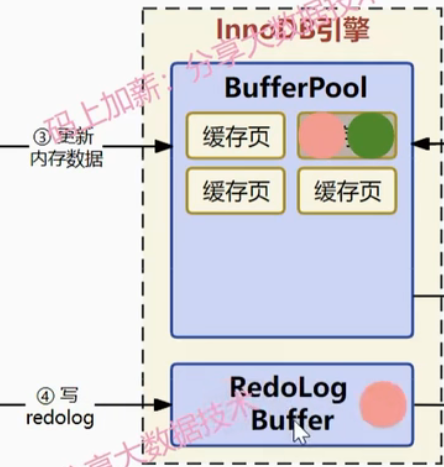

# 两大内存bufferpool、redologbuffer和三大日志binlog、redolog、undolog

在mysql更新数据时，bufferpool、redologbuffer、binlog、redolog、undolog都有哪些作用？

在执行sql语句时，直接更新磁盘中的数据行吗？

## 更新sql执行的过程

执行`update xxx_table set name='小明' where id='1002';commit;`，客户端会把sql语句交给**执行器**去执行

内存的读写速率要比磁盘高得多，所以innodb把一切逻辑处理和读写操作都放到内存中去执行，由于innodb是以页为单位和硬盘进行数据交互的，所以要**把硬盘上整个页的数据都完整加载到BufferPool中**

然后准备修改BufferPool中的数据，为了写入的数据能够支持回滚，需要在修改数据之前，**把旧数据写入到undolog里面**，现在这个缓存页被记为**”脏页“**（一旦缓存页和磁盘的数据页的数据不一致的时候），图中绿圈是旧数据，红圈是新数据

但是存在丢数据风险，如果脏数据写到硬盘之前bufferpool崩溃了，那数据不就丢失了，因此诞生了Redolog

所以在**更新bufferpool数据时，也会将数据写到redolog buffer中**

如果innodb_flush_log_at_trx_commit=2（实时写，延时刷），数据更新到redologbuffer后会写入到PageCache，然后**隔一段**时间调用fysc函数写到redolog中

如果innodb_flush_log_at_trx_commit=1（默认，实时写，实时刷），数据更新到redologbuffer后会**马上**写入到redolog中**（保证数据不丢失）**

最后把脏数据写到硬盘中

## 总结

undolog主要是为了sql执行异常的时候能够做数据回滚，不需要我们操作数据库会完成

redolog主要是为了数据库故障在重启的时候能够基于redolog去补全数据

binlog就是记录了sql语句的逻辑操作，通常可以用my2sql或者binlog2sql或者MyFlash工具完成数据的修复

