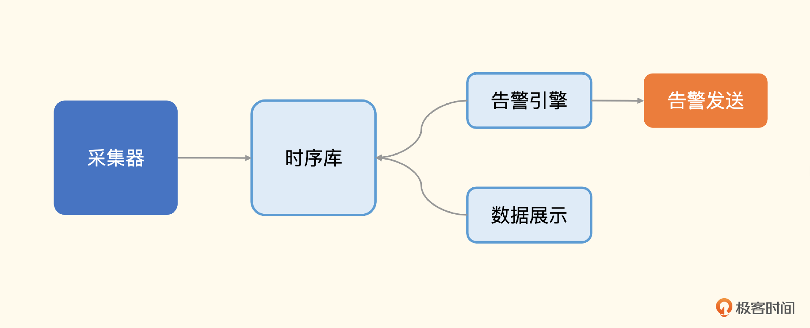
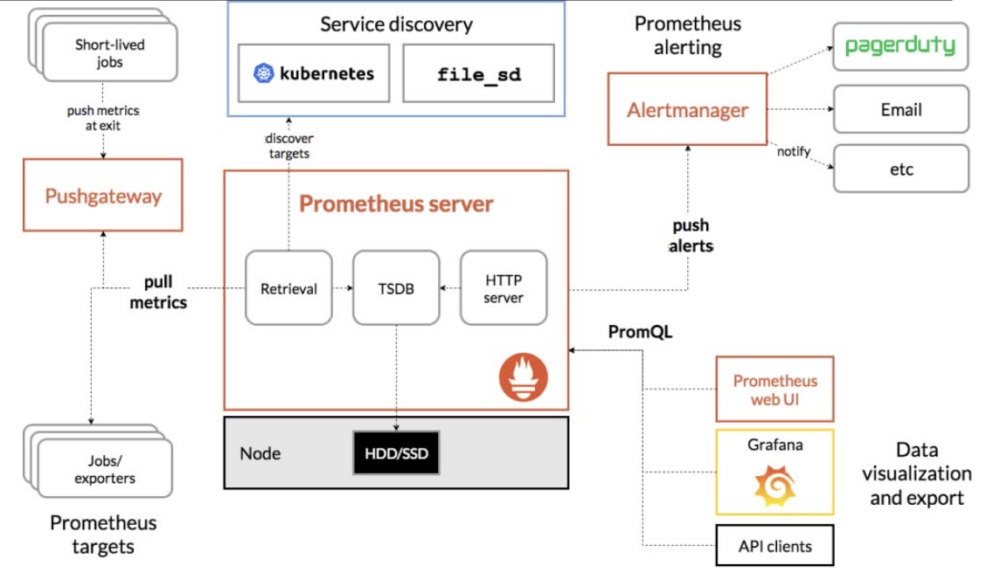

## prometheus介绍

CNCF继k8s的第二个项目，支持多种exporter采集数据，还支持pushgateway进行上报，prometheus性能足够支持上万台规模的集群。

监控系统没有绝对的好坏，最重要是适合自己的公司团队，能够利用最小的成本解决问题，实在不知道怎么选可以参考如下：

物理机、硬件设备用zabbix；**docker、k8s推荐用Prometheus**

云服务器厂商自带监控系统，有的监控不全，也可以搭配zabbix和prometheus

## 监控系统的典型架构

采集器：用于收集监控数据

时序库：用于存储时序数据，如果规模比较小，1000 台机器以下，通常一个单机版本的Prometheus就够了

告警引擎：用于做告警规则判断，生成告警事件。

数据展示：用于渲染展示监控数据。

## prometheus特点

1. 多维度数据模型

   prometheus采集的数据都是**时间序列数据**，时间序列数据由**metric度量指标**和**labels键值对**组成。

   metrics指定监控目标系统的测量特征（如：http_requests_total-接收http请求的总数），相同的metrics通过打上不同的labels标签形成多维度数据模型（如：所有包含度量名称为/api/tracks的http请求，打上method=POST的标签，形成具体的http请求）

2. 灵活的查询语言promql

   可以对采集的metrics指标进行加法，乘法，连接等操作；

3. 通过http pull的方式采集时序数据

4. 可以通过pushgateway把时间序列数据推送到prometheus server

5. 可以通过服务发现或静态配置来发现目标服务对象（targets）

6. 每个采样数据占3.5bytes左右，300万的时间序列，30s间隔，保留60天，消耗磁盘约200G（官方数据）

## promtheus组件

1. prometheus server定期从活跃目标主机（targets）**拉取**监控指标数据，可通过配置静态job或动态服务发现的方式被Prometheus server采集目标主机数据；或者从pushgateway拉取监控指标数据
2. prometheus把采集的数据**保存**在本地或云存储
3. 通过配置告警规则，把触发的**告警发送**到alertmanager
4. 通过配置告警接收方，alertmanager把告警发送到邮件、微信或钉钉等
5. Prometheus自带的web ui界面提供PromQL查询语言，可查询监控数据
6. Grafana可接入prometheus数据源，把监控数据以图形化形式展示出

### job和instances

**每一个暴露监控样本数据的http服务都称为一个instance**，例如当前主机上运行的node exporter可以被称为一个实例instance，**在配置文件里面表示为target**；而具有**相同采集目的的实例集合称为job**

实例的状态：

除了通过“up”表达式查询当前所有instance的状态外，还可以通过Prometheus UI中的targets页面查看当前所有采集的job，以及各个job下的所有instance状态

## 监控流程

1. 在被监控主机安装xxx_exporter来收集数据
2. 添加prometheus配置，去收集xxx_exporter提供的监控样本数据
3. 配置触发器（告警规则）
4. grafana添加dashboard

## prometheus对k8s监控

对于Kubernetes而言，我们可以把当中所有的资源分为几类：

基础设施层（Node）：集群节点，为整个集群和应用提供运行时资源

容器基础设施（Container）：为应用提供运行时环境

用户应用（Pod）：Pod中会包含一组容器，它们一起工作，并且对外提供一个（或者一组）功能

内部服务负载均衡（Service）：在集群内，通过Service在集群暴露应用功能，集群内应用和应用之间访问时提供内部的负载均衡

外部访问入口（Ingress）：通过Ingress提供集群外的访问入口，从而可以使外部客户端能够访问到部署在Kubernetes集群内的服务

因此，如果要构建一个完整的监控体系，我们应该考虑，以下5个方面：

集群节点状态监控：从集群中各节点的kubelet服务获取节点的基本运行状态；

集群节点资源用量监控：通过Daemonset的形式在集群中各个节点部署Node Exporter采集节点的资源使用情况；

节点中运行的容器监控：通过各个节点中kubelet内置的cAdvisor中获取个节点中所有容器的运行状态和资源使用情况；

如果在集群中部署的应用程序本身内置了对Prometheus的监控支持，那么我们还应该找到相应的Pod实例，并从该Pod实例中获取其内部运行状态的监控指标。

对k8s本身的组件做监控：apiserver、scheduler、controller-manager、kubelet、kube-proxy