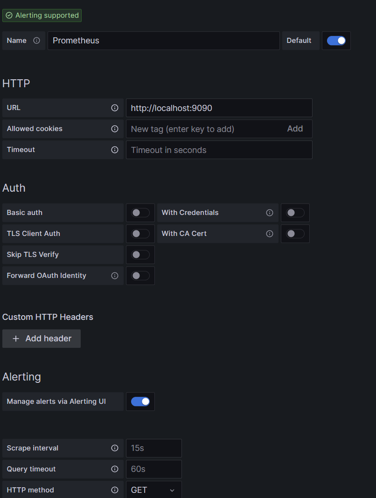

## 部署Prometheus

### 二进制包部署

[Download | Prometheus](https://prometheus.io/download/)

[Getting started | Prometheus](https://prometheus.io/docs/prometheus/latest/getting_started/)

安装

```shell
wget https://github.com/prometheus/prometheus/releases/download/v2.25.0/prometheus-2.25.0.linux-amd64.tar.gz
tar xzf prometheus-2.25.0.linux-amd64.tar.gz
mv prometheus-2.25.0.linux-amd64 /usr/local/prometheus
ln -s /usr/local/prometheus/promtool /usr/bin/promtool
cd /usr/local/prometheus
ll
total 167992
drwxr-xr-x 2 3434 3434     4096 Feb 17 16:11 console_libraries
drwxr-xr-x 2 3434 3434     4096 Feb 17 16:11 consoles
-rw-r--r-- 1 3434 3434    11357 Feb 17 16:11 LICENSE
-rw-r--r-- 1 3434 3434     3420 Feb 17 16:11 NOTICE
-rwxr-xr-x 1 3434 3434 91044140 Feb 17 14:19 prometheus
-rw-r--r-- 1 3434 3434      926 Feb 17 16:11 prometheus.yml
-rwxr-xr-x 1 3434 3434 80948693 Feb 17 14:21 promtool
```

启动

```shell
nohup ./prometheus &
ss -tnl	#9090端口
State       Recv-Q Send-Q                                    Local Address:Port                                                   Peer Address:Port              
LISTEN      0      128                                                   *:22                                                                *:*                  
LISTEN      0      128                                                [::]:22                                                             [::]:*                  
LISTEN      0      128                                                [::]:9090  
```

配置systemctl管理

```shell
# cat > /usr/lib/systemd/system/prometheus.service <<EOF

[Unit]
Description=Prometheus

[Service]
ExecStart=/usr/local/prometheus/prometheus --config.file=/usr/local/prometheus/prometheus.yml --storage.tsdb.path=/data/prometheus --web.enable-lifecycle --storage.tsdb.retention.time=180d
Restart=on-failure

[Install]
WantedBy=multi-user.target 
EOF

# promtool check config prometheus.yml   #使用promtool工具来验证配置文件 
# systemctl enable prometheus.service 
# systemctl start prometheus.service 
```

### docker部署

[Installation | Prometheus](https://prometheus.io/docs/prometheus/latest/installation/)

### 访问web

http://localhost:9090

## prometheus+grafana

grafana部署文档：https://grafana.com/grafana/download

访问地址：http://ip:3000

用户名密码：admin/admin


接下来需要配置的就是 Grafana 的采集数据源要从哪个地方采集，所以我们需要把 Grafana 的数据源配置成从 Prometheus 去采集，我们在登录到 Grafana 界面以后，在浏览器里面点击 **Data Source** 这个按钮


然后点击 **add data source**，它里面有一个默认的配置模板，我们可以点击 Prometheus：


然后我们就可以进入 Grafana 的控制台，针对 Prometheus 这样的一个数据源，它的具体的配置界面。这里需要配置的有如下几大块配置：



一个是 HTTP，也就是 Prometheus 对外服务的接口的地址，我们填写的是 Prometheus 的服务地址和它对应的服务端口，并且设置它的权限是浏览的权限。另外Scrape interval 配置的是采集间隔，也就是每 15 秒去做一次采集。HTTP Method 代表是以 GET 的方式去请求 Prometheus 服务。这里就完成了整个对于 Prometheus 数据源的采集。


导入 Grafna 对于普罗修斯所默认携带的面板插件：

登录到我的浏览器打开grafana后台，进入**Dashboards**，然后点击 import，这里我搜索一个关键词 “**405**“，然后回车一下。这个时候我们点击完 load ，界面中有 Prometheus Metric 的插件，然后我们点击 input，这样就完成了面板插件导入。


最后我们点击主界面，这个时候我们在 Dashboard 的下面会看到一个新的 Dashboard 按钮（Node Exporter Server Metrics），我们点击进去，就会看到对应节点的 IP 地址和端口信息：

