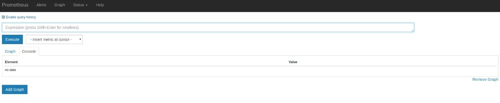

指标抓取后会存储在内置的时序数据库中，Prometheus 也提供了 PromQL 查询语言给我们做指标的查询，我们可以在 Prometheus 的 WebUI 上通过 PromQL，可视化查询我们的指标，也可以很方便的接入第三方的可视化工具，例如 grafana。

访问http://ip:9090，会默认跳转到Graph页面



在这里我们可以使用 Prometheus 自己开发的语言 PromQL对时序数据进行筛选和聚合，查询的监控数据有列表和曲线图两种展现形式（对应上图中 Console 和 Graph 这两个标签）

## 数据类型

PromQL 是 Prometheus 为我们提供的函数式的查询语言，查询表达式有四种类型：：

**瞬时向量**：指同一时刻的一组时间序列，每个时间序列包含一个样本，所有样本共享相同的时间戳，即每个时序只有一个点

**区间向量**：指任何一个时间范围内的一组时间序列，包含每个时间序列随时间变化的一系列数据点，这时每个时序有多个点

标量数据：单一的数字值，可以是函数参数，也可以是函数的返回结果；

字符串：只作为某些内置函数的参数出现；

### 瞬时查询

直接通过指标名即可进行查询，查询结果是当前指标最新的时间序列。例如：选择指标名称为 http_requests_total 的所有时间序列：

```promql
http_requests_total
```

可以看到查询出来有多个同名指标结果 可以用{}做标签过滤查询，**可以通过向花括号{}里附加一组标签来进一步过滤时间序列**。

```promql
http_requests_total{job="prometheus",group="canary"}
```

匹配标签值时可以是等于，也可以使用**正则表达式**。总共有下面几种匹配操作符：

```shell
=	等于
!=	不等于
=~	匹配
!~	不匹配
```

选择指标名称为 http_requests_total，环境为 staging、testing 或 development，HTTP 方法为 GET 的时间序列：
```shell
http_requests_total{environment=~"staging|testing|development",method="GET"}
```

### 范围查询

范围查询的结果集就是区间向量，可以通过[]指定时间来做范围查询

查询指标最近5分钟内的所有样本数据：

```shell
http_requests_total{}[5m]
```

注意：这里范围查询第一个点并不一定精确到刚刚好5分钟前的那个时序样本点，他是以5分钟作为一个区间，寻找这个区间的第一个点到最后一个样本点。


除了使用m表示分钟以外，PromQL的时间范围选择器支持其它时间单位：

- s - 秒
- m - 分钟
- h - 小时
- d - 天
- w - 周
- y - 年


如果我们想查询，5分钟前的瞬时样本数据，就可以使用位移操作，位移操作的关键字为**offset**

使用offset时间位移操作：

```shell
#前5分钟请求总数
http_request_total{} offset 5m
#前1小时1天内的请求总数
http_request_total{}[1d] offset 1d
```

offset 关键字需要紧跟在选择器{}后面。

```promql
sum(http_requests_total{method="GET"} offset 5m) // GOOD.
sum(http_requests_total{method="GET"}) offset 5m // INVALID.
```

## 二次运算符

+

-

*

/

% 模

^ 幂等


二次运算符支持瞬时向量/标量、瞬时向量/瞬时向量之间的操作

瞬时向量/标量：

node_memory_MemTotal_bytes / (1024*1024)

瞬时向量/瞬时向量:

node_memory_MemAvailable_bytes / node_memory_MemTotal_bytes * 100

## 函数

https://prometheus.io/docs/prometheus/latest/querying/functions/

Prometheus内置了很多函数，这里主要记录下常用的几个函数的使用：

### rate和irate

rate和irate函数：rate函数可以用来求指标的平均变化速率

```
rate函数=时间区间前后两个点的差 / 时间范围
```

一般rate函数可以用来求某个时间区间内的请求速率，也就是我们常说的QPS


但是rate函数只是算出来了某个时间区间内的平均速率，没办法反映突发变化，假设在一分钟的时间区间里，前50秒的请求量都是0到10左右，但是最后10秒的请求量暴增到100以上，这时候算出来的值可能无法很好的反映这个峰值变化。这个问题可以通过irate函数解决，irate函数求出来的就是瞬时变化率。

```
时间区间内最后两个样本点的差 / 最后两个样本点的时间差
```


当将 `rate()` 函数与[聚合运算符](https://prometheus.io/docs/prometheus/latest/querying/operators/#aggregation-operators)（例如 `sum()`）或随时间聚合的函数（任何以 `_over_time` 结尾的函数）一起使用时，**必须先执行 rate 函数，然后再进行聚合操作**，否则当采样目标重新启动时 **rate() 无法检测到计数器是否被重置。**


### 聚合函数sum() by() without()

without用于从计算结果中移除列举的标签，而保留其它标签。by则正好相反，结果向量中只保留列出的标签，其余标签则移除。通过without和by可以按照样本的问题对数据进行聚合。


我们在求指定接口的QPS的时候，可能会出现多个实例的QPS的计算结果

可以配合 by 和 without 函数在 sum 的时候，基于某些标签分组，类似 SQL 中的 group by

例如，我可以根据请求接口标签分组：这样拿到的就是具体接口的QPS：

```
sum(rate(demo_api_request_duration_seconds_count{job="demo", method="GET", status="200"}[5m])) by(path)
```

也可以不根据接口路径分组：通过without指定：

```
sum(rate(demo_api_request_duration_seconds_count{job="demo", method="GET", status="200"}[5m])) without(path)
```


> 可以通过`histogram_quantile`函数做数据统计：可以用来统计百分位数：第一个参数是百分位，第二个histogram指标，这样计算出来的就是中位数，即P50

```
histogram_quantile(0.5,go_gc_pauses_seconds_total_bucket)
```

> 分享一个坑：

在刚刚写的自定义exporter上新增几个histogram的样本点：

```
MyHistogram.Observe(0.3)
MyHistogram.Observe(0.4)
MyHistogram.Observe(0.5)
```

histogram 的桶设置：

```
MyHistogram = prometheus.NewHistogram(prometheus.HistogramOpts{   
   Name: "my_histogram_bucket",
   Help: "自定义histogram",
   Buckets: []float64{0,2.5,5,7.5,10},    // 需要指定桶
})
```

如果这样的话，所有指标都会直接进入到第一个桶，即0到2.5这个桶，如果我要计算中位数，那么这个中位数按照数学公式来算的话，肯定是在0到2.之间的，而且肯定是0.3到0.5之间。

我用`histogram_quantile`函数计算下：计算结果是1.25，其实已经不对了。

```
histogram_quantile(0.5,my_histogram_bucket_bucket)
```

我在计算下P99，等于2.475：

```
histogram_quantile(0.99,my_histogram_bucket_bucket)
```

我的指标都是不大于1的，为啥算出来的P50和P99都这么离谱呢？

这是因为Prometheus他是不保存你具体的指标数值的，他会帮你把指标放到具体的桶，但是他不会保存你指标的值，计算的分位数是一个预估的值，怎么预估呢？就是假设每个桶内的样本分布是均匀的，线性分布来计算的，比如刚刚的P50，其实就是算排在第50%位置的样本值，因为刚刚所有的数据都落在了第一个桶，那么他在计算的时候就会假定这个50%值在第一个桶的中点，他就会假定这个数就是0.5 *2.5，**P99就是第一个桶的99%的位置，他就会假定这个数就是0.99* 2.5。

**导致这个误差较大的原因就是我们的 bucket 设置的不合理。**

重新定义桶：

```
// 定义histogram
MyHistogram = prometheus.NewHistogram(prometheus.HistogramOpts{
   Name: "my_histogram_bucket",
   Help: "自定义histogram",
   Buckets: []float64{0.1,0.2,0.3,0.4,0.5},   // 需要指定桶
})
```

上报数据：

```
MyHistogram.Observe(0.1)
MyHistogram.Observe(0.3)
MyHistogram.Observe(0.4)
```

桶设置的越合理，计算的误差越小。