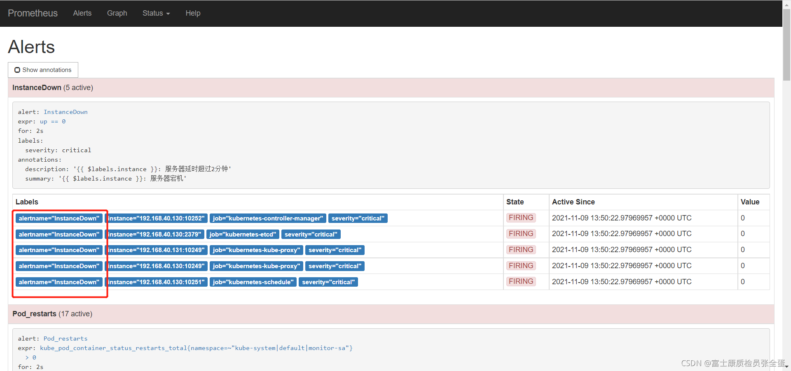

虽然 Prometheus 的 /alerts 页面可以看到所有的告警，但我们还需要触发告警时自动通知，这由Alertmanager 来完成


alertmanager除了基本的告警通知功能外，还主要提供如分组、抑制、静默等告警特性

端口：9093

**分组：**

将详细的告警信息合并为一个通知，比如系统宕机导致大量告警被同时触发，这时分组机制可以将这些被触发的告警合并为一个告警通知

**抑制：**

当某一个告警发出后，可以停止重复发送由此告警引发的其他告警

例如当集群不可访问时触发一次告警，抑制机制可以忽略与该集群有关的其他所有告警，避免收到大量与实际问题无关的告警

**静默：**

根据标签对告警进行静默处理，如果接收到的告警符合静默的配置，alertmanager则不会发送告警通知

静默设置需要在alertmanager的web界面配置


## 安装alertmanager

在root用户下运行：

```shell
wget https://github.com/prometheus/alertmanager/releases/download/v0.25.0/alertmanager-0.25.0.linux-amd64.tar.gz
tar xf alertmanager-0.25.0.linux-amd64.tar.gz
mv alertmanager-0.25.0.linux-amd64 /opt/prometheus/alertmanager

vim /usr/lib/systemd/system/alertmanager.service
[Unit]
Description=Prometheus
Wants=network-online.target
After=network-online.target

[Service]
Type=simple
ExecStart=/opt/prometheus/alertmanager/alertmanager --config.file=/opt/prometheus/alertmanager/alertmanager.yml --storage.path=/opt/prometheus/alertmanager/data
Restart=always

[Install]
WantedBy=multi-user.target
```


安装好alertmanager后，要把alertmanager关联到prometheus

```yaml
alerting:
  alertmanagers:
  - scheme: http
    static_configs:
    - targets:
      - "1xx.xx.xx.xx:9093"
```

现在alertmanager就可以接收到告警了，下面的问题就是如何让alertmanager发送告警

## 报警流程

1. **prometheus server**监控目标主机上暴露的http接口（下面称作接口A），通过prometheus配置的`scrape_interval`定期采集目标主机的监控数据
2. 当接口A不可用，server端会持续的尝试从接口获取数据，直到`scrape_timeout`时间后停止尝试，这时候把接口状态改为“DOWN”
3. Prometheus根据配置的`evaluation_interval`的时间间隔，定期（默认1min）的对alert rule进行评估，当达到评估周期时，发现接口A为DOWN，即UP=0为真，激活alert，进入“PENDING”状态，并记录当前active的时间
4. 当下一个alert rule评估周期到来时，发现UP=0继续为真，然后判断警报active的时间是否已经超出rule里的“for”持续时间，如果未超出，则进入下一个评估周期；如果时间超出，则alert的状态变为“**FIRING**“；同时调用alerting接口，发送相关报警数据
5. **alertmanager**收到报警信息后，会对警报信息进行分组，然后根据alertmanager配置的`group_wait`时间先进行等待，等wait时间后再发送警报信息
6. 在同一个alert group中，在等待的过程中可能进入新的告警，如果之前的报警已经成功发出，那么间隔`group_interval`的时间间隔后再一起重新发送告警
7. 如果alert group中的告警一直没有变化并且已经成功发送，等待`repeat_interval`时间间隔后再重新发送相同的告警邮件；如果之前的警报没有成功发送，则相当于触发上面第六个步骤，则需要等待`group_interval`的时间间隔后再重新发送告警
8. 至于最后告警信息发送给谁，满足什么条件下指定警报接收人，设置不同告警发送频率，由alertmanager的route规则进行配置

## alertmanager配置文件

在Alertmanager配置中一般会包含以下几个主要部分：

- 全局配置（global）：用于定义一些全局的公共参数，如全局的SMTP配置，Slack配置等内容；
- 模板（templates）：用于定义通知模板，如邮件模板等；
- 告警路由（route）：根据标签匹配，确定当前告警应该如何处理；
- 接收人（receivers）：接收人是一个抽象的概念，它可以是一个邮箱也可以是微信，Slack或者Webhook等，接收人一般配合告警路由使用；
- 抑制规则（inhibit_rules）：合理设置抑制规则可以减少垃圾告警的产生

其完整配置格式如下：

```yaml
global:
  # 当Alertmanager持续多长时间未接收到告警后标记告警状态为resolved（已解决）
  [ resolve_timeout: <duration> | default = 5m ]
  
  [ smtp_from: <tmpl_string> ] #指定从哪个邮箱发送报警
  [ smtp_smarthost: <string> ] #SMTP服务器地址+端口
  [ smtp_hello: <string> | default = "localhost" ]
  [ smtp_auth_username: <string> ] #发送邮箱的认证用户，不是邮箱名
  [ smtp_auth_password: <secret> ] #发送邮箱的授权码而不是登录密码
  [ smtp_auth_identity: <string> ]
  [ smtp_auth_secret: <secret> ]
  [ smtp_require_tls: <bool> | default = true ]
  [ slack_api_url: <secret> ]
  [ victorops_api_key: <secret> ]
  [ victorops_api_url: <string> | default = "https://alert.victorops.com/integrations/generic/20131114/alert/" ]
  [ pagerduty_url: <string> | default = "https://events.pagerduty.com/v2/enqueue" ]
  [ opsgenie_api_key: <secret> ]
  [ opsgenie_api_url: <string> | default = "https://api.opsgenie.com/" ]
  [ hipchat_api_url: <string> | default = "https://api.hipchat.com/" ]
  [ hipchat_auth_token: <secret> ]
  [ wechat_api_url: <string> | default = "https://qyapi.weixin.qq.com/cgi-bin/" ]
  [ wechat_api_secret: <secret> ]
  [ wechat_api_corp_id: <string> ]
  [ http_config: <http_config> ]

# - 从中读取自定义通知模板定义的文件,最后一个组件可以使用通配符匹配器,例如“templates/*.tmpl”。 
templates:
  [ - <filepath> ... ]

# - 配置告警分发策略
route: <route>

# 通知接收者列表
receivers:
  - <receiver> ...

# - 抑制规则列表: 当存在与另一组匹配器匹配的警报（源）时，禁止规则会使与一组匹配器匹配的警报（目标）静音。对于相等列表中的标签名称，目标警报和源警报必须具有相同的标签值。 
inhibit_rules:
  [ - <inhibit_rule> ... ]
```

### route

通知路由，可以根据不同的标签将告警通知发送给不同的receiver

将类似的指标分组，比如说监控linux服务器会监控其负载，资源负载就是一个分组，这个分组下面会有cpu的指标，内存的指标。

每一个告警都会从配置文件中顶级的route进入路由树，需要注意的是顶级的route必须匹配所有告警(即不能有任何的匹配设置match和match_re)，每一个路由都可以定义自己的接受人以及匹配规则。

```yaml
# 所有报警信息进入后的根路由，用来设置报警的分发策略
route:
  receiver: 'default-receiver' # 默认情况下所有的告警都会发送给集群管理员default-receiver
  group_wait: 10s # 组告警等待时间。也就是告警产生后等待10s，如果有同组告警一起发出
  group_interval: 5m # 如果有不同的组，两组告警的间隔时间
  repeat_interval: 4h # 重复告警的间隔时间，减少相同邮件的发送频率
  group_by: ['alertname', 'cluster'] # 根据label标签的key进行重新分组，例如，接收到的报警信息里面有许多具有 cluster=A 和 alertname=LatncyHigh 这样的标签的报警信息将会批量被聚合到一个分组里面
  
  # 上面所有的属性都由所有子路由继承，并且可以在每个子路由上进行覆盖。
  routes:
  - receiver: 'database-pager' # 如果告警中包含service标签，并且service为MySQL或者Cassandra,则向database-pager发送告警通知，由于这里没有定义group_by等属性，这些属性的配置信息将从上级路由继承，database-pager将会接收到按cluster和alertname进行分组的告警通知。
    group_wait: 10s
    match_re: #可以用正则
      service: mysql|cassandra
  - receiver: 'frontend-pager'
    group_by: [product, environment] #按照标签product和environment对告警进行分组
    match:
      team: frontend
```



### receivers

配置告警通知的接收方式，每个 receiver 包含一个 name 和一个 xxx_configs，常用的有email_config ， webhook_config， wechat_configs

```yaml
name: <string>
email_configs:
  [ - <email_config>, ... ] #指定发送到哪个邮箱，需要写自己的邮箱地址，不应该跟smtp_from的邮箱名字重复
hipchat_configs:
  [ - <hipchat_config>, ... ]
pagerduty_configs:
  [ - <pagerduty_config>, ... ]
pushover_configs:
  [ - <pushover_config>, ... ]
slack_configs:
  [ - <slack_config>, ... ]
opsgenie_configs:
  [ - <opsgenie_config>, ... ]
webhook_configs:
  [ - <webhook_config>, ... ]
victorops_configs:
  [ - <victorops_config>, ... ]
```

## 配置基本的报警到qq邮箱

```yaml
#全局配置
global:
  resolve_timeout: 1m
  #邮箱服务器
  smtp_smarthost: 'smtp.163.com:25'
  smtp_from: '1xxxxxxx@163.com'
  smtp_auth_username: '15011572657'
  smtp_auth_password: 'BGWHYUOSOOHWEUJM'
  smtp_require_tls: false

#配置路由树
route:
  group_by: ['alertname'] # 采用哪个alertname标签作为分组依据
  group_wait: 10s # #组告警等待时间。也就是告警产生后等待10s，如果有同组告警一起发出
  group_interval: 10s # 上下两组发送告警的间隔时间
  repeat_interval: 10m # 重复告警间隔发送时间，默认1h
  receiver: 'default-receiver' # 定义谁来收告警

#接收人
receivers:
  - name: default-receiver
    email_configs:
    - to: '1980570647@qq.com'
      send_resolved: true
```

## 配置基本的报警到企业微信

企业微信相关概念说明请参考[企业微信API说明](https://work.weixin.qq.com/api/doc#90000/90135/90665)，可以在企业微信的后台中建立多个应用，每个应用对应不同的报警分组，由企业微信来做接收成员的划分。

1. 注册企业微信

   https://work.weixin.qq.com

   

2. webhook告警

   添加群机器人

   新创建一个部门，然后把需要接受报警的人拉到这个部门里面，然后在这个部门群里面新建机器人，然后复制机器人的webhook地址，其实只需要用到`key=`后面那一串字符

3. docker安装webhook-wechat

   prometheus服务器上安装

   ```shell
   mkdir /data/docker-prometheus/webhook-wechat -p
   cd /data/docker-prometheus/webhook-wechat
   
   cat > docker-compose.yaml <<"EOF"
   version: "2"
   services:
     prometheus-webhook-wechat:
       image: linge365/webhook-wechat:latest
       container_name: prometheus-webhook-wechat
       restart: always
       volumes:
       - /etc/localtime:/etc/localtime
       ports:
       - "5000:5000"
       environment:
         ROBOT_TOKEN: "填入之前复制的token"
   EOF
   
   docker-compose up -d
   ```

4. 修改alertmanager配置

   ```shell
   vim alertmanager/config.yml
   receivers:
   - name: 'wechat'
     webhook_configs:
     - url: 'http://192.168.101.129:5000'
   ```

   

   
