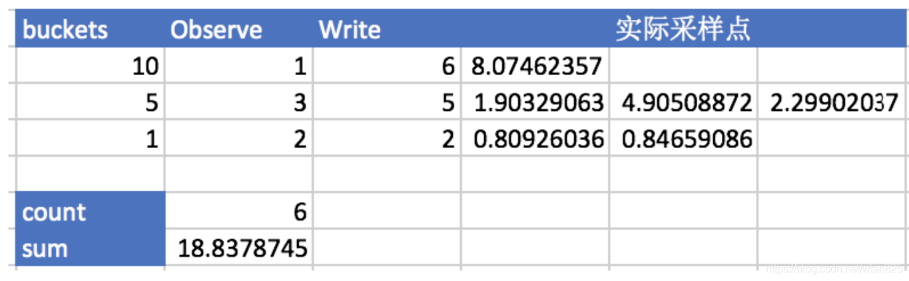

# PromQL

PromQL(Prometheus Query Language) 是 Prometheus 自己开发的数据查询 DSL 语言

用curl命令可以看到metrics数据以k/v形式展现

```powershell
$ curl http://10.244.1.132:9090/metrics
...
# HELP promhttp_metric_handler_requests_total Total number of scrapes by HTTP status code.
# TYPE promhttp_metric_handler_requests_total counter
promhttp_metric_handler_requests_total{code="200"} 149
promhttp_metric_handler_requests_total{code="500"} 0
promhttp_metric_handler_requests_total{code="503"} 0
```

其中#号开头的两行分别为：

- HELP开头说明该行为指标的帮助信息，通常解释指标的含义
- TYPE开头是指明了指标的类型
  - counter 计数器
  - guage 测量器
  - histogram 柱状图
  - summary 采样点分位图统计

其中非#开头的每一行表示当前采集到的一个监控样本

## 样本

Prometheus会将所有采集到的样本数据以时间序列（time-series）的方式保存在内存数据库中，并且定时保存到硬盘上。

```shell
 ^
  │   . . . . . . . . . . . . . . . . .   . .   node_cpu{cpu="cpu0",mode="idle"}
  │     . . . . . . . . . . . . . . . . . . .   node_cpu{cpu="cpu0",mode="system"}
  │     . . . . . . . . . .   . . . . . . . .   node_load1{}
  │     . . . . . . . . . . . . . . . .   . .  
  v
    <------------------ 时间 ---------------->
```

在time-series中的**每一个点称为一个样本**（sample），样本由以下三部分组成：

- **指标(metric)**：metric name和描述当前样本特征的labelsets;
- **时间戳(timestamp)**：一个精确到毫秒的时间戳;
- **样本值(value)**： 一个float64的浮点型数据表示当前样本的值。

```shell
<--------------- metric ---------------------><-timestamp -><-value->
http_request_total{status="200", method="GET"}@1434417560938 => 94355
```

指标格式:

```shell
<metric name>{<label name>=<label value>, ...}
```

指标的名称(metric name)可以反映被监控样本的含义（比如，`http_request_total` - 表示当前系统接收到的HTTP请求总量）。
标签(label)反映了当前样本的特征维度，通过这些维度Prometheus可以对样本数据进行过滤，聚合等。

## 数据类型

### 瞬时向量

该时间序列中最新的一个样本值

例如：选择指标名称为 http_requests_total 的所有时间序列：

```promql
http_requests_total
```

可以通过向花括号（{}）里附加一组标签来进一步过滤时间序列。

```promql
http_requests_total{job="prometheus",group="canary"}
```


PromQL还支持用户根据时间序列的标签匹配模式来对时间序列进行过滤，目前主要支持两种匹配模式：完全匹配和正则匹配。

```text
匹配器用于定义标签过滤条件：
=	等于
!=	不等于
=~	匹配
!~	不匹配

选择指标名称为 http_requests_total，环境为 staging、testing 或 development，HTTP 方法为 GET 的时间序列：
http_requests_total{environment=~"staging|testing|development",method="GET"}


#数学运算：+ - * / %(余) ^(幂)
使用MB作为单位响应数据：node_memory_free_bytes_total / (1024 * 1024)
```

所有的 PromQL 表达式必须至少包含一个指标名称，或者一个不会匹配到空字符串的标签过滤器。

```promql
{job=~".*"} # 非法！
{job=~".+"}              # 合法！
{job=~".*",method="get"} # 合法！
```


### 区间向量

一段时间范围内的数据。**在瞬时范围选择器后面加个`[]`进行定义。**

查询指标最近5分钟内的所有样本数据：

```shell
http_requests_total{}[5m]
```

除了使用m表示分钟以外，PromQL的时间范围选择器支持其它时间单位：

- s - 秒
- m - 分钟
- h - 小时
- d - 天
- w - 周
- y - 年

### 偏移修饰器

如果我们想查询，5分钟前的瞬时样本数据，就可以使用位移操作，位移操作的关键字为**offset**

使用offset时间位移操作：

```shell
#前5分钟请求总数
http_request_total{} offset 5m
#前1小时1天内的请求总数
http_request_total{}[1d] offset 1d
```

offset 关键字需要紧跟在选择器（{}）后面。

```promql
sum(http_requests_total{method="GET"} offset 5m) // GOOD.
sum(http_requests_total{method="GET"}) offset 5m // INVALID.
```


### 标量和字符串

除了使用瞬时向量表达式和区间向量表达式以外，PromQL还直接支持用户使用标量(Scalar)和字符串(String)。

标量（Scalar）：一个浮点型的数字值

需要注意的是，当使用表达式count(http_requests_total)，返回的数据类型，依然是瞬时向量。用户可以通过内置函数scalar()将单个瞬时向量转换为标量。

字符串（String）：一个简单的字符串值

直接使用字符串，作为PromQL表达式，则会直接返回字符串。

## metrics类型

Prometheus从exporter抓取的每一个指标均是有注释度量类型的，例如，我们来查看node_exporter的度量指标，curl http://xxx.xxx.xxx.xxx:9100/metrics

### **counter：只增不减的计数器**

只增不减（除非系统发生重置）。如http_requests_total，node_cpu都是Counter类型的监控指标。 一般在定义Counter类型指标的名称时推荐使用**_total作为后缀**。

counter类型的数据，首先应该想到是否要使用**rate()**或者**increase()**函数来计算其变化速率：

PromQL内置的聚合操作和函数可以让用户对这些数据进行进一步的分析：

```shell
rate(http_requests_total[2h]) #获取2小时内，该指标下各时间序列上http总请求数的增长速率
topk(3,http_requests_total) #获取该指标下http请求总数排名前3的时间序列
irate(http_requests_total[2h]) #高灵敏度函数，计算指标的瞬时速率
```

### **gauge：可增可减的仪表盘**

Gauge类型的指标侧重于**反应系统的当前状态**。常见指标如：node_memory_MemFree（主机当前空闲的内容大小）、node_memory_MemAvailable（可用内存大小）

```shell
常用于求和、平均值、最小值、最大值等聚合计算，也常结合predict_linear和delta函数使用
delta(cpu_temp_celsius{host="zeus"}[2h]) #计算CPU温度在两个小时内的差异
predict_linear(node_filesystem_free{job="node"}[1h], 4 * 3600) #预测系统磁盘空间在4个小时之后的剩余情况
```

### Histogram和Summary

**用于统计和分析样本的分布情况**

Histogram（直方图）：

有些情况下计算出来的平均值是不能反应出少部分的特殊情况，比如用户的响应时间，这时候就可以用histogram，可以分别统计~=0.05秒的量有多少，0~0.05秒有多少，>2秒有多少，>10秒有多少


1. 对每个采样点进行统计（**并不是一段时间的统计**），打到各个桶(bucket)中（0.05秒以下多少，2秒以下多少，10秒以下多少）
2. 对每个采样点值累计和(sum) （请求总时间）
3. 对采样点的次数累计和(count) （请求的总次数）


度量指标名称: [basename]的柱状图, 上面三类的作用度量指标名称

1. [basename]_bucket{le=“上边界”}, 这个值为小于等于上边界的所有采样点数量
2. [basename]_sum
3. [basename]_count




```text
如上表，设置bucket=[1,5,10]，当实际采样数据如是采样点所示, Observe表示采样点落在该bucket中的数量，即落在[-,1]的样点数为2，即落在[1,5]的样点数为3，即落在[5,10]的样点数为1，write是得到的最终结果（histogram的最终结果bucket计数是向下包含的）：
[basename]_bucket{le=“1”} = 2
[basename]_bucket{le=“5”} =5
[basename]_bucket{le=“10”} =6
[basename]_bucket{le="+Inf"} = 6
[basename]_count =6
[basename]_sum =18.8378745
```


Summary（摘要）：

用于**记录某些东西的平均大小**，可能是计算所需的时间或处理的文件大小，摘要显示两个相关的信息：**`count`（事件发生的次数）和 `sum`（所有事件的总大小）**

作用：

1. 在客户端对于**一段时间内**（默认是10分钟）的每个采样点进行统计，并形成分位图。（中位数的成绩为多少，9分位数的成绩为多少）
2. 统计班上所有同学的总成绩(sum)
3. 统计班上同学的考试总人数(count)

例如：

```text
prometheus_tsdb_wal_fsync_duration_seconds{quantile="0.5"} 0.012352463
prometheus_tsdb_wal_fsync_duration_seconds{quantile="0.9"} 0.014458005
prometheus_tsdb_wal_fsync_duration_seconds{quantile="0.99"} 0.017316173
prometheus_tsdb_wal_fsync_duration_seconds_sum 2.888716127000002
prometheus_tsdb_wal_fsync_duration_seconds_count 216

#当前Prometheus Server进行wal_fsync操作的总次数为216次，耗时2.888716127000002s。其中中位数（quantile=0.5）的耗时为0.012352463，9分位数（quantile=0.9）的耗时为0.014458005s。
```

经验：

1. 如果需要聚合（aggregate），选择histograms。
2. 如果比较清楚要观测的指标的范围和分布情况，选择histograms。如果需要精确的分为数选择summary。

## PromQL操作符

常规操作符：

| 类型           | 操作符                                                       | 示例                                                         |
| -------------- | ------------------------------------------------------------ | ------------------------------------------------------------ |
| 比较操作符     | = 等于<br />!= 不等于<br />> 大于<br />< 小于<br />>= 大于等于<br /><= 小于等于 | node_cpu_seconds_total{job="Linux Server",mode="iowait"} <br />node_cpu_seconds_total{job="Linux Server",mode=~"user\|system"} <br />node_cpu_seconds_total{job="Linux Server",mode=~"user\|system",cpu!="0"} |
| 算数操作符     | + 加法<br />- 减法<br />* 乘法<br />/ 除法                   | CPU使用率： <br />100 - (avg(irate(node_cpu_seconds_total{mode="idle"}[5m])) by (instance) * 100) <br />内存使用率： <br />100 - (node_memory_MemFree_bytes+node_memory_Cached_bytes+node_memory_Buffers_bytes) / node_memory_MemTotal_bytes * 100 |
| 正则匹配操作符 | =~ 正则表达式匹配<br />!~ 正则表达式匹配结果取反             | 磁盘使用率： <br />100 - (node_filesystem_free_bytes{mountpoint="/",fstype=~"ext4\|xfs"} / node_filesystem_size_bytes{mountpoint="/",fstype=~"ext4\|xfs"} * 100) |
| 聚合操作符     | sum (在维度上求和) <br />max (在维度上求最大值) <br />min (在维度上求最小值) <br />avg (在维度上求平均值)<br />count(统计样本数量） | 所有实例CPU system使用率总和： <br />sum(node_cpu_seconds_total{job="Linux Server",mode="system"})  <br />所有实例CPU system变化速率平均值： <br />avg(irate(node_cpu_seconds_total{job="Linux Server",mode="system"}[5m]) <br />统计CPU数量： <br />count(node_cpu_seconds_total{job="Linux Server",mode="system"}) |
| 逻辑操作符     | and 与<br />or 或                                            | 大于10并且小于50： <br />prometheus_http_requests_total > 10 and prometheus_http_requests_total < 50 <br />大于10或者小于50： <br />prometheus_http_requests_total > 10 or prometheus_http_requests_total < 50 |


### 数学运算

PromQL支持的所有数学运算符如下所示：

- `+` (加法)
- `-` (减法)
- `*` (乘法)
- `/` (除法)
- `%` (求余)
- `^` (幂运算)


例如，我们可以通过指标node_memory_free_bytes_total获取当前主机可用的内存空间大小，其样本单位为Bytes。这是如果客户端要求使用MB作为单位响应数据：

```shell
node_memory_free_bytes_total / (1024 * 1024)
```

在上一小节中我们称该表达式为瞬时向量表达式，而返回的结果成为瞬时向量。
当瞬时向量与标量之间进行数学运算时，数学运算符会依次作用于瞬时向量中的每一个样本值，从而得到一组新的时间序列。

如果是瞬时向量与瞬时向量之间进行数学运算时，过程会相对复杂一点。 例如，如果我们想根据node_disk_bytes_written和node_disk_bytes_read获取主机磁盘IO的总量：

```shell
node_disk_bytes_written + node_disk_bytes_read
```

那这个表达式是如何工作的呢？依次找到与左边向量元素匹配（标签完全一致）的右边向量元素进行运算，如果没找到匹配元素，则直接丢弃。同时新的时间序列将不会包含指标名称。 该表达式返回结果的示例如下所示：

```shell
{device="sda",instance="localhost:9100",job="node_exporter"}=>1634967552@1518146427.807 + 864551424@1518146427.807
{device="sdb",instance="localhost:9100",job="node_exporter"}=>0@1518146427.807 + 1744384@1518146427.807
```


### 使用布尔运算过滤时间序列

布尔运算则支持用户根据时间序列中样本的值，对时间序列进行过滤。

目前，Prometheus支持以下布尔运算符如下：

- `==` (相等)
- `!=` (不相等)
- `>` (大于)
- `<` (小于)
- `>=` (大于等于)
- `<=` (小于等于)


当前所有主机节点的内存使用率：

```shell
(node_memory_bytes_total - node_memory_free_bytes_total) / node_memory_bytes_total
```

而系统管理员在排查问题的时候可能只想知道当前内存使用率超过95%的主机呢？通过使用布尔运算符可以方便的获取到该结果：

```shell
(node_memory_bytes_total - node_memory_free_bytes_total) / node_memory_bytes_total > 0.95
```

瞬时向量与标量进行布尔运算时，PromQL依次比较向量中的所有时间序列样本的值，如果比较结果为true则保留，反之丢弃。

瞬时向量与瞬时向量直接进行布尔运算时，同样遵循默认的匹配模式：依次找到与左边向量元素匹配（标签完全一致）的右边向量元素进行相应的操作，如果没找到匹配元素，则直接丢弃。


### 使用bool修饰符改变布尔运算符的行为

例如，只需要知道当前模块的HTTP请求量是否>=1000，如果大于等于1000则返回1（true）否则返回0（false）。这时可以使用bool修饰符改变布尔运算的默认行为。 例如：

```shell
http_requests_total > bool 1000
```

### 使用集合运算符

通过集合运算，可以在两个瞬时向量与瞬时向量之间进行相应的集合操作。目前，Prometheus支持以下集合运算符：

- `and` (并且)
- `or` (或者)
- `unless` (排除)

***vector1 and vector2*** 会产生一个由vector1的元素组成的新的向量。该向量包含vector1中完全匹配vector2中的元素组成。

***vector1 or vector2*** 会产生一个新的向量，该向量包含vector1中所有的样本数据，以及vector2中没有与vector1匹配到的样本数据。

***vector1 unless vector2*** 会产生一个新的向量，新向量中的元素由vector1中没有与vector2匹配的元素组成。

### 操作符优先级

查询主机的CPU使用率，可以使用表达式：

```shell
100 * (1 - avg (irate(node_cpu{mode='idle'}[5m])) by(job) )
```

在PromQL操作符中优先级由高到低依次为：

1. `^`
2. `*, /, %`
3. `+, -`
4. `==, !=, <=, <, >=, >`
5. `and, unless`
6. `or`

### 聚合操作

Prometheus还提供了下列内置的聚合操作符，这些操作符**作用于瞬时向量**。可以将瞬时表达式返回的样本数据进行聚合，形成一个新的时间序列。

- `sum` (求和)
- `min` (最小值)
- `max` (最大值)
- `avg` (平均值)
- `stddev` (标准差)
- `stdvar` (标准方差)
- `count` (计数)
- `count_values` (对value进行计数)
- `bottomk` (后n条时序)
- `topk` (前n条时序)
- `quantile` (分位数)

使用聚合操作的语法如下：

```shell
<aggr-op>([parameter,] <vector expression>) [without|by (<label list>)]
```

其中只有`count_values`, `quantile`, `topk`, `bottomk`支持参数(parameter)。

without用于从计算结果中移除列举的标签，而保留其它标签。by则正好相反，结果向量中只保留列出的标签，其余标签则移除。通过without和by可以按照样本的问题对数据进行聚合。

例如：

```
sum(http_requests_total) without (instance)
```

等价于

```
sum(http_requests_total) by (code,handler,job,method)
```

如果只需要计算整个应用的HTTP请求总量，可以直接使用表达式：

```
sum(http_requests_total)
```

count_values用于时间序列中每一个样本值出现的次数。count_values会为每一个唯一的样本值输出一个时间序列，并且每一个时间序列包含一个额外的标签。

例如：

```
count_values("count", http_requests_total)
```

topk和bottomk则用于对样本值进行排序，返回当前样本值前n位，或者后n位的时间序列。

获取HTTP请求数前5位的时序样本数据，可以使用表达式：

```
topk(5, http_requests_total)
```

quantile用于计算当前样本数据值的分布情况quantile(φ, express)其中0 ≤ φ ≤ 1。

例如，当φ为0.5时，即表示找到当前样本数据中的中位数：

```
quantile(0.5, http_requests_total)
```

## 内置函数

https://prometheus.io/docs/prometheus/latest/querying/functions/

### 使用频率最高的函数

rate

该函数配置counter数据类型使用，用于获取在**这个时间段内的平均每秒增量**。该函数的返回结果**不带有度量指标**，只有标签列表。

当将 `rate()` 函数与[聚合运算符](https://prometheus.io/docs/prometheus/latest/querying/operators/#aggregation-operators)（例如 `sum()`）或随时间聚合的函数（任何以 `_over_time` 结尾的函数）一起使用时，**必须先执行 rate 函数，然后再进行聚合操作**，否则当采样目标重新启动时 **rate() 无法检测到计数器是否被重置。** 

例如，以下[表达式](https://so.csdn.net/so/search?q=表达式&spm=1001.2101.3001.7020)返回区间向量中每个时间序列过去 5 分钟内 HTTP 请求数的每秒增长率： 

```yaml
rate(http_requests_total[5m])
 
结果：
{code="200",handler="label_values",instance="120.77.65.193:9090",job="prometheus",method="get"} 0
{code="200",handler="query_range",instance="120.77.65.193:9090",job="prometheus",method="get"}  0
{code="200",handler="prometheus",instance="120.77.65.193:9090",job="prometheus",method="get"}   0.2
...
```


irate

用于计算指定时间范围内每秒瞬时增长率，是基于该时间范围内最后两个数据点来计算。rate和irate函数都用于计算某个指标在一定时间间隔内的变化速率。但是它们的计算方法有所不同：irate取的是在指定时间范围内的最后两个数据点来算速率，而rate会取指定时间范围内所有数据点，算出一组速率，然后取平均值作为结果。

例如，以下表达式返回区间向量中每个[时间序列](https://so.csdn.net/so/search?q=时间序列&spm=1001.2101.3001.7020)过去 5 分钟内最后两个样本数据的 HTTP 请求数的增长率：

```yaml
irate(http_requests_total{job="api-server"}[5m])
```

irate 只能用于绘制快速变化的计数器,当将 `irate()` 函数与[聚合运算符](https://prometheus.io/docs/prometheus/latest/querying/operators/#aggregation-operators)（例如 `sum()`）或随时间聚合的函数（任何以 `_over_time` 结尾的函数）一起使用时，***\*必须先执行 irate 函数，然后再进行聚合操作，否则当采样目标重新启动时 irate() 无法检测到计数器是否被重置。\****


increase

用来针对counter这种持续增长的数值，截取其中**一段时间的增量**

increase(node_cpu[1m])就获取了CPU总使用时间在1分钟内的增量


sum

sum会把结果集的输出进行总加和

在实际工作中CPU大多是多核心，而node_cpu_seconds_total会将每个核的数据都单独显示出来，但我们关心的是CPU总的使用情况，因此可以使用sum()函数求和后得出一条总的数据

但是sum(increase(node_cpu[1m]))会把所有机器的cpu值都加起来，我们可以用by(instance)把sum按机器拆分出来


topk

取出排行前N的数值，N可以自定义


一般用于瞬时报警，而不是为了观察曲线

```promql
# 例如从所有主机中找出近5分钟网卡流量排名前3的主机(Counter类型数据)。
topk(3,rate(node_network_receive_bytes_total{device=~'ens.*'}[5m]))
```


count

把数值符合条件的输出数目进行加合

count(count_netstat_wait_connections>200)

一般用于一些模糊的监控判断

## 常用系统资源监控指标

```shell
-------------------------CPU资源监控--------------------------------------------------

user time(us) 表示CPU执行用户进程所消耗的时间。

system time(sy) 表示CPU在内核运行的时间，该值较大时表明系统存在瓶颈。

wait time(wa)   表示CPU在等待I/O操作完成所花费的时间，该值较大时表明系统I/O存在瓶颈。

idle time(id) CPU处于空闲状态，等待进程运行。

nice time(ni) 表示在调整进程优先级时所花费CPU时间。

irq time(hi) 表示在处理硬中断时所花费CPU时间。

softirq time(si) 表示在处理软中断时所花费CPU时间。

steal time(st) 表示Hypervisor在为另一个虚拟处理器提供服务时，虚拟CPU等待实际CPU的时间百分比。该种情况通常是在虚拟化或公有云环境存在CPU资源严重超卖的情况，多个虚拟机抢占CPU激烈。

1、cpu使用率监控(Unit: percent 0-100)

100 - (avg(irate(node_cpu_seconds_total{nodename=~"$hostname", mode="idle"}[1m])) * 100)

同时还可以列出CPU其他使用指标，便于定位问题

avg(irate(node_cpu_seconds_total{nodename=~"monitor01", mode="system"}[1m])) * 100

说明：在计算CPU使用率时，范围向量选择器时间间隔不能太大，例如取5分钟，就很有可能会漏掉严重的抖动。

cpu个数

count(node_cpu_seconds_total{nodename="$hostname",mode="idle"})

-------------------------内存资源监控--------------------------------------------------

1、总内存(Unit: bytes)

node_memory_MemTotal_bytes{nodename=~"$hostname"}

2、可用内存(Unit: bytes)

node_memory_MemAvailable_bytes{nodename=~"$hostname"}

3、空闲内存(Unit: bytes)

node_memory_MemFree_bytes{nodename=~"$hostname"}

4、活动内存(Unit: bytes)

node_memory_Active_bytes{nodename=~"$hostname"}

5、使用内存(Unit: bytes)

node_memory_MemTotal_bytes{nodename=~"$hostname"} - node_memory_MemAvailable_bytes{nodename=~"$hostname"}

-------------------------系统负载监控--------------------------------------------------

1、系统1分钟负载监控

avg(node_load1{nodename=~"$hostname"})

2、系统5分钟负载监控

avg(node_load5{nodename=~"$hostname"})

3、系统5分钟负载监控

avg(node_load5{nodename=~"$hostname"})


-------------------------磁盘监控--------------------------------------------------

1、分区总容量(Unit: bytes)

node_filesystem_size_bytes{device=~"/dev/mapper/vg00-lvroot",nodename=~"$hostname"}

2、磁盘空闲容量(Unit: bytes)

node_filesystem_free_bytes{device=~"/dev/mapper/vg00-lvroot",nodename=~"$hostname"}

3、磁盘使用容量(Unit: bytes)

node_filesystem_size_bytes{device=~"/dev/mapper/vg00-lvroot",nodename=~"$hostname"} - node_filesystem_free_bytes{device=~"/dev/mapper/vg00-lvroot",nodename=~"$hostname"}

3、磁盘每秒读(Unit: bytes/s)

irate(node_disk_read_bytes_total{nodename=~"$hostname"}[5m])

4、磁盘每秒读(Unit: bytes/s)

irate(node_disk_written_bytes_total{nodename=~"$hostname"}[5m])

5、磁盘读IO(Unit: IOPS)

irate(node_disk_reads_completed_total{nodename=~"$hostname"}[5m])

6、磁盘写(Unit: IOPS)

irate(node_disk_writes_completed_total{nodename=~"$hostname"}[5m])


-------------------------网卡流量监控--------------------------------------------------

1、网卡每秒接收字节(Unit: bytes/sec)

rate(node_network_receive_bytes_total{device=~"ens.*",nodename=~"$hostname"}[5m])

2、网卡每秒发送字节(Unit: bytes/sec)

rate(node_network_transmit_bytes_total{device=~"ens.*",nodename=~"$hostname"}[5m])

3、网卡每秒接收错误字节(Unit: bytes/sec)

rate(node_network_receive_errs_total{device=~"ens.*",nodename=~"$hostname"}[5m])

4、网卡每秒发送错误字节(Unit: bytes/sec)

rate(node_network_transmit_errs_total{device=~"ens.*",nodename=~"$hostname"}[5m])

5、网卡每秒接收包个数(Unit: packets/sec)

rate(node_network_receive_packets_total{device=~"ens.*",nodename=~"$hostname"}[5m])

6、网卡每秒发送包个数(Unit: packets/sec)

rate(node_network_transmit_packets_total{nodename=~"$hostname"}[5m])


-------------------------socket连接监控--------------------------------------------------

1、状态为ESTABLISHED的个数

node_netstat_Tcp_CurrEstab{nodename=~'$hostname'}

2、状态为TIMEWAIT的个数

node_sockstat_TCP_tw{nodename=~'$hostname'}
```

