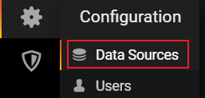
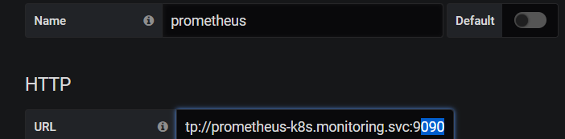
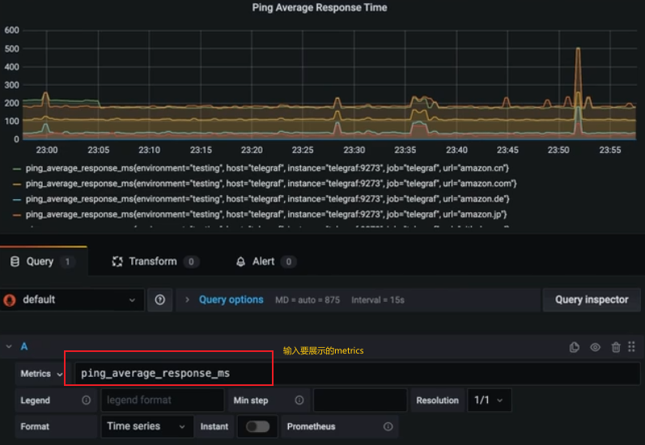
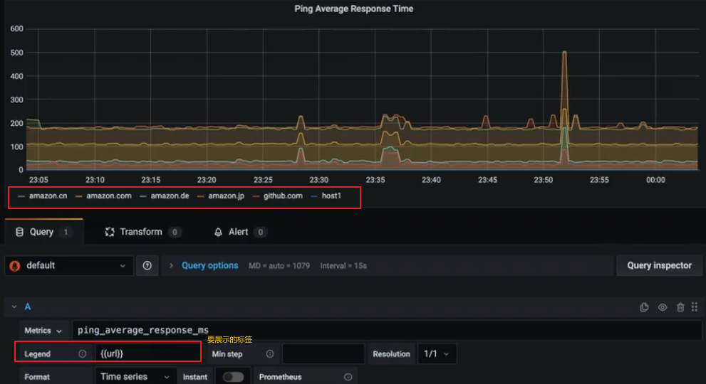
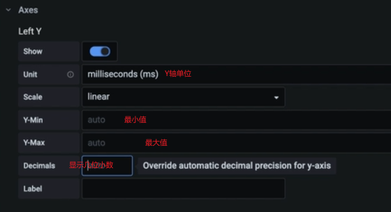
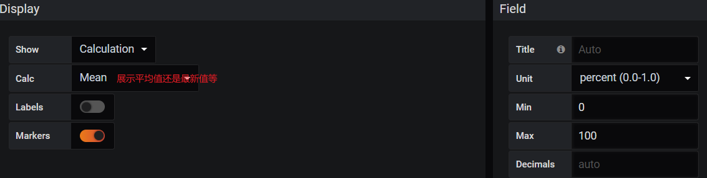
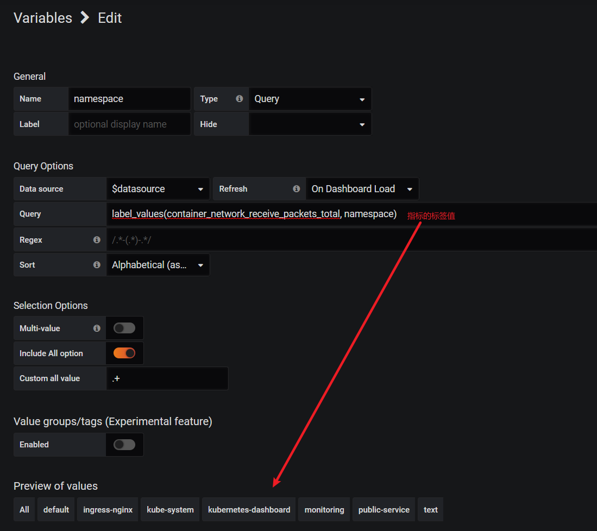
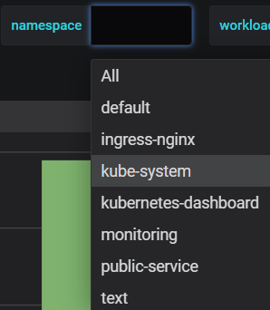
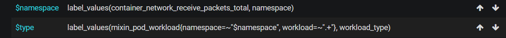
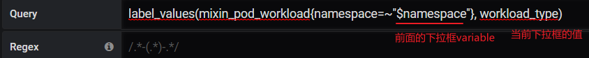

# grafana

支持**Dashboard、Panel、Row**等组合，且支持折线图、柱状图等多种图例

grafana模板很活跃，有很多[用户贡献的面板](https://grafana.com/dashboards)，直接导入就能用

## 连接Prometheus

配置data sources






## 界面介绍


- 创建dashboard，一个dashboard包含多个panel

- 创建folder来分类dashboard
- import导入dashboard模板


查询指标，输入promql

## 编辑panel

### Graph类型

适合展示趋势







### Bar Gauge、Gauge、Stat类型

适合展示当前取值



## dashboard variable

dashboard左上角的下拉框是如何显示的

例子：






namespace下拉框可以跟type下拉框联动，比如namespace选择ingress-nginx时，type只有daemonset

首先把namespace移动到type上面：



可以查看一下promql：

```promql
mixin_pod_workload{namespace="ingress-nginx",pod="ingress-nginx-controller-bwc9s",workload="ingress-nginx-controller",workload_type="daemonset"}
```

配置$type的query：



