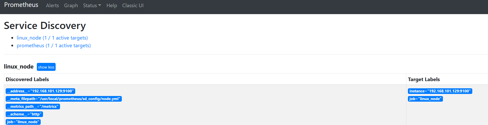

使用文档：https://prometheus.io/docs/guides/node-exporter


安装node_exporter

```shell
tar xvfz node_exporter-1.6.0.linux-amd64.tar.gz
mv node_exporter-1.6.0.linux-amd64 /usr/local/node_exporter

vim /usr/lib/systemd/system/node_exporter.service
[Unit]
Description=Prometheus

[Service]
#ExecStart=/usr/local/node_exporter/node_exporter
ExecStart=/usr/local/node_exporter/node_exporter --collector.systemd --collector.systemd.unit-whitelist=(docker|sshd|nginx).service
Restart=on-failure

[Install]
WantedBy=multi-user.target

systemctl start node_exporter.service
```


修改配置文件

```yaml
vim /usr/local/prometheus/prometheus.yml
scrape_configs:
  - job_name: 'linux_node'
    file_sd_configs:
    - files: ['/usr/local/prometheus/sd_config/node.yml']
      refresh_interval: 5s
      
vim sd_config/node.yml
- targets:
  - 192.168.101.129:9100

systemctl restart prometheus
```


在web界面查看是否监控到




常用监控指标：

cpu采集

node_cpu_seconds_total

node_load 一分钟内cpu负载

node_load5 5分钟内cpu负载

node_load15 15分钟内cpu负载

内存采集

node_memory_MemTotal_bytes 内存总大小

node_memory_MemAvailable_bytes 空闲可用的内存大小（free+buffer+cache）

node_memory_MemFree_bytes 空闲物理内存大小

磁盘采集

node_disk_

文件系统采集

node_filesystem_avail_bytes 空闲大小

node_filesystem_size_bytes 总大小

node_filesystem_files_free 空闲inode大小

node_filesystem_files inode总大小

网络采集

node_network_transmit_bytes_total 网络流出流量

node_network_receive_bytes_total 网络流入流量


promql：

cpu使用率：

100 - (avg(irate(node_cpu_seconds_total{mode="idle"}[5m])) by (instance) * 100)

内存使用率：

100 - (node_memory_MemFree_bytes+node_memory_Cached_bytes+node_memory_Buffers_bytes) / node_memory_MemTotal_bytes *100

硬盘使用率：

100 - (node_filesystem_free_bytes{mountpoint="/",fstype=~"ext4|xfs"} / node_filesystem_size_bytes{mountpoint="/",fstype=~"ext4|xfs"} * 100)


触发器设置

cat node_rules.yml

```yaml
groups:
- name: node_alert
  rules:
  - alert: HostCpuIsUnderUtilized
    expr: 100 - (avg(irate(node_cpu_seconds_total{mode="idle"}[2m])) by (instance) * 100) > 80
    for: 1m
    labels:
    ¦ severity: warning
    annotations:
    ¦ summary: "cpu使用率高，实例:{{ $labels.instance }}"
    ¦ description: "cpu使用率 > 80%，当前值:{{ $value }}"
  - alert: high_load
    expr: node_load1 > 4
    for: 2m
    labels:
    ¦ severity: warning
    annotations:
     summary: "cpu1分钟负载过高，实例：{{ $labels.instance }}"
    ¦ description: "cpu1分钟负载 > 4，已经持续2分钟，当前值：{{ $value }}"
  - alert: HostOutOfMemory
    expr: 100 - (node_memory_MemFree_bytes+node_memory_Cached_bytes+node_memory_Buffers_bytes) / node_memory_MemTotal_bytes *100 > 80
    for: 2m
    labels:
    ¦ severity: warning
    annotations:
    ¦ summary: "主机内存不足，实例：{{ $labels.instance }}"
    ¦ description: "内存使用率>80%，当前值：{{ $value }}"
  - alert: HostUnusualNetworkThroughputIn
    expr: sum (rate(node_network_receive_bytes_total[2m])) by (instance) / 1024 / 1024 > 100
    for: 5m
    labels:
    ¦ severity: warning
    annotations:
    ¦ summary: "异常流入网络吞吐量，实例：{{ $labels.instance }}"
    ¦ description: "网络流入流量 > 100MB/s，当前值：{{ $value }}"
  - alert: HostUnusualNetworkThroughputOut
    expr: sum (rate(node_network_transmit_bytes_total[2m])) by (instance) / 1024 / 1024 > 100
    for: 5m
    labels:
    ¦ severity: warning
    annotations:
    ¦ summary: "异常流出网络吞吐量，实例：{{ $labels.instance }}"
    ¦ description: "网络流出流量 > 100MB/s，当前值：{{ $value }}"
  - alert: HostUnusualDiskReadRate
    expr: sum (rate(node_disk_read_bytes_total[2m])) by (instance) / 1024 / 1024 > 50
    for: 5m
    labels:
    ¦ severity: warning
    annotations:
    ¦ summary: "异常磁盘读取，实例：{{ $labels.instance }}"
    ¦ description: "硬盘读取 > 50MB/s，当前值：{{ $value }}"
  - alert: HostUnusualDiskWriteRate
    expr: sum (rate(node_disk_written_bytes_total[2m])) by (instance) / 1024 / 1024 > 50
    for: 5m
    labels:
    ¦ severity: warning
    annotations:
    ¦ summary: "异常磁盘写入，实例：{{ $labels.instance }}"
    ¦ description: "硬盘写入 > 50MB/s，当前值：{{ $value }}"
  - alert: HostOutOfDiskSpace
    expr: node_filesystem_avail_bytes  / node_filesystem_size_bytes * 100 < 10 and ON (instance, device, mountpoint) node_filesystem_readonly == 0
    for: 2m
    labels:
    ¦ severity: warning
    annotations:
    ¦ summary: "磁盘空间不足告警，实例：{{ $labels.instance }}"
    ¦ description: "剩余磁盘空间 < 10%，当前值：{{ $value }}"
  - alert: HostDiskWillFillIn24Hours
    expr: node_filesystem_avail_bytes  / node_filesystem_size_bytes * 100 < 10 and ON (instance, device, mountpoint) predict_linear(node_filesystem_avail_bytes{fstype!~"tmpfs"}[1h], 24 * 3600) < 0 and ON (instance, device, mountpoint) node_filesystem_readonly == 0
    for: 2m
    labels:
    ¦ severity: warning
    annotations:
    ¦ summary: "磁盘空间将在24小时内耗尽，实例：{{ $labels.instance }}"
    ¦ description: "以当前写入速率预计磁盘空间将在24小时内耗尽，当前值：{{ $value }}"
```


登录grafana，导入1860模板