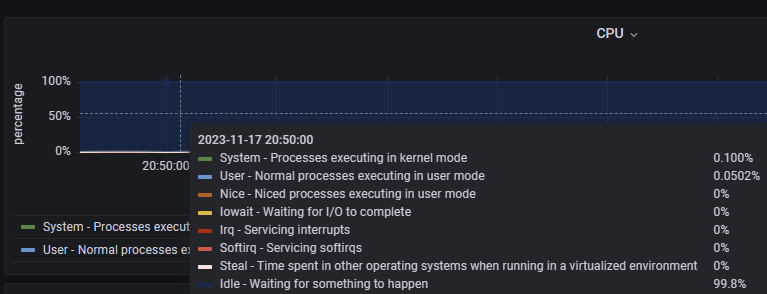

使用文档：https://prometheus.io/docs/guides/node-exporter

Prometheus 生态的机器监控比较简单，就是在所有的目标机器上部署 Node-Exporter，然后在抓取规则中给出所有 Node-Exporter 的地址就可以了。


安装node_exporter

```shell
tar xvfz node_exporter-1.6.0.linux-amd64.tar.gz
mv node_exporter-1.6.0.linux-amd64 /usr/local/node_exporter

vim /usr/lib/systemd/system/node_exporter.service
[Unit]
Description=Prometheus

[Service]
#ExecStart=/usr/local/node_exporter/node_exporter
ExecStart=/usr/local/node_exporter/node_exporter --collector.systemd --collector.systemd.unit-whitelist=(docker|sshd|nginx).service
Restart=on-failure

[Install]
WantedBy=multi-user.target

systemctl start node_exporter.service
```

Node-Exporter 默认内置了很多 collector，比如 cpu、loadavg、filesystem 等，可以通过命令行启动参数来控制这些 collector，比如要关掉某个 collector，使用 --no-collector.<name>，如果要开启某个 collector，使用 --collector.<name>。


修改配置文件

```yaml
vim /usr/local/prometheus/prometheus.yml
scrape_configs:
  - job_name: 'linux_node'
    file_sd_configs:
    - files: ['/usr/local/prometheus/sd_config/node.yml']
      refresh_interval: 5s
      
vim sd_config/node.yml
- targets:
  - 192.168.101.129:9100

systemctl restart prometheus
```

如果要监控更多机器，就在 targets 中写上多个 Node-Exporter 的地址，用逗号隔开。


在web界面查看是否监控到


如何选择node-exporter暴露的监控指标，我们可以按照四大黄金指标给出的维度进行筛选，并且promql语句也不用我们从头写，已经有现有的监控模板可使用。我们用到的监控模板是node exporter full。

由于node exporter full模板里的监控面板实在太多，我们只需要选取其中的某些面板即可。

**cpu**

1， us 代表用户态进程消耗的cpu。

2，sy 代表 内核态程序消耗的cpu。

3，ni 代表低优先级的进程消耗的cpu，当我们使用renice命令调低某个用户进程的优先级时，该用户进程cpu占用率会从us里分到ni里。这样当一批非常吃CPU的进程被调整nice值后，调整的人就能非常清楚的知道，这些进程现在占用多少CPU了。

4，id 代表代表空闲cpu的占用率。

5，wa 代表进程等待cpu执行所花的时间占cpu周期的时长。

6,  hi 代表处理硬件中断的cpu占用率。

7，si 代表软中断的cpu使用率，在linux上，会运行一个特定的进程ksoftirqd 处理软中断的逻辑，软中断你可以把它理解成也是一段程序，不过这段程序运行特点的某些软中断的任务，linux内核为了方便观察这些任务的耗时，专门在cpu使用率里分出一个类别来记录这些软中断的任务运行的cpu占用率。  软中断的任务有多种类型，比如定时器，网络数据包的处理等。

8，st 代表从其他操作系统那里偷取到的cpu，一般在虚拟化环境比如物理主机上部署多台虚拟机或者云主机的条件下，一台虚拟机能够从另一台虚拟机那里抢占cpu，st就代表抢占cpu的时长。

在node exporter full里我们选用了一个cpu的面板，把上述cpu的使用率及其分类后的使用率表现了出来。



其中用到的prometheus的查询语句promql有8个，分别对应8种cpu使用率的分类

**内存**

由于内存是可增可减的，所以是个guage类型的指标，相应的指标信息也是从proc文件系统获取到的，其路径是 /proc/meminfo ,对应的promql语句不用使用什么函数只需要将对应的指标值加减即可，比较容易理解

**page fault 和oom kill次数**

其中page fault分major fault和minor fault 。

major fault是指在分配内存时，内存地址即不在虚拟地址空间也不在物理内存中的情况，这种情况需要将数据从磁盘读到物理内存里并建立映射关系。

minor fault 是指分配内存时，内存地址不在虚拟地址空间，但是已经在物理内存中了，这种情况只需要将虚拟地址和物理地址建立映射就行，比如多个进程共享内存的情况，可能某些进程还没有建立起映射关系，所以访问时会出现minor page fault。

**磁盘**

1，磁盘的使用空间 : 这个很容易理解，当磁盘要满了，就必然存不进新的数据了。

2,  iops :  这个指标是指磁盘每秒读写请求的次数，一般我们在云服务商那里都能看到对应磁盘的这个值，当达到峰值时，会影响磁盘的读写性能。

3, 吞吐量: 这个值代表磁盘每秒写入写出的流量，也就是每秒读写了多少字节数，这个值也是不同磁盘有不同的极限值，当磁盘吞吐量达到最大值后，也会影响到磁盘的性能。

4, 等待时间: 磁盘的读写请求本质上也是排队进行的，它们在队列中会有一个等待时间。

**网络**

1，带宽 :这个和磁盘吞吐量比较类似，是单位时间内传输的字节数，不过单位一般是bit/s 和字节的换算  8 * bit/s = 1 B/s

2, pps : 每秒的收发包数量。

3，连接数

4，网卡层面和tcp层面暴露的错误信息

**进程状态**


触发器设置

cat node_rules.yml

```yaml
groups:
- name: node_alert
  rules:
  - alert: HostCpuIsUnderUtilized
    expr: 100 - (avg(irate(node_cpu_seconds_total{mode="idle"}[2m])) by (instance) * 100) > 80
    for: 1m
    labels:
    ¦ severity: warning
    annotations:
    ¦ summary: "cpu使用率高，实例:{{ $labels.instance }}"
    ¦ description: "cpu使用率 > 80%，当前值:{{ $value }}"
  - alert: high_load
    expr: node_load1 > 4
    for: 2m
    labels:
    ¦ severity: warning
    annotations:
     summary: "cpu1分钟负载过高，实例：{{ $labels.instance }}"
    ¦ description: "cpu1分钟负载 > 4，已经持续2分钟，当前值：{{ $value }}"
  - alert: HostOutOfMemory
    expr: 100 - (node_memory_MemFree_bytes+node_memory_Cached_bytes+node_memory_Buffers_bytes) / node_memory_MemTotal_bytes *100 > 80
    for: 2m
    labels:
    ¦ severity: warning
    annotations:
    ¦ summary: "主机内存不足，实例：{{ $labels.instance }}"
    ¦ description: "内存使用率>80%，当前值：{{ $value }}"
  - alert: HostUnusualNetworkThroughputIn
    expr: sum (rate(node_network_receive_bytes_total[2m])) by (instance) / 1024 / 1024 > 100
    for: 5m
    labels:
    ¦ severity: warning
    annotations:
    ¦ summary: "异常流入网络吞吐量，实例：{{ $labels.instance }}"
    ¦ description: "网络流入流量 > 100MB/s，当前值：{{ $value }}"
  - alert: HostUnusualNetworkThroughputOut
    expr: sum (rate(node_network_transmit_bytes_total[2m])) by (instance) / 1024 / 1024 > 100
    for: 5m
    labels:
    ¦ severity: warning
    annotations:
    ¦ summary: "异常流出网络吞吐量，实例：{{ $labels.instance }}"
    ¦ description: "网络流出流量 > 100MB/s，当前值：{{ $value }}"
  - alert: HostUnusualDiskReadRate
    expr: sum (rate(node_disk_read_bytes_total[2m])) by (instance) / 1024 / 1024 > 50
    for: 5m
    labels:
    ¦ severity: warning
    annotations:
    ¦ summary: "异常磁盘读取，实例：{{ $labels.instance }}"
    ¦ description: "硬盘读取 > 50MB/s，当前值：{{ $value }}"
  - alert: HostUnusualDiskWriteRate
    expr: sum (rate(node_disk_written_bytes_total[2m])) by (instance) / 1024 / 1024 > 50
    for: 5m
    labels:
    ¦ severity: warning
    annotations:
    ¦ summary: "异常磁盘写入，实例：{{ $labels.instance }}"
    ¦ description: "硬盘写入 > 50MB/s，当前值：{{ $value }}"
  - alert: HostOutOfDiskSpace
    expr: node_filesystem_avail_bytes  / node_filesystem_size_bytes * 100 < 10 and ON (instance, device, mountpoint) node_filesystem_readonly == 0
    for: 2m
    labels:
    ¦ severity: warning
    annotations:
    ¦ summary: "磁盘空间不足告警，实例：{{ $labels.instance }}"
    ¦ description: "剩余磁盘空间 < 10%，当前值：{{ $value }}"
  - alert: HostDiskWillFillIn24Hours
    expr: node_filesystem_avail_bytes  / node_filesystem_size_bytes * 100 < 10 and ON (instance, device, mountpoint) predict_linear(node_filesystem_avail_bytes{fstype!~"tmpfs"}[1h], 24 * 3600) < 0 and ON (instance, device, mountpoint) node_filesystem_readonly == 0
    for: 2m
    labels:
    ¦ severity: warning
    annotations:
    ¦ summary: "磁盘空间将在24小时内耗尽，实例：{{ $labels.instance }}"
    ¦ description: "以当前写入速率预计磁盘空间将在24小时内耗尽，当前值：{{ $value }}"
```


