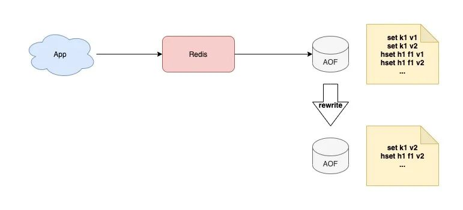
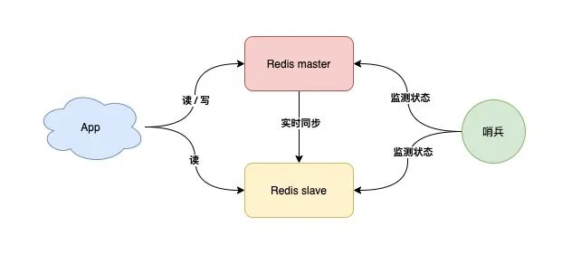
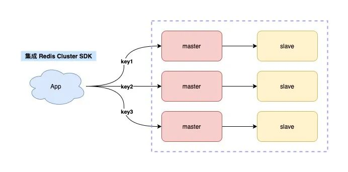

## 单机redis

假设现在你有一个业务应用，需要引入 Redis 来提高应用的性能，此时你可以选择部署一个单机版的 Redis 来使用

业务应用可以把 Redis 当做**缓存**来使用，**存用户的session-cookie**（第一次登录的时候，后端程序会在你的浏览器写入cookie，服务器会将对应的session存入到数据库中，浏览器下一次会携带这个cookie去访问，后端程序会去数据库查看是否有这个seesion，redis的key可以提供过期时间，所以一次登录后超时时间内不用反复登录），支持十万并发

登录数据都存在redis，如果重启了数据丢了，所有用户都要重新登录一遍

而且存在**单点问题**，如果redis宕机了，所有业务流量，都会打到后端 MySQL 上，这会导致你的 MySQL 压力剧增，严重的话甚至会压垮 MySQL。

因为数据存在内存中，如果重启redis，之前的数据就丢失了，由于 Redis 中没有任何数据，业务流量还是都会打到后端 MySQL 上，MySQL 的压力还是很大。

## 数据持久化

Redis 数据持久化可以用「数据快照」的方式来做。

Redis 的数据快照，是记录某一时刻下 Redis 中的数据，然后只需要把这个数据快照写到磁盘上就可以了。

它的优势在于，只在需要持久化时，把数据「一次性」写入磁盘，其它时间都不需要操作磁盘。

基于这个方案，我们可以**定时**给 Redis 做数据快照，把数据持久化到磁盘上，即Redis 的**「RDB」**和**「AOF」**：

- RDB：只持久化某一时刻的数据快照到磁盘上（创建一个子进程来做）
- AOF：每一次写操作都持久到磁盘（主线程写内存，根据策略可以配置由主线程还是子线程进行数据持久化）

**特点：**

1. RDB 采用二进制 + 数据压缩的方式写磁盘，这样文件**体积小**，数据恢复速度也快（适合业务对数据丢失不敏感）
2. AOF 记录的是每一次写命令，**数据最全**，但文件**体积大**，数据恢复速度慢（适合对数据完整性要求比较高）

**对AOF文件瘦身：**

由于 AOF 文件中记录的都是每一次写操作，但对于同一个 key 可能会发生多次修改，我们可以对 AOF 文件定时 rewrite，避免这个文件体积持续膨胀

**混合持久化：**

有没有办法继续缩小AOF文件，可以利用AOF和RDB各自的优点

具体来说，当 AOF rewrite 时，Redis 先以 RDB 格式在 AOF 文件中写入一个数据快照，再把在这期间产生的每一个写命令，追加到 AOF 文件中。因为 RDB 是二进制压缩写入的，这样 AOF 文件体积就变得更小了。

Redis 4.0 以上版本才支持混合持久化。

虽然我们已经把持久化的文件优化到最小了，但在恢复数据时依旧是需要时间的，在这期间你的业务应用还是会受到影响

## 主从复制：双（多）副本

采用多副本的方案主要**解决单点问题**，它的优势是：

1. 缩短不可用时间：master 发生宕机，我们可以手动把 slave 提升为 master 继续提供服务
2. 提升读性能：让 slave 分担一部分读请求，提升应用的整体性能

问题：

切换主备需要**手动**

## 哨兵：故障自动切换

现在，我们可以引入一个「观察者」，让这个观察者去实时监测 master 的健康状态，这个观察者就是「哨兵」。

具体如何做？

1. 哨兵每间隔一段时间，询问 master 是否正常
2. master 正常回复，表示状态正常，回复超时表示异常
3. 哨兵发现异常，发起主从切换

但这里还有一个问题，如果 master 状态正常，但这个哨兵在询问 master 时，它们之间的网络发生了问题，那这个哨兵可能会误判。

我们可以部署多个哨兵，让它们分布在不同的机器上，它们一起监测 master 的状态，流程就变成了这样：

1. 多个哨兵**每间隔一段时间，询问 master 是否正常**
2. master 正常回复，表示状态正常，回复超时表示异常
3. 一旦有一个哨兵判定 master 异常（不管是否是网络问题），就询问其它哨兵，**如果多个哨兵（设置一个阈值）都认为 master 异常了**，这才判定 master 确实发生了故障
4. 多个哨兵经过协商后，判定 master 故障，则发起主从切换

所以，我们用多个哨兵互相协商来判定 master 的状态，这样一来，就可以大大降低误判的概率。

哨兵协商判定 master 异常后，这里还有一个问题：**由哪个哨兵来发起主从切换呢？**

答案是，选出一个哨兵「领导者」，由这个领导者进行主从切换。

问题又来了，这个领导者怎么选？

想象一下，在现实生活中，选举是怎么做的？

是的，投票。

在选举哨兵领导者时，我们可以制定这样一个选举规则：

1. 每个哨兵都询问其它哨兵，请求对方为自己投票
2. 每个哨兵只投票给第一个请求投票的哨兵，且只能投票一次
3. 首先拿到超过半数投票的哨兵，当选为领导者，发起主从切换

再分析一下：

1. 稳定性：Redis 故障宕机，我们有哨兵 + 副本，可以自动完成主从切换
2. 性能：读请求量增长，我们可以再部署多个 slave，读写分离，分担读压力
3. 性能：**写请求量增长**，但我们只有一个 master 实例，这个实例达到瓶颈怎么办？

## 分片集群

一个实例扛不住写压力，那我们是否可以部署多个实例，然后把这些实例按照一定规则组织起来，用于大量数据

现在问题又来了，这么多实例如何组织呢？

我们制定规则如下：

1. 每个节点各自存储一部分数据，所有节点数据之和才是全量数据
2. 制定一个路由规则，对于不同的 key，把它路由到固定一个实例上进行读写

而分片集群根据路由规则所在位置的不同，还可以分为两大类：

1. 客户端分片
2. 服务端分片

这个方案的缺点是，客户端需要维护这个路由规则，也就是说，你需要把路由规则写到你的业务代码中。

如何做到不把路由规则耦合在业务代码中呢？

你可以这样优化，把这个路由规则封装成一个模块，当需要使用时，集成这个模块就可以了。

这就是 Redis Cluster 的采用的方案。

**Redis Cluster 内置了哨兵逻辑，无需再部署哨兵。**