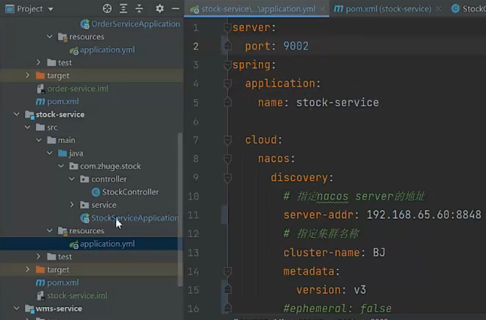
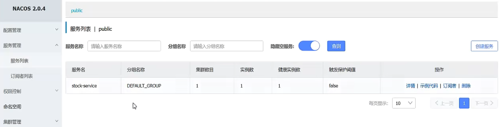
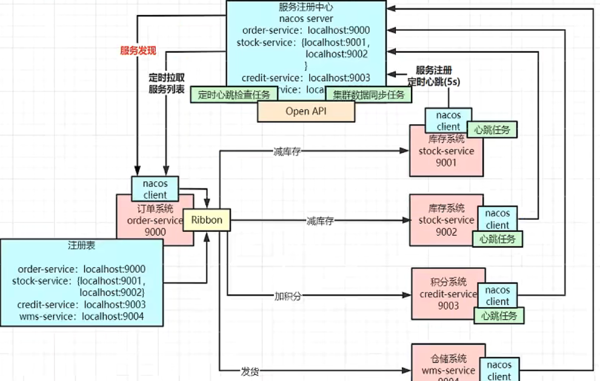

## 安装

[Nacos 快速开始](https://nacos.io/zh-cn/docs/v2/quickstart/quick-start.html)

把服务注册到nacos中：

访问nacos查看服务是否注册进来：

## nacos核心架构图

每个微服务都引入了一个nacos客户端包，启动后会把服务注册到nacos中

发起一个调用时，底层会被Ribbon拦截住，它会拿着要调用的服务名去注册中心查找，然后缓存到本地，然后Ribbon会在本地源码实现负载均衡调用策略

微服务上下线动态感知：

