# 网络知识

## 从交换机到tcp

**交换机通过mac地址表决定信息的流向**，假设黑色计算机要发送信息给橙色计算机，黑色计算机要在报文写上自己的mac和橙色的mac，然后发给交换机，交换机收到后知道了黑色的mac地址，记录下来并绑定到接口1

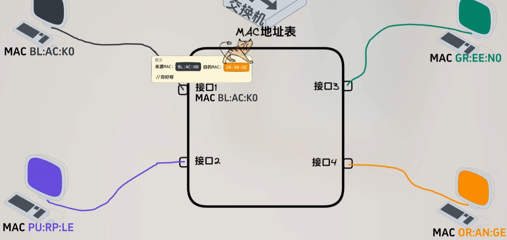

但此时并不知道橙色的mac地址对应的哪个接口，所以只能发给所有人，这种做法就叫**泛洪**，只有橙色能匹配上所以橙色会回应交换机，交换机就把橙色的mac地址绑定到接口4

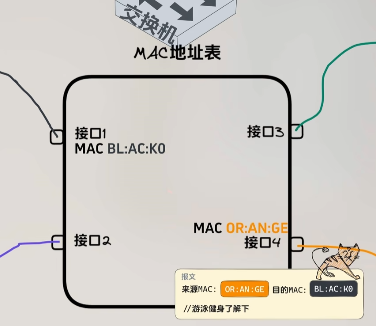

由于之前保存了黑色的mac地址，交换机可以直接发送到接口1，这样就完成了mac地址发现到通信的过程，之后还需要发送消息也是直接发送即可，这就是**交换机的原理**。

然而如果设备更换了网卡，mac地址就改变了，之前一起通信过的计算机也要一起更改，很不方便，所以需要**IP地址**

假设黑色计算机要发送信息给绿色计算机，那么它需要在报文写上自己的ip和绿色计算机的ip，因为要经过交换机所以还要写上mac地址，但此时它并不知道绿色计算机的mac，所以只能通过交换机的泛洪发给所有人

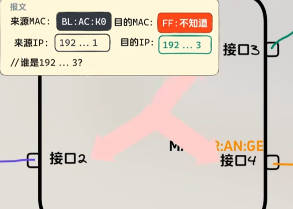

只有绿色计算机和目的ip匹配，于是把黑色的ip和mac绑定记录下来以便下次使用，随后回应黑色告诉自己的mac地址，黑色收到后也把绿色的ip和mac记录下来以便下次使用，有了mac之后就可以直接通信，这个**由ip地址到获得mac地址的过程**，就是**arp协议**，而**计算机里ip和mac绑定的数据表则是arp记录表**

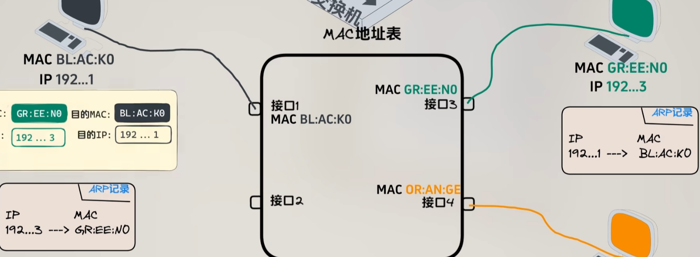

虽然可以通过交换机将不同网络联合起来，但是规模大了后交换机的mac表会无法容纳，全网“泛洪”也会导致效率问题，所以要将网络隔离开来，将网络分成不同的网段，交换机只用来传输同一网段的数据，于是有了子网掩码的概念。**计算机通过子网掩码知道目的ip是否为当前网段**，**对于发往外网的数据**，就交给**路由器**去转发

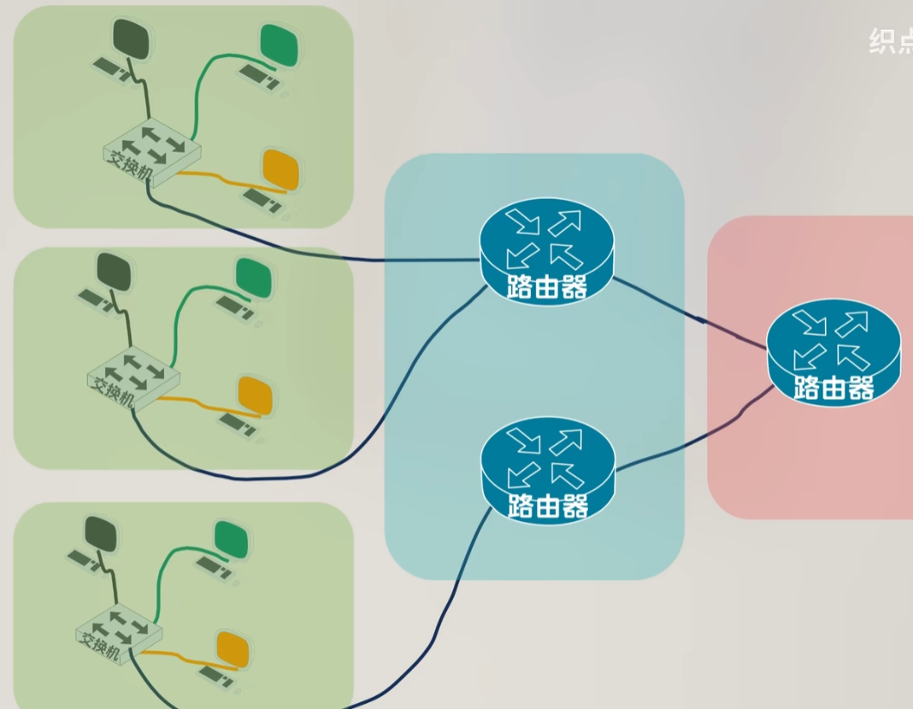

例如黑色要发数据给紫色，通过子网掩码计算出目的ip不是当前网段，于是把数据交给了路由器，之所以知道发送给哪台路由器是因为黑色**计算机配置的网关地址就是路由器的ip**

路由器上有个路由表，可以配置网段和下一跳，用来决定各个网段的数据下一步要交给哪一个路由设备，路由器就通过这种接力的方式将数据发送到紫色

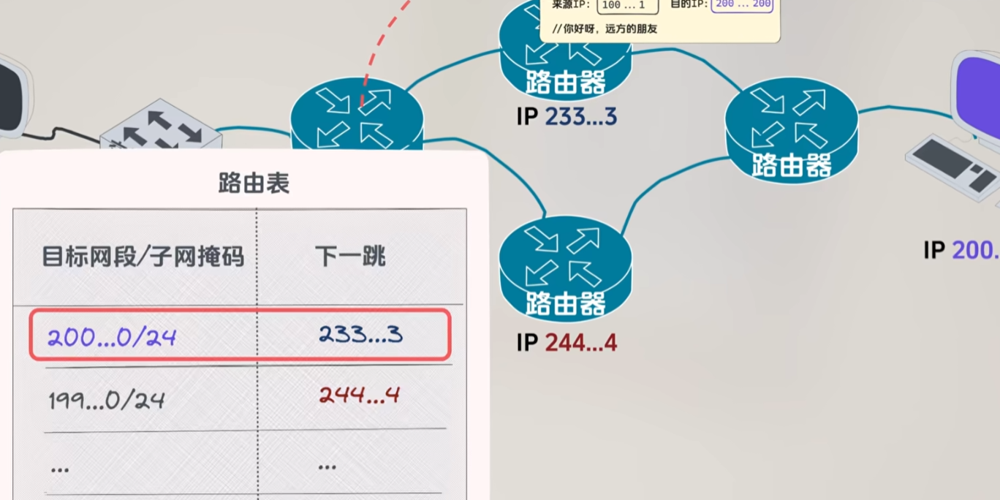

如果路由设备多起来，靠手动维护路由表就很麻烦，于是有了自动管理路由表的**OSPF**等协议，当网络规模继续扩大OSPF也不够用时，于是有了**BGP**等协议

ip协议只负责将数据发送到计算机，但是计算机有多应用，于是引入**端口**的概念，不同的应用使用不同的端口，发送报文时，除了前面提到的mac、ip，还要加上源和目的端口，**这种带端口的消息发送方式就是UDP协议**，但是UDP协议存在很多问题，于是有了稳定可靠的**TCP协议**

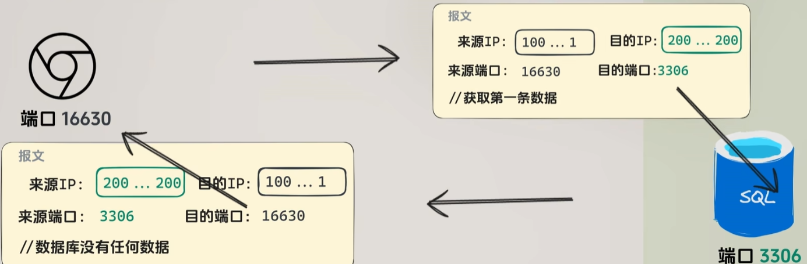

网络是不稳定的，发送的数据可能会中途丢失，所以需要设置**重试机制**，而大段内容发送很容易因为部分丢失导致全部内容要重新发送，所以将数据**分成多个包发送**，重新发送时只需要发丢失的分包就好，此外还需要给**每个分包配上序号**，以免接收方数据乱序

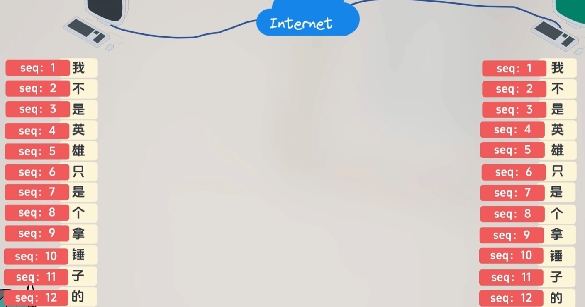

为了提高计算效率，需要双方约定好一起开启、一起结束，这里的开启和结束就叫连接的建立和关闭

tcp建立连接时，发送方先发送一个连接意愿，接收方收到后要响应这个消息和表达连接意愿，接收方的意愿也需要发送方响应，这就是**tcp的三次握手**

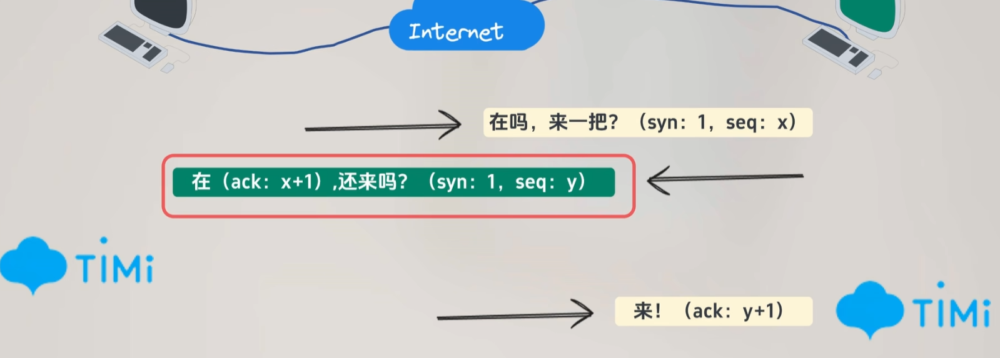

连接建立后，就可以传输数据，前面提到的分包传输是全部一起发送，可能对方处理能力不强或网络带宽有限，导致溢出数据传输失败，于是需要控制每次传输的分包数量，于是有了**滑动窗口、拥塞控制**等技术

数据传输完后要断开连接，同样由发送方发起断开意愿，接收方响应消息并表达断开意愿，发送方也响应这条消息，跟建立连接的过程一样，唯一不同的是，**断开连接中接收方的两条消息不能合为一条**，因为接收方要等数据处理完后再表达断开意愿，中间有时间隔离，这就是**tcp的四次挥手**

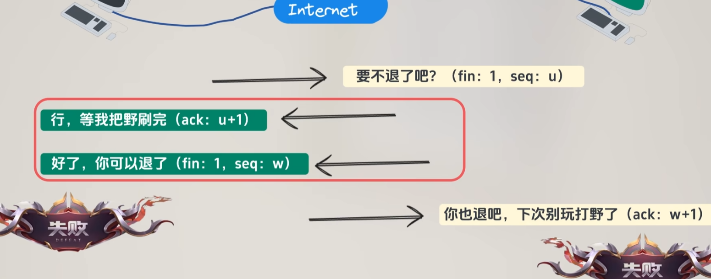

## 访问网址的过程

ip不好记，所以有了**域名**的概念，客户端访问网站从域名服务器获取ip，域名服务器采用”分布式数据库“的形式，根据域名段进行划分，找不到的记录就由下属服务器查询后再层层返回，这种查询方式叫递归查询

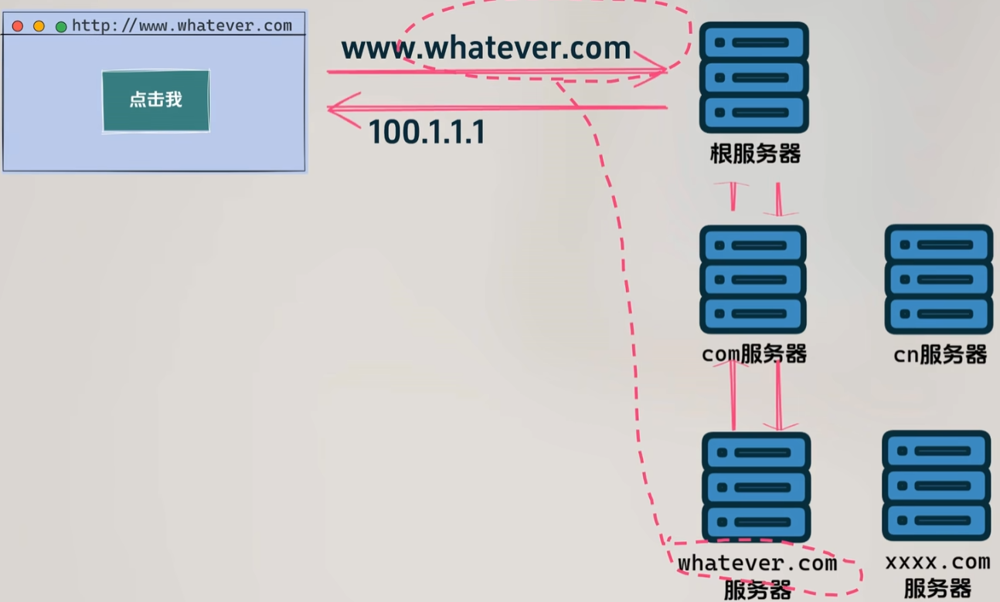

为了提高域名ip查询速度，通常运营商会建立**代理服务器**，代理服务器通过缓存机制，可以使用**迭代查询**的模式

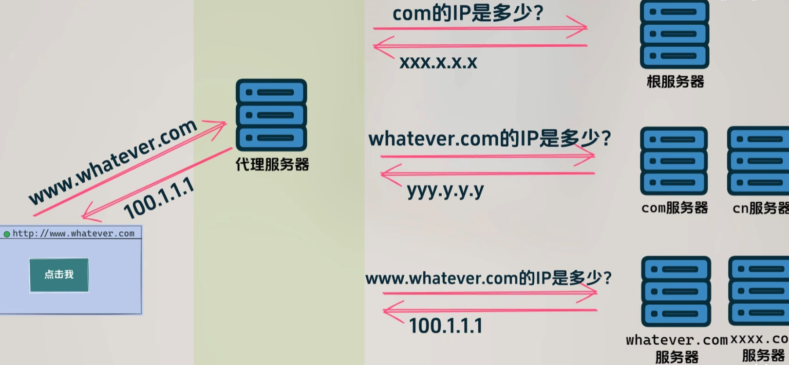

这些不同角色的服务器名都有专属的名称，分别是：**本地服务器、根服务器、顶级域名服务器、权威域名服务器**，它们共同组成了**dns服务**，解决客户端根据域名查询ip的问题。客户端并非每次都要进行dns查询，**浏览器、计算机缓存会把域名ip缓存起来**

用http发送消息是明文，中间环节任何人都可以对内容查阅篡改，所以需要对内容进行加密处理，常见的**非对称加密**，**用私钥上锁后只能用公钥解锁，用公钥上锁只能用私钥解锁**。服务端发送公钥给客户端，客户端用公钥对内容加密，然后发送给服务端，服务端有私钥可以解锁。

但其实还是有风险的，攻击者虽然拿不到服务端的私钥，但是可以掉包服务端的公钥，客户端用攻击者的公钥加密，攻击者就可以用自己的私钥对内容解密，为了潜伏攻击者还会用服务端的公钥加密客户端的内容转发到服务端，这就是所谓的中间人攻击。如果肉身亲自去获取服务端的公钥就最安全，但是不符合实际，于是希望有个机构来帮我们跑，这就是**CA机构**

首先服务端会把域名、公钥等信息发送给CA，CA会将这些信息用非对称加密加密起来，加密后内容变成证书，然后送给服务端，然后又把CA公钥送给客户端，以方便客户端解密证书，这样就降低了中间人攻击的风险

## 协议层次

### OSI七层模型（理论）

| 名称   | 功能                                                         |
| ------ | ------------------------------------------------------------ |
| 应用层 | 应用层协议规定应用进程之间的通信和交互规则。不同的应用有不同的协议，如dns、http、smtp等 |
| 表示层 | 表示层的作用是把数据翻译成计算机能识别的0和1，（对称/非对称）加密，压缩 |
| 会话层 | 确定数据是否需要网络传输，需要就会交给传输层处理             |
| 传输层 | 负责给两台主机进程之间的通信提供通用的传输数据服务。对报文进行分组（发送时），组装（接收时）因为ipv4协议规定数据包的最大长度是2^16(65535)字节。提供TCP、UDP传输协议。封装端口。 |
| 网络层 | IP地址编址（源IP、目标IP），路由选择（两主机之间不止一条通信链路） |
| 链路层 | MAC地址编址、寻址                                            |
| 物理层 | 数据实际传输，电气特性定义（比如网线的8根线哪根不传输）      |

### TCP/IP参考模型（实际工作）

| 名称       | 功能                    |
| ---------- | ----------------------- |
| 应用层     | OSI应用层+表示层+会话层 |
| 传输层     | OSI传输层               |
| 网络层     | OSI网络层               |
| 网络接口层 | OSI链路层+物理层        |

### TCP和UDP

TCP和UDP的区别：

| 类型 | 是否面向连接 | 传输可靠性 | 传输形式   | 传输效率 | 所需资源 | 应用场景 | 首部字节 |
| ---- | ------------ | ---------- | ---------- | -------- | -------- | -------- | -------- |
| TCP  | 是           | **可靠**   | 字节流     | 慢       | 多       | 文件传输 | 20-60    |
| UDP  | 否           | 不可靠     | 数据报文段 | **快**   | 少       | 域名转换 | 8个字节  |

TCP如何保证可靠传输：

1. 应用数据被分割成 TCP 认为最适合发送的数据块。
2. TCP 给发送的每一个包进行编号，接收方对数据包进行排序，把有序数据传送给应用层。
3. **校验和：** TCP 将保持它首部和数据的检验和。这是一个端到端的检验和，目的是检测数据在传输过程中的任何变化。如果收到段的检验和有差错，TCP 将丢弃这个报文段和不确认收到此报文段。
4. TCP 的接收端会丢弃重复的数据。
5. **流量控制：** **TCP 连接的每一方都有固定大小的缓冲空间，TCP的接收端只允许发送端发送接收端缓冲区能接纳的数据。**当接收方来不及处理发送方的数据，能提示发送方降低发送的速率，防止包丢失。TCP 使用的流量控制协议是可变大小的滑动窗口协议。 （TCP 利用**滑动窗口实现流量控制**）
6. **拥塞控制：** 当网络拥塞时，减少数据的发送。
7. **停止等待协议** ：**也是为了实现可靠传输的，它的基本原理就是每发完一个分组就停止发送，等待对方确认**。在收到确认后再发下一个分组。 
8. **超时重传：** 发送端超过一段时间没收到确认，就会重传上次发送的分组，因此每次发完一个分组就会设置一个超时定时器，其重传时间应该比数据在分组传输的平均往返时间要长一些。

## IP/子网掩码

子网掩码计算公式：

- 网络地址（网段的起始地址）：IP地址与子网掩码的二进制按位进行逻辑与运算
- 广播地址（网段的终止地址）：有效子网掩码中，有几个0，就把IP地址的后几位换成1
- 子网个数：有效子网掩码中，有几个1，子网数就是2的几次方
- 主机个数：有效子网掩码中，有几个0，就是2的几次方减2

## ddos攻击

原理就是使用大量的流量把服务器灌满，让其业务处理速度变慢甚至瘫痪

解决办法：

防火墙拦截攻击源的ip

如果攻击源的ip很多拦截不完，有条件可以上高防（具有更高带宽和防ddos能力）和使用cdn，但是比较昂贵

还可以用cloudflare，它的cdn服务是免费的，可以帮助我们挡住大部分ddos攻击，但是它是海外的产品，所以国内的话还是要使用国内的cdn，如果被攻击了再切换到cloudflare，尽管访问速度会变慢但至少不会让服务崩溃