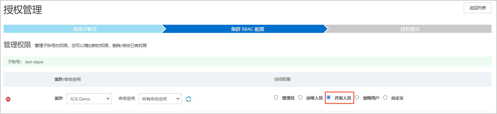

使用容器服务提供的**四种预置角色**来对**目标RAM用户**或RAM角色进行授权

容器服务ACK在集群层面提供了四种预置角色:

| 角色     | 集群内RBAC权限                                               |
| :------- | :----------------------------------------------------------- |
| 管理员   | 对所有命名空间下所有资源的读写权限。                         |
| 运维人员 | 对所有命名空间下控制台可见Kubernetes资源的读写权限，对集群节点、存储卷、命名空间、配额的只读权限。 |
| 开发人员 | 对所有命名空间或所选命名空间下控制台可见Kubernetes资源的读写权限。 |
| 受限用户 | 对所有命名空间或所选命名空间下控制台可见Kubernetes资源的只读权限。 |

## 给开发授权

拥有ACK集群内Kubernetes资源对象的操作权限（即RBAC授权），无需云上资源的访问权限

### RAM授权

### RBAC授权

为授权对象（RAM用户或RAM角色）配置**目标集群**和**对应命名空间的访问权限**



绑定预置角色后，ACK会自动在集群中创建与被授权对象身份对应的ClusterRoleBinding实例：

```yaml
apiVersion: rbac.authorization.k8s.io/v1
kind: ClusterRole
metadata:
  name: cs:ns:dev
rules:
- apiGroups: [""]
  resources:  ["pods", "pods/attach", "pods/exec", "pods/portforward", "pods/proxy"]
  verbs: ["create", "delete", "deletecollection", "get", "list", "patch", "update", "watch"]
- apiGroups: [""]
  resources:  ["configmaps", "endpoints", "persistentvolumeclaims", "replicationcontrollers", "replicationcontrollers/scale", "secrets", "serviceaccounts", "services", "services/proxy"]
  verbs: ["create", "delete", "deletecollection", "get", "list", "patch", "update", "watch"]
- apiGroups: [""]
  resources:  ["events", "replicationcontrollers/status", "pods/log", "pods/status"]
  verbs: ["get", "list", "watch"]
- apiGroups: ["apps"]
  resources:  ["daemonsets", "deployments", "deployments/rollback", "deployments/scale", "replicasets", "replicasets/scale", "statefulsets"]
  verbs: ["create", "delete", "deletecollection", "get", "list", "patch", "update", "watch"]
- apiGroups: ["autoscaling"]
  resources:  ["horizontalpodautoscalers"]
  verbs: ["create", "delete", "deletecollection", "get", "list", "patch", "update", "watch"]
- apiGroups: ["batch"]
  resources:  ["cronjobs", "jobs"]
  verbs: ["create", "delete", "deletecollection", "get", "list", "patch", "update", "watch"]
- apiGroups: ["extensions"]
  resources:  ["daemonsets", "deployments", "deployments/rollback", "deployments/scale","ingresses","replicasets", "replicasets/scale", "replicationcontrollers/scale"]
  verbs: ["create", "delete", "deletecollection", "get", "list", "patch", "update", "watch"]
- apiGroups: ["networking.k8s.io"]
  resources:  ["*"]
  verbs: ["create", "delete", "deletecollection", "get", "list", "patch", "update", "watch"]
- apiGroups: ["servicecatalog.k8s.io"]
  resources:  ["clusterserviceclasses", "clusterserviceplans", "clusterservicebrokers", "serviceinstances", "servicebindings"]
  verbs: ["create", "delete", "get", "list", "patch", "update", "watch"]
- apiGroups: ["servicecatalog.k8s.io"]
  resources:  ["clusterservicebrokers/status", "clusterserviceclasses/status", "clusterserviceplans/status", "serviceinstances/status", "serviceinstances/reference", "servicebindings/status",]
  verbs: ["update"]
- apiGroups: ["alicloud.com"]
  resources:  ["*"]
  verbs: ["create", "delete", "get", "list", "patch", "update", "watch"]
- apiGroups: ["policy"]
  resources:  ["poddisruptionbudgets"]
  verbs: ["create", "delete", "deletecollection", "get", "list", "patch", "update", "watch"]
- apiGroups: ["networking.istio.io"]
  resources:  ["*"]
  verbs: ["create", "delete", "deletecollection", "get", "list", "patch", "update", "watch"]
- apiGroups: ["config.istio.io"]
  resources:  ["*"]
  verbs: ["create", "delete", "deletecollection", "get", "list", "patch", "update", "watch"]
- apiGroups: ["rbac.istio.io"]
  resources:  ["*"]
  verbs: ["create", "delete", "deletecollection", "get", "list", "patch", "update", "watch"]
- apiGroups: ["istio.alibabacloud.com"]
  resources:  ["*"]
  verbs: ["create", "delete", "deletecollection", "get", "list", "patch", "update", "watch"]
- apiGroups: ["authentication.istio.io"]
  resources:  ["*"]
  verbs: ["create", "delete", "deletecollection", "get", "list", "patch", "update", "watch"]
- apiGroups: ["log.alibabacloud.com"]
  resources:  ["*"]
  verbs: ["create", "delete", "deletecollection", "get", "list", "patch", "update", "watch"]
- apiGroups: ["monitoring.kiali.io"]
  resources:  ["*"]
  verbs: ["create", "delete", "deletecollection", "get", "list", "patch", "update", "watch"]
- apiGroups: ["kiali.io"]
  resources:  ["*"]
  verbs: ["create", "delete", "deletecollection", "get", "list", "patch", "update", "watch"]
- apiGroups: ["apiextensions.k8s.io"]
  resources: ["customresourcedefinitions"]
  verbs: ["get", "list", "create", "watch", "patch", "update", "delete", "deletecollection"]
- apiGroups: ["serving.knative.dev"]
  resources: ["*"]
  verbs: ["get", "list", "create", "watch", "patch", "update", "delete", "deletecollection"]
- apiGroups: ["eventing.knative.dev"]
  resources: ["*"]
  verbs: ["get", "list", "create", "watch", "patch", "update", "delete", "deletecollection"]
- apiGroups: ["messaging.knative.dev"]
  resources: ["*"]
  verbs: ["get", "list", "create", "watch", "patch", "update", "delete", "deletecollection"]
- apiGroups: ["sources.eventing.knative.dev"]
  resources: ["*"]
  verbs: ["get", "list", "create", "watch", "patch", "update", "delete", "deletecollection"]
- apiGroups: ["tekton.dev"]
  resources: ["*"]
  verbs: ["get", "list", "create", "watch", "patch", "update", "delete", "deletecollection"]
- apiGroups: ["alert.alibabacloud.com"]
  resources: ["*"]
  verbs: ["get", "list", "create", "watch", "patch", "update", "delete", "deletecollection"]
```

如果需要更细粒度的RBAC权限需求，可以创建自定义ClusterRole，然后在控制平台选择自定义角色

例如对default命名空间的pods有所有权限：

```yaml
apiVersion: rbac.authorization.k8s.io/v1
kind: Role
metadata:
  name: test-role
  namespace: default
rules:
- apiGroups:
  - ""
  resources:
  - pods
  verbs:
  - create
  - delete
  - deletecollection
  - get
  - list
  - patch
  - update
  - watch
```

例如对集群所有pods有所有权限：

```yaml
apiVersion: rbac.authorization.k8s.io/v1
kind: ClusterRole
metadata:
  name: test-clusterrole
rules:
- apiGroups:
  - ""
  resources:
  - pods
  verbs:
  - create
  - delete
  - deletecollection
  - get
  - list
  - patch
  - update
  - watch
```


