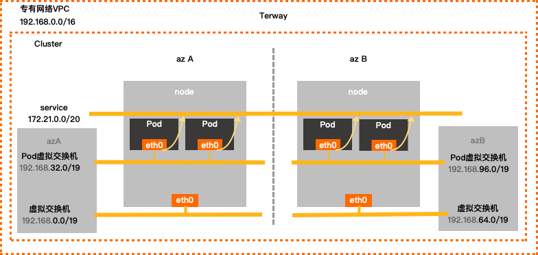

创建ACK Kubernetes集群时，您需要指定专有网络VPC、虚拟交换机、Pod网络CIDR（地址段）和Service CIDR（地址段）



## 通过公网slb的服务公开应用

当Service的类型设置为`Type=LoadBalancer`时，容器服务ACK的CCM（Cloud Controller Manager）组件会自动为该Service创建或配置阿里云负载均衡SLB（Server Load Balancer），包括含SLB、监听、后端服务器组等资源。

部署一个应用：

```yaml
apiVersion: apps/v1 # for versions before 1.8.0 use apps/v1beta1
kind: Deployment
metadata:
  name: my-nginx    #示例应用的名称。
  labels:
    app: nginx
spec:
  replicas: 3       #设置副本数量。
  selector:
    matchLabels:
      app: nginx     #对应服务中Selector的值需要与其一致，才可以通过服务公开此应用。
  template:
    metadata:
      labels:
        app: nginx
    spec:
    #  nodeSelector:
    #    env: test-team
      containers:
      - name: nginx
        image: registry.aliyuncs.com/acs/netdia:latest     #替换为您实际的镜像地址，格式为：<image_name:tags>。
        ports:
        - containerPort: 80                                #需要在服务中暴露该端口。
```

创建service：

```yaml
apiVersion: v1
kind: Service
metadata:
  annotations:
    service.beta.kubernetes.io/alibaba-cloud-loadbalancer-id: ${YOUR_LB_ID}
    service.beta.kubernetes.io/alicloud-loadbalancer-force-override-listeners: 'true'  #设置为true，CCM会根据Service配置管理监听；如果监听已经存在，则CCM会覆盖已有监听。本示例中，SLB实例为新创建，需要为其创建监听，因此设为true
  labels:
    app: nginx
  name: my-nginx-svc
  namespace: default
spec:
  ports:
  - port: 80
    protocol: TCP
    targetPort: 80
  selector:
    app: nginx
  type: LoadBalancer
```

查看service：

```shell
kubectl get svc my-nginx-svc
NAME           TYPE           CLUSTER-IP    EXTERNAL-IP      PORT(S)        AGE
my-nginx-svc   LoadBalancer   172.21.5.82   39.106.XX.XX     80:30471/TCP   5m
```

在集群外可通过SLB域名或`<IP:服务端口>`的方式访问服务：

```shell
curl 39.106.XX.XX
```

## 使用私网SLB

1. 手动申请私网SLB实例

2. 新建service

   ```yaml
   # intranet nginx ingress slb service
   apiVersion: v1
   kind: Service
   metadata:
     # 这里服务取名为nginx-ingress-lb-intranet。
     name: nginx-ingress-lb-intranet
     namespace: kube-system
     labels:
       app: nginx-ingress-lb-intranet
     annotations:
       # 指明SLB实例地址类型为私网类型。
       service.beta.kubernetes.io/alibaba-cloud-loadbalancer-address-type: intranet
       # 修改为您的私网SLB实例ID。
       service.beta.kubernetes.io/alibaba-cloud-loadbalancer-id: <YOUR_INTRANET_SLB_ID>
       # 是否自动创建SLB端口监听（会覆写已有端口监听），也可手动创建端口监听。
       service.beta.kubernetes.io/alibaba-cloud-loadbalancer-force-override-listeners: 'true'
   spec:
     type: LoadBalancer
     # route traffic to other nodes
     externalTrafficPolicy: "Cluster"
     ports:
     - port: 80
       name: http
       targetPort: 80
     - port: 443
       name: https
       targetPort: 443
     selector:
       # select app=ingress-nginx pods
       app: ingress-nginx
   ```

3. 查看svc

   ```shell
   kubectl -n kube-system get svc | grep nginx-ingress-lb
   nginx-ingress-lb-intranet   LoadBalancer   172.19.*.***   192.16*.*.**   80:32394/TCP,443:31000/TCP   7m
   ```

## 配置https

在云端环境使用Kubernetes与SLB（负载均衡器）搭建HTTPS时，有多种实现的方式：

1. 在SLB上配置HTTPS，SLB通过HTTP直接访问到集群内的具体服务（SLB负责处理HTTPS）
2. 在SLB上配置TCP 443端口到Ingress的映射，SLB通过TCP将流量转发到Ingress，在容器集群内为具体服务配置Ingress路由，并配置TLS证书（Ingress负责处理HTTPS）
3. 在SLB上配置HTTPS 443端口到Ingress的映射，SLB通过HTTP将流量转发到Ingress，在容器集群内为具体服务配置Ingress路由（SLB负责处理HTTPS）

### slb配置https证书（1）

适用场景：应用不使用Ingress暴露访问方式，通过LoadBalancer类型的Service进行应用访问的暴露。

1. 配置ssl证书：

- 如果您是通过命令方式创建集群的服务器证书，您需要使用前提条件中创建的公钥证书和私钥上传非阿里云签发证书。具体操作，请参见[上传非阿里云签发证书](https://help.aliyun.com/document_detail/129373.htm#task-1597568)。
- 如果您是通过购买方式获取阿里云签发证书，请跳过此步骤。关于创建阿里云签发证书的操作，请参见[选择阿里云签发证书](https://help.aliyun.com/document_detail/129370.htm#task-1597562)。

2. 创建service：

```yaml
apiVersion: v1
kind: Service
metadata:
  annotations:
    service.beta.kubernetes.io/alibaba-cloud-loadbalancer-protocol-port: "https:443"
    service.beta.kubernetes.io/alibaba-cloud-loadbalancer-cert-id: "${YOUR_CERT_ID}"
  name: nginx
  namespace: default
spec:
  ports:
  - name: https
    port: 443
    protocol: TCP
    targetPort: 80
  - name: http
    port: 80
    protocol: TCP
    targetPort: 80
  selector:
    app: nginx
  type: LoadBalancer
```

在浏览器中输入`https://<slb-instance-ip>`并进行访问

### 在ingress上配置证书（2）

适用场景：每个应用都需要单独的证书进行访问，或者集群中存在需要证书才能访问的应用。

示例：

1. 根据前提条件中准备好的证书执行以下命令创建Secret。

   **说明** 在这里需要正确配置域名，否则后续通过HTTPS访问会有问题。

   ```sql
   kubectl create secret tls secret-https --key tls.key --cert tls.crt      
   ```

2. 登录[容器服务管理控制台](https://cs.console.aliyun.com/)；在集群管理页左侧导航栏中，选择***\*网络\** > \**路由\****；在**路由**页面，单击页面右上角的**创建**。

3. 在**创建**路由对话框中，配置可HTTPS访问的路由，完成后单击**创建**。

   更多详细的路由配置信息，请参见[创建路由（Ingress）](https://help.aliyun.com/document_detail/86536.htm#concept-qm4-kyn-vdb)。本例中进行如下配置。

   - **名称**：输入该路由的名称。
   - **域名**：即是前面配置的正确域名，与SSL证书中配置的保持一致。
   - **服务**：选择应用对应的Service，端口为8080。
   - **开启TLS**：开启TLS后，选择已创建的Secret。

   您也可采用YAML文件的方式创建路由（Ingress），本例对应的YAML示例文件如下。

   ```yaml
   apiVersion: networking.k8s.io/v1
   kind: Ingress
   metadata:
      name: tomcat-https
   spec:
     tls:
     - hosts:
       - foo.bar.com
       secretName: secret-https
     rules:
     - host: foo.bar.com
       http:
         paths:
         - path: /
           backend:
             serviceName: tomcat-svc
             servicePort: 8080
   ```

4. 返回路由列表，查看创建的路由（Ingress），本例中域名为`foo.bar.com`，并查看端点和域名，您也可进入路由详情页进行查看。

### slb配置https（3）


