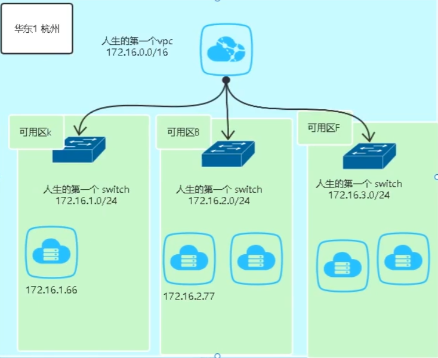

# ECS

## 实例

创建实例的方式：

1. 按照向导创建：灵活地选择配置项，还可以选择创建好的**自定义镜像**（定义了操作系统、应用环境等）方便地创建具有相同操作系统、应用程序和数据的ECS实例
2. 创建相同配置的实例
3. 通过启动模板创建实例

实例规格：

实例规格族名称格式为**ecs.<规格族>**，实例规格名称为**ecs.<规格族>.<nx>large**。

- 业务指标

| 指标       | 计算周期 | 含义                                                        |
| ---------- | -------- | ----------------------------------------------------------- |
| PV         | 天       | web业务一天内的页面访问次数，每打开或刷新一次页面就算一个PV |
| UV         | 天       | web业务一天内访问站点的用户数                               |
| IP         | 天       | web业务一天内有多少个独立的IP浏览了页面                     |
| 用户数     | -        | 业务系统的注册用户数                                        |
| 活跃用户数 | 天       | 一天使用业务系统的用户数                                    |
| 在线用户数 | 天       | 活跃用户中，用户同时在一定时间段在线的数量                  |
| 并发用户数 | -        | 在线用户中，某一时刻同时向服务器发送请求的用户数            |

| PV（万） | 服务器配置   | RDS配置  |
| -------- | ------------ | -------- |
| 1        | 1核/1G/1台   | 无       |
| 10       | 2核/4G/1台   | 1核/1G   |
| 50       | 4核/8G/1台   | 2核/4G   |
| 100      | 8核/16G/1台  | 8核/16G  |
| 500      | 8核/16G/10台 | 8核/16G  |
| 1000     | 8核/16G/20台 | 16核/64G |

## 镜像

镜像就是ECS的**装机盘**，为ECS提供操作系统、应用数据、预装软件。通过镜像可以创建并部署ECS.

自定义镜像是基于**实例或快照**创建的镜像，包含已部署的应用、数据等信息。使用自定义镜像可以快速创建更多相同配置的实例，无需每次创建实例时重复配置操作。

## 块存储

云盘，类似pc的硬盘，需要挂载到云服务器使用

IOPS：万～百万级别

吞吐量：数GB/s

通过快照可以备份和回滚云盘

扩容：

1. 先平台上在线扩容云盘
2. 如果有分区，需要扩容分区和文件系统；如果没有分区，直接扩容文件系统

## 快照

快照指的是云盘数据在某个时刻的完整拷贝或镜像，可以定期备份重要业务数据。

可以通过快照创建自定义镜像，将一台ECS实例的操作系统、数据制作成环境副本，再通过自定义镜像创建多台ECS实例，快速复制应用环境。

通过快照创建云盘，可以快速复制云盘。

**创建快照会暂时降低块存储I/O性能**，一般性能差异在10%以内，出现短暂瞬间变慢。建议选择避开业务高峰的时间点。

回滚快照操作时必需在云服务器ECS实例的**状态为“停止”**时才能进行

## 安全组

虚拟防火墙，控制ECS出/入方向流量，屏蔽IP、端口

默认规则：白名单，拒绝访问

默认情况下，同一个安全组内的ECS内网互通

优先级的取值范围为1~100，数值越小，代表优先级越高。同类型规则间依赖优先级决定最终执行的规则。当ECS实例加入了多个安全组时，多个安全组会从高到低依次匹配规则。最终生效的安全组规则如下：如果两条安全组规则只有授权策略不同：拒绝策略的规则生效，允许策略的规则不生效。如果两条安全组规则只有优先级不同：优先级高的规则生效。

建议：

单个安全组内尽量保持规则简洁。单台实例可以加入多个安全组

避免直接修改线上环境使用的安全组。修改安全组设置后会自动应用于组内所有实例，您可以先克隆一个安全组并在测试环境调试，确保修改后实例间通信正常。

## 网络

两种类型：经典网络（已经不能创建）和专有网络

vpc：虚拟局域网，VPC相当于一个大网段，还可以通过创建虚拟交换机划分多个子网

如图，相当于在杭州创建了一个网段为172.16.0.0/16的局域网，然后再划分成3个子网

专有网络内互通，专有网络间隔离

通过建立ClassicLink连接，使经典网络类型的ECS实例可以和专有网络VPC中的云资源通过内网互通

步骤：

1. 在专有网络的基本信息页面开启ClassicLink
2. 在经典网络ECS实例的安全组，设置ClassicLink安全组规则
   - 找到目标经典网络类型ECS实例，在详情页面点**设置专有网络连接状态**，选择**目标专有网络**，点确定
   - 单击**前往实例安全组列表添加classicLink安全组规则**

出网带宽收费，入网免费

## 升降配置

