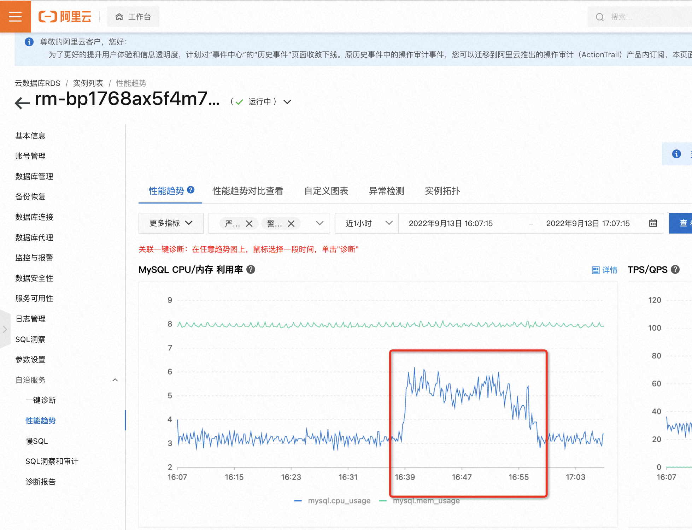
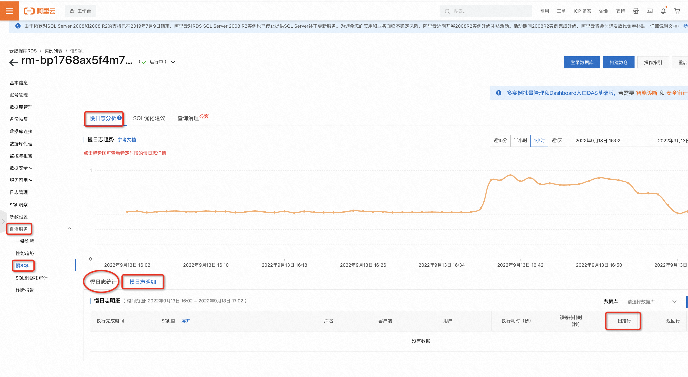
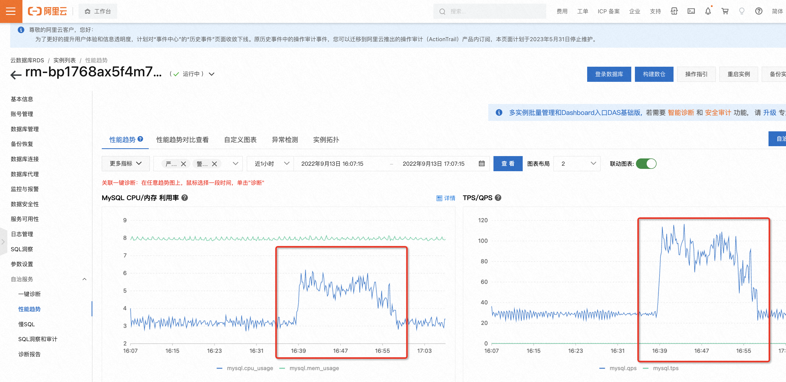

问题描述：cpu超过100%，实例偶尔出现卡住的现象

常见原因：存在扫描量大的慢SQL；QPS高

排查步骤：

RDS控制台>自治服务>性能趋势>MySQL CPU/内存 利用率，**获取到CPU使用率高的时间范围**

RDS控制台>自治服务>慢SQL，输入CPU使用率高的时间范围，查询对应慢日志明细，主要关注**“扫描行”较大的慢请求**。若慢SQL较多，不直观，可以通过慢日志统计分析。获取到扫描量大的慢请求后，优化后再观察下是否还存在性能问题。

如果RDS不存在扫描量大的慢请求，可以查看**QPS**监控，与CPU使用率监控曲线是否吻合，若吻合，则建议考虑升级实例规格。

