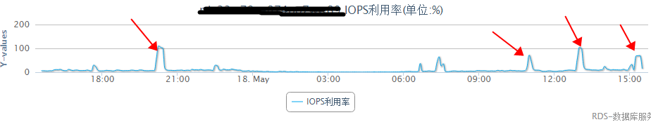
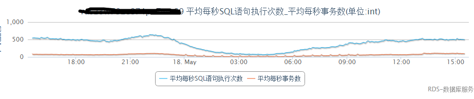
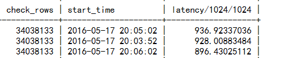

问题描述：

每天隔一段时间就会出现IOPS 100%



排查思路：

```
   (1).慢SQL问题：通过优化索引，子查询，隐士转换，分页改写等优化；
   (2).DDL：create index，optimze table，alter table add column，create as select ；
```

一.慢SQL

```
  根据以上的排查思路我们首先去定位在IOPS高的时间段慢SQL，通过排查发现慢日志中根本就没有明显的慢日志出现，数据库慢日志设置的时间阀值是1秒，难道是我们的阀值太大了吗？不对，IOPS张高期间数据库的QPS并没有明显增加，所以看来并不是慢日志的问题。
```



二.DDL

```
 慢日志中没有发现线索，那么是不是DDL导致的，用户有定时的DDL任务或者create as select的操作，这个可以通过审计日志进行排查跟踪，结果还没有发现问题所在，高峰期间并没有DDL操作。
```

三.审计日志

```
 经过上面两步骤的排查并没有结果，所以这个时候只能排查一些IOPS高峰期间的所有SQL了，这是没有的办法的办法。把出问题时间段的SQL审计日志拉出来进行分析，结果让人很惊喜：
```



我们发现有三条SQL执行时间超过了900秒，同时扫描的行数也超过了3kw，很明显iops高的原因就是这三条SQL在捣蛋：

| mysql> explain SELECT * FROM user WHERE id != 6088883 AND name like '34218864' OR id =34218864 LIMIT 0, 1 ; |             |         |       |               |         |         |      |          |             |
| :----------------------------------------------------------- | ----------- | ------- | ----- | ------------- | ------- | ------- | ---- | -------- | ----------- |
| id                                                           | select_type | table   | type  | possible_keys | key     | key_len | ref  | rows     | Extra       |
| 1                                                            | SIMPLE      | wn_user | range | PRIMARY       | PRIMARY | 4       | NULL | 34234220 | Using where |

可以看到上面捣蛋SQL的执行计划与审计日志中的check_rows相同，所以通知用户将该SQL下线掉。

为什么慢日志里面没有记录着三条捣蛋sql，还是通过审计日志发现，这三条sql都没有执行成功，所以它是不会记录到慢日志中的。