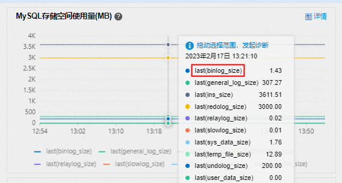

## 备份

支持手动备份和自动备份


两种备份功能：

- RDS备份（物理备份或快照备份）：RDS本身提供的备份功能，包括全量（数据）和增量（日志）备份。
  - 本地盘才能备份部分库表，不能增量和定时
  - 不能呢跨账号备份
  - 只能手动下载备份
  - 可以恢复到新实例和原实例，不能恢复到其他已有实例和本地自建库
  
- [通过DBS备份](https://help.aliyun.com/document_detail/59133.htm#multiTask228)（逻辑备份）：DBS的逻辑备份，提供高级备份功能，包括跨账号备份、快速查询等。
  - 不能秒级恢复


备份的组成：

- **数据备份**：系统对数据进行备份，并生成备份集。您可以恢复备份集所在时间点的数据。
- **日志备份**（可以关闭）：也叫**增量备份**。开启日志备份后，本地日志会上传，形成日志备份。基于“数据备份+日志备份”，您可以恢复时间范围内**任意时间点**的数据。

数据备份和日志备份都存放在备份空间，不占用存储空间


备份在备实例执行，不占用主实例CPU，不影响主实例性能。

可使用命令行或图形界面进行逻辑数据备份。仅限通过 RDS 管理控制台 或 OPEN API 进行物理备份。


### 本地日志

一般当Binlog文件大小超过 512 MB就会生成新的binlog文件继续写入，但是binlog文件也可能大于512MB，例如执行大事务时要等大事务完成时才能进行binlog切换

主、从节点的Binlog大小默认是一致的，但可能因为主从延迟导致不一致


获取binlog：

通过RDS控制台直接下载日志文件

客户端连接实例，执行以下SQL语句

```mysql
show binary logs;
```

根据上一步获取的Binlog文件名，在客户端执行以下命令，远程获取Binlog日志并保存至本地

```mysql
mysqlbinlog -u[$User] -p[$Password] -h[$Host] --read-from-remote-server --raw mysql-bin.XXX > [$File_Name]
```


通过mysqlbinlog工具查看binlog日志内容：

```
mysqlbinlog -vv --base64-output=decode-rows mysql-bin.XXX | more
```

- `-vv`参数为查看具体SQL语句及备注。
- `--base64-output=decode-rows`参数为解析Binlog日志文件。


查看本地日志大小：

在左侧导航栏选择**监控与报警**，查看日志空间使用量



## 恢复

### 恢复全量数据

使用原实例的数据备份和日志备份创建新实例


| 恢复位置           | 恢复方法                                                     |
| :----------------- | :----------------------------------------------------------- |
| 恢复到原实例       | 方法一：先[恢复到新实例](https://help.aliyun.com/document_detail/96147.html?spm=a2c4g.96043.0.0.34ec233ajftEFI#section-7se-ns2-8uh)，验证数据后，再将部分或全部库表数据[迁移至原实例](https://help.aliyun.com/document_detail/96154.htm#concept-fxm-bhp-ydb)。方法二：使用库表恢复功能将全量数据恢复至原实例，具体请参见[恢复库表](https://help.aliyun.com/document_detail/103175.htm#concept-ocr-swk-ngb)。方法三：如果有使用DBS创建逻辑备份，可以直接将其恢复至原实例，具体请参见[恢复逻辑备份](https://help.aliyun.com/document_detail/204388.htm#task-2044257)。 |
| 恢复到其他已有实例 | 方法一：先[恢复到新实例](https://help.aliyun.com/document_detail/96147.html?spm=a2c4g.96043.0.0.34ec233ajftEFI#section-7se-ns2-8uh)，验证数据后，再[迁移至其他已有实例](https://help.aliyun.com/document_detail/96154.htm#concept-fxm-bhp-ydb)。方法二：如果有使用DBS创建逻辑备份，可以直接将其恢复至其它已有实例，具体请参见[恢复逻辑备份](https://help.aliyun.com/document_detail/204388.htm#task-2044257)。 |
| 恢复到本地数据库   | 方法一：先[恢复到新实例](https://help.aliyun.com/document_detail/96147.html?spm=a2c4g.96043.0.0.34ec233ajftEFI#section-7se-ns2-8uh)，验证数据后，再[迁移至自建数据库](https://help.aliyun.com/document_detail/96154.htm#concept-fxm-bhp-ydb)。方法二：如果有使用DBS创建逻辑备份，可以直接将其恢复至自建数据库，具体请参见[恢复逻辑备份](https://help.aliyun.com/document_detail/204388.htm#task-2044257)。方法三：先[下载备份](https://help.aliyun.com/document_detail/98819.htm#concept-yjb-pn4-ydb)，再将备份文件恢复至自建数据库，具体请参见[RDS MySQL物理备份文件恢复到自建数据库](https://help.aliyun.com/document_detail/41817.htm#concept-41817-zh)、[RDS MySQL逻辑备份文件恢复到自建数据库](https://help.aliyun.com/document_detail/97438.htm#concept-zql-2c5-vfb)或[RDS MySQL CSV或SQL文件恢复到自建数据库](https://help.aliyun.com/document_detail/433343.htm#task-2221514)。 |

### 恢复库表

云盘实例暂不支持常规库表恢复，仅本地盘实例支持恢复到原实例和新实例


