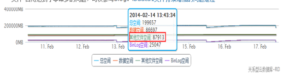

RDS的空间组成：磁盘总空间，数据空间，日志空间，临时文件空间，系统文件空间


一. 数据文件：

```sql
顾名思义该文件空间则是指的存放用户数据的文件，对应到数据库中就是一张张的表，表的组成主要包括：数据和索引两类，所以当你看到你的数据文件占用实例的空间非常多的时候，你需要看一下到底是哪一张表占用了我的空间，用户可以通过数据库的数据字典找到系统中占用最大的表：

select TABLE_SCHEMA,TABLE_NAME,INDEX_LENGTH/1024/1024 as index_M,DATA_LENGTH/1024/1024 as data_M from TABLES order by (INDEX_LENGTH+DATA_LENGTH) desc limit 10
```

常见的空间问题：

1. **对表进行数据删除后空间不会进行释放**
   最佳实践：需要对表进行重建，重建的方法：Optimize table xxxxx，该方法在5.6以下会导致锁表，RDS 5.6支持在线重建。
2. **大表索引占用的空间比数据空间还大**
   最佳实践：需要将表中无用或者重复的索引删除，删除索引需要特别注意该索引是否还在使用。
3. **大表主要用作日志型业务数据存储，基本都是插入，很少查询**
   最佳实践：可以使用tokudb引擎将表中的数据进行压缩，通常压缩效率在3倍以上，注意使用tokudb引擎需要调整tokudb的buffer，可参考参数优化loose_tokudb_buffer_pool_ratio。

二. 日志文件：

```
RDS MySQL采用主从M-M的高可用架构，其主备之间的数据同步依靠binlog日志。为了减少binlog日志对用户的空间的占用，RDS会定时把日志备份到oss中，然后将本地的binlog清除。当日志空间出现异常的时候，如下图，由于应用写入数据压力过大，导致binlog日志增加的速度大于了RDS上传到oss的速度，造成了binlog日志增长迅猛，这时候需要用户对数据库进行优化，减小对数据库的变更操作。
```

1. 曾经看到这样的案例，应用频繁的对表进行更新，但是在该表上有较多的大字段，由于在row格式下，binlog会记录整行记录，这样就导致了binlog增长非常迅猛，详细可以参考Mysql大字段的频繁更新导致binlog暴增。所以在应用的设计初期，就要**避免使用大字段**：varchar(8000),text,blob,clob等。
2. 还有一种情况可能是**主备的复制卡主或者中断**，则会导致主库的binlog没有传递到备库，那么这个时候binlog会一直在主库堆积，那么就需要提工单要求尽快处理了。

三. 临时文件：

```
临时文件通常可以理解为数据库做一个大的操作，由于内存不足，数据库需要将内存中的文件写到磁盘上，这样则有可能导致临时文件写的非常大，通常出现这种情况的时候，数据库在做大的排序操作（order by，group by，distinct）。下图的案例中，由于数据库中一条order by的语句频繁的执行，但是排序sql没有索引，导致了临时文件的频繁写操作：
```

1. 当临时空间上涨原因是SQL排序导致的时候，可以通过show processlist快速找出排序的SQL，然后kill 掉SQL；
2. 同时对排序的sql添加合适的索引，避免排序，这是治根的办法，避免数据库中出现排序的SQL；
3. 为了避免排序消耗的空间过大，可以设置临时空间的大小，具体可以参考RDS参数优化loose_rds_max_tmp_disk_space；

四. 系统文件：

```
系统文件是每个数据库在安装的时候会初始化一些系统文件，这些系统文件是数据库正常运行的前提，mysql：ibdata1，ib_logfile0，下面的这幅图反映了 “其他文件”占用达到了非常多的问题，可以参考：ibdata1文件持续增加的问题定位 
```



1. ibdata1文件中大量的都是undo_log，建议将版本升级到5.6以上有独立的purge线程可以很快的回收掉undo log，可以单独设置undo tablespace文件，避免与ibdata1混用在一起；
2. 同时也可以采用逻辑迁移的方式，重建ibdata1文件；
3. 数据库中要注意未提交的事务对undo的影响，监控数据库中的INNODB_TRX视图。