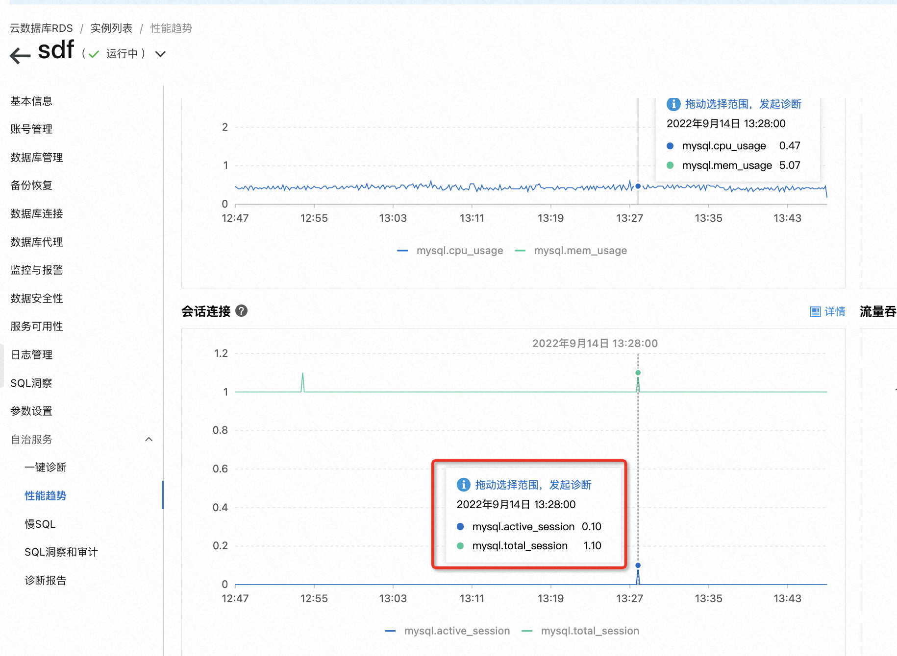

问题描述：连接数打满如何处理

**一、快速的解决方法**

1. RDS控制台>>自治服务>>一键诊断>>会话管理，可以kill会话快速释放连接。

1. 重启实例【一般不建议这个方案，如果此时会话有大事务或者事务很多，会非常致命，重启时间可能会很长，且人工无法介入，只能等】

**二、根本的解决方法**

RDS控制台>>自治服务>>性能趋势，通过会话连接监控，可以判断出是空闲连接多导致的，还是活跃连接

\>>如果是空闲连接【active_session很少，total_session很大】导致的

1. 建议业务侧的链接池限制下最大连接数，比如最大连接数是1000，可以设置为900，预留一些链接资源应急
2. 业务侧代码链接用完后，及时close回收掉
3. 调低RDS侧的wait_timeout和interactive_timeout，这个方案治标不治本，不推荐

\>>如果是活跃连接【active_session很大，几乎等于total_session】导致的，要确认下是业务高并发导致的，还是有锁，还是性能问题导致会话的阻塞

1. 业务高并发>>建议升级配置
2. 锁>>获取锁信息，解决锁问题
3. 性能问题>>获取慢SQL，做优化