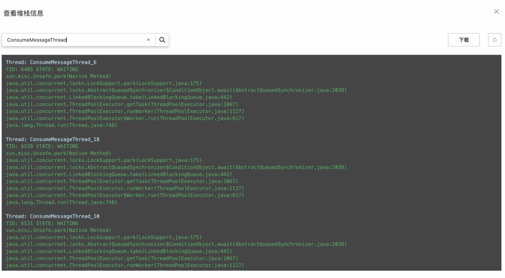

# RocketMQ 监控告警：生产环境如何快速通过监控预警发现堆积、收发失败等问题？

## RocketMQ 监控告警介绍

RocketMQ 联合阿里云云监控提供了开箱即用且免费的监控报警服务：

- 实例规格水位监控预警

若您实际使用的指标值超过实例的规格限制，**RocketMQ会进行强制限流**。提前配置实例规格水位告警可以提前发现规格超限风险并及时升配，避免因限流导致的业务故障。

- 业务逻辑错误监控预警

您在消息收发时可能会收到异常报错，配置调用错误告警可以提前在业务反馈前发现异常，帮助您提前判断异常来源并及时修复。

- 业务性能指标监控预警

如果您的消息链路有相关性能指标要求，例如RT耗时、消息延迟等，提前配置业务指标告警可以帮助您提前治理业务风险。

RocketMQ 版提供了丰富的 Metric 指标和告警监控项。各监控项可分为运行水位、收发性能、异常错误事件三类告警。根据大量生产环境实践经验，建议您根据以下原则配置如下告警

## 应用场景1：消息堆积问题

**消息堆积指标及监控配置**

业界通用指标：使用消息堆积量（ready + inflight）来度量消费健康度，表示未处理完成的消息量；部分产品额外增加已就绪消息量来度量消息拉取的及时性；使用上述 2 个指标直接来配置报警有以下缺点：

- 有误报或无法触发报警的问题
- 及时性的间接指标，不直观

RocketMQ 指标：额外支持延时时间来度量消费健康度，涵盖了所有业务场景，根据业务容忍延迟度直接配置时间告警阈值。

- **消息处理延迟时间**：表示业务处理完成及时度
- **已就绪消息排队时间**：表示拉取消息及时度

建议对消息堆积敏感的用户，都在 RocketMQ 实例页的监控报警，添加如下报警指标，并设置符合业务需求的阈值。

**如何定位和处理堆积问题**

假如收到堆积报警，确认消息出现堆积情况，可参考以下措施进行定位和处理。

1. **判断消息堆积在 RocketMQ 服务端还是客户端**

- 查看客户端本地日志文件 ons.log，搜索是否出现如下信息：the cached message count exceeds the threshold
- 出现相关日志信息，说明客户端本地缓冲队列已满，消息堆积在客户端，请执行步骤2。
- 若未出现相关日志，说明消息堆积不在客户端，若出现这种特殊情况，请直接提交工单联系阿里云技术支持。

2. **确认消息的消费耗时是否合理**

- 若查看到消费耗时较长，则需要查看客户端堆栈信息排查具体业务逻辑，请执行步骤3。
- 若查看到消费耗时正常，则有可能是因为消费并发度不够导致消息堆积，需要逐步调大消费线程或扩容节点来解决。

消息的消费耗时可以通过以下方式查看：

查看消费者状态，在客户端连接信息中查看业务处理时间，获取消费耗时的平均值。

3. 查看客户端堆栈信息。只需要关注线程名为 ConsumeMessageThread 的线程，这些都是业务消费消息的逻辑。

- 客户端堆栈信息可以通过以下方式获取：查看消费者状态，在客户端连接信息中查看 Java 客户端堆栈信息

- 使用 Jstack 工具打印堆栈信息。

常见的异常堆栈信息如下：

- - 示例一：

- 消费逻辑有抢锁休眠等待等情况。

- 消费线程阻塞在内部的一个睡眠等待上，导致消费缓慢。

- - 

- - 示例二：

- 消费逻辑操作数据库等外部存储卡住。

- 消费线程阻塞在外部的 HTTP 调用上，导致消费缓慢。

- - 

4. 针对某些特殊业务场景，如果消息堆积已经影响到业务运行，且堆积的消息本身可以跳过不消费，您可以通过重置消费位点跳过这些堆积的消息从最新位点开始消费，快速恢复业务。

**如何避免消息堆积**

为了避免在业务使用时出现非预期的消息堆积和延迟问题，需要在前期设计阶段对整个业务逻辑进行完善的排查和梳理。整理出正常业务运行场景下的性能基线，才能在故障场景下迅速定位到阻塞点。其中最重要的就是梳理消息的消费耗时和消息消费的并发度。

- 梳理消息的消费耗时通过压测获取消息的消费耗时，并对耗时较高的操作的代码逻辑进行分析。梳理消息的消费耗时需要关注以下信息：

- - 消息消费逻辑的计算复杂度是否过高，代码是否存在无限循环和递归等缺陷。
  - 消息消费逻辑中的 I/O 操作（如：外部调用、读写存储等）是否是必须的，能否用本地缓存等方案规避。外部 I/O 操作通常包括如下业务逻辑：

- - 读写外部数据库，例如 MySQL 数据库读写。
  - 读写外部缓存等系统，例如 Redis 读写。
  - 下游系统调用，例如 Dubbo 调用或者下游 HTTP 接口调用。

- - 消费逻辑中的复杂耗时的操作是否可以做异步化处理，如果可以是否会造成逻辑错乱（消费完成但异步操作未完成）。

- 设置消息的消费并发度

1. - 逐步调大线程的单个节点的线程数，并观测节点的系统指标，得到单个节点最优的消费线程数和消息吞吐量。
   - 得到单个节点的最优线程数和消息吞吐量后，根据上下游链路的流量峰值计算出需要设置的节点数，节点数=流量峰值/单线程消息吞吐量。

## 应用场景2：消息收发失败问题

**消息收发的核心流程**

从上图中可以看出消息收发都要先从 NameServer 返回路由，再通过 broker 的鉴权以及实例规格是否超限的判断，才能进行正常收发消息。根据经验检消息收发失败的原因有如下情况：

- API 请求频率是否超过实例规格限制
- 查网络是否正常
- 服务端是否是有重启造成的短期收发失败
- 操作资源是否有权限

**常见的消息收发失败异常**

在无论开发阶段还是生产运行阶段，遇到收发失败问题，我们都可以从客户端日志出发进行排查。以下列举下常见的消息收发失败异常场景：

1. 在客户端日志中出现ClusterName ** consumer groupId ** consumer topic ** messages flow control, flow limit threshold is ***, remainMs **异常信息

原因：RocketMQ 每个实例都明确了消息收发 API 调用 TPS，例如，标准版实例支持每秒 5000 次 API 调用，若实例消息收发 API 调用频率超过规格限制，会导致实例被限流。实例被限流后，导致部分消息收发请求失败。

建议措施：

1. a. 配置实例 API 调用频率监控告警

建议设置为规格上限的 70%。例如，您购买的实例消息收发 TPS 上限为 10000，则告警阈值建议设置为 7000。

1. b. 配置限流次数告警

RocketMQ 支持将指定实例触发限流的事件作为监控项，通过对限流次数的监控，可以帮助您了解当前业务的受损情况。

2. 在客户端日志中出现RemotingConnectException: connect to <118.xx.xx.xx:80> failed 或者 RemotingTimeoutException 等异常信息。

可能有如下原因：

1. - MQ 服务升级过程中 , 会出现短暂的网络闪断，查看官网公告看是否在服务升级窗口
   - 检查应用服务器到broker的网络是否通畅，是否有网络延迟
   - 检查应用的网络带宽情况，是否被打满
   - 确认下应用是否出现 FGC 现象，FGC 会造成一定的网络延迟

3. 在客户端日志当中出现 system busy, start flow control for a while 或者 broker busy, start flow control for a while等异常信息。

可能原因：共享集群 broker（出现网络，磁盘，IO 等抖动）压力大，造成消息收发出现排队现象；若是偶尔短暂抖动，此类错误 SDK 会自动重试，但建议在自己的业务代码做好异常处理，当自动重试次数超限仍失败情况下，业务根据需要做好容灾。若长时间持续出现，可以提工单让技术人员跟进排查。