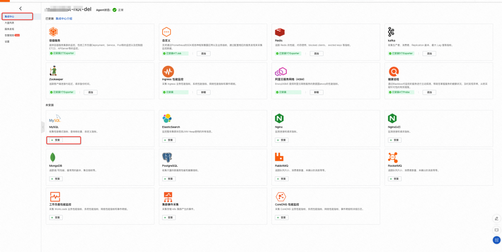
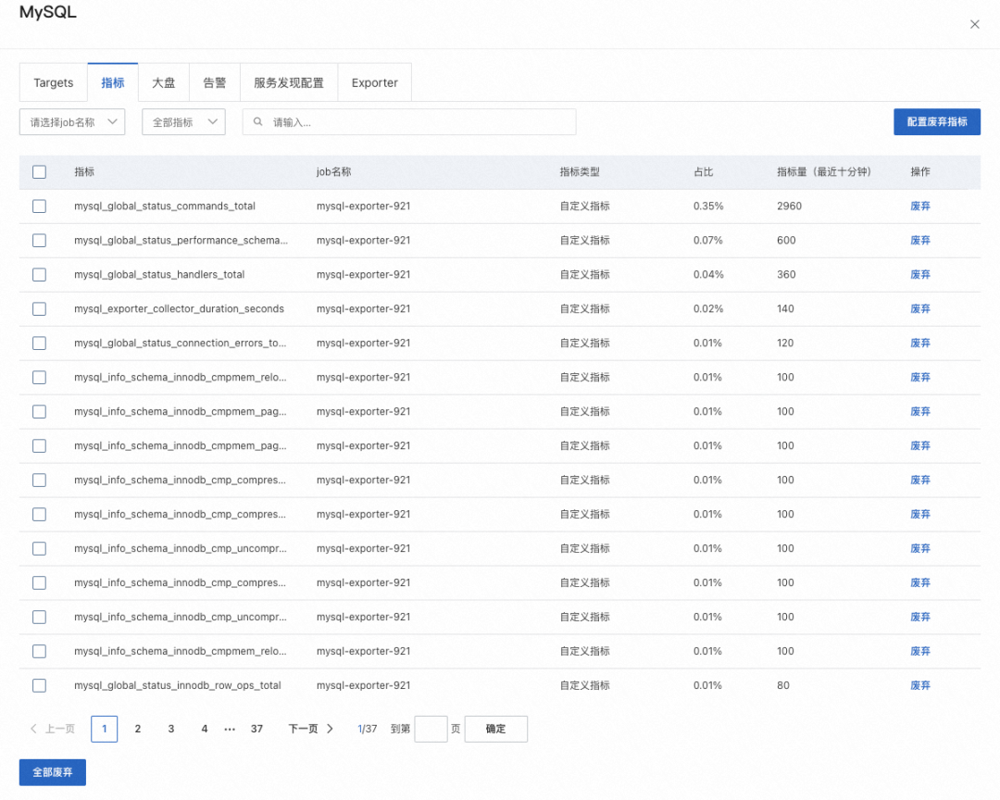
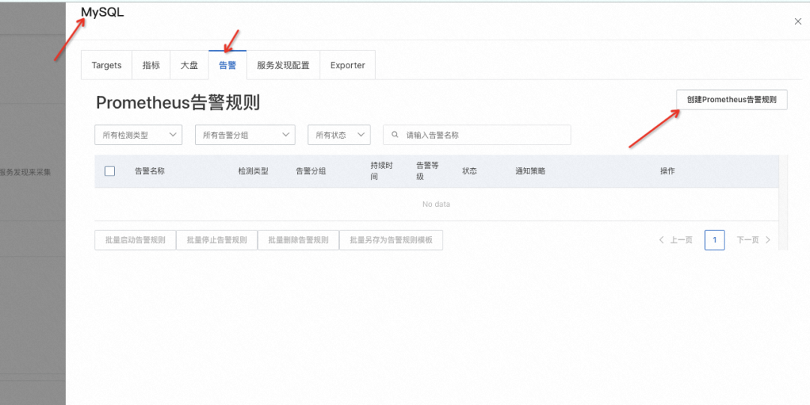
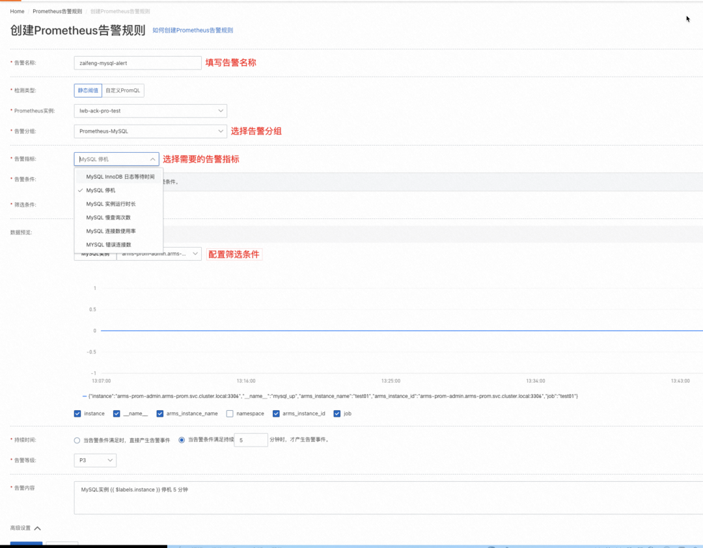

# 使用 Prometheus 监控 MySQL

## 监控指标解读

Google 提出系统监控的 Latency，Traffic，Saturation，Errors 作为黄金指标。而 MySQL 作为资源类服务系统出现，我们将之进行细化，从可用性、数据库连接、查询、流量、文件五大维度入手。


## 基于 Prometheus 的指标观测&告警体系搭建

相较于自建 Prometheus，需要部署 Exporter、传入 MySQL 实例的连接信息，配置服务发现，再建立大盘。阿里云 Prometheus监控一键集成 MySQL Exporter，并提供开箱即用的专属监控大盘、告警，将诸多配置与操作实现白屏化，尽可能简化配置服务接入工作量。

**将常见的 MySQL 告警规则制作成预置模板**，帮助运维团队快速搭建起指标看板与告警体系。

- **MySQL 停机**：如果该指标值是 0 表示当前数据库未在正常运行，为 1 表示正常，可以通过 ${instance} 针对具体的实例告警；

  ```promql
  mysql_up{${instance}} != 1
  ```

- **MySQL 实例运行时长**：Prometheus 监控服务提供了默认的告警阈值，监控运行少于半小时的 MySQL 实例，用户可以根据自己的需要修改阈值；

  ```promql
  mysql_global_status_uptime{${instance}} < 1800
  ```

- **MySQL 实例慢查询**：该指标可以作为判断当前数据库是否存在 sql 语句需要优化等问题；

  ```promql
  rate(mysql_global_status_slow_queries{${instance}}[5m]) > 0
  ```

- **MySQL 错误连接数**：连接错误是数据库中的主要错误之一，通过 Prometheus 监控服务提供的告警规则，当触发告警时，用户能够接受错误类型、查询次数等告警信息；

  ```promql
  rate(mysql_global_status_connection_errors_total{${instance}}[5m]) > 0
  ```

- **MySQL 连接使用率**：当出现时连接错误告警时，大部分原因是因为连接数不足，可以通过查看 MySQL 连接使用率进一步排查问题。

  ```promql
  100 * mysql_global_status_threads_connected{${instance}} 
        / mysql_global_variables_max_connections{${instance}} > 90
  ```

  注：当使用率达到一定的阈值时，MySQL 实例开始拒绝连接，可以通过扩大连接数来解决问题。但在提高连接数之前，请务必通过以下语句检查当前系统可打开的文件数：

  ```promql
  mysql_global_variables_open_files_limit - mysql_global_variables_innodb_open_files
  ```

- **MySQL 日志等待时间**

  ```promql
  rate(mysql_global_status_innodb_log_waits{${instance}}[5m])
  ```

## 实践

条件：

- 开通阿里云 Prometheus 监控服务；
- 安装阿里云 Prometheus 实例(Prometheus for 容器服务、Prometheus for ECS)，详情参见：创建 Prometheus 实例；
- 准备 MySQL 实例连接信息，包括 Mysql 地址、MySQL 端口、用户名和密码；


集成中心安装 MySQL 监控：

- 登录 **Prometheus 控制台**

  https://common-buy.aliyun.com/?commodityCode=prometheus_pay_public_cn#/open

- 单击具体的 Prometheus 实例并进入到集成中心，选择安装 MySQL；

  

- 输入 Mysql 地址、MySQL 端口、用户名和密码；

- 安装成功后，可以查看大盘、指标、target 等信息，并且配置相关告警；

  

MySQL 监控告警配置：

阿里云 Prometheus 监控服务针对 MySQL 集成，围绕着热点指标提供了若干项默认的 Prometheus 告警规则。

- 安装 MySQL 监控之后，可以通过 MySQL 集成 - 告警 - 创建告警规则进行创建；

  

- 填写告警名称、选择告警分组、所需的告警指标以及筛选条件。

  


监控大盘：

Prometheus 监控服务围绕热点指标创建了 MySQL 监控大盘，通过监控大盘用户可以查看可用性、数据库查询、网络流量、连接、内存等监控数据；

