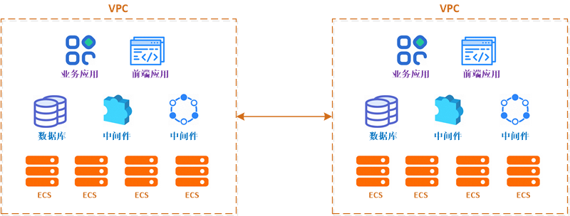
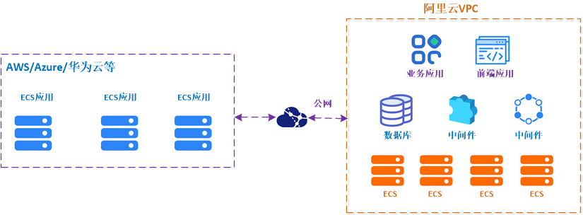
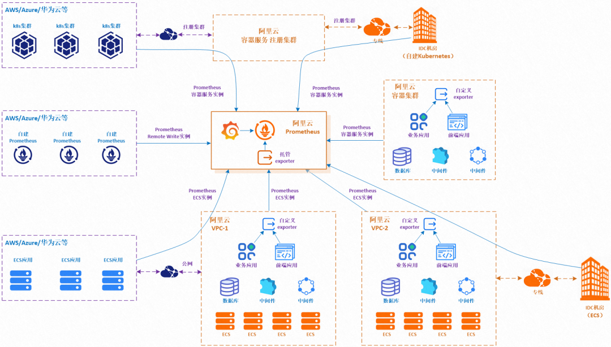
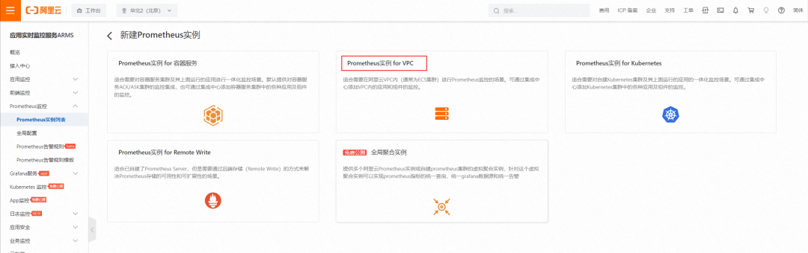
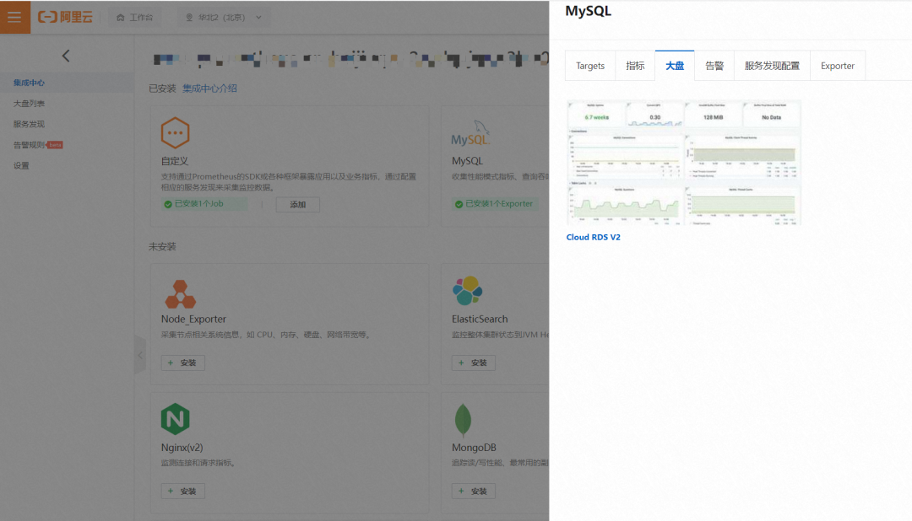
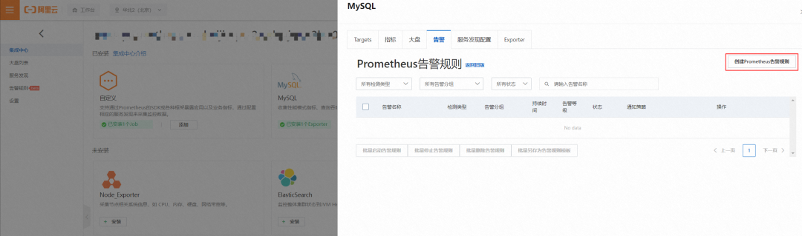

# 使用阿里云 Prometheus 观测 ECS 应用

Prometheus + Grafana 已经成为云原生时代的可观测性事实标准。我们使用 Prometheus 观测云原生时代的 Kubernetes 体系下的 Node、ApiServer、workload 等的基础 metric，同时通过 Prometheus Exporters 采集各种组件（如 Redis、Kafka 等）和业务应用的 metric，最后通过 Grafana 展示大盘、AlertManager 进行告警，实现了云原生 Kubernetes 体系下 metric 可观测闭环。

## ECS 应用的典型部署场景

场景 1：纯公有云 VPC

业务应用部署在一个或多个 VPC 内，每个 VPC 内购买了一批 ECS，在这些 ECS 上部署了基础组件（数据库和中间件等）和业务应用。我们需要对这些 **ECS OS**（Linux 或 Windows）、**基础组件**和**业务应用本身**进行 metric 观测。

场景 2：公有云 VPC+线下 IDC

业务除了部署公有云 VPC 上外，还需要与线下 IDC 机房进行互通互联。通常，我们使用专线方式打通云上 VPC 和线下 IDC 机房。

场景 3：公有云 VPC+多云 ECS

业务除了部署在阿里云 VPC 上外，还通过公网与其它云上的 ECS 进行互通互联。

## 自建prometheus观测ecs应用的痛点

1. 由于安全、组织管理等因素，用户业务通常部署在多个相互隔离的 VPC，**需要在多个 VPC 内都重复**、独立部署 Prometheus，导致部署和运维成本高。
2. 每套完整的自建观测系统都需要安装并配置 Prometheus、Grafana、AlertManager 以及各组件 Exporter，过程复杂、实施周期长。
3. 缺少与阿里云 ECS 无缝集成的服务发现（ServiceDiscovery）机制，**无法根据 ECS 标签来灵活定义抓取 targets**。如果自行实现类似功能，则需要使用 Golang 语言开发代码（调用阿里云 ECS POP 接口）、集成进开源 Prometheus 代码、编译打包后部署，实现门槛高、过程复杂、版本升级困难。
4. 常用组件的开源 Grafana 大盘不够专业，缺少结合观测组件的原理和最佳实践进行深入定制。
5. 缺少常用组件的告警项模板，需要用户自行研究、配置告警项，工作量大，且很可能缺少各组件领域的专业技术沉淀。

## 阿里云prometheus监控能力框架

除了支持阿里云容器服务、自建 Kubernetes、Remote Write 外，阿里云 Prometheus 还提供混合云+多云 ECS 应用的 metric 观测能力；并且支持多实例聚合观测能力，实现 Prometheus 指标的统一查询，统一 Grafana 数据源和统一告警。其逻辑架构如下示意：

对于 ECS 应用，阿里云 Prometheus 提供以下 metric 数据采集方式：

- **托管 exporter**：提供 MySQL、Redis 等数十种常见组件（持续更新中）的托管部署。用户只需要在阿里云 Prometheus 控制台配置观测组件相关信息（如 IP 地址、端口等），即可实现 VPC 内 ECS 上这些组件的 metric 监控。由于线下 IDC 通过专线与 VPC 互通，因此托管 exporter 同时也能采集到线下 IDC 内的组件 metric。

   

- **非托管 exporter**：对于我们暂未提供托管 exporter 的组件，或用户业务应用的自定义 metric，用户可以在 VPC 或 IDC 内部署自定义 exorter，然后在阿里云 Prometheus 控制台上配置自定义服务发现（ServiceDiscovery），最后阿里云 Prometheus 主动发现这些 exporter，并定时抓取和存储 metric。

   

- **Node/Windows exporter**：它们是一类特殊的非托管 exporter，因为需要部署在每台 ECS 上，以便采集 ECS OS 上观测信息。阿里云 Prometheus 提供了 Node exporter 的原生支持，Windows exporter 原生支持也即将上线。

## 如何使用阿里云 Prometheus 观测 ECS 应用

### 步骤 1：创建 VPC 实例

登录 Prometheus 控制台，选择新建 Prometheus 实例，根据界面提示，填写实例名、选择 VPC / VSwitch / SecurityGroup / Grafana 工作区，即可创建 VPC 实例成功。操作说明详见阿里云帮助中心文档。

### 步骤 2：接入组件监控

目前阿里云 Prometheus 已支持 Node exporter、MySQL、Redis、ElasticSearch、Kafka、Nginx、MongoDB、PostgreSQL、RabbitMQ、RocketMQ、BlackBox 等组件观测。

阿里云 Prometheus 天然内置支持了 **static_configs和aliyun_sd_configs 两种最常用/实用的服务发现方式**，方便用户进行组件观测目标 ECS 的配置。

以mysql的接入配置为例，登录 Prometheus 控制台后，进入已创建的 VPC 实例详情的集成中心界面，新建 MySQL 接入，填写 MySQL 监控名称、MySQL 地址、端口、用户名/密码等信息即可。

### 步骤 3：查看大盘

阿里云 Prometheus 无缝集成了共享版 Grafana 和专家版 Grafana，用户无需单独安装 Grafana，即可查看各个组件的观测大盘。

接入需要监控的组件后，在集成中心点击对应组件图标的已安装 Exporter，可以看到该组件的大盘略缩图和链接，点击即可进入阿里云 Grafana，查看对应观测大盘。

### 步骤 4：配置告警

进入 VPC 实例详情的集成中心界面，进入 MySQL 组件的告警界面，即可创建 Prometheus 告警规则

