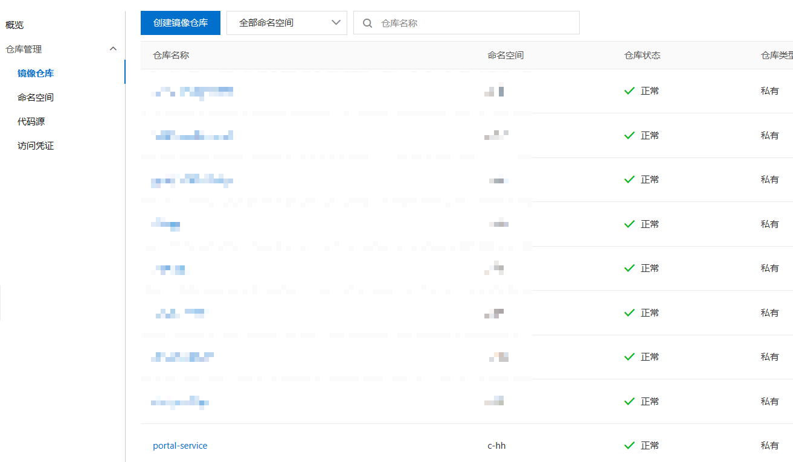
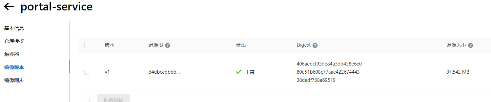

## 创建dockerfile

## 构建镜像

```shell
docker build -t registry.cn-shenzhen.aliyuncs.com/c-hh/portal-service:v1 .
```

## 使用创建的docker镜像启动容器并测试访问容器

启动容器

```shell
docker run -itd --name=portal-service registry.cn-shenzhen.aliyuncs.com/c-hh/portal-service:v1
```

检查内核转发是否已经开启，如果没有开启echo "net.ipv4.ip_forward = 1" >> /etc/sysctl.conf，然后sysctl -p

检查iptables的FORWARD链是否默认DROP，如果是默认DROP，则iptables -P FORWARD ACCEPT设为默认ACCEPT

测试访问docker应用

## 推送自建镜像到阿里云容器镜像服务

首先创建好阿里云容器镜像服务ACR的仓库



本地登录容器镜像仓库

```shell
docker login --username=haven_c registry.cn-hangzhou.aliyuncs.com
```

推送本地创建镜像到镜像仓库

```shell
docker push registry.cn-shenzhen.aliyuncs.com/c-hh/portal-service:v1
```

阿里云控制台可以看到推送的镜像了。

