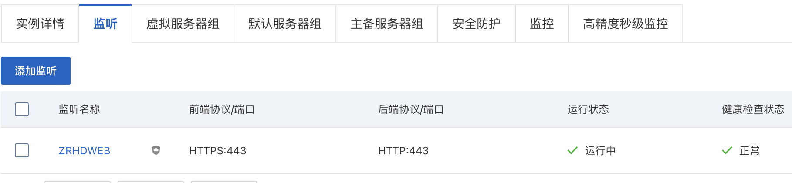
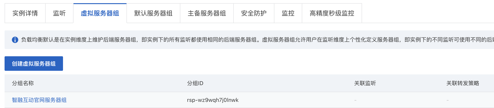
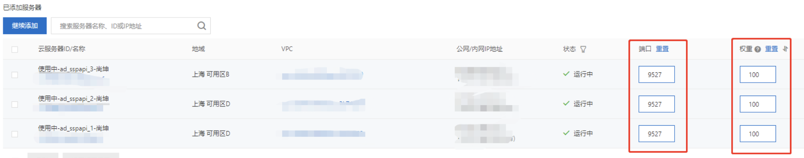
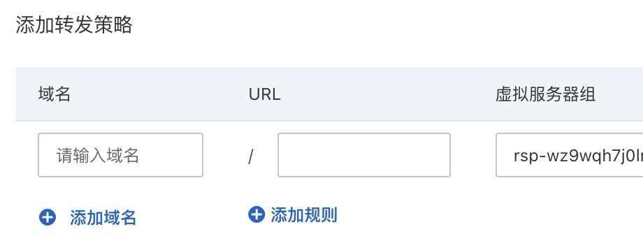

### 1.创建虚拟服务组，指定后端服务端口号

找到对应的slb实例，配置监听，https配置443端口号



创建一个虚拟服务器组



设置好后端服务的端口和权重



### 2.在slb监听443端口配置转发策略

点击443端口监听的配置转发策略

将自己的域名添加进来，还可以根据域名后面的上下文路径去将请求分发到不同的服务器



### 3.添加扩展域名

在https监听配置扩展域名后就可以正常访问域名将请求分发到对应ECS实例的9527端口了，这样也不用在每一个ECS实例安装nginx然后做端口映射了


另一种方式就是创建一个https监听，然后转发到虚拟服务器组的nginx，在后端服务器上配置nginx

```nginx
server {
  listen 443 ssl;
  #配置https默认访问端口443
  #如果使用nginx1.15.0及以上的版本，请使用listen 443 ssl代替listen 443和ssl on
  server_name xxx
    root html;
    index index.html index.htm;
  ssl_certificate /etc/.....pem;
  ssl_certificate_key /etc/...key;
  ssl_session_timeout 5m;
  ssl_ciphers EC...;
  ssl_protocols TLSv1 TLSv1.1 TLSv1.2;
  ssl_prefer_server_ciphers on;
  location / {
    root html;
    index index.html index.htm;
  }
  location / {
    proxy_pass http://127.0.0.1:9527;
  }
}
```

