有三种获取客户端真实IP的方法，其中第三种方法还可以防止X-Forwarded-For伪造。

实验环境说明：

1. 本文均是基于 客户端 --> 负载均衡SLB --> ECS 这种网络架构测试。
2. 本文提及到的域名 aliyunslb.osmonitor.cn 是解析到阿里云负载均衡SLB的IP上。
3. 本文提及到的ECS安装的Web软件是Nginx。
4. 本文提及到的主机名 beijing-ecs-1 是Web服务器（Nginx Server），主机名 aliyun 是客户端。

## 基础概念

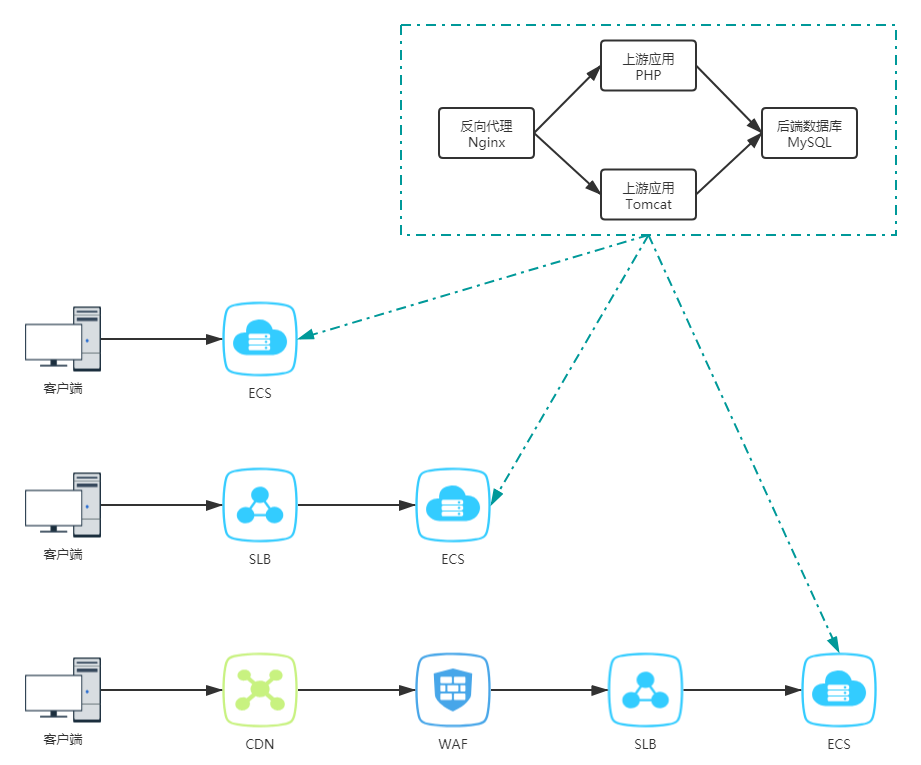

**remote_addr**

remote_addr指的是和Web服务器建立TCP连接的客户端IP。当我们的浏览器访问某个网站时，假设中间没有任何代理，那么就可以把remote_addr当为客户端IP；如果中间使用了某些代理(比如CDN、WAF、SLB等)，那么我们的浏览器会先访问到代理，然后再由代理层层转发到真正的Web服务器，这时Web服务器拿到的remote_addr实际是上级代理设备的IP。也就是说，remote_addr其实代表的是和Web服务器"直连"(进行TCP三次握手)的客户端IP。

**X-Forwarded-For**

如前面所述，当我们的Web服务器前端部署有CDN、WAF、SLB等代理产品时，Web服务器就不知道真实的客户端IP了。为了避免这种情况，中间的代理服务器通常会在HTTP Request Header中增加一个叫做X-Forwarded-For的扩展头信息，X-Forwarded-For简称XFF头，其格式规定如下：

X-Forwarded-For: client, proxy1, proxy2

从上可以看出，X-Forwarded-For头信息可以有多个参数值，每个参数值之间用"英文逗号+空格"进行分隔，左边第一个参数值为真实的客户端IP，后边的就是曾经依次经过的代理设备的IP地址。

举个例子，某个客户端在访问到Web服务器之前，依次经过了3个代理产品，分别是CDN、WAF、SLB，这些代理产品的IP分别为IP1-CDN、IP2-WAF、IP3-SLB，用户真实IP为IP0，那么Web服务端最终会收到以下信息：

X-Forwarded-For: IP0, IP1, IP2

SLB直连Web服务器，它会在XFF头中追加IP2，表示它是在帮WAF转发请求。XFF头的值中并没有IP3，IP3可以在Web服务器上通过 $remote_addr 字段获得。

## 三种方法

**第一种：传统获取法**

直接通过X-Forwarded-For扩展头获取客户端真实IP

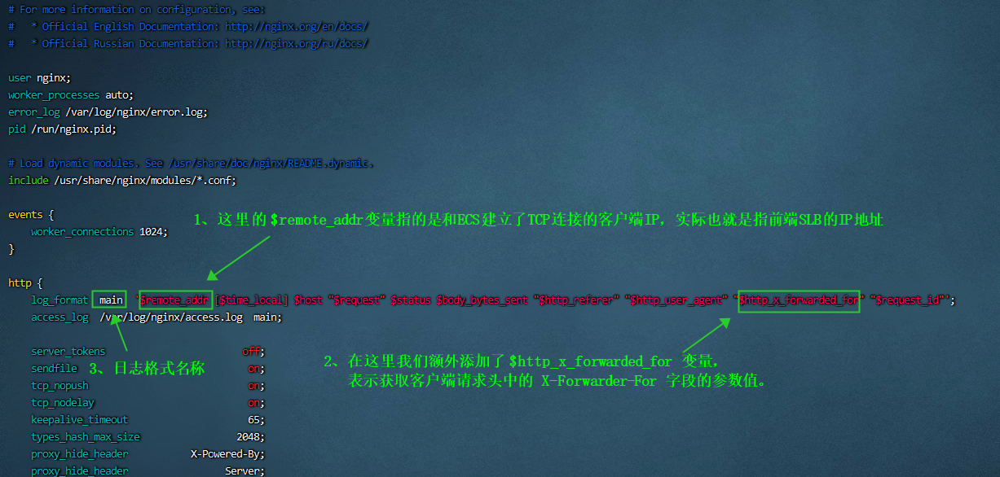

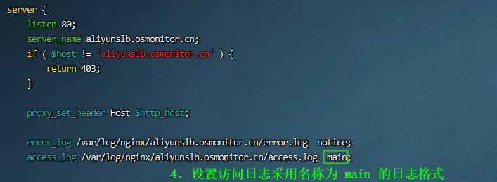

Nginx服务端查看日志进行验证：

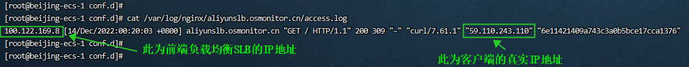

**第二种：排除获取法**

排除获取法是指通过http_realip_module模块解析X-Forwarded-For记录从而获得客户端真实IP。

默认情况下，通过yum直接安装的Nginx，是已经集成有http_realip_module模块的，我们无需再手动编译添加该模块。

Nginx服务端配置如下图所示：

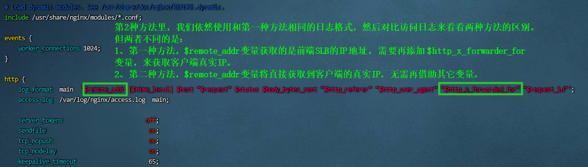

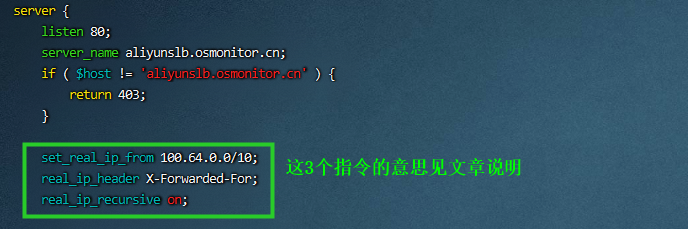

| 指令              | 说明                                                         |
| ----------------- | ------------------------------------------------------------ |
| set_real_ip_from  | 指定前端代理产品的IP地址段。如果前端有多层代理（例如客户端--CDN--WAF-SLB-ECS），那么要多次使用该指令，把前端所有代理产品(CDN、WAF、SLB)的IP地址段都写进来，不能只写一个代理的。由于本文实验环境是：客户端--SLB--ECS，对于ECS中的Nginx来说，前端代理就是SLB，而SLB的IP地址段是 100.64.0.0/10，因此这个指令的值就需要填写为SLB的地址段 100.64.0.0/10 ，参见下方示例截图。 |
| real_ip_header    | 表示让Nginx从SLB哪个Header头中提取真实IP。                   |
| real_ip_recursive | 是否排除IP地址，这也是笔者定义为排除获取法名称的由来。如果该指令的值设置为on，那么表示从右至左逐个检索并排除set_real_ip_from里面指定的IP，如果出现了不属于set_real_ip_from指令中的IP，那么这个IP将被认为是用户的真实IP，并被赋值给remote_addr变量。此时在日志中打印$remote_addr变量，就会看到客户端的真实IP地址。 |

**第三种：另辟蹊径法**

众所周知，和服务器直接建立TCP连接的客户端IP必定是客户端真实IP，必定是无法伪造的。目前**很多云产品都会新增一个自定义Header头**，把remote_addr(也就是和其直接建立TCP连接的客户端IP)的值赋给该字段，然后转发给后端服务器，那么后端应用只需要提取自定义Header头的值即可得到客户端的真实IP。

即使客户端知道了我们云产品新增的Header头，刻意去伪造该字段，也是行不通的。因为**云产品无论如何都会强制把建立TCP连接的客户端IP赋给新增的这个Header头**，通过这种方法去避免客户端伪造X-Forwarded-For头而导致后端应用无法通过X-Forwarded-For获取到客户端真实IP的情况发生。

例如，阿里云CDN在接收到客户端请求时，会新增一个名为Ali-CDN-Real-IP的Header头，CDN会把客户端的真实IP强制赋值给Ali-CDN-Real-IP字段，然后CDN回源时会带着这个新增的Header头。

再例如，阿里云SLB在接收到客户端请求时，会新增一个名为RemoteIp的Header头，SLB会把客户端的真实IP强制赋值给RemoteIp字段，然后SLB转发客户端请求给后端ECS时，也会带着新增的Header头。

在ECS中抓包可以看到SLB的请求Header头如下：

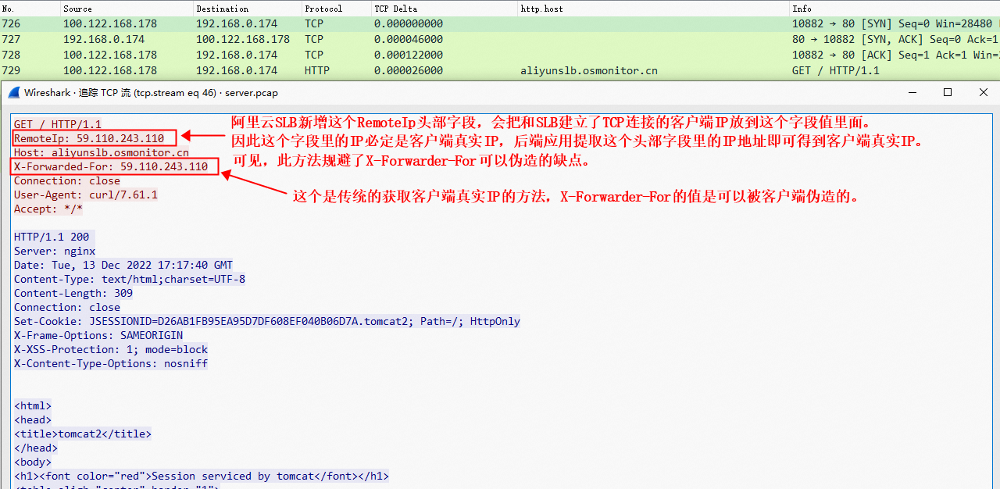

Nginx服务端配置如下图所示：

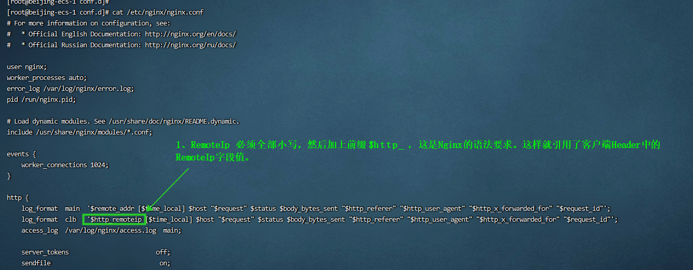

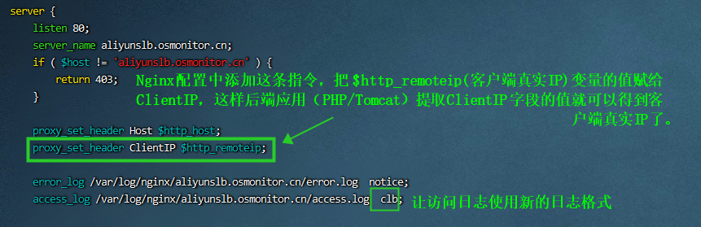

## 伪造X-Forwarded-For

客户端发起访问：

curl -I -X GET http://aliyunslb.osmonitor.cn -H "RemoteIp: 1.1.1.1" -H "X-Forwarded-For: 2.2.2.2"

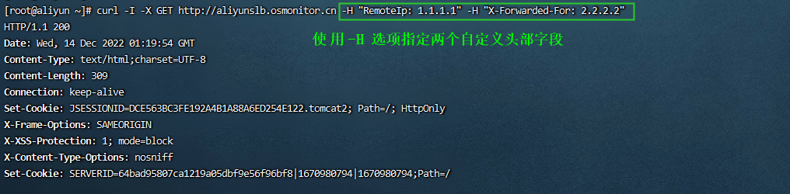

Nginx服务端查看日志进行验证：

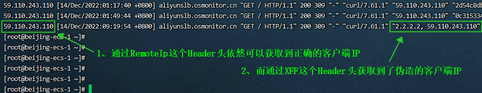

在ECS中抓包：

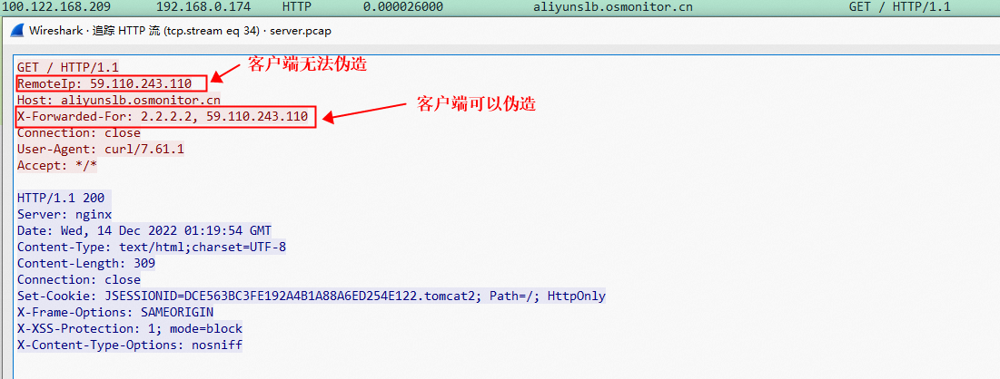

## 最后说明

通过对比以上3种方法，我们可以发现：

1. 第1种方法是借助X-Forwarded-For头来获取到客户端真实IP，配置简单，但存在X-Forwarded-For伪造的缺点。
2. 第2种方法也是借助X-Forwarded-For头来获取到客户端真实IP，配置复杂，需要把前端所有的代理产品的IP段全部写进去进行逐一排除，配置复杂，并且有的代理产品回源IP段不固定，实现起来也不容易。同时也存在X-Forwarded-For伪造的缺点。
3. 第3种方法不借助X-Forwarded-For头，而是直接提取代理产品所插入的自定义Header头的值，来获取客户端真实IP，配置简单，也避免了X-Forwarded-For伪造的情况。